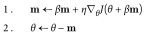
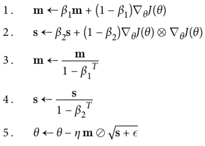
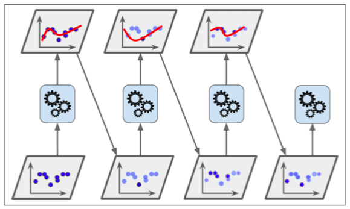
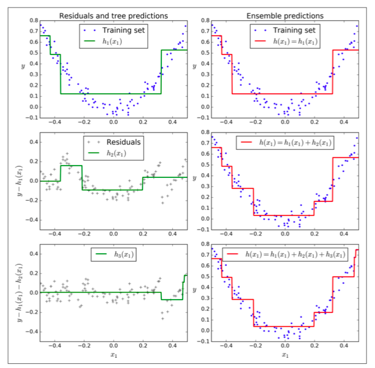
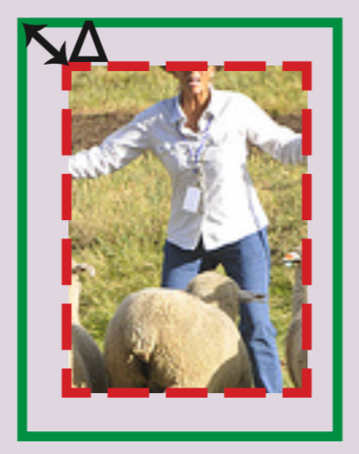
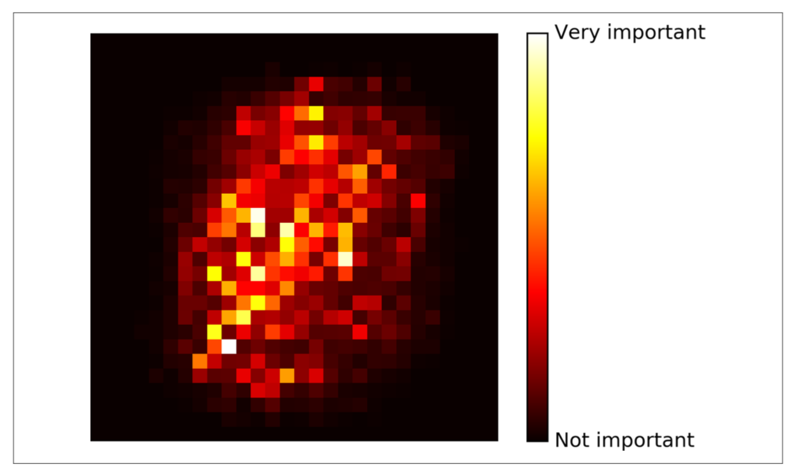
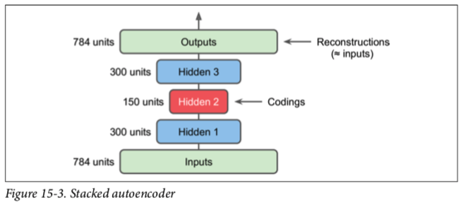
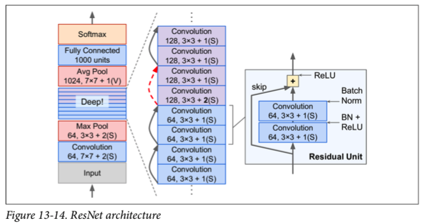
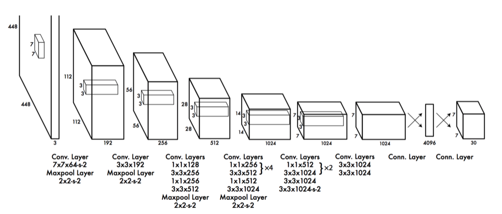

<!-- START doctoc generated TOC please keep comment here to allow auto update -->
<!-- DON'T EDIT THIS SECTION, INSTEAD RE-RUN doctoc TO UPDATE -->
**Table of Contents**  *generated with [DocToc](https://github.com/thlorenz/doctoc)*

- [Activation Function](#activation-function)
  - [Linear](#linear)
  - [Sigmoid](#sigmoid)
  - [Tanh](#tanh)
  - [ReLU](#relu)
  - [Softmax](#softmax)
- [Loss Function](#loss-function)
  - [Mean Absolution Error (MAE)](#mean-absolution-error-mae)
  - [Mean Square Error (MSE)](#mean-square-error-mse)
  - [Likelihood Loss](#likelihood-loss)
  - [Log Loss](#log-loss)
  - [Cross Entropy Loss](#cross-entropy-loss)
  - [Hinge Loss](#hinge-loss)
  - [CTC Loss](#ctc-loss)
  - [Triplet Loss](#triplet-loss)
- [Optimization Function](#optimization-function)
  - [Batch Gradient Descent](#batch-gradient-descent)
  - [Stochastic Gradient Descent (SGD)](#stochastic-gradient-descent-sgd)
  - [Mini-batch Gradient Descent (SGD)](#mini-batch-gradient-descent-sgd)
  - [Momentum](#momentum)
  - [Nesterov Accelerated Gradient (NAG)](#nesterov-accelerated-gradient-nag)
  - [AdaGrad](#adagrad)
  - [AdaDelta](#adadelta)
  - [RMSprop](#rmsprop)
  - [Adam](#adam)
  - [AdaMax](#adamax)
  - [Nadam](#nadam)
  - [Learning Rate Schedule](#learning-rate-schedule)
  - [Miscellaneous](#miscellaneous)
- [Evaluation Metrics](#evaluation-metrics)
  - [Confusion Matrix](#confusion-matrix)
  - [Accuracy](#accuracy)
  - [Precision](#precision)
  - [Recall (aka, Sensitivity)](#recall-aka-sensitivity)
  - [Specificity](#specificity)
  - [F1-Score](#f1-score)
  - [AUC-ROC](#auc-roc)
  - [IoU](#iou)
- [Normalization](#normalization)
  - [Batch Normalization (BN)](#batch-normalization-bn)
  - [Local Response Normalization](#local-response-normalization)
- [Regularization](#regularization)
  - [L1 & L2 & Elastic Net](#l1--l2--elastic-net)
  - [Dropout](#dropout)
  - [Earlystopping](#earlystopping)
  - [Max-Norm Regularization](#max-norm-regularization)
  - [Data Augmentation](#data-augmentation)
- [Ensemble Methods](#ensemble-methods)
  - [Voting Classifier](#voting-classifier)
  - [Bagging](#bagging)
  - [Boosting](#boosting)
  - [Stacking](#stacking)
- [Engineering in ML](#engineering-in-ml)
- [ML Glossary: General](#ml-glossary-general)
  - [Active Learning](#active-learning)
  - [Affine Layer](#affine-layer)
  - [Attention Mechanism](#attention-mechanism)
  - [Backpropagation](#backpropagation)
  - [Backpropagation Through Time (BPTT)](#backpropagation-through-time-bptt)
  - [Cross-Validation](#cross-validation)
  - [Embedding](#embedding)
  - [Fine-Tuning](#fine-tuning)
  - [Hyperparameters](#hyperparameters)
  - [Latent Space](#latent-space)
  - [Multi-crop](#multi-crop)
  - [Saturating](#saturating)
  - [Transfer learning](#transfer-learning)
  - [Unsupervised Pretraining (semi-supervised)](#unsupervised-pretraining-semi-supervised)
  - [Vectorization (Flatten)](#vectorization-flatten)
  - [Miscellaneous](#miscellaneous-1)
- [ML Glossary: Vision](#ml-glossary-vision)
  - [Anchor Box](#anchor-box)
  - [Bounding-box Regression](#bounding-box-regression)
  - [Non-max Suppression](#non-max-suppression)
  - [One-shot Learning](#one-shot-learning)
  - [Receptive Field](#receptive-field)
  - [RoI Pooling](#roi-pooling)
  - [1x1 Convolution](#1x1-convolution)
- [ML Glossary: Sequence](#ml-glossary-sequence)
  - [Sequence to Sequence](#sequence-to-sequence)
  - [Teacher Force](#teacher-force)
- [Math Glossary](#math-glossary)
  - [Likelihood vs Probability](#likelihood-vs-probability)
  - [Norm](#norm)
  - [Monte Carlo and Las Vegas Method](#monte-carlo-and-las-vegas-method)
  - [Gradient](#gradient)
  - [Variables](#variables)
- [Traditional ML](#traditional-ml)
  - [Linear Regression](#linear-regression)
  - [Logistic Regression](#logistic-regression)
  - [Naive Bayes](#naive-bayes)
  - [Support Vector Machine](#support-vector-machine)
  - [Decision Tree](#decision-tree)
  - [K Nearest Neighbors](#k-nearest-neighbors)
  - [Random Forest](#random-forest)
  - [Dimensionality Reduction](#dimensionality-reduction)
- [Neural Network Architectural Paradigms](#neural-network-architectural-paradigms)
  - [Feedforward Neural Networks](#feedforward-neural-networks)
  - [Convolutional Neural Networks](#convolutional-neural-networks)
  - [Recurrent Neural Networks](#recurrent-neural-networks)
  - [Encoder-Decoder Architectures](#encoder-decoder-architectures)
  - [Autoencoders](#autoencoders)
- [Models: Image Classification](#models-image-classification)
  - [LeNet (1998)](#lenet-1998)
  - [AlexNet (2012)](#alexnet-2012)
  - [ZFNet (2013)](#zfnet-2013)
  - [VGGNet (2014)](#vggnet-2014)
  - [GoogLeNet (2014)](#googlenet-2014)
  - [ResNet (2015)](#resnet-2015)
  - [DenseNet (2016)](#densenet-2016)
  - [SqueezeNet (2016)](#squeezenet-2016)
  - [Xception (2017, TODO)](#xception-2017-todo)
  - [MobileNet (2017, TODO)](#mobilenet-2017-todo)
- [Models: Object Detection](#models-object-detection)
  - [OverFeat (2013, TODO)](#overfeat-2013-todo)
  - [R-CNN (2013)](#r-cnn-2013)
  - [Fast R-CNN (2015)](#fast-r-cnn-2015)
  - [YOLOv1 (2015)](#yolov1-2015)
  - [Faster R-CNN (2015)](#faster-r-cnn-2015)
  - [SSD (TODO)](#ssd-todo)
  - [YOLOv2 (2016)](#yolov2-2016)
  - [R-FCN (TODO)](#r-fcn-todo)
  - [Mask-RCNN (TODO)](#mask-rcnn-todo)
  - [RetinaNet (TODO)](#retinanet-todo)
- [Models: Semantic Segmentation](#models-semantic-segmentation)
  - [FCN (TODO)](#fcn-todo)
  - [DeepLab (TODO)](#deeplab-todo)
- [Models: Face Recognition](#models-face-recognition)
  - [Siamese Network (2005)](#siamese-network-2005)
  - [DeepFace (2014)](#deepface-2014)
  - [FaceNet (2015)](#facenet-2015)
- [Models: Text & Sequence](#models-text--sequence)
  - [LSTM (1997)](#lstm-1997)
  - [GRU (2014)](#gru-2014)
  - [RNN Encoder-Decoder (2014, TODO)](#rnn-encoder-decoder-2014-todo)
  - [Seq2Seq (2014)](#seq2seq-2014)
  - [Transformer (TODO)](#transformer-todo)
  - [BERT (TODO)](#bert-todo)
- [Models: Recommendation](#models-recommendation)
  - [Wide & Deep Network (2016)](#wide--deep-network-2016)
- [Trending & State of the Art](#trending--state-of-the-art)
  - [2018](#2018)

<!-- END doctoc generated TOC please keep comment here to allow auto update -->

Personal notes on machine learning topics. I prefer using [owncloud](https://owncloud.org/) to take
notes, but will perform mini-batch update of the document irregularly. For completeness and quick
lookup, some contents are copy/pasted (with minior modification) from reference links. If there is
any violation, please let me know.

Many of the contents come from:
- https://www.coursera.org/specializations/deep-learning
- https://github.com/ageron/handson-ml
- https://www.deeplearningbook.org/

# Activation Function

In artificial neural networks, the activation function of a node defines the output of that node
given an input or set of inputs. The node (or neuron) calculates a "weighted sum" of its input,
adds a bias and then activation function decides whether it should be "fired" (activated) or not.

While one can use linear activation function, the core purpose of the activation function is to
introduce **non-linearity into the network**. Another way to think of it: without a non-linear
activation function in the network, a NN, no matter how many layers it had, would behave just like
a single-layer perceptron, because summing these layers would give you just another linear function.

There are quite a few activation functions, the most commonly used activation function is relu,
which supercedes previously used ones like sigmoid, tanh, etc.

*References*

- [understanding activation functions in neural networks](https://medium.com/the-theory-of-everything/understanding-activation-functions-in-neural-networks-9491262884e0)
- [why must a nonlinear activation function be used in a backpropagation neural net](https://stackoverflow.com/questions/9782071/why-must-a-nonlinear-activation-function-be-used-in-a-backpropagation-neural-net)
- https://zhuanlan.zhihu.com/p/25110450

## Linear

Linear activation function can not learn complex features thus is generally not useful in practice.

A common usage is to use linear activation function in vanilla autoencoders, i.e. autoencoders with
a single hidden layer, for both the hidden and output layers. This can approximate principal component
analysis (PCA).

## Sigmoid

Sigmoid function curve looks like a s-shape. It mapps linear output to probability distribution
(ranges between 0 and 1); therefore, it is used for models where we have to predict the probability
as an output.

Sigmoid function is defined as `1/(1+exp(-x))`, it ranges from (0, 1). It is a special case of
logistic function, i.e. L = K = 1, x0 = 0

<p align="center"></p>

## Tanh

Tanh is also sigmoidal (s-shaped). It is like logistic sigmoid but better. The range of the tanh
function is from (-1 to 1).

<p align="center"></p>

## ReLU

Rectified Linear Unit (ReLU) is the most used activation function. It ranges from 0 to +Inf.

The nice thing about ReLU is that it's a non-saturating function, meaning that it's output is
infinite if the input is infinite. This can help avoid the vanishing gradient problem.

However, ReLU has a problem called "dying relu", meaning that if a neuron outputs 0, then it
will stop learning. To solve the problem, a couple variants are proposed, e.g. Leaky ReLu, etc.

<p align="center"></p>

## Softmax

Softmax function is a generalized logistic activation function which is used for multiclass
classification. As shown in the image below, softmax turns the input vector `y` into a probability
distribution; whereas in logistic activation, `y` is a single number and logistic function turns it
into a single probability number. The input vector `y` is also called `logits`.

Softmax is commonly used as the activation function of output layer.

<p align="center"></p>

*References*

- [what is the meaning of the word logits in tensorflow](https://stackoverflow.com/questions/41455101/what-is-the-meaning-of-the-word-logits-in-tensorflow)
- [what are the differences between logistic function and sigmoid function](https://stats.stackexchange.com/questions/204484/what-are-the-differences-between-logistic-function-and-sigmoid-function)

# Loss Function

Loss function is a way to penalize model output, which is then used to adjust model parameters.
Generally, if the model is doing good, then loss function outputs a lower number. Loss function
will vary based on the domain of the problem.

Defining loss function is very important: it can directly affect model performance. Quite a few
models are popular due to defining noval loss functions.

## Mean Absolution Error (MAE)

Mean Absolute Error (MAE) measures the average magnitude of the errors in a set of predictions,
without considering their direction. It's the average over the test set of the absolute differences
between prediction and actual observation where all individual differences have equal weight.

MAE is also called L1 loss.

## Mean Square Error (MSE)

Mean square error (MSE) is the most basic loss function. To calculate MSE, you take the difference
between your predictions and the ground truth, square it, and average it out across the whole dataset.

Another metric is Root Mean Square Error (RMSE), which takes the square root of MSE. The square root
is introduced to make scale of the errors to be the same as the scale of targets. In practice, MSE
is a little bit easier to work with, so everybody uses MSE instead of RMSE. Note that even though
RMSE and MSE are really similar in terms of models scoring, they can be not immediately interchangeable
for gradient based methods (since gradient change rate is different).

Compared to MAE, MSE has the benefit of penalizing large errors more so can be more appropriate in
some cases, for example, if being off by 10 is more than twice as bad as being off by 5. But if being
off by 10 is just twice as bad as being off by 5, then MAE is more appropriate.
> MAE is widely used in finance, where $10 error is usually exactly two times worse than $5 error.
> On the other hand, MSE metric thinks that $10 error is four times worse than $5 error. MAE is
> easier to justify than RMSE.

MSE is also called L2 loss.

*References*

- https://medium.com/human-in-a-machine-world/mae-and-rmse-which-metric-is-better-e60ac3bde13d
- [how-to-select-the-right-evaluation-metric-for-machine-learning-models-part-1-regrression-metrics](https://towardsdatascience.com/how-to-select-the-right-evaluation-metric-for-machine-learning-models-part-1-regrression-metrics-3606e25beae0)

## Likelihood Loss

The likelihood function is relatively simple, and is commonly used in classification problems. The
function takes the predicted probability for each input example and multiplies them.

For example, consider a model that outputs probabilities of [0.4, 0.6, 0.9, 0.1] for the ground truth
labels of [0, 1, 1, 0]. The likelihood loss would be computed as (0.6) * (0.6) * (0.9) * (0.9) = 0.2916.
Since the model outputs probabilities for TRUE (or 1) only, when the ground truth label is 0 we take
(1-p) as the probability.

## Log Loss

Log Loss measures the performance of a classification model whose output is a probability value
between 0 and 1. It is a loss function for binary classification, for multiclass, see following
cross entropy loss (log loss is essentially binary-class cross entropy loss).

Log loss penalizes model heavily on wrong predictions with high probability, i.e. predictions that
are confident and wrong.

```python
def LogLoss(yHat, y):
  if y == 1:
    return -log(yHat)
  else:
    return -log(1 - yHat)
```

## Cross Entropy Loss

Cross entropy is a straightforward modification of the likelihood function with logarithms.
Essentially, cross entropy is used to compare the similarity between two probability distribution.

In classification problem, we use activation function like softmax which produces probabilities for
each class, and cross entropy is a loss function which is used in such problems to evaluate model.
For example, for a 3 class classification problem with label [0, 1, 0], and we have two results:
[0.2, 0.6, 0.2], [0.1, 0.8, 0.1] from softmax. Using cross entropy, we are able to tell that the
second distribution is closer to the real label, and also produces two number indicating the
differences. Cross entropy loss has nice kicks:
- it cares more about the 'right class': better value means better model.
- it penalizes heavily for being very confident and very wrong. Predicting high probabilities for
  the wrong class makes the function go crazy.

Following is the equation for cross entropy. `p(x)` is the ground truth probability distribution
for input x, and `q(x)` the network output. In the above example, p(x) = [0, 1, 0], and q(x) =
[0.2, 0.6, 0.2]. Note `log0 =+inf`, `log1=0`.

<p align="center"></p>

As we can see from the equation, for binary cross entropy (BCE), or log loss as mentioned above,
we can expand it and write it as:

```
BCE = -[y * log(y_hat) + (1-y) * log(1-y_hat)]
```

Conceptually, we can think of the relationship between cross entropy and log loss as:
```
Softmax -----(output)-----> Cross Entropy Loss
Sigmoid -----(output)-----> Log Loss
```

However, in practice, people use the terminology `Log Loss` and `Cross Entropy Loss` interchangably.

*References*

- https://towardsdatascience.com/demystifying-cross-entropy-e80e3ad54a8
- https://rdipietro.github.io/friendly-intro-to-cross-entropy-loss/

## Hinge Loss

In machine learning, the hinge loss is a loss function used for training classifiers. The hinge loss
is used for "maximum-margin" classification, most notably for support vector machines (SVMs).

> To summarize, when working with an SVM, if a computed value gives a correct classification and is
> larger than the margin, there is no hinge loss. If a computed value gives a correct classification
> but is too close to zero (where too close is defined by a margin) there is a small hinge loss. If
> a computed value gives an incorrect classification there will always be a hinge loss.

<p align="center"></p>

*References*

- https://jamesmccaffrey.wordpress.com/2018/10/04/hinge-loss-explained-with-a-table-instead-of-a-graph/

## CTC Loss

CTC Loss stands for Connectionist Temporal Classification Loss.

TBD

## Triplet Loss

Triplet loss is a loss function introduced in the paper `FaceNet` from Google, to learn good
embeddings (or "encodings") of faces. In the embedding space, faces from the same person should be
close together and form well separated clusters.

The core idea behind triplet loss is to take three instances, i.e. anchor, positive, negtive, then
minimize the distance between anchor and positive (both have the same identity, e.g. same person),
and also maximize the distance between anchor and negtive.

Below is a formal definition of triplet loss (for one instance):

<p align="center"></p>

In the equation:
- `f(A)` is the feature vector of anchor, `f(P)` is the feature vector of positive, etc
- `max` is used here because if the output from the first part is negtive, then A and P is 'very close', thus loss is 0
- `alpha` is the 'margin' term to make the network robust; otherwise it's trivial for the network to learn f(A)=f(P)=f(N)
- triplet uses L2 norm to measure the distance between two feature vectors

Note the feature vector is the logits (or output from fully connected layer) of classic CNN, that is,
we use the logits as feature vector, instead of feeding them to a softmax classifier.

One other thing to note is that we need to choose triplets that are 'hard' to train on, i.e. triplets
where the negative is closer to the anchor than the positive. If we choose triplets randomly, the
network will learn little information.

*References*

- https://omoindrot.github.io/triplet-loss

# Optimization Function

Optimization algorithms help us to minimize (or maximize) an Objective function E(x) which is simply
a mathematical function dependent on the Model's internal learnable parameters which are used in
computing the target values (Y) from the set of predictors (X) used in the model.

For example, in neural networks, we call the Weights (W) and the Bias (b) values of the neural
network as its internal learnable parameters which are used in computing the output values and are
learned and updated in the direction of optimal solution, i.e minimizing the Loss by the network's
training process.

**List of Common Parameters**

- learning rate: denoted as alpha or lr; some optimizers require it to be tuned while others don't
- momentum term: fraction of the update step of past gradients, usually set to 0.9 or a similar value
- epsilon: a very small number to prevent any division by zero in optimization implementation, e.g. 10E-8
- beta1/beta2: exponential decay rate for the first/second moment, usually set to 0.9 and 0.999
- decay: learning rate decay over each update

**Summary**

- Gradient Descent Variants
  - Batch Gradient Descent
  - Stochastic Gradient Descent
  - Mini-batch Gradient Descent
- Optimization on SGD
  - Momentum
  - Nesterov Accelerated Gradient
  - Learning Rate Schedule
- Adaptive SGD
  - AdaGrad
  - AdaDelta
  - RMSprop
- Adaptive SGD with Optimization
  - Adam
  - AdaMax
  - Nadam

*References*

- http://ruder.io/optimizing-gradient-descent/
- [types of optimization algorithms used in neural networks and ways to optimize gradient](https://towardsdatascience.com/types-of-optimization-algorithms-used-in-neural-networks-and-ways-to-optimize-gradient-95ae5d39529f)
- https://blog.paperspace.com/intro-to-optimization-in-deep-learning-gradient-descent/
- https://blog.paperspace.com/intro-to-optimization-momentum-rmsprop-adam/

## Batch Gradient Descent

Gradient Descent is the most important optimization algorithm. It uses the gradient of the loss
function with respect to all the parameters, and update the parameters in the opposite direction
of the gradient to minimize the loss. For example, in neural networks, we use backpropagation to
calculate the gradient of loss function w.r.t all weights, and then use gradient descent to minimize
the loss function. Formally speaking, `θ = θ - η⋅∇J(θ)` is the formula of the parameter updates,
where `η` is the learning rate, `∇J(θ)` is the gradient of loss function J(θ).

In practice, we use different variants of gradient descent, notably SGD, due to performance reasons.
However, there are some challenges for both Batch Gradient Descent and SGD:
- Choosing a proper learning rate can be difficult
- The same learning rate applies to all parameter updates, but we might want to use differnt rate for different features
- Gradient Descent can reach sub-optimal local minima and can hardly escape

## Stochastic Gradient Descent (SGD)

The traditional batch, or standard gradient descent will calculate the gradient of the whole dataset
but will perform only one update, which means to reach local optima, we have to iterate the dataset
a lot of times, hence it can be very slow and hard to control for datasets which are very large and
don't fit in the memory.

On the other hand, Stochastic Gradient Descent (SGD) performs a parameter update **for each training
example**. It is usually much faster technique. Formally speaking, the formula is `θ = θ − η⋅∇J(θ;x(i);y(i))`,
where `{x(i),y(i)}` is the i'th training example. It is called stochastic because samples are selected
randomly (or shuffled) instead of as a single group (as in batch gradient descent) or in the order
they appear in the training set.

Now due to these frequent updates, parameters updates have **high variance** and causes the loss
function to **fluctuate to different intensities** (since gradient computed for two training
examples can vary a lot). This is actually a good thing because it helps us discover new and
possibly better local minima, whereas batch gradient descent will only converge to the minimum
of the basin.

The real problem with SGD is that due to the frequent updates and fluctuations it ultimately
complicates the convergence to the exact minimum and will keep overshooting due to the frequent
fluctuations. However, it is shown that by gradually decreasing the learning rate, SGD shows the
same convergence pattern as batch gradient descent.

## Mini-batch Gradient Descent (SGD)

An improvement to avoid all the problems and demerits of SGD and batch Gradient Descent would be to
use Mini-batch Gradient Descent as it takes the best of both techniques and performs an update for
every batch with n training examples in each batch.

Commonly mini-batch sizes range from 50 to 256, and is typically the algorithm of choice when
training a neural network nowadays. Actually, the term SGD is used also when mini-batch gradient
descent is used.

## Momentum

A very popular technique that is used along with SGD is called Momentum. Instead of using only the
gradient of the current step to guide the search, momentum also accumulates the gradient of the past
steps to determine the direction to go. It is one of the most popular optimization algorithms and
many state-of-the-art models are trained using it.

Momentum simply adds a fraction `m` of the previous weight update to the current one. When the
gradient keeps pointing in the same direction, this will increase the size of the steps taken
towards the minimum. When the gradient keeps changing direction, momentum will smooth out the
variations. Momentum can help the network out of local minima.

> If you include a momentum term, then instead of just relying on the gradient at each new stopping
> point to determine your movement, your direction now also depends on the size and direction of
> your movement in the previous update.

Essentially, momentum is `exponentially weighed averages`, or in another word, it keeps a 'memory'
of previous gradients and update current one according to `beta` parameter. It works because in SGD,
we do not calculate the exact derivative of our dataset, rather, we are estimating it using mini-batch.
Exponentially weighted average can provide us a better estimate which is closer to the actual derivate
than our noisy calculations.

<p align="center"></p>

*References*

- https://towardsdatascience.com/stochastic-gradient-descent-with-momentum-a84097641a5d
- https://www.willamette.edu/~gorr/classes/cs449/momrate.html

## Nesterov Accelerated Gradient (NAG)

Nesterov Accelerated Gradient is an improvement over Momentum, it can be viewed as the correction
factor for Momentum method. The idea of Nesterov Momentum optimization is to measure the gradient
of the cost function not at the local position but slightly ahead in the direction of the momentum.
The only difference from vanilla Momentum optimization is that the gradient is measured at `θ + βm`
rather than at `θ`.

In other words, while Momentum first computes the current gradient and then takes a big jump in the
direction of the updated accumulated gradient, NAG first makes a big jump in the direction of the
previous accumulated gradient, measures the gradient and then makes a correction. This anticipatory
update prevents us from going too fast and results in increased responsiveness, which has significantly
increased the performance of RNNs on a number of tasks.

<p align="center"></p>

## AdaGrad

Adagrad is short for Adaptive Gradient Descent. It simply allows the learning rate to adapt based on
the parameters, i.e. it makes big updates for infrequent parameters and small updates for frequent
parameters. For this reason, it is well-suited for dealing with sparse data.

Adagrad modifies the general learning rate at each time step t for every parameter `θ(i)` based on
the past accumulated gradients that have been computed for `θ(i)`. The main benefit of Adagrad is
that we don't need to manually tune the learning rate. Most implementations use a default value of
0.01 and leave it at that.

However, the main weakness is the accumulation of gradients: since accumulation is always positive,
the learning rate is always decreasing and decaying, and eventually become so small that the model
just stops learning entirely and stops acquiring new additional knowledge.

<p align="center"></p>

## AdaDelta

Adadelta is an extension of Adagrad that seeks to reduce its aggressive, monotonically decreasing
learning rate. Instead of accumulating all past squared gradients, Adadelta restricts the window of
accumulated past gradients to some fixed size `w`. Note instead of inefficiently storing `w` previous
squared gradients, the sum of gradients is recursively defined as a decaying average of all past
squared gradients.

## RMSprop

RMSprop and Adadelta have both been developed independently around the same time stemming from the
need to resolve Adagrad's radically diminishing learning rates. RMSprop stands for RMS propagation,
it as well divides the learning rate by an exponentially decaying average of squared gradients.

Unlike AdaDelta, RMSprop requires an initial learning rate to be specified, but the general idea of
RMSprop and Adadelta is very similar.

<p align="center"></p>

## Adam

Since we are calculating individual learning rates for each parameter, why not calculate individual
momentum changes for each parameter and store them separately. This is where a new modified technique
and improvement comes into play called as Adam.

Adam is short for Adaptive Moment Estimation. it is another method that computes adaptive learning
rates for each parameter. In addition to storing an exponentially decaying average of past squared
gradients `vt` like Adadelta and RMSprop, Adam also keeps an exponentially decaying average of past
gradients `mt`, similar to momentum. Two parameters beta1 and beta2 control the decay rates of these
moving averages.

> Adam works well in practice and compares favorably to other adaptive learning-method algorithms
> as it converges very fast and the learning speed of the Model is quiet fast and efficient and
> also it rectifies every problem that is faced in other optimization techniques such as vanishing
> learning rate, slow convergence or high variance in the parameter updates which leads to
> fluctuating loss function.

<p align="center"></p>

Adam is essentially RMSprop with momentum. It is the recommended default optimizer.

*References*

- https://machinelearningmastery.com/adam-optimization-algorithm-for-deep-learning/

## AdaMax

AdaMax is a variant of Adam based on the infinity norm.

## Nadam

Nadam is short for Nesterov-accelerated Adaptive Moment Estimation. Much like Adam is essentially
RMSprop with momentum, Nadam is Adam RMSprop with Nesterov momentum.

## Learning Rate Schedule

Learning rate schedules seek to adjust the learning rate during training by reducing the learning
rate according to a pre-defined schedule. Common learning rate schedules include time-based decay,
step decay, exponential decay, etc.

Unlike above learning rate adaptive methods, learning rate schedules need to be pre-defined and do
not update learning rate per parameter. On the other hand, the two are not mutually exclusive, i.e.
you can use learning rate schedules and adaptive methods together, depending on the problem.

## Miscellaneous

**Exploding Gradient Problem**

The Exploding Gradient Problem is the opposite of the Vanishing Gradient Problem. In deep neural
networks gradients may explode during backpropagation, resulting number overflows. This typically
happens in recurrent neural network.

A common technique to deal with exploding gradients is to perform Gradient Clipping, which will
clip the gradients between two numbers to prevent them from getting too large. There exist various
ways to perform gradient clipping, but a common one is to normalize the gradients of a parameter
vector when its L2 norm exceeds a certain threshold:
```
new_gradients = gradients * threshold / l2_norm(gradients)
```

**Vanishing Gradient Problem**

The Vanishing Gradient Problem is the opposite of the Exploding Gradient Problem. It arises in very
deep Neural Networks, typically Recurrent Neural Networks, that use activation functions whose
gradients tend to be small (in the range of 0 from 1). Because these small gradients are multiplied
during backpropagation, they tend to "vanish" throughout the layers, preventing the network from
learning long-range dependencies.

Common ways to counter this problem is to
- use activation functions like ReLUs that do not suffer from small gradients (non-saturating function)
- use better parameter initialization strategy like `Xavier and He Initialization`
- use architectures like LSTMs and GRUs that explicitly combat vanishing gradients.
- use techniques like batch normalization, etc

# Evaluation Metrics

## Confusion Matrix

Confusion matrix itself is not an evaluation metric, but the following classification metrics like
accuracy, precision, recall, specificity, etc are all derived from it. It is used for classification
problem where the output can be of two or more types of classes.

Confusion matrix defines the following four terms:
- True Positive (TP): model correctly classify a sample as a class
- True Negative (TN): model correctly classify a sample as not a class
- False Positive (FP): model incorrectly classify a sample as a class
- False Negative (FN): model incorrectly classify a sample as not a class

*References*

- [performance metrics for classification problems](https://medium.com/greyatom/performance-metrics-for-classification-problems-in-machine-learning-part-i-b085d432082b)

## Accuracy

Definition:
```
Accuracy = (TP + TN) / (TP + TN + FP + FN)
```

Accuracy means number of correct predictions across all data. It is a good measurement when data
are evenly distributed.

> Ex: In our cancer detection example with 100 people, only 5 people have cancer. Let's say our model
> is very bad and predicts every case as No Cancer. In doing so, it has classified those 95 non-cancer
> patients correctly and 5 cancerous patients as Non-cancerous. Now even though the model is terrible
> at predicting cancer, The accuracy of such a bad model is also 95%.

## Precision

Definition:
```
Precision = TP / (TP + TN)
```

Precision means for all the items that we classify as one class, are indeed in that class.

> Ex: In our cancer detection example with 100 people, only 5 people have cancer. Let's say our model
> is very bad and predicts every case as Cancer. Since we are predicting everyone as having cancer,
> our denominator (True positives and False Positives) is 100 and the numerator, person having cancer
> and the model predicting his case as cancer is 5. So in this example, we can say that precision of
> such model is 5%.
>
> If the model predicts every case as No Cancer, then TP is 0 and our model precision is 0.

## Recall (aka, Sensitivity)

Definition:
```
Recall = TP / (TP + FN)
```

Recall or Sensitivity means for all the items that are in a class, are correctly classified as the
class.

> Ex: In our cancer detection example with 100 people, only 5 people have cancer. Let's say our model
> is very bad and predicts every case as Cancer. So our denominator (True positives and False Negatives)
> is 5 and the numerator, person having cancer and the model predicting his case as cancer is also 5
> (Since we predicted 5 cancer cases correctly). So in this example, we can say that the Recall of
> such model is 100%.

Precision vs Recall

- Precision is about being precise. So even if we managed to capture only one cancer case, and we
  captured it correctly, then we are 100% precise.
- Recall is not so much about capturing cases correctly but more about capturing all cases that have
  "cancer" with the answer as "cancer". So if we simply always say every case as "cancer", we have
  100% recall.

## Specificity

Definition:
```
Specificity = TN / (TN + FP)
```

Specificity means for all the items that are not in a class, are correctly classified as not the
class. Specificity is the exact opposite of recall.

> Ex: In our cancer detection example with 100 people, only 5 people have cancer. Let’s say our model
> is very bad and predicts every case as Cancer. So our denominator (False positives and True Negatives)
> is 95 and the numerator, person not having cancer and the model predicting his case as no cancer is 0
> (Since we predicted every case as cancer). So in this example, we can that that Specificity of such
> model is 0%.

## F1-Score

Definition:
```
F1-Score = 2 * Precision * Recall / (Precision + Recall)
```

F1-Score combines Precision and Recall into a single metric using Harmonic Mean. Compared with
Arithmetic Mean, Harmonic Mean is closer to smaller number, which is better. For example, in the
above example, Precision is 5% and Recall is 100%, then Arithmetic Mean is 52.5% while Harmonic
Mean is 9.5%. It is evident that 9.5% is a better evalution for the model.

## AUC-ROC

AUC-ROC is short for "Area Under the ROC Curve". It is also derived from confusion matrix.

The above metrics deal with ones and zeros, meaning you either got the class label right or you
didn't. But many classifiers are able to quantify their uncertainty about the answer by outputting
a probability value. To compute accuracy from probabilities you need a threshold to decide when
zero turns into one. The most natural threshold is of course 0.5.

AUC-ROC indicates how well the probabilities from the positive classes are separated from the
negative classes. AUC ranges from 0 to 1, but score of a random classifier for balanced data is
0.5, so real value should be larger that 0.5 at least. Generally, the bigger the number, the
better the model.

For an intuitive introduction, see the following youtube link.

*References*

- https://www.youtube.com/watch?v=OAl6eAyP-yo
- https://towardsdatascience.com/understanding-auc-roc-curve-68b2303cc9c5
- http://fastml.com/what-you-wanted-to-know-about-auc/

## IoU

IoU is short for Intersection over Union, it is a metric used to evaluate objection detection
algorithm. Basically, it is the intersection of predicted box and ground-truth box divided by the
union of the two boxes.

IoU = 1 means a perfect detector. A typical threshhold for a good detector is 0.5.

# Normalization

Feature scaling is a method used to standardize the range of independent variables or features of
data. In data processing, it is also known as data normalization and is generally performed during
the data preprocessing step.

Note that Normalization, Standarization, Feature Scaling are often used interchangeably, but they
are different concepts:
- Feature Scaling: This means transforming data so that it fits within a specific scale, like 0-100
  or 0-1. Feature Scaling includes Standarization and Normalization.
- Standarization: Standarization is also called "Z-score normalization". This is a more radical
  transformation. The point of standarization is to change your observations so that they can be
  described as a normal distribution, i.e. substract from mean and divide by standard deviation,
  or in an other word, shifting inputs to zero-mean and unit variance.
- Normalization: Normalization is called Min-Max scaling (common cause for ambiguities), where
  data is substracted from min and then divided by max-min. **In some literature and blogs,
  normalization is described as Standarization**, i.e. shifting inputs to zero-mean and unit
  variance.

Despite the difference, in the context of machine learning, all of them refer to a preprocessing
step to clean up data, thus making it easier for ml algorithms to learn. Note that normalization
can vary final results a lot while using certain algorithms and have a minimal or no effect in
others.

*References*

- https://en.wikipedia.org/wiki/Feature_scaling
- https://sebastianraschka.com/Articles/2014_about_feature_scaling.html
- [when should you perform feature scaling and mean normalization](https://www.quora.com/When-should-you-perform-feature-scaling-and-mean-normalization-on-the-given-data-What-are-the-advantages-of-these-techniques)

## Batch Normalization (BN)

Normalization (here, shifting inputs to zero-mean and unit variance) is often used as a
pre-processing step to make the input data comparable across features. However, as the data flows
through a deep network, the weights and parameters adjust those values, sometimes making the data
too big or too small again - a problem referred to as "internal covariate shift". In another words,
the distribution of each layer's inputs changes during training, as the parameters of the previous
layers change.

[Batch Normalization (BN)](https://arxiv.org/abs/1502.03167) consists of adding an operation in the
model just before the activation function of each layer, simply zero-centering and normalizing the
inputs, then scaling and shifting the result using two new parameters per layer (one for scaling,
the other for shifting). In other words, this operation lets the model learn the optimal scale and
mean of the inputs for each layer.

In order to zero-center and normalize the inputs, the algorithm needs to estimate the inputs' mean
and standard deviation. It does so by evaluating the mean and standard deviation of the inputs over
the current mini-batch (hence the name "Batch Normalization").

By normalizing the input of each layer in each mini-batch, the "internal covariate shift" problem
is largely avoided. Basically, rather than just performing normalization once in the beginning, with
BN, you're doing it at every layer. BN can improve training speed, improve accuracy, etc. Now most
CNN uses BN in their architecture. Note that BN is used before activation.

During inference, there is no mini-batch to compute the empirical mean and standard deviation, so
instead we simply use the whole training set's mean and standard deviation.

Example code:

```python
model.add(Conv2D(32, (3, 3)))
model.add(BatchNormalization())
model.add(Activation('relu'))

model.add(Dense(32, (3, 3)))
model.add(BatchNormalization())
model.add(Activation('relu'))
```

*References*

- https://www.learnopencv.com/batch-normalization-in-deep-networks/
- https://www.jeremyjordan.me/batch-normalization/
- https://www.quora.com/Why-does-batch-normalization-help
- https://arxiv.org/pdf/1502.03167.pdf

## Local Response Normalization

In neurobiology, there is a concept called "lateral inhibition". Now what does that mean? This
refers to the capacity of an excited neuron to subdue its neighbors. We basically want a
significant peak so that we have a form of local maxima. This tends to create a contrast in
that area, hence increasing the sensory perception.

Local Response Normalization (LRN) layer implements the lateral inhibition. This layer is useful
when we are dealing with ReLU neurons, because ReLU neurons have unbounded activations and we need
LRN to normalize that. We want to detect high frequency features with a large response. If we
normalize around the local neighborhood of the excited neuron, it becomes even more sensitive as
compared to its neighbors.

At the same time, it will dampen the responses that are uniformly large in any given local
neighborhood. If all the values are large, then normalizing those values will diminish all of them.
So basically we want to encourage some kind of inhibition and boost the neurons with relatively
larger activations.

LRN is proposed in AlexNet, but right now Batch Normalization is commonly used in place of LRN.

*Reference*

- http://yeephycho.github.io/2016/08/03/Normalizations-in-neural-networks/

# Regularization

In mathematics, statistics, and computer science, particularly in the fields of machine learning
and inverse problems, regularization is a process of introducing additional information in order
to solve an ill-posed problem or to prevent overfitting.

## L1 & L2 & Elastic Net

In L1 & L2 regularizer, a regularization term is added to loss function, in order to penalize
learned parameters to avoid overfitting. There are L1 regularizer, L2 regularizer and a combined
regularizer:
- Ridge regression, i.e. L2 regularizer, adds "squared magnitude" of coefficient as penalty term
  to the loss function.
- Lasso Regression (Least Absolute Shrinkage and Selection Operator), i.e. L1 regularizar, adds
  "absolute value of magnitude" of coefficient as penalty term to the loss function.
- Elastic Net: Elastic Net is a middle ground between Ridge Regression and Lasso Regression by
  adding a mix ratio of L1 and L2 term.

The key difference between these techniques is that Lasso shrinks the less important feature’s
coefficient to zero thus, removing some feature altogether. So, this works well for feature
selection in case we have a huge number of features.

In practice, Ridge regression is a good default. If you suspect that only a few features are
actually useful, then use Lasso or Elastic Net (Elastic Net is more perferable).

## Dropout

At each training stage, individual nodes are either dropped out of the net with probability 1-p
or kept with probability p, so that a reduced network is left. The incoming and outgoing edges to
a dropped-out node are also removed. The reason to perform dropout is to prevent over-fitting,
and it essentially is a regularization approach. Note after training, neurons don't get dropped
anymore.

There is one small but important technical detail. Suppose p = 50, in which case during testing a
neuron will be connected to twice as many input neurons as it was (on average) during training. To
compensate for this fact, we need to multiply each neuron's input connection weights by 0.5 after
training. If we don't, each neuron will get a total input signal roughly twice as large as what the
network was trained on, and it is unlikely to perform well.

## Earlystopping

Earlystopping is basically stopping the training once your loss starts to increase (or in other
words validation accuracy starts to decrease). It is essentially a different way to regularize
a model to avoid overfitting.

In the context of hp tuning, earlystopping means stop training if the model's performance won't
outperform models trained with other hyperparameters.

## Max-Norm Regularization

Another regularization technique that is quite popular for neural networks is called max-norm
regularization: for each neuron, it constrains the weights `w` of the incoming connections such
that L2 norm of `w <= r`, where `r` is the max-norm hyperparameter.

## Data Augmentation

Data augmentation consists of generating new training instances from existing ones, artificially
boosting the size of the training set. This will reduce overfitting, making this a regularization
technique. Common data augmentation techniques include:
- mirroring, random cropping, rotation, etc
- color shifting, or color distortion (PCA color shifting)

Apart from avoiding overfitting, data augmentation can make network more robust. For example, in
image classification problem, we can generate multiple images by shifting color, thus the network
can tolerate test images with different contrast, etc.

# Ensemble Methods

Ensemble methods are meta-algorithms that combine several machine learning techniques into one
predictive model in order to decrease variance (bagging), bias (boosting), or improve predictions
(stacking). Ensemble methods are usually used near the end of a project, once you have already
built a few good predictors, to combine them into an even better predictor.

*References*

- https://blog.statsbot.co/ensemble-learning-d1dcd548e936
- https://towardsdatascience.com/ensemble-learning-in-machine-learning-getting-started-4ed85eb38e00
- https://machinelearningmastery.com/boosting-and-adaboost-for-machine-learning/

## Voting Classifier

The idea behind the Voting Classifier is to combine conceptually different machine learning
classifiers and use a majority vote or the average predicted probabilities (soft vote) to predict
the class labels. Such a classifier can be useful for a set of equally well performing model in
order to balance out their individual weaknesses.

## Bagging

Bagging uses the same training algorithm for every predictor, but to train them on different random
subsets of the training set. When sampling is performed with replacement, this method is called
`bagging`, short for bootstrap aggregating (bootstrapping means sampling with replacement, i.e.
a sample will be put back into the pool in every sample peroid). When sampling is performed without
replacement, it is called `pasting`.

In other words, both bagging and pasting allow training instances to be sampled several times across
multiple predictors, but only bagging allows training instances to be sampled several times for the
same predictor.

The aggregation function is typically the statistical mode (i.e., the most frequent prediction, just
like a `hard voting classifier`) for classification, or the average for regression. Generally, the
net result is that the ensemble has a similar bias but a lower variance than a single predictor
trained on the original training set.

Two more concepts:

- Random Patches: sampling dataset as well as features
- Random Subspaces: only sampling dataset

## Boosting

Boosting (originally called hypothesis boosting) refers to any Ensemble method that can combine
several weak learners into a strong learner. The general idea of most boosting methods is to train
predictors sequentially, each trying to correct its predecessor. There are many boosting methods
available, but by far the most popular are `AdaBoost` (short for Adaptive Boosting) and `Gradient
Boosting`.

**AdaBoost**

One way for a new predictor to correct its predecessor is to pay a bit more attention to the training
instances that the predecessor underfitted. This results in new predictors focusing more and more on
the hard cases. This is the technique used by AdaBoost.

For example, to build an AdaBoost classifier, a first base classifier (such as a Decision Tree) is
trained and used to make predictions on the training set. The relative weight of misclassified
training instances is then increased. A second classifier is trained using the updated weights and
again it makes predictions on the training set, weights are updated, and so on.

Note the weights here are defined inside of AdaBoost: it's part of the algorithm details, not the
weights parameter for predictor models.

<p align="center"></p>
<p align="center"><a href="https://github.com/ageron/handson-ml">Source: handson-ml</a></p>

**Gradient Boost**

Just like AdaBoost, Gradient Boosting works by sequentially adding predictors to an ensemble, each
one correcting its predecessor. However, instead of tweaking the instance weights at every iteration
like AdaBoost does, this method tries to fit the new predictor to the residual errors made by the
previous predictor. Below is an example:

First, let's fit a `DecisionTreeRegressor` to the training set (for example, a noisy quadratic
training set):

```python
from sklearn.tree import DecisionTreeRegressor tree_reg1 = DecisionTreeRegressor(max_depth=2)
tree_reg1.fit(X, y)
```

Now train a second DecisionTreeRegressor on the residual errors made by the first predictor:

```python
y2 = y - tree_reg1.predict(X)
tree_reg2 = DecisionTreeRegressor(max_depth=2)
tree_reg2.fit(X, y2)
```

Then we train a third regressor on the residual errors made by the second predictor:

```python
y3 = y2 - tree_reg2.predict(X)
tree_reg3 = DecisionTreeRegressor(max_depth=2)
tree_reg3.fit(X, y3)
```

Now we have an ensemble containing three trees. It can make predictions on a new instance simply by
adding up the predictions of all the trees:

```python
y_pred = sum(tree.predict(X_new) for tree in (tree_reg1, tree_reg2, tree_reg3))
```

<p align="center"></p>
<p align="center"><a href="https://github.com/ageron/handson-ml">Source: handson-ml</a></p>

There are a couple of abbreviations for gradient boosting:
- GBM: Gradient Boost Machine
- GBDT: Gradient Boost Decision Tree
- GBRT: Gradient Boost Regression Tree
- MART: Multiple Additive Regression Tree

There are also some famous boosting frameworks like xgboost, lightgbm, etc

## Stacking

Stacking is based on a simple idea: instead of using trivial functions (such as hard voting) to
aggregate the predictions of all predictors in an ensemble, why don't we train a model to perform
this aggregation? For example, we can train three predictors each predicting its own value, and then
the final predictor (called a `blender`, or a `meta learner`) takes these predictions as inputs and
makes the final prediction. It's also possible to train multiple layers as well.

Stacking is a commonly used technique for winning the Kaggle data science competition. For example,
the first place for the Otto Group Product Classification challenge was won by a stacking ensemble
of over 30 models whose output was used as features for three meta-classifiers: XGBoost, Neural
Network, and Adaboost.

<p align="center"></p>
<p align="center"><a href="https://github.com/ageron/handson-ml">Source: handson-ml</a></p>

# Engineering in ML

*References*

- https://www.jeremyjordan.me/ml-projects-guide/

# ML Glossary: General

## Active Learning

In active learning, the algorithm gets a lot of data, but not the labels. The algorithm can then
explicitly request labels to individual examples. This can be helpful when we have a large amount
of unlabeled data, and we want the examples that we label manually to be as helpful for learning
as possible.

*References*

- https://becominghuman.ai/accelerate-machine-learning-with-active-learning-96cea4b72fdb

## Affine Layer

Affine Layer is a fancy term for Fully-Connected Layer in neural network.

Affine means that each neuron in the previous layer is connected to each neuron in the current layer.
In many ways, this is the "standard" layer of a Neural Network. Affine layers are often added on top
of the outputs of Convolutional Neural Networks or Recurrent Neural Networks before making a final
prediction. An affine layer is typically of the form `y = f(Wx + b)` where `x` are the layer inputs,
`W` the parameters, `b` a bias vector, and `f` a nonlinear activation function.

## Attention Mechanism

Attention Mechanisms are inspired by human visual attention, the ability to focus on specific parts
of an image. Attention mechanisms can be incorporated in both Language Processing and Image
Recognition architectures to help the network learn what to "focus" on when making predictions.

For example, most NMT (Neural Machine Translation) systems work by encoding the source sentence
(e.g. a German sentence) into a vector using a Recurrent Neural Network, and then decoding an
English sentence based on that vector, also using a RNN. With an attention mechanism we no longer
try encode the full source sentence into a fixed-length vector. Rather, we allow the decoder to
"attend" to different parts of the source sentence at each step of the output generation.

*References*

- http://www.wildml.com/2016/01/attention-and-memory-in-deep-learning-and-nlp/

## Backpropagation

Backpropagation is an algorithm to efficiently calculate the gradients in a Neural Network. It boils
down to applying the chain rule of differentiation starting from the network output and propagating
the gradients backward.

Backpropagation is the key algorithm that makes training deep models computationally tractable. The
general, application independent name for backpropagation is `reverse-mode differentiation`.

> Forward-mode differentiation tracks how one input affects every node. Reverse-mode differentiation
> tracks how every node affects one output.

In neural network, backpropagation allows us to compute how each parameter attributes to loss value,
and then apply derivatives to parameters to minimize the loss, i.e. gradient desent. The algorithm
contains two passes:
- The first pass is a normal forward computation. However, instead of just computing output from
  input using current parameters, the forward pass will essentially 'cache' the values (neuron
  outputs) for backward pass.
- The second pass is a backward computation using chain rules. For example, following is a diagram
  for computing `f(x,y) = x^2 * y + y + 2`. For node `n4`, the chain rule is `df/dn4 = df/dn5 * dn5/dn4`,
  where `df/dn5` equals 1 (already calculated), `dn5/dn4` equals 4 (since `n5 = n4 * n2` and `n2=4`).

<p align="center"></p>
<p align="center"><a href="https://github.com/ageron/handson-ml">Source: handson-ml</a></p>

> When training neural networks, we think of the cost (a value describing how bad a neural network
> performs) as a function of the parameters (numbers describing how the network behaves). We want to
> calculate the derivatives of the cost with respect to all the parameters, for use in gradient
> descent. Now, there's often millions, or even tens of millions of parameters in a neural network.
> So, reverse-mode differentiation, called backpropagation in the context of neural networks, gives
> us a massive speed up!

*References*

- http://colah.github.io/posts/2015-08-Backprop/

## Backpropagation Through Time (BPTT)

Backpropagation Through Time is the Backpropagation algorithm applied to Recurrent Neural Networks
(RNNs). BPTT can be seen as the standard backpropagation algorithm applied to an RNN, where each
time step represents a layer and the parameters are shared across layers. Because an RNN shares
the same parameters across all time steps, the errors at one time step must be backpropagated
"through time" to all previous time steps, hence the name. When dealing with long sequences
(hundreds of inputs), a truncated version of BPTT is often used to reduce the computational cost.
Truncated BPTT stops backpropagating the errors after a fixed number of steps.

*References*

- [recurrent-neural-networks-tutorial-part-3-backpropagation-through-time-and-vanishing-gradients](http://www.wildml.com/2015/10/recurrent-neural-networks-tutorial-part-3-backpropagation-through-time-and-vanishing-gradients/)

## Cross-Validation

Separating data into three different sets (as mentioned above) result in fewer data used for
training. In cross-validation, there is no explicit validation set: training set will be divided
into k-fold and each fold will be used as validation set in turn. This is computationally
expensive, but can fully make use of data.

*References*

- http://scikit-learn.org/stable/modules/cross_validation.html

## Embedding

Embedding essntially means Representation. It is a transformation from discrete values/scalars to
dense real value vectors.

Explanation one:

> An embedding is a mapping of a discrete, categorical variable to a vector of continuous numbers.
> In the context of neural networks, embeddings are low-dimensional, learned continuous vector
> representations of discrete variables. Neural network embeddings are useful because they can
> reduce the dimensionality of categorical variables and meaningfully represent categories in the
> transformed space.

Explanation two:

> An embedding is a relatively low-dimensional space into which you can translate high-dimensional
> vectors. Embeddings make it easier to do machine learning on large inputs like sparse vectors
> representing words. Ideally, an embedding captures some of the semantics of the input by placing
> semantically similar inputs close together in the embedding space. An embedding can be learned
> and reused across models.

For example, we can use a 100 dimension vector to represent a word in English. For a vocabulary
of 40,000 words, the embedding matrix shape is 40,000 x 100. For a 10 word sentence using a
100-dimensional embedding we would have a 10×100 matrix as our input. An alternative encoding scheme
is "one-hot encoding", where we use a very sparse vector to represent a word. In the example, each
word corresponds to a vector of size 40,000, with only a single value 1 and all other values are 0s,
and there are 40,000 such vectors.

Note that embedding is not just used in language models, for example, in face recognition, we use
embedding to represent faces and feed them to triplet loss function.

There are a couple of ways to use embedding:
- learn an embedding: this can be a slower, but tailors the model to a specific training dataset
  - embedding can be learned standalone and then used to other models
  - embedding can be learned along with neural network
- reuse pre-trained embedding such as Word2Vec, GloVe, etc
  - static embedding, i.e. embedding matrix never change
  - trainable embedding, i.e. embedding matrix can change over training

In Keras, the Embedding layer is essentially a lookup table.

*References*

- [what-is-embedding-in-machine-learning](https://www.quora.com/What-is-embedding-in-Machine-Learning-Could-you-give-a-simple-example-explanation/answer/Jessica-Hyde-4)
- https://towardsdatascience.com/neural-network-embeddings-explained-4d028e6f0526
- https://machinelearningmastery.com/what-are-word-embeddings/
- https://github.com/keras-team/keras/issues/3110#issuecomment-345153450

## Fine-Tuning

Fine-Tuning refers to the technique of initializing a network with parameters from another task
and then updating these parameters based on the task at hand. For example, NLP architecture often
use pre-trained word embeddings like word2vec, and these word embeddings are then updated during
training based for a specific task like Sentiment Analysis. As an other example, with autoencoder,
we can use it to train layers in unsupervised fasion, which can then be used in supervised tasks.

## Hyperparameters

In the context of machine learning, hyperparameters are parameters whose values  are set prior to
the commencement of the learning process. By contrast, the values of other parameters are derived
via training. Examples of hyperparameter are Learning rate (in many models), Number of hidden layers
in a deep neural network, Number of clusters in a k-means clustering, etc.

*References*

- https://www.quora.com/What-are-hyperparameters-in-machine-learning

## Latent Space

The word "latent" means "hidden". It is pretty much used that way in machine learning - you observe
some data which is in the space that you can observe, and you want to map it to a latent space where
similar data points are closer together.

Before you use a neural network for a task (classification, regression, image reconstruction), the
usual architecture is to extract features through many layers (convolutional, recurrent, pooling
etc.). We say that the function that maps your input to this before last layer projects it on the
latent space. In other words, the latent space is the space where your features lie.

*References*

- https://www.quora.com/What-is-the-meaning-of-latent-space

## Multi-crop

Multi-crop at test time is a form of data augmentation that a model uses during test time, as
opposed to most data augmentation techniques that run during training time.

Broadly, the technique involves:
- cropping a test image in multiple ways
- using the model to classify these cropped variants of the test image
- averaging the results of the model's many predictions

Multi-crop at test time is a technique that some machine learning researchers use to improve accuracy
at test time. The technique found popularity among some competitors in the ImageNet competitions,
but it's generally not used in production system due to performance reasons.

## Saturating

By definition, a non-saturating function means the value of the function is infinite if the input
is infinite. Therefore, ReLU is a non-saturating while Sigmoid is a saturating function.

In another word, if a function becomes saturated, then it stops changing and its value is close to
its limit. For example, in Sigmoid, it will saturate at 0 when input is negatively very large and
1 when input is positively very large, and its derivative is very small at both sides. For this
reason, Sigmoid is not suited for deep neural network because it will stop learning when neuron
output are very (negtive & positive) large.

*References*

- https://stats.stackexchange.com/questions/174295/what-does-the-term-saturating-nonlinearities-mean
- https://www.quora.com/Why-would-a-saturated-neuron-be-a-problem

## Transfer learning

Transfer learning is a machine learning method where a model developed for a task is reused as the
starting point for a model on a second task.

In typical deep learning tasks, one can download pre-trained model parameters and make some of the
layer parameters non-trainable (i.e. make them "frozen layers"), and replace the fully connected
layers & softmax with custom ones. Since every input will run multiple times during training, we can
cache activations of final frozen layer to speed up training. The number of layers to freeze depends
on the nubmer of training set: if we have more training set, then we can freeze less laysers.

*References*

- https://machinelearningmastery.com/transfer-learning-for-deep-learning/

## Unsupervised Pretraining (semi-supervised)

In cases we have less labeled training data, we can perform "unsupervised pretraining" using RBM
(Restricted Boltzmann Machine), or more recently, Autoencoders. The process is also called
"semi-supervised", shown below:
- Unsupervised training: Train a neural network with unlabeled data
- Network modification: Change something in the network. Often, the output layer is adjusted.
- Supervised training: Train the neural network with labeled data

In Autoencoders, unsupervised pretraining works by first train an autoencoder using all data, both
labeled and unlabeled, then use the lower layers (including encoding layers) as starting point for
our model.

## Vectorization (Flatten)

In mathematics, the vectorization of a matrix is a linear transformation which converts the matrix
into a column vector. Specifically, the vectorization of an `m × n` matrix A, denoted `vec(A)`, is
the `mn × 1` column vector obtained by stacking the columns of the matrix A on top of one another.

In NumPy, Keras, etc, vectorization is implemented via `flatten()` method, that is, `flatten()`
will take a tensor of any shape and transform it into a one dimensional tensor (plus the samples
dimension) but keeping all values in the tensor. For example a tensor (samples, 10, 20, 1) will be
flattened to (samples, 10 * 20 * 1).

*why flatten in CNN*

The last stage of a convolutional neural network (CNN) is a classifier. It is called a dense layer,
which is just an artificial neural network (ANN) classifier. And an ANN classifier needs individual
features, just like any other classifier. This means it needs a feature vector. Therefore, you need
to convert the output of the convolutional part of the CNN into a 1D feature vector, to be used by
the ANN part of it. This operation is called flattening. It gets the output of the convolutional
layers, flattens all its structure to create a single long feature vector to be used by the dense
layer for the final classification.

## Miscellaneous

**Epoch**

An epoch is one forward pass and one backward pass of ALL training examples. Note: epoch and
iterations are two different things. For example, for a set of 1000 images and a batch size of 10,
each iteration would process 10 images for a total of 100 such iterations to go over the entire set.
This is called one epoch. Training can go on for 100s of epochs.

**Bias Term**

Biases are almost always helpful. In effect, a bias value allows you to shift the activation
function to the left or right, which may be critical for successful learning. See [this thread](https://stackoverflow.com/questions/2480650/role-of-bias-in-neural-networks).

**Bias/Variance Tradeoff**

Bias is the generalization error arises from wrong assumptions about data. A high-bias model is most
likely to underfit the training data. Note this notion of bias is different from the bias term.

Variance is due to the model's excessive sensitivity to small variations in the training data. A
high-variance model is likely to overfit the training data.

**Dataset Split**

- Training set: A set of examples used for learning, that is to fit the parameters [i.e., weights] of the classifier.
- Validation set: A set of examples used to tune the parameters [i.e., architecture, not weights] of a classifier, for example to choose the number of hidden units in a neural network.
- Test set: A set of examples used only to assess the performance [generalization] of a fully specified classifier.

**Multiclass vs Multilabel vs Multioutput**

- Multiclass classification problems contains multiple class to classify, e.g. in MNIST dataset we have 10 classes
- Multilabel is the case where we output multiple labels, e.g. in face recognition we label multiple faces
- Multioutput is a generalization of multilabel where each label can have multiple class

# ML Glossary: Vision

## Anchor Box

In object detection task without anchor box, each input region can only detect one object; however,
it's possible that a input region contains multiple objects, i.e. center point of those objects are
located inside of the same input region. Depending on the type of network, input region can be:
-  a sliding window, i.e. in proposal network like R-CNN, a sliding window with `n x n` slides through the input image
-  a grid cell, i.e. in recognition network like YOLO, an image is divided into `n x n` grids

<p align="center"></p>

Anchor box is used to solve the problem by defining boxes with different shapes, and if multiple
objects locate in the same input region, then each should be associated with a particular anchor
box. Because of this, anchor boxes are not generated randomly, they are carefully pre-selected to
be diverse and cover real-life objects at different scales and aspect ratios reasonable well. The
object + anchor box binding is determined by IoU number: higher the number means an object is more
similar to an anchor box.

Note there are some limitations of anchor box:
- the max number of predictions equals to the number of anchor boxes, that is, if there are three
  objects and we only define two anchor boxes for each cell in the network, then one of the objects
  will not be detected
- if two objects have similar shape, then even if we have multiple anchor boxes, it's hard to
  detect both of them

In practice, since we have many grids (e.g. an 256x256 image is divided into 1024 grids, each has
the size 8x8), it's not too often that two objects are in the same grid cell. Generally, we can
define around 5~10 anchor boxes manually with different properties (aspect ratio, scale, locations),
or using algorithms to automatically select anchor box via clustering.

In the following image, anchor centers (red dots) are placed throughout the image.

<p align="center"></p>

The following image shows anchor boxes with different shapes for a single anchor center (left). In
the middle, we'll see how this anchor center applies to the original image: the tall box is likely
to be identified as matching our object. The right picture shows all anchors applied to the original
image.

<p align="center"></p>

> Anchors are also called priors or default boundary boxes in different papers.

*References*

- https://github.com/Nikasa1889/HistoryObjectRecognition
- https://tryolabs.com/blog/2018/01/18/faster-r-cnn-down-the-rabbit-hole-of-modern-object-detection/

## Bounding-box Regression

In object detection problem, by looking at an input region, **bounding-box regressor** (bbox
regressor) can infer the bounding box that fit the object inside, even if the object is only
partly visible. Therefore, one regressor can be trained to look at an input region and predict
the offset `∆(x, y, w, h)`between the input region box and the ground truth box.

If we have one regressor for each object class, it is called class specific regression, otherwise,
it is called class-agnostic (one regressor for all classes). A bounding box regressor is often
accompanied by a **bounding box classifier** (confidence scorer) to estimate the confidence of object
existence in the box. The classifier can also be class-specific or class-agnostic.

<p align="center"></p>

*References*

- https://github.com/Nikasa1889/HistoryObjectRecognition

## Non-max Suppression

NMS is used to make sure that in object detection, a particular object is identified only once.
In the following image, the object is detected in multiple boxes, using non-max suppression, we
first find the bounding box with highest probability, then remove surrounding boxes that has IoU
value (with this bounding box) larger than a threshold (typically 0.5).

<p align="center"></p>

*References*

- https://www.quora.com/How-does-non-maximum-suppression-work-in-object-detection

## One-shot Learning

One-shot learning is an object categorization problem, found mostly in computer vision. Whereas most
machine learning based object categorization algorithms require training on hundreds or thousands of
samples/images and very large datasets, one-shot learning aims to learn information about object
categories from one, or only a few, training samples/images.

For example, in face recognition system, we might only have a few images of a person, say a dataset
with 10k images and 1k persons, and we need to train a network to verify a person's identity. One of
the solutions to the problem is to have the network learn a 'similarity' function: if the difference
score `d(img1, img2)` is below a threshhold, then we output yes (same person), otherwise no.

## Receptive Field

The receptive field is defined as the region in the input space that a particular CNN's feature is
looking at (i.e. be affected by). It one of the most important concepts in Convolutional Neural
Networks (CNNs).

<p align="center"></p>
<p align="center"><a href="https://medium.com/mlreview/a-guide-to-receptive-field-arithmetic-for-convolutional-neural-networks-e0f514068807/">Source: Medium Blog</a></p>

*References*

- [a-guide-to-receptive-field-arithmetic-for-convolutional-neural-networks](https://medium.com/mlreview/a-guide-to-receptive-field-arithmetic-for-convolutional-neural-networks-e0f514068807)
- https://zhuanlan.zhihu.com/p/28492837

## RoI Pooling

RoI Pooling is used in object detection tasks to speed up training by reusing feature map from the
convolutional network (in two stage networks like R-CNN).

Refer to "Faster R-CNN" for more details.

*References*

- https://deepsense.ai/region-of-interest-pooling-explained/

## 1x1 Convolution

1x1 convolution is mainly used to reduce computational cost by decreasing channel depth, e.g. from
28x28x16 to 28x28x8 (height x wight x #channel). In this example, the filter size is 1x1x16, and we
have 8 filters. Because the third dimension of a filter must equal to input channel number (here 16),
it is usually ignored when talking about convolution filter size.

If filter depth is the same as input channel, e.g. in the above example, we use 16 filters, then the
output is also 28x28x16, in such case, the purpose of 1x1 convolution is to learn non-linear features,
though this is not commonly used.

1x1 convolution is popularized by the Inception network. The following link has great summary on
1x1 convolution.

*References*

- https://www.quora.com/How-are-1x1-convolutions-used-for-dimensionality-reduction/answer/Ajit-Rajasekharan

# ML Glossary: Sequence

## Sequence to Sequence

The "sequence to sequence" term can mean two things:
- The sequence to sequence problem, where given a sequence, we want to predict or generate a new sequence
- The sequence to sequence model that addresses the above problem, refer to "Models" section for more details

There is also a [seq2seq tensorflow library](https://github.com/google/seq2seq) from Google, which
let's you define a seq2seq model using configuration file (YAML) without writting code. Some of the
configuration include what cell to use (LSTM, GRU, etc), cell parameters, attention parameters, etc.

## Teacher Force

In sequence prediction models, it's common to use the output from last time step as input for the
next time step. For example, in language model, we use current predicted word as input for next step.

However, this process, when applied to training, can make the model converge and instable. For
instance, if the predicted word of current time step `t` is far off from the expected output, then
using this predicted word as input for time step `t+1` will not work well for sure. If we wait until
the whole sequence `T` is generated and backpropage the errors , the model convergence is quite
slow.

Teacher force is used to solve the problem. It was originally described and developed as an
alternative technique to backpropagation through time for training a recurrent neural network.

> Teacher forcing works by using the actual or expected output from the training dataset at the
> current time step y(t) as input in the next time step X(t+1), rather than the output generated
> by the network.

Following code demonstrate the process:

```py
class SimpleRNN(nn.Module):
    def __init__(self, hidden_size):
        super(SimpleRNN, self).__init__()
        self.hidden_size = hidden_size

        self.inp = nn.Linear(1, hidden_size)
        self.rnn = nn.LSTM(hidden_size, hidden_size, 2, dropout=0.05)
        self.out = nn.Linear(hidden_size, 1)

    def step(self, input, hidden=None):
        input = self.inp(input.view(1, -1)).unsqueeze(1)
        output, hidden = self.rnn(input, hidden)
        output = self.out(output.squeeze(1))
        return output, hidden

    def forward(self, inputs, hidden=None, force=True, steps=0):
        if force or steps == 0: steps = len(inputs)
        outputs = Variable(torch.zeros(steps, 1, 1))
        for i in range(steps):
            if force or i == 0:
                input = inputs[i]
            else:
                input = output
            output, hidden = self.step(input, hidden)
            outputs[i] = output
        return outputs, hidden
```

*Reference*

- https://machinelearningmastery.com/teacher-forcing-for-recurrent-neural-networks/
- https://gist.github.com/spro/ef26915065225df65c1187562eca7ec4

# Math Glossary

## Likelihood vs Probability

Suppose you have a probability model with parameters θ, p(x|θ) has two names:
- It can be called the probability of x (given θ),
- or the likelihood of θ (given that x was observed).

Therefore, Maximum-likelihood-estimation means that given observed x, calculate the parameter θ
which maximizes the probability that x occurs. This is also the basis of machine learning.

*References*

- https://zhuanlan.zhihu.com/p/26614750
- https://www.zhihu.com/question/54082000/answer/470252492

## Norm

Norm is a function that assigns a strictly positive length or size to each vector in a vector space.
In a simple term, norm is a measurement of vector, allowing us to 'compare' different vectors. For
example, in real-number space, we can compare two numbers by their value, e.g. -1<2. In vector space,
we need a measurement to tell us how to compare two vectors, e.g. how to compare (-1,2) and (1,-2).

There are different kind of norms:
- The L0 norm that is calculated as the number of non-zero element in the vector.
- The L1 norm that is calculated as the sum of the absolute values of the vector.
- The L2 norm that is calculated as the square root of the sum of the squared vector values.
- The max norm that is calculated as the maximum vector values.

In machine learning, the L1 and L2 regularizers use L1 norm and L2 norm respectively.

## Monte Carlo and Las Vegas Method

Monte Carlo methods (or Monte Carlo experiments) are a broad class of computational algorithms that
rely on repeated random sampling to obtain numerical results. Their essential idea is using randomness
to solve problems that might be deterministic in principle.

*References*

- https://www.zhihu.com/question/20254139

## Gradient

A Gradient is a vector which is a multi-variable generalization of a derivative (dy/dx) which is the
instantaneous rate of change of y with respect to x. The difference is that to calculate a derivative
of a function which is dependent on more than one variable or multiple variables, a Gradient takes
its place.

Gradient is calculated using Partial Derivatives. For example, for a multi-variable function
`y = f(x1, x2)`, the gradient is `[dy/dx1, dy/dx2]`.

## Variables

**Categorical variable**

A categorical variable (sometimes called a nominal variable) is one that has two or more categories,
but there is no intrinsic ordering to the categories. For example, gender is a categorical variable
having two categories (male and female) and there is no intrinsic ordering to the categories.

**Ordinal variable**

An ordinal variable is similar to a categorical variable. The difference between the two is that there
is a clear ordering of the variables. For example, suppose you have a variable, economic status, with
three categories (low, medium and high).  In addition to being able to classify people into these three
categories, you can order the categories as low, medium and high.

High-cardinality variables are those with many unique categories.

**Interval variable**

An interval variable is similar to an ordinal variable, except that the intervals between the values
of the interval variable are equally spaced. For example, suppose you have a variable such as annual
income that is measured in dollars, and we have three people who make $10,000, $15,000 and $20,000.

*References*

- [what-is-the-difference-between-categorical-ordinal-and-interval-variables](https://stats.idre.ucla.edu/other/mult-pkg/whatstat/what-is-the-difference-between-categorical-ordinal-and-interval-variables/)

# Traditional ML

## Linear Regression

Linear regression is a linear approach to modelling the relationship between a scalar response
(or dependent variable) and one or more explanatory variables (or independent variables). There
are different types of linear regression based on parameters used:
- least-squares: uses least square as error metrics.
- ridge: use L2 regularization (regularization is used to penalize parameters to avoid overfitting).
- lasso: use L1 regularization. Lasso regression has the effect of setting most w parameters to zero.
- polynomial: generates new features using polynomial combinations. polynomial regression is still a weighted linear combination of features, so it's still a linear model, and can use same least-squares estimation method to compute w and b parameters.

Note that normalization is also important, where we scale features to the same scale. MinMaxScaler
is a commonly used normalization approach.

## Logistic Regression

Logistic Regression uses sigmoid (or, logistic) function for binary classification, and uses softmax
function for multiclass classification. It is called Logistic Regression because it is essentially
linear regression + logistic, but despite the name, it is a classification algorithm.

## Naive Bayes

Bayes' theorem (alternatively Bayes' law or Bayes' rule, also written as Bayes's theorem) describes
the probability of an event, based on prior knowledge of conditions that might be related to the
event. For example, if cancer is related to age, then, using Bayes’ theorem, a person's age can be
used to more accurately assess the probability that they have cancer, compared to the assessment of
the probability of cancer made without knowledge of the person's age.

In machine learning, the theorem is used widely for classification problem. Naive Bayes classifier
calculates the probabilities for every factor (e.g. in case of spam email filtering, the factor
would be an email is spam or not for given input words); then it selects the outcome with highest
probability. This classifier assumes the features (in this case we had words as input) are independent,
hence the word naive. For a full spam filtering example, see [wikipedia](https://en.wikipedia.org/wiki/Naive_Bayes_spam_filtering).

There are a couple types of naive bayes,
- Gaussian naive Bayes: Gaussian Naive Bayes model assumes that for all classes, each feature fits into a normal distribution; for example, in spam class, the word "ads" fits normal distribution.
- Multinomial naive Bayes: With a multinomial event model, samples (feature vectors) represent the frequencies with which certain events have been generated by a multinomial.
- Bernoulli naive Bayes: In the multivariate Bernoulli event model, features are independent booleans (binary variables) describing inputs.

## Support Vector Machine

A Support Vector Machine (SVM) is a discriminative classifier formally defined by a separating
hyperplane. In other words, given labeled training data, the algorithm outputs an optimal hyperplane
which categorizes new examples. Usually, optimal is defined as providing the maximal classifier
margin. In two dimentional space this hyperplane is a line dividing a plane in two parts where in
each class lay in either side. Here's a simplified version of what SVMs do:
- Find lines that correctly classify the training data
- Among all such lines, pick the one that has the greatest distance to the points closest to it

**Kernel**

SVMs are good at finding hyperplanes (multi-dimentional linearly line), but a lot of real world
data are not linearly separable. The way SVMs handle this is to transform data, i.e. project the
data into a space where it is linearly separable and find a hyperplane in this space! The entity
that carries out the operation is called `kernel`. In general, to use kernelized SVMs, we need a
couple of parameters:
- Kernel type, e.g. `rbf`, `polynomial`, etc. In sklearn, the default is `rbf`.
  - Each kernel has its own parameters as well. For `rbf`, it's gamma.
- C: regularization.

Similar to linear regression, normalization is also very important to SVMs.

In SVM, kernel is essentially dot product of two vectors. The nice thing above kernel is that it
helps transform our data to high-dimension space without actually visiting the space. Specifically,
the dual form on linear SVM objective expects dot product of `x_transform` and `x`, thus instead
of transforming  data to high-dimension space, we use kernel trick to directly return the dot
product (since kernel is already dot product of two vectors), without first transforming `x` then
calculate dot product.

For more information on kernels, see the reference links. Following is two common kernels in SVM:
- [Polynomial kernel](https://en.wikipedia.org/wiki/Polynomial_kernel): polynomial kernel using
  exponents of `d` to map our data into a `d` dimensional space.
- [Radial basis function kernel](https://en.wikipedia.org/wiki/Radial_basis_function_kernel): RBF,
  or Gaussian kernels, mathematically maps our data into an infinite dimension space.

**Regression**

SVM algorithm is quite versatile: not only does it support linear and nonlinear classification, but
it also supports linear and nonlinear regression. If we think of an SVM classifier as fitting the
widest possible street between the classes (large margin classification), then an SVM regressor is
to reverse the objective: instead of trying to fit the largest possible street between two classes
while limiting margin violations, SVM Regression tries to fit as many instances as possible on the
street while limiting margin violations (i.e., instances off the street). The width of the street
is controlled by a hyperparameter.

**Compare with LR**

SVM and LR only differ in the loss function — SVM minimizes hinge loss while logistic regression
minimizes logistic loss. For more information, see the following link.

*References*

- https://stats.stackexchange.com/questions/31066/what-is-the-influence-of-c-in-svms-with-linear-kernel
- https://stats.stackexchange.com/questions/152897/how-to-intuitively-explain-what-a-kernel-is
- https://towardsdatascience.com/understanding-the-kernel-trick-e0bc6112ef78
- https://towardsdatascience.com/support-vector-machine-vs-logistic-regression-94cc2975433f

## Decision Tree

Decision Tree Classifier repetitively divides the working area into sub-part by identifying lines.
There are two commonly used critiera to measure the quality of a split: max information gain
(entropy), and Gini impurity (gini).
- Gini impurity measures node's purity: if a node is 'pure', meaning that it has only one class,
  then its gini score is 0. For example, for a 3 class classification problem, if a node has 54
  instances, out of which 0 comes from class 1, 49 comes from class 2 and 5 comes from class 3,
  then Gini impurity is calculated as `1 - (0/54)^2 - (49/54)^2 - (5/54)^2 = 0.168`.
- Entropy is another way to measure node impurity. In the above example, the entropy is calculated
  as `-0/54*log(0/54) - 49/54*log(49/54) - 5/54*log(5/54) = 0.31`.

In most cases, the two critieras lead to similar trees. In sklearn, the default is gini impurity
since it is faster (no need to calculate log). Training decision tree involves splitting the training
set into different subsets to make each subset with the smallest impurity. The default algorithm in
sklearn is CART, i.e. Classification And Regression Tree; other algorithms are ID3, etc. Note the
problem of finding the best division is NP-complete, so all algorithms are greedy search algorithms,
which means they can only find the 'reasonable good' solution.

Unlike SVM or Logistic regression, Decision Tree doesn't require much data preprocessing, e.g. it
doesn't require feature scaling. However, Decision Tree is very sensitive to small variances in the
training set. For example, if we rotate the dataset distribution by 45 degress, we'll likely get a
totally different model.

There are three commonly used parameters:
- max_depth
- max_leaf
- min_sample_leaf

In practice, using one of them is enough.

**Regression**

Decision Tree is also capable of performing regression task. The main difference is that instead of
predicting a class in each node, it predicts a value. The prediction value is simply the average
target value of all the instances associated with a leaf node.

## K Nearest Neighbors

An object is classified by a majority vote of its neighbors, with the object being assigned to the
class most common among its k nearest neighbors (k is a positive integer, typically small). To
search k nearest neighbors, there're few commonly used algorithms:
- Brute force search
- K-D tree: based on the observation that if A is very far from B and C is very close to B, we can
  infer that A is also far from C without explicitly measuring the distance
- Ball tree: A ball tree is a binary tree in which every node defines a D-dimensional hypersphere,
  or ball, containing a subset of the points to be searched (balls may intersect). Each point is
  assigned to one or the other ball in the partition according to its distance from the ball's center.
  Each leaf node in the tree defines a ball and enumerates all data points inside that ball.

It's more likely to overfit training data when K is small.

K-nearest neighbors is an example of instance-based learning where we store the training data and
use it directly to generate a prediction, rather than attempted to build a generalized model.

**Regression**

KNN can also be used for regression problem. For classification problem, by default, KNN uses the
majority of labels from K nearest neighbors as the label for new data (it's better to set K to an
odd number). For regression problem, by default, it uses the mean value from from K nearest neighbors.

## Random Forest

Random Forest Classifier is an ensemble algorithm: those which combines more than one algorithms
of same or different kind for classifying objects. Random forest classifier creates a set of decision
trees from randomly selected subset of training set. It then aggregates the votes from different
decision trees to decide the final class of the test object.

Random Forest is generally trained using *bagging* method, that is, random sampling with replacement,
and typically `max_samples` (max number of samples for each decision tree) is set to the size of the
training set. As shown below:

```python
from sklearn.ensemble import RandomForestClassifier
rnd_clf = RandomForestClassifier(n_estimators=500, max_leaf_nodes=16, n_jobs=-1)
    rnd_clf.fit(X_train, y_train)
    y_pred_rf = rnd_clf.predict(X_test)
```

is essentially the same as (except that sklearn applies some optimizations to `RandomForestClassifier`):

```python
bag_clf = BaggingClassifier(
    DecisionTreeClassifier(splitter="random", max_leaf_nodes=16),
    n_estimators=500, max_samples=1.0, bootstrap=True, n_jobs=-1
)
```

Apart from random sampling, for each Decision Tree in Random Forest, **the set of features used to
split sampled data is also random**. For example, if we have 10 features, then in a typical Decision
Tree Classifier, we choose 1 of the 10 features to split our data in the first node that leads to
the smallest gini impurity or entropy; however, in Random Forest, we can only choose 1 out of 6
randomly selected features. These added randomness will increase bias but with lower variance.

One useful feature of Random Forest is to quickly get an understanding of Feature Importance. If we
look at a Decision Tree, important features are likely to appear closer to the root of the tree,
while unimportant features will often appear closer to the leaves (or not at all). It is therefore
possible to get an estimate of a feature's importance by computing the average depth at which it
appears across all trees in the forest. For example, the following image shows feature importance
for a MNIST image.

<p align="center"></p>
<p align="center"><a href="https://github.com/ageron/handson-ml">Source: handson-ml</a></p>

## Dimensionality Reduction

**Principle Component Analysis (PCA)**

Principal component analysis (PCA) is a statistical procedure that uses an orthogonal transformation
to convert a set of observations of possibly correlated variables (entities each of which takes on
various numerical values) into a set of values of linearly uncorrelated variables called principal
components.

PCA identifies the axis that accounts for the largest amount of variance in the training set, i.e.
preserve the max variance. It also finds a second axis, orthogonal to the first one, that accounts
for the largest amount of remaining variance. It then finds a third axis, orthogonal to both previous
axes, and a fourth, a fifth, and so on-as many axes as the number of dimensions in the dataset.

For example, in the following image, projecting the data onto `C1` results in the largest variance,
so the first principle component is `c1`; similarly, the second principle component  `c2` gives the
second largest variance.

<p align="center"></p>
<p align="center"><a href="https://github.com/ageron/handson-ml">Source: handson-ml</a></p>

In practice, instead of arbitrarily choosing the right number of dimensions (or the number of principle
components) to reduce down to, it is generally preferable to choose the number of dimensions that
add up to a sufficiently large portion of the variance (e.g., 95%). Unless, of course, you are
reducing dimensionality for data visualization: in that case you will generally want to reduce the
dimensionality down to 2 or 3.

A few more concepts:
- Explained Variance Ratio: indicates the proportion of the dataset's variance of each axis
- Incremental PCA: used in case dataset can't fit into memory
- Randomized PCA: finds an approximation of the first `d` principal components (faster)
- Kernel PCA: suitable for nonlinear dataset

```python
from sklearn.datasets import fetch_openml
from sklearn.decomposition import PCA

from matplotlib import pyplot as plt

# Fetch data and view the first image.
X, y = fetch_openml('mnist_784', version=1, return_X_y=True)
plt.imshow(X[0].reshape((28, 28)), cmap='gray')
plt.show()

# Perform PCA, note the shape change.
pca = PCA(n_components=154)
X_reduced = pca.fit_transform(X)
print(X_reduced.shape)          # (70000, 154)

# Reverse PCA and view the first image.
X_recovered = pca.inverse_transform(X_reduced)
plt.imshow(X_recovered[0].reshape((28, 28)), cmap='gray')
plt.show()
```

**Locally Linear Embedding (LLE)**

LLE is another very powerful nonlinear dimensionality reduction (NLDR) technique. LLE works by first
measuring how each training instance linearly relates to its closest neighbors (c.n.), and then
looking for a low-dimensional representation of the training set where these local relationships are
best preserved.

**t-Distributed Stochastic Neighbor Embedding (t-SNE)**

t-SNE reduces dimensionality while trying to keep similar instances close and dissimilar instances
apart. It is mostly used for visualization, in particular to visualize clusters of instances in
high-dimensional space.

# Neural Network Architectural Paradigms

Below we list a couple of neural network architecture paradigms, they represent different design
patterns of neural networks.

<p align="center"></p>
<p align="center"><a href="https://medium.com/tensorflow/mit-deep-learning-basics-introduction-and-overview-with-tensorflow-355bcd26baf0">Source: MIT Medium</a></p>

## Feedforward Neural Networks

A feedforward neural network (FFNNs) is an artificial neural network wherein connections between
the nodes do not form a cycle. As such, it is different from recurrent neural networks. The
feedforward neural network was the first and simplest type of artificial neural network devised.

Technically, most networks in deep learning can be considered FFNNs (e.g. CNN), but usually "FFNN"
refers to its simplest variant: a densely-connected multilayer perceptron (MLP). Each perceptron
is a single layer of neurons, each connected to all the inputs.

## Convolutional Neural Networks

CNNs (aka ConvNets) are feed forward neural networks that use a spatial-invariance trick to
efficiently learn local patterns, most commonly, in images.

Convolutional neural networks (CNNs) are the current state-of-the-art model architecture for image
classification tasks. CNNs apply a series of filters to the raw pixel data of an image to extract
and learn higher-level features, which the model can then use for classification. CNNs contains
three components:
- Convolutional layers, which apply a specified number of convolution filters to the image. For
  each subregion, the layer performs a set of mathematical operations to produce a single value
  in the output feature map. Convolutional layers then typically apply a ReLU activation function
  to the output to introduce nonlinearities into the model.
- Pooling layers, which downsample the image data extracted by the convolutional layers to reduce
  the dimensionality of the feature map in order to decrease processing time. A commonly used
  pooling algorithm is max pooling, which extracts subregions of the feature map (e.g., 2x2-pixel
  tiles), keeps their maximum value, and discards all other values.
- Dense (fully connected) layers, which perform classification on the features extracted by the
  convolutional layers and downsampled by the pooling layers. In a dense layer, every node in the
  layer is connected to every node in the preceding layer.

Typically, a CNN is composed of a stack of convolutional modules that perform feature extraction.
Each module consists of a convolutional layer followed by a pooling layer. The last convolutional
module is followed by one or more dense layers that perform classification. The final dense layer
in a CNN contains a single node for each target class in the model (all the possible classes the
model may predict), with a softmax activation function to generate a value between 0–1 for each
node (the sum of all these softmax values is equal to 1). We can interpret the softmax values for
a given image as relative measurements of how likely it is that the image falls into each target
class.

*References*

- https://ujjwalkarn.me/2016/08/11/intuitive-explanation-convnets/
- http://colah.github.io/posts/2014-07-Conv-Nets-Modular/
- http://www.wildml.com/2015/11/understanding-convolutional-neural-networks-for-nlp/

## Recurrent Neural Networks

Recurrent Neural Networks (RNNs) are popular models that have shown great promise in many tasks
like NLP, Machine Translation, Time series prediction, Music composition, etc.

The idea behind RNNs is to make use of sequential information. In a traditional neural network we
assume that all inputs (and outputs) are independent of each other. But for many tasks that's a
very bad idea. If you want to predict the next word in a sentence you better know which words came
before it. RNNs are called recurrent because they perform the same task for every element of a
sequence, with the output being depended on the previous computations. Another way to think about
RNNs is that they have a "memory" which captures information about what has been calculated so far.

In theory RNNs can make use of information in arbitrarily long sequences, but in practice they are
limited to looking back only a few steps, due to the vanishing/exploding gradient problem. To solve
the issue, there a couple variants of RNNs, notably, LSTM and GRU. Note vanishing gradients aren't
exclusive to RNNs. They also happen in deep Feedforward Neural Networks. It's just that RNNs tend
to be very deep (as deep as the sentence length in our case), which makes the problem a lot more
common. For more information on why this is the case, refer to [this post](http://www.wildml.com/2015/10/recurrent-neural-networks-tutorial-part-3-backpropagation-through-time-and-vanishing-gradients/).

Unlike a traditional deep neural network, which uses different parameters at each layer, a RNN
shares the same parameters across all steps (timestep, sequence location, etc). This reflects the
fact that we are performing the same task at each step, just with different inputs. This greatly
reduces the total number of parameters we need to learn. Actually, if we compare this to CNNs, we'll
see that CNNs share weights across "space", RNNs share weights across "time).

Because RNN's input and output is much more flexible than other network like CNN, there are quite
a few different types of RNNs, including:
- many-to-many (same length): for example, name entity recognition, i.e. find all names in a given sentence
- many-to-many (different length): for example, machine translation
- many-to-one: for example, sentiment analysis/classification
- one-to-many: for example, music generation
- one-to-one: just like regular neural network

My favorite quote:

> If training vanilla neural nets is optimization over functions, training recurrent nets is
> optimization over programs.

**RNNs Extension: Bidirectional RNNs**

Bidirectional RNNs are based on the idea that the output at time `t` may not only depend on the
previous elements in the sequence, but also future elements. For example, to predict a missing word
in a sequence you want to look at both the left and the right context. Bidirectional RNNs are quite
simple. They are just two RNNs stacked on top of each other. The output is then computed based on
the hidden state of both RNNs.

**RNNs Extension: Deep RNNs**

Deep RNNs are RNNs with multiple layers per timestep. In practice this gives us a higher learning
capacity (but we also need a lot of training data).

Note since unrolling a RNN cell across different timestep already makes it 'deep', it's not common
to use deep RNNs with more than 3 layers.

*References*

- http://www.wildml.com/2015/09/recurrent-neural-networks-tutorial-part-1-introduction-to-rnns/
- http://karpathy.github.io/2015/05/21/rnn-effectiveness/

## Encoder-Decoder Architectures

FFNNs, CNNs, and RNNs presented in first 3 sections are simply networks that make a prediction using
either a dense encoder, convolutional encoder, or a recurrent encoder, respectively. These encoders
can be combined or switched depending on the kind of raw data we're trying to form a useful
representation of. "Encoder-Decoder" architecture is a higher level concept that builds on the
encoding step to, instead of making a prediction, generate a high-dimensional output via a decoding
step by upsampling the compressed representation.

For this reason, Encoder-Decoder architecture is a generic architecture, where FFNNs, CNNs, RNNs and
Autoencoder can all be seen as a variant of it.

## Autoencoders

Autoencoders (AE) are neural networks that aims to copy their inputs to their outputs. They work by
encoding the input into a latent-space (or coding space) representation, and then decoding the output
from this representation. The idea of "representation learning" is central to the generative models
in GAN, RL, and all of deep learning.

Since the ground truth data comes from the input data, no human effort is required. In other words,
it's self-supervised (or unsupervised learning). The main applications of autoencoders are:
- dimensionality reduction
- feature extraction
- unsupervised pretraining
- generative model
- outlier detection (because autoencoder will generally not learn outliers)

One way to categorize autoencoder is the relationship between its internal representation and
input data:
- undercomplete: internal representation has lower dimensionality than the input data
- overcomplete: the opposite of undercomplete

It's often desirable to visualize the internal representations, main approaches are:
- for low-level representation, we can draw a diagram of the weights in a lower layer.
- for high-level representation, we can consider each neuron in every hidden layer, and find the
  training instances that activate it the most, e.g. if a neuron strongly activates when it sees
  a cat in a picture, it will be pretty obvious that the pictures that activate it the most all
  contain cats.
  activated neurons; e.g. a neuron always activates when seeing a picture of cat
- another approach is to input a random image to the network, measure the neuron we are interested
  in, then tweak the network to make the neurons activate more; the image will gradually turn into
  the most exciting image for the particular neuron.
- yet another approach is to measure performance of a supervised learning task if the autoencoders'
  outputs will be used later in a supervised learning task

There are many different types of autoencoder:

**Stacked Autoencoders**

Stacked Autoencoders (or Multilayer Autoencoder) have multiple hidden layers. The structure of
stacked autoencoder is often symmetrical with regards to the central hidden layer, i.e. the encoding
layer. One trick is to use "tying wight", namely to share weight between two mirroring layers. In
the following diagram, `hidden1` and `hidden3` will share weights.

<p align="center"></p>
<p align="center"><a href="https://github.com/ageron/handson-ml">Source: handson-ml</a></p>

It's very important to note that we must not make the autoencoder too powerful, otherwise it may not
learn useful patterns from the input, rather, it just simply learns to copy the input to output.

**Denoising Autoencoders**

Denosing Autoencoder work by adding noise to its inputs, training it to recover the original,
noise-free inputs. This prevents the autoencoder from simply copying the input.

The noise can be pure Gaussian noise added to the inputs, or it can be randomly switched off inputs,
just like dropout. The latter is more common in practice.

<p align="center"></p>
<p align="center"><a href="https://github.com/ageron/handson-ml">Source: handson-ml</a></p>

**Sparse Autoencoders**

Sparse Autoencoder constraint the reconstruction of autoencoder by imposing a constraint in its
loss, e.g. using sparsity loss or L1 regularization.

Sparsity loss is more involved:
- Compute the average activation of each neuron in the coding layer, over the whole training batch.
  e.g. we feed 500 inputs into the network, then measure how many time a neuron activates; if it
  activates 100 times, then the activation of this neuron is 20%. We do this for all neurons in a
  layer, and calculates the average.
- Penalize the neurons that are too active by adding a sparsity loss to the cost function. The
  sparsity loss is calculated using KL divergence, `q` equals the average activation of a coding
  layer from above step, as well, `p` equals to the target activation rate, say 10%.
- Sum up all losses, and add the result to the cost function. The final cost is reconstruction loss
  plus sparsity loss.

**Variational Autoencoders**

Variational Autoencoder are quite different from all the autoencoders, in particular:
- They are *probabilistic autoencoders*, meaning that their outputs are partly determined by chance,
  even after training (as opposed to denoising autoencoders, which use randomness only during training).
  This means that using variational autoencoder, we cannot 'recover' the original input, but instead
  a similar one.
- Most importantly, they are *generative autoencoders*, meaning that they can generate new instances
  that look like they were sampled from the training set. This works because each input is encoded
  into a distribution, thus we can retrieve a similar but different encoded data from the distribution;
  without such distribution, we can only retrieve encoded data itself. Think of it as a one to many
  encoding.

Instead of directly producing a coding for a given input, the encoder produces a mean coding `μ` and
a standard deviation `σ`. The actual coding is then sampled randomly from a Gaussian distribution
with mean `μ` and standard deviation `σ`. After that the decoder just decodes the sampled coding
normally.

<p align="center"></p>
<p align="center"><a href="https://github.com/ageron/handson-ml">Source: handson-ml</a></p>

*References*

- https://towardsdatascience.com/deep-inside-autoencoders-7e41f319999f

# Models: Image Classification

The networks described below are the most popular ones and are presented in the order that they
were published and also had increasingly better accuracy from the earlier ones.

*References*

- https://www.jeremyjordan.me/convnet-architectures/
- https://towardsdatascience.com/an-intuitive-guide-to-deep-network-architectures-65fdc477db41

## LeNet (1998)

LeNet was one of the very first convolutional neural networks which helped propel the field of Deep
Learning. It uses convolution, pooling, etc, which forms the basic structure of current convolution
neural networks.

Quick notes:
- LeNet uses average pooling, which is not commonly used now (use max pooling instead)
- LeNet doesn't use padding (or always use 'Valid' padding), while current network uses 'Same' padding
- LeNet uses tanh/sigmoid activation instead of relu

*References*

- [paper-brief-review-of-lenet-1-lenet-4-lenet-5-boosted-lenet-4-image-classification](https://medium.com/@sh.tsang/paper-brief-review-of-lenet-1-lenet-4-lenet-5-boosted-lenet-4-image-classification-1f5f809dbf17)

## AlexNet (2012)

[AlexNet](https://papers.nips.cc/paper/4824-imagenet-classification-with-deep-convolutional-neural-networks.pdf),
proposed by Alex Krizhevsky, was one of the first deep networks to push ImageNet Classification
accuracy by a significant stride in comparison to traditional methodologies. AlexNet is considered
one of the most influential papers published in computer vision, having spurred many more papers
published employing CNNs and GPUs to accelerate deep learning.

Quick notes:
- AlexNet uses ReLU (Rectified Linear Unit) for the non-linear part, instead of a Tanh or Sigmoid
  function which was the earlier standard for traditional neural networks.
- AlexNet reduces over-fitting problem by using a Dropout layer after every FC layer.
- AlexNet uses local response normalization to normalize data (superceded by batch normalization).
- AlexNet uses data augmentation to improve number of training set.
- AlexNet is much deeper than previous network
- AlexNet stacks multiple convolution layers directly

A smaller version of alexnet is called caffenet.

*References*

- [paper-review-of-alexnet-caffenet-winner-in-ilsvrc-2012-image-classification](https://medium.com/coinmonks/paper-review-of-alexnet-caffenet-winner-in-ilsvrc-2012-image-classification-b93598314160)

## ZFNet (2013)

[ZFNet](https://arxiv.org/abs/1311.2901) becomes the winner of ILSVLC 2013 in image classification
by fine-tuning the AlexNet invented in 2012. The main contribution of ZFNet is to visualize deep
neural network with deconv, unpooling, etc

After visualizing AlexNet, two problems are identified:
- Filters at layer 1 are a mix of extremely high and low frequency information, with little coverage
  of the mid frequencies. Without the mid frequencies, there is a chain effect that deep features
  can only learn from extremely high and low frequency information.
- Layer 2 shows aliasing artifacts caused by the large stride 4 used in the 1st layer convolutions.
  Aliasing is an effect that causes different signals to become indistinguishable (or aliases of one
  another) when sampled. It also refers to the distortion or artifact that results when the signal
  reconstructed from samples is different from the original continuous signal.
  Aliasing artifacts usually occurs when under-sampling or poor reconstruction.

To fix the problems, ZFNet made two changes to AlexNet:
- Reduced the 1st layer filter size from 11x11 to 7x7.
- Made the 1st layer stride of the convolution 2, rather than 4.

*References*

- [paper-review-of-zfnet-the-winner-of-ilsvlc-2013-image-classification](https://medium.com/coinmonks/paper-review-of-zfnet-the-winner-of-ilsvlc-2013-image-classification-d1a5a0c45103)

## VGGNet (2014)

[VGGNet](https://arxiv.org/pdf/1409.1556.pdf) is deep convolutional network for object recognition
developed and trained by Oxford's renowned Visual Geometry Group (VGG), which achieved very good
performance on the ImageNet dataset. It makes the improvement over AlexNet by replacing large
kernel-sized filters (11 and 5 in the first and second convolutional layer, respectively) with
multiple 3X3 kernel-sized filters one after another. It proves that multiple stacked smaller size
kernel is better than the one with a larger size kernel because multiple non-linear layers
increases the depth of the network which enables it to learn more complex features, and that too
at a lower cost.

<p align="center"></p>

Therefore, the core of VGGNet is to give an answer to "how to design network structure":

> Our main contribution is a thorough evaluation of networks of increasing depth using an
> architecture with very small (3×3) convolution filters, which shows that a significant improvement
> on the prior-art configurations can be achieved by pushing the depth to 16-19 weight layers.

VGG16 has 16 convolution layers, while VGG19 has 19 such layers. In practice, VGG16 provides
sufficient accuracy.

Quick notes:
- VGGNet uses 3x3 filters in place of 7x7, 5x5 ones, etc
- VGGNet provides a network design approach, i.e. how to design network structure
- VGGnet uses multi-scale training/testing, i.e. scaling images for training and testing

*References*

- https://www.quora.com/What-is-the-VGG-neural-network
- [paper-review-of-vggnet-1st-runner-up-of-ilsvlc-2014-image-classification](https://medium.com/coinmonks/paper-review-of-vggnet-1st-runner-up-of-ilsvlc-2014-image-classification-d02355543a11)

## GoogLeNet (2014)

GoogLeNet is the Inception v1 network.

The Inception network was an important milestone in the development of CNN classifiers. Prior to
its inception, most popular CNNs just stacked convolution layers deeper and deeper, hoping to get
better performance.

The core of inception module is to use multiple convolution kernel sizes operate on the same level,
i.e. uses convolutions of different sizes to capture details at varied scales (5x5, 3x3, 1x1). With
this design, the network is much 'wider' rather than 'deeper'. Inception network is a stacking of
multiple inception modules.

<p align="center"></p>
<p align="center"><a href="https://github.com/ageron/handson-ml">Source: handson-ml</a></p>

[Inception v1](https://arxiv.org/abs/1409.4842) is where all started, it's also called GoogLeNet.
Apart from different kernel size, there are two notable improvement: one is to use a 1x1 convolution
layer before all convolution layers to reduce the computational complexity; the other is to use
auxiliary classifiers to avoid gradient vanishing.

[Inception v2 & v3](https://arxiv.org/abs/1512.00567) are presented in the same paper, with the goal
to increase accuracy and reduce computational complexity, e.g. factorize 5x5 convolution to two 3x3
convolution operations, factorize convolutions of filter size nxn to a combination of 1xn and nx1
convolutions, etc.

Qucik notes:
- GoogLeNet uses 1x1 filter to reduce dimension
- GoogLeNet uses inception module which contains multiple kernel sizes
- GoogLeNet uses global average pooling to greatly reduce computation cost (7x7xN feature map -> 1x1xN)
- GoogLeNet uses auxiliary classifiers to fight the vanishing gradient problem

*References*

- https://towardsdatascience.com/a-simple-guide-to-the-versions-of-the-inception-network-7fc52b863202
- [paper-review-of-googlenet-inception-v1-winner-of-ilsvlc-2014-image-classification](https://medium.com/coinmonks/paper-review-of-googlenet-inception-v1-winner-of-ilsvlc-2014-image-classification-c2b3565a64e7)

## ResNet (2015)

[ResNet](https://arxiv.org/pdf/1512.03385.pdf) stands for Deep Residual Network.

When deeper networks starts converging, a degradation problem has been exposed: with the network
depth increasing, accuracy gets saturated and then degrades rapidly. Unexpectedly, training accuracy
decreses as well (thus not an overfitting problem). Another different problem is the "vanishing
gradient", in which the gradient fluctuations become too small to be immediately useful.

Intuitively, deeper nets should perform no worse than their shallower counterparts, at least at
train time. As a thought process, if we have a neural network with n layers, then a network with
n+1 layer should not perform less because we can just copy input `x` directly from one layer to next
layer, i.e. totally skip the additional layer.

Based on the observation above, the authors of ResNet boiled these problems down to a single
hypothesis: direct mappings are hard to learn. They proposed a fix: instead of learning a direct
mapping of x -> y with a function H(x) (A few stacked non-linear layers), let us define the residual
function using `F(x) = H(x) - x`, which can be reframed into `H(x) = F(x)+x`, where F(x) and x
represents the stacked non-linear layers and the identity function (input=output) respectively.

If we go back to our thought experiment, this simplifies our construction of identity layers
greatly. Intuitively, it's much easier to learn to push F(x) to 0 and leave the output as x than
to learn an identity transformation from scratch. In general, ResNet gives layers a "reference"
point x to start learning from.

The core of ResNet is the Residual Block. ResNetv1 residual block has two layers (BasicBlock) while
v2 has three layers (Bottleneck block). Reference implementation in [pytorch](https://github.com/pytorch/vision/blob/v0.2.1/torchvision/models/resnet.py)
and [keras](https://github.com/keras-team/keras/blob/2.2.2/examples/cifar10_resnet.py).

<p align="center"></p>
<p align="center"><a href="https://github.com/ageron/handson-ml">Source: handson-ml</a></p>

Note that the number of feature maps is doubled every few residual units, at the same time as their
height and width are halved (using a convolutional layer with stride 2). When this happens the inputs
cannot be added directly to the outputs of the residual unit since they don't have the same shape
(for example, this problem affects the skip connection represented by the dashed arrow). To solve
this problem, the inputs are passed through a 1×1 convolutional layer with stride 2 and the right
number of output feature maps.

<p align="center"></p>
<p align="center"><a href="https://github.com/ageron/handson-ml">Source: handson-ml</a></p>

ResNet is usally named under its number of layers, e.g. ResNet-50, ResNet-101.

Qucik notes:
- ResNet depends on residual block
- ResNet can be very deep (even 1k layers)

*References*

- https://github.com/KaimingHe/deep-residual-networks
- https://zhuanlan.zhihu.com/p/28413039

## DenseNet (2016)

[DenseNet](https://arxiv.org/abs/1608.06993) stands for Densely Connected Convolutional Network.

DenseNet is a network architecture where each layer is directly connected to every other layer in a
feed-forward fashion (within each dense block). For each layer, the feature maps of all preceding
layers are treated as separate inputs whereas its own feature maps are passed on as inputs to all
subsequent layers. This connectivity pattern yields state-of-the-art accuracies on CIFAR10/100 (with
or without data augmentation) and SVHN. On the large scale ILSVRC 2012 (ImageNet) dataset, DenseNet
achieves a similar accuracy as ResNet, but using less than half the amount of parameters and roughly
half the number of FLOPs.

<p align="center"></p>

Compare to ResNet: ResNet architecture has a fundamental building block (Identity) where you merge
(additive) a previous layer into a future layer. Reasoning here is by adding additive merges we are
forcing the network to learn residuals (errors, i.e. diff between some previous layer and current
one). In contrast, DenseNet paper proposes concatenating outputs from the previous layers instead
of using the summation.

*References*

- https://github.com/liuzhuang13/DenseNet

## SqueezeNet (2016)

[SqueezeNet](https://arxiv.org/abs/1602.07360) is a small DNN architecture which achieves
AlexNet-level accuracy on ImageNet with 50x fewer parameters. Additionally, with model compression
techniques, SqueezeNet is less than 0.5MB (510x smaller than AlexNet).

In summary, there are three strategies to reduce parameter size while maximizing accuracy:
- Make the network smaller by replacing 3x3 filters with 1x1 filters
- Reduce the number of inputs for the remaining 3x3 filters (a bottleneck layer called `fire module`)
- Downsample late in the network so that convolution layers have large activation maps

*References*

- https://www.kdnuggets.com/2016/09/deep-learning-reading-group-squeezenet.html

## Xception (2017, TODO)

## MobileNet (2017, TODO)

# Models: Object Detection

There are a couple of concepts in the area:
- image classification with localization: classify image and output bounding box
- landmark detection: pinpoint the core points (landmark) of an image
- object detection: output multiple bounding boxes in an image
- object recognition: output multiple bounding boxes as well object classes
- region proposal: certain network, e.g. R-CNN, proposes/detect regions first, then use CNN to
  classify the proposed regions; others do not have region proposal and instead combines the
  detection and recognition steps, e.g. YOLO.
  - for more details on region based approaches, refer to [this overview](https://medium.com/@jonathan_hui/what-do-we-learn-from-region-based-object-detectors-faster-r-cnn-r-fcn-fpn-7e354377a7c9)
  - for more details on single shot approaches, refer to [this overview](https://medium.com/@jonathan_hui/what-do-we-learn-from-single-shot-object-detectors-ssd-yolo-fpn-focal-loss-3888677c5f4d)

*References*

- [object-detection-an-overview-in-the-age-of-deep-learning](https://tryolabs.com/blog/2017/08/30/object-detection-an-overview-in-the-age-of-deep-learning/)
- [deep-learning-for-object-detection-a-comprehensive-review](https://towardsdatascience.com/deep-learning-for-object-detection-a-comprehensive-review-73930816d8d9)

## OverFeat (2013, TODO)

https://arxiv.org/abs/1312.6229

## R-CNN (2013)

[R-CNN](https://arxiv.org/abs/1311.2524) stands or Region-based Convolutional Neural Network, it
consists of 3 simple steps:
- Scan input image for possible objects using an algorithm called Selective Search, generating ~2000 region proposals
- Run a convolutional neural network (CNN) on top of each of these region proposals
- Take the output of each CNN and feed it into
   - a) an SVM to classify the region and
   - b) a linear regressor to tighten the bounding box of the object, if such an object exists

In summary:
- we first propose regions
- then extract features
- then classify those regions based on their features

Here is the systm flow:

<p align="center"></p>

Essentially, we have turned object detection into an image classification problem. R-CNN was very
intuitive, but very slow.

## Fast R-CNN (2015)

[Fast R-CNN](https://arxiv.org/abs/1504.08083) is R-CNN's immediate descendant. Fast R-CNN resembled
the original in many ways, but improved on its detection speed through two main augmentations:
- Performing feature extraction over the image before proposing regions, thus only running one CNN
  over the entire image instead of 2000 CNNs over 2000 overlapping regions (with the help of RoI
  pooling).
- Replacing the SVM with a softmax layer, thus extending the neural network for predictions instead
  of creating a new model.

In another word:
- We are now generating region proposals based on the last feature map of the CNN network, not from
  the original image itself. As a result, we can train just one CNN for the entire image.
- In addition, instead of training many different SVM's to classify each object class, there is a
  single softmax layer that outputs the class probabilities directly.

Here is the system flow:

<p align="center"></p>

Fast R-CNN is much faster, but there was just one big bottleneck remaining: the selective search
algorithm for generating region proposals.

## YOLOv1 (2015)

[YOLOv1](https://arxiv.org/abs/1506.02640) is published after Fast R-CNN, but before Faster R-CNN.

YOLOv1 divides the input image into an `SxS` grids, each grid predicts only **one** object whose
whole center falls inside the grid cell. To better detect objects, each grid cell contains a **fixed
number** of boundary boxes. Initially, YOLOv1 makes **arbitrary guesses** on the boundary boxes, and
gradually learns to find the correct ones during training. The following input image is divided
into 7x7 grids, the yellow box is a grid and blue boxes are bounding boxes. The yellow box is
responsible to detect the object because the center of the object (yellow dot) falls inside of the
grid cell.

<p align="center"></p>

For each grid cell:
- it predicts **B** boundary boxes and each box has one box confidence score,
- it detects **one** object only regardless of the number of boxes B,
- it predicts **C** conditional class probabilities (one per class for the likeliness of the object class).

Each bounding box contains 5 elements: (x, y, w, h, p), where `x` and `y` are box coordinates, `w`
and `h` are box width and height, `p` is the conditional class probability, i.e. how likely that the
box belongs to a particular class. For example, if grid size is 7x7, each grid has 2 bounding boxes,
and total number of classes are 20, then YOLOv1's prediction has a shape of (7, 7, 2*5+20). Note
bounding box width `w` and height `h` are normalized by the image width and height. Hence, `x`, `y`,
`w` and `h` are all between 0 and 1.

With this in place, the major concept of YOLOv1 is to build a CNN network to predict the (7, 7, 2*5+20)
tensor. Following is the network design of YOLOv1 (configuration can be found [here](https://github.com/pjreddie/darknet/blob/master/cfg/yolov1.cfg)):

<p align="center"></p>

> YOLOv1 has 24 convolutional layers followed by 2 fully connected layers (FC). Some convolution
> layers use 1 × 1 reduction layers alternatively to reduce the depth of the features maps. For the
> last convolution layer, it outputs a tensor with shape (7, 7, 1024). The tensor is then flattened.
> Using 2 fully connected layers as a form of linear regression, it outputs 7×7×30 parameters and
> then reshapes to (7, 7, 30), i.e. 2 boundary box predictions per location.

YOLOv1 loss function composes of:
- the classification loss.
- the localization loss (errors between the predicted boundary box and the ground truth).
- the confidence loss (the objectness of the box).

As with other detection algorithms, YOLOv1 applies non-maximal suppression to remove duplications with
lower confidence.

*References*

- https://medium.com/@jonathan_hui/real-time-object-detection-with-yolo-yolov2-28b1b93e2088

## Faster R-CNN (2015)

The main insight of [Faster R-CNN](https://arxiv.org/abs/1506.01497) was to replace the slow
Selective Search algorithm in Fast R-CNN with a fast neural network. Specifically, it introduced
the region proposal network (RPN), which is a convolutional network. Thus the modoel can be seen
as **RPN + Fast R-CNN**.

Following is Faster R-CNN architecture, it has multiple moving parts:

<p align="center"></p>

Here is the system flow:

<p align="center"></p>

**Base Network**

A pre-trained CNN is used to extract features from input image, to be specific, feature maps of
intermediate layers are used in all the following stages. The original Faster R-CNN used ZF and
VGG pretrained on ImageNet. The paper does not specify which layer to use; but in the official
implementation you can see they use the output of `conv5/conv5_1` layer. VGG is the state-of-the-art
network back then, now (2018) newer networks like ResNet, DenseNet have mostly replaced VGG as a
base network for extracting features.

The decision to train the base network depends on the nature of the objects we want to learn and
the computing power available. If we want to detect objects that are similar to those that were on
the original dataset on which the base network was trained on, then there is no real need except
for trying to squeeze all the possible performance we can get. On the other hand, training the base
network can be expensive both in time and on the necessary hardware, to be able to fit the complete
gradients.

<p align="center"></p>

**Region Proposal Network (RPN)**

Using the features that the CNN computed, RPN is used to find up to a *predefined number*, e.g. 2000
in the paper, of regions (bounding boxes), which may contain objects. RPN uses Anchor Box to derive
the proposals. Anchor boxes are fixed bounding boxes that are placed throughout the image with
different sizes and ratios that are going to be used for reference when first predicting object
locations. RPN takes all the reference boxes (anchor boxes) and outputs a set of good proposals for
objects. It does this by having two different outputs for each of the anchors.

To be specific, RPN slides a small window on the feature map. For each sliding window, RPN considers
k different anchor boxes: a tall box, a wide box, a large box, etc. For each of those anchor boxes,
it uses a small convolutional network to output 1) whether or not we think it contains an object,
and 2) what the coordinates for that box are (with bbox-regression).

After all proposals are found, the network will perform non-max suppression and top-N proposal
selection to reduce the number of proposals passed to next stage.

Notice that although the RPN outputs bounding box coordinates, it does not try to classify any
potential objects: its sole job is still proposing object regions. If an anchor box has an
"objectness" score above a certain threshold, that box's coordinates get passed forward as a
region proposal.

Just as we can use VGG as the base network for object detection in Faster R-CNN, we the RPN, up
to now, can also be used standalone in other applications, or to feed into other networks, without
going through following stages, such application includes ocr, face recognition, etc.

<p align="center"></p>

**RoI Pooling**

Now with the features from the CNN and the proposals from RPN, we can ideally run classifiers on
features within a proposal to classify objects. However, the proposals from RPN have different
sizes, it's inefficient to build one classifier for each of them.

Faster R-CNN solves this by apply Region of Interest (RoI) Pooling. It works by cropping the CNN
feature maps using each proposal and then resize each crop to a fixed sized `14 x 14 x convdepth`
using interpolation (usually bilinear). After cropping, max pooling with a 2x2 kernel is used to
get a final `7 x 7 x convdepth` feature map for each proposal.

Basically, what RoI Pooling does is to perform max pooling on inputs of nonuniform sizes to obtain
fixed-size feature maps (here. 7 × 7).

<p align="center"></p>

**Region-based convolutional neural network (R-CNN)**

After getting a convolutional feature map from the image, using it to get object proposals with the
RPN and extracting features for each of those proposals (via RoI Pooling), we finally need to use
these features for classification.

R-CNN contains two FC network:
- A fully-connected layer to classify proposal into one of the classes
- A fully-connected layer to better adjust the bounding box for the proposal according to the predicted class

<p align="center"></p>

After putting the complete model together we end up with 4 different losses, two for the RPN and two
for R-CNN, each network uses two losses: binary cross entropy and smooth L1. We have the trainable
layers in RPN and R-CNN, and we also have the base network which we can train (fine-tune) or not.

*References*

- https://tryolabs.com/blog/2018/01/18/faster-r-cnn-down-the-rabbit-hole-of-modern-object-detection/

## SSD (TODO)

https://arxiv.org/abs/1512.02325

## YOLOv2 (2016)

[YOLOv2](https://arxiv.org/abs/1612.08242) is the second version of the YOLO algorithms family with
improved speed and accuracy. YOLOv2 configuration can be found [here](https://github.com/pjreddie/darknet/blob/master/cfg/yolov2.cfg).

After performing "Dimension Clusters" on the ground truth labels in COCO and VOC dataset, it turns
out that most bounding boxes have certain height-width ratios. So instead of prediting a bounding
box, YOLOv2 (and v3) predicts off-sets from a predetermined set of anchor boxes with particular
height-width ratios. If we look at the configuration above, we'll see the anchor boxes are [pre-defined now](https://github.com/pjreddie/darknet/blob/61c9d02ec461e30d55762ec7669d6a1d3c356fb2/cfg/yolov2.cfg#L242).

In YOLOv1, each grid predicts only one object, i.e. class prediction is cell level. In YOLOv2, class
prediction is boundary box level, which means if two objects with different shape falls in the same
 grid, YOLOv2 can successfully detect them. After this change, the third dimension of the `(7, 7, 2*5+20)`
tensor in YOLOv1 should be changed to `2*(4+1+20)`, where 2 is number of bounding box, 4 is `x`, `y`,
`w`, `h` of bounding boxes, and 20 is class probabilities. Note YOLOv2 actually uses 5 bounding boxes
instead of 2, thus each grid cell contains 5*(4+1+20)=125 parameters. Same as YOLOv1, the objectness
prediction still predicts the IOU of the ground truth and the proposed box.

Many other modifications have been applied to the network architecture, e.g.
- add batch normalization in convolution layers
- a custom deep architecture darknet-19, based off VGG and GoogLeNet
- change input image size, some filters size, depth, etc

*References*

- https://medium.com/@jonathan_hui/real-time-object-detection-with-yolo-yolov2-28b1b93e2088

## R-FCN (TODO)

https://arxiv.org/abs/1605.06409

## Mask-RCNN (TODO)

https://arxiv.org/abs/1703.06870

## RetinaNet (TODO)

https://arxiv.org/abs/1708.02002

# Models: Semantic Segmentation

## FCN (TODO)

https://arxiv.org/abs/1411.4038

## DeepLab (TODO)

https://arxiv.org/abs/1606.00915

# Models: Face Recognition

There are a couple of concepts in the area:
- face verification: output whether the input image is that of the claimed person
- face detection: detect face (bounding box) in input image, but doesn't need to provide its identity
- face recognition: output the identity (name or id) of the person in input image, or output 'not recognized'

## Siamese Network (2005)

Siamese networks are a special type of neural network architecture. Instead of a model learning
to classify its inputs, the neural networks learns to differentiate between two inputs. It learns
the similarity between them.

A Siamese networks consists of two identical (same weights) neural networks, each taking one of the
two input images. The last layers of the two networks are then fed to a contrastive loss function,
which calculates the similarity between the two images. In typical siamese networks, each sister
neural network is a convolutional neural network.

<p align="center"></p>

*References*

- http://yann.lecun.com/exdb/publis/pdf/chopra-05.pdf
- https://www.cs.cmu.edu/~rsalakhu/papers/oneshot1.pdf
- https://towardsdatascience.com/one-shot-learning-face-recognition-using-siamese-neural-network-a13dcf739e
- https://hackernoon.com/one-shot-learning-with-siamese-networks-in-pytorch-8ddaab10340e

## DeepFace (2014)

[DeepFace](https://www.cs.toronto.edu/~ranzato/publications/taigman_cvpr14.pdf) is a face verification
model published by Facebook in CVPR 2014.

This is the first highly successful application of deep neural networks to face verification, providing
approximately human-level performance in face verification, a subtask in facial recognition.

## FaceNet (2015)

[FaceNet](https://arxiv.org/abs/1503.03832) is a face recognition and clustering model published by
Google in 2015. It directly learns a mapping from face images to a compact Euclidean space where
distances directly correspond to a measure of face similarity. Once this space has been produced,
tasks such as face recognition, verification and clustering can be easily implemented using standard
techniques with FaceNet embeddings as feature vectors.

The main contribution of the paper is triplet loss (mentioned in "Loss Function" section). Different
embedding networks, like inception and AlexNet variants, are evaluated to learn the feature vectors.
In particular, the paper evaluates ZFNet and GoogLeNet.

> Once this embedding has been produced, then ... the tasks become straight-forward: face verification
> simply involves thresholding the distnace between the two embeddings; recognition becomes a k-NN
> classification problem; and clustering can be achieved using off-the-shelf techniques such as
> k-means or agglomerative clustering.

Note that FaceNet is a very deep model and is trained on extremely large dataset (260M).

# Models: Text & Sequence

## LSTM (1997)

Long Short Term Memory networks – usually just called "LSTMs" – are a special kind of RNN, capable
of learning long-term dependencies. They were introduced by Hochreiter & Schmidhuber (1997), and
were refined and popularized by many people in following work. They work tremendously well on a
large variety of problems, and are now widely used.

Essentially, LSTM is just another way to compute a hidden state. In basic RNN, we compute the hidden
state based on current input at step `t`, and previous hidden state at step `t-1`, which is then
directly used as RNN cell output. **A LSTM unit does the exact same thing, just in a different way**,
as we'll see in the following formula. In practice, we can treat BasicRNN, LSTM, and GRU units as
black boxes.

Following is the equation for LSTM:

<p align="center"></p>

Different components in LSTM:
- The input gate (`i`) defines how much of the newly computed state for the current input you want
  to let through.
- The forget gate (`f`) defines how much of the previous state you want to let through.
- The output gate (`o`) defines how much of the internal state you want to expose to the external
  network (higher layers and the next time step).
- The internal hidden state "candidate" (`g`) is computed based on the current input and the previous
  hidden state (like in basic RNN cell).
- The internal memory of the unit (`c_t`, or `c_t_hat`) is a combination of the previous memory
  multiplied by the forget gate, and the newly computed hidden state, multiplied by the input gate.
  Thus, intuitively it is a combination of how we want to combine previous memory and the new input.
- The final hidden state (`s_t` or `h_t` or `a_t`) is computed by multiplying the internal memory
  with the output gate.

Intuitively, plain RNNs could be considered a special case of LSTMs (e.g. set input gate to all
1's, forget gate to all 0's, etc). The gating mechanism is what allows LSTMs to explicitly model
long-term dependencies. By learning the parameters for its gates, the network learns how its memory
should behave.

Each LSTM cell contains multiple neurons, which decides the internal hidden state size, i.e.

<p align="center"></p>
<p align="center"><a href="https://stackoverflow.com/questions/37901047/what-is-num-units-in-tensorflow-basiclstmcell">image from stackoverflow</a></p>

LSTM only handles fixed length input and fixed length output, so
- for variable-length input, we need to use zero padding
- for variable-length output, we need to use `<eos>` tokens

A popular LSTM variant is peephole connections. It is introduced by Gers & Schmidhuber (2000), that
allow the gates to not only depend on the previous hidden state `s_{t-1}`, but also on the previous
internal state `c_{t-1}`, adding an additional term in the gate equations.

**LSTM Usages: Sequence Generation Problem**

In sequence generation problem, we usually train a model with one or more RNN layers to generate
text, music, etc. At training time, the input is a list of sequence, and the output is all these
sequences left shift by 1. For example, if the task is to generate baby name, then one intput
sequence can be `<go>alice`, and output sequence is `alice<eos>`, where `<go>` means start of
sequence and `<eos>` means end of sequence.

Given an input sequence `x` at timestep (location) `t`, the model will predict a character based on
current input character at `t`, as well as past characters. For example, given character `l` in the
above example, the model should ideally predict `i`. Strictly speaking, the model will produce a
probability distribution across all possible values (vocabulary). That is, the model will return,
for example, [0.01, 0.05, ... ,0.04], where 0.01 corresponds to the probability that the next
character is 'a', 0.05 is the probability for 'b', etc. Note if the vocabulary size is large, then
it's infeasible to compute all the probabilities. There is a technology called "Sampled Softmax" to
solve the problem.

Now we have the probability distribution across all timestep, the total loss of the sequence is the
sum of all losses at individual timestep. In the above example, we use cross entropy to compute loss
for character `a`, character `l`, character `i`, etc, and sum them up. Once we have the loss value,
we can adjust relevant weights using backpropagation through time.

At inference time, we depend on "Sampling" to generate desired sequence. It works as follows: we
first feed an initial input (can be all zeros) to the model, then sample a value from its probability
distribution, e.g. for initial zero input, it's likely that the model will output a probability
distribution where characters like `a` have larger probability, and characters like `z` have smaller
probability. We then feed the generated character to the network, just like the initial zero input,
then repeat the process for the whole sequence until we reach `<eos>` or other termination condition
like max generated sequence length.

**LSTM Usages: Encoder-Decoder LSTM for seq2seq Problem**

Sequence-to-sequence prediction problems are challenging because the number of items in the input
and output sequences can vary. For example, text translation and learning to execute programs are
examples of seq2seq problems.

One approach to seq2seq prediction problems that has proven very effective is called the Encoder-Decoder
LSTM. This architecture is comprised of **two models**: one for reading the input sequence and encoding
it into a fixed-length vector, and a second for decoding the fixed-length vector and outputting the
predicted sequence. The use of the models in concert gives the architecture its name of Encoder-Decoder
LSTM designed specifically for seq2seq problems.

> ... RNN Encoder-Decoder, consists of two recurrent neural networks (RNN) that act as an encoder
> and a decoder pair. The encoder maps a variable-length source sequence to a fixed-length vector,
> and the decoder maps the vector representation back to a variable-length target sequence.

Note this approach has also been used with image inputs where a Convolutional Neural Network is used
as a feature extractor on input images, which is then read by a decoder LSTM.

> ... we propose to follow this elegant recipe, replacing the encoder RNN by a deep convolution
> neural network (CNN). ... it is natural to use a CNN as an image encoder, by first pre-training
> it for an image classification task and using the last hidden layer as an input to the RNN decoder
> that generates sentences

**Misc Notes**

Two functions in Keras are commonly used in Encoder-Decoder LSTM:
- TimeDistributed
- RepeatVector

For more information, refer to [this blog](https://machinelearningmastery.com/encoder-decoder-long-short-term-memory-networks/).

*References*

- http://colah.github.io/posts/2015-08-Understanding-LSTMs/
- https://hackernoon.com/understanding-architecture-of-lstm-cell-from-scratch-with-code-8da40f0b71f4
- [recurrent-neural-network-tutorial-part-4-implementing-a-grulstm-rnn-with-python-and-theano](http://www.wildml.com/2015/10/recurrent-neural-network-tutorial-part-4-implementing-a-grulstm-rnn-with-python-and-theano/)

## GRU (2014)

GRU is a variant (simplified version) of LSTM.

A GRU has two gates, a reset gate `r`, and an update gate `z`. Intuitively, the reset gate determines
how to combine the new input with the previous memory, and the update gate defines how much of the
previous memory to keep around. If we set the reset to all 1's and update gate to all 0's, we again
arrive at our plain RNN model.

<p align="center"></p>

**GRU vs LSTM**

There isn’t a clear winner. In many tasks both architectures yield comparable performance and tuning
hyperparameters like layer size is probably more important than picking the ideal architecture.

## RNN Encoder-Decoder (2014, TODO)

Learning Phrase Representations using RNN Encoder-Decoder for Statistical Machine Translation

https://arxiv.org/abs/1406.1078

## Seq2Seq (2014)

The sequence to sequence model, short for [seq2seq](https://arxiv.org/abs/1409.3215), is introduced
for the first time in 2014 by Google. It aims to map a fixed length input with a fixed length output
where the length of the input and output may differ.

For example, translating "What are you doing today?" from English to Chinese has input of 5 words and
output of 7 symbols. Clearly, we can't use a regular LSTM network to map each word from the English
sentence to the Chinese sentence. This is why sequence to sequence model is used to address problems
like that one.

Summary of seq2seq model:

> Our method uses a multilayered Long Short-Term Memory (LSTM) to map the input sequence to a vector
> of a fixed dimensionality, and then another deep LSTM to decode the target sequence from the vector.

Diagram 1:

<p align="center"></p>

Diagram 2:

<p align="center"></p>

The power of seq2seq model lies in the fact that it can map sequences of different lengths to each
other. As you can see the inputs and outputs are not correlated and their lengths can differ. This
opens a whole new range of problems which can now be solved using such architecture.

*References*

- [understanding-encoder-decoder-sequence-to-sequence-model](https://towardsdatascience.com/understanding-encoder-decoder-sequence-to-sequence-model-679e04af4346)
- [seq2seq-the-clown-car-of-deep-learning](https://medium.com/@devnag/seq2seq-the-clown-car-of-deep-learning-f88e1204dac3)

## Transformer (TODO)

https://arxiv.org/abs/1706.03762

## BERT (TODO)

https://arxiv.org/abs/1810.04805

# Models: Recommendation

## Wide & Deep Network (2016)

[Wide & Deep Network](https://arxiv.org/abs/1606.07792) is a recommender model from Google that
combines the best aspects of logistic regression and neural nets and found than it outperformed
either approach individually by a small but significant percentage.

The basic idea is that linear models are easy to use, easy to scale and easy to understand. They're
also pretty good at "memorizing" the relationships between individual features when you use some
simple feature engineering to capture the relationship between individual features. This feature
engineering, which is very commonly used, results in a lot of derived features and so the linear
models that uses it is called "wide" learning in this paper.

What the linear models aren't really good at are "generalizing" across different features because
they can't really see those relationships unless you feed in a set of higher order derived features
that capture this, and doing so is labor intensive. This is where neural nets, or so called "deep"
models, come into play. They are better at generalizing and rooting out unexpected feature combinations
that have predictive value. But they're also prone to over-generalization and don't do a good job at
"memorizing" specific feature combinations that are infrequently seen in the training data.

Wide & Deep Network proposes a jointly trained model that combines both wide and deep learning. By
jointly trained we mean that this isn't an ensemble model, where we train a linear model and a
neural net separately and then choose the best prediction among the two. That doesn't help us here
because for ensemble to work, we need both models to be independently accurate. That would mean we
would need to do all the feature engineering we're trying to avoid for the linear model. Rather,
by training the wide and deep models together, they can each do what they’re best at while keeping
the overall model complexity low.

*Reference*

- https://twimlai.com/googles-wide-deep-learning-models/

# Trending & State of the Art

## 2018

- https://www.analyticsvidhya.com/blog/2018/12/key-breakthroughs-ai-ml-2018-trends-2019/

*References*

- https://paperswithcode.com/sota
