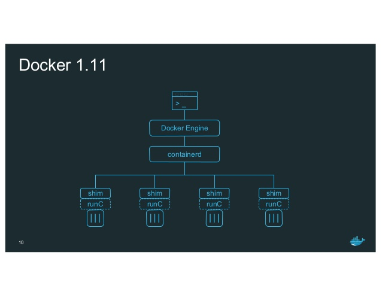

<!-- START doctoc generated TOC please keep comment here to allow auto update -->
<!-- DON'T EDIT THIS SECTION, INSTEAD RE-RUN doctoc TO UPDATE -->
**Table of Contents**  *generated with [DocToc](https://github.com/thlorenz/doctoc)*

- [Docker 1.10](#docker-110)
  - [Static IP](#static-ip)
- [Docker 1.11](#docker-111)
  - [Runtime change](#runtime-change)
- [Docker 1.12](#docker-112)
  - [SwarmKit](#swarmkit)
  - [Overlay2](#overlay2)
  - [Macvlan](#macvlan)
- [Github Issues](#github-issues)

<!-- END doctoc generated TOC please keep comment here to allow auto update -->

# Docker 1.10

## Static IP

Only user defined network supports static IP. Upon receiving a request for static IP, docker will do
sanity check and pass this information to IPAM; IPAM plugin in docker will honor this perference and
allocate this address if possible (and update its bitmask, etc).

*References*

- https://github.com/docker/docker/pull/19001/
- https://blog.jessfraz.com/post/ips-for-all-the-things/

# Docker 1.11

## Runtime change

Instead of a single binary, docker 1.11 ships with multiple ones to support OCI. Docker daemon no
longer manages containers; instead, they are managed by "containerd". containerd is another daemon
which basically just listens on a socket and does CRUD operations. It uses runc to complete the
actual tasks (it launches runc using `os/exec`, i.e. call `/usr/bin/docker-runc` binary).

There is also another component called `/usr/bin/docker-containerd-shim` which is launched everytime
a new container is ran. It will be the parent of the container. The main purpose for shim is for
reattach. It's not enabled in this release but with the shim being the parent and keeping a hold of
the fifo's and pty master it allows docker and containerd to both die and your containers to keep
running. When docker/containerd come back up then they can reattach to the container and get exit
events and attach to stdio.

*References*

- https://blog.docker.com/2016/04/docker-engine-1-11-runc/

# Docker 1.12

## SwarmKit

Docker 1.12 has built-in orchestration, the underline project is swarmkit. For more details, ref
./swarmkit.md.

## Overlay2

Since version 1.12, Docker also provides overlay2 storage driver which is much more efficient than
overlay in terms of inode utilization. The overlay2 driver is only compatible with Linux kernel 4.0
and later.

## Macvlan

In version 1.12, macvlan network driver leaves experimental and becomes production ready.

# Github Issues

- Allow IPC: https://github.com/docker/docker/pull/9074
