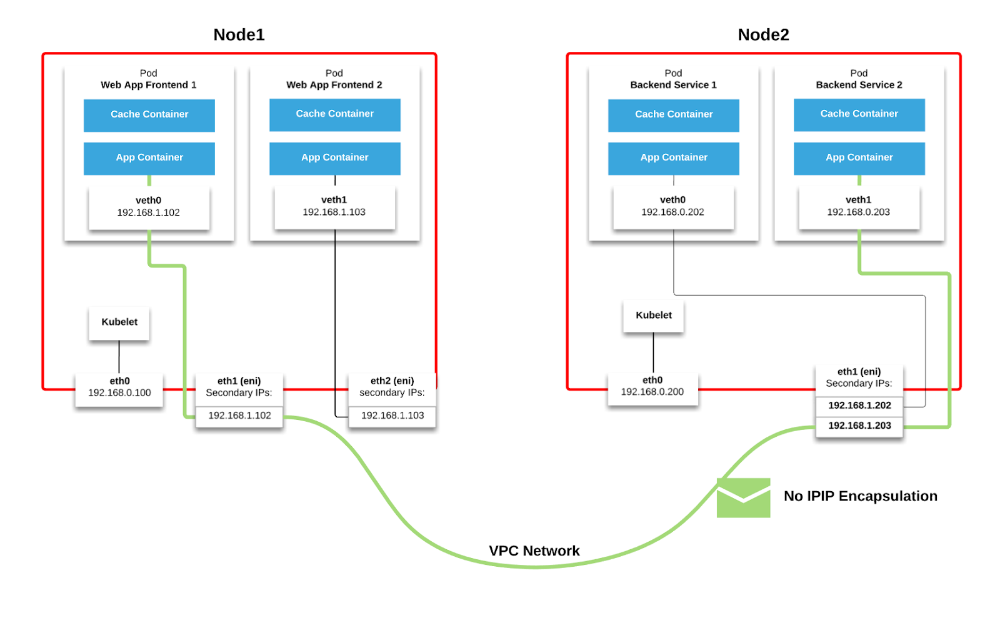

<!-- START doctoc generated TOC please keep comment here to allow auto update -->
<!-- DON'T EDIT THIS SECTION, INSTEAD RE-RUN doctoc TO UPDATE -->
**Table of Contents**  *generated with [DocToc](https://github.com/thlorenz/doctoc)*

- [Nginx ingress](#nginx-ingress)
  - [Overview](#overview)
  - [nginx configuration](#nginx-configuration)
- [GCE ingress](#gce-ingress)
- [AWS ingress](#aws-ingress)
- [Azure ingress](#azure-ingress)

<!-- END doctoc generated TOC please keep comment here to allow auto update -->

# Nginx ingress

## Overview

*Date: 03/07/2017, v0.9*

[Nginx ingress controller](https://github.com/kubernetes/ingress) is a standalone repository in
kubernetes (previously under contrib). The `core/` directory contains general ingress code, e.g.
- generic ingress controller framework
- general configuration for ingress configuration
- proxy settings

When starting an ingress controller, it is the generic ingress controller that gets started; this
generic ingress controller in turn calls specific backend (e.g. nginx, haproxy, gce) to handle config
update, reload, etc. There is an interface `Controller` that defines several methods like Reload,
OnUpdate, etc, to be implemented by an ingress backend.

*Updates on 04/07/2018, v0.12*
*Updates on 12/13/2018, v0.21*

Repository moved from [ingress](https://github.com/kubernetes/ingress) to [ingress-nginx](https://github.com/kubernetes/ingress-nginx).
It no longer tries to be a generic controller to provide an interface for all backend implementations,
instead, it now focuses only on nginx.

For nginx controller design, refere to [this doc](https://github.com/kubernetes/ingress-nginx/blob/nginx-0.21.0/docs/how-it-works.md).
In particular, nginx controller now avoids reloading nginx when kubernetes endpoints changed, that
is, it will not relaod nginx when pod gets deleted, replaced, etc. It achieves by using lua module,
which shares memory region with nginx.

## nginx configuration

There are three ways to configure nginx:
- configmap: set global configuration for an ingress controller
- annotation: specific configuration for an ingress rule
- custom template: custom configurations that are not exposed from the above two approaches

For more information, refer to official [user guide](https://github.com/kubernetes/ingress-nginx/blob/nginx-0.21.0/docs/user-guide/nginx-configuration/index.md).
For example, here we start a nginx controller, and tell it where to look for configmap configuration
via `--configmap`:

```yaml
containers:
- image: gcr.io/google_containers/nginx-ingress-controller:0.9.0-beta.3
  name: nginx-ingress-controller
  args:
  - /nginx-ingress-controller
  - --default-backend-service=$(POD_NAMESPACE)/default-http-backend
  - --configmap=$(POD_NAMESPACE)/nginx-custom-configuration
```

The above config is a global config, to override any specific config, use annotation for an individual
ingress rule, e.g.

```yaml
apiVersion: extensions/v1beta1
kind: Ingress
metadata:
  name: nginx-test
  annotations:
    kubernetes.io/ingress.class: "nginx"
    ingress.kubernetes.io/affinity: "cookie"
    ingress.kubernetes.io/session-cookie-name: "route"
    ingress.kubernetes.io/session-cookie-hash: "sha1"
spec:
  rules:
  - host: stickyingress.example.com
    http:
      paths:
      - backend:
          serviceName: nginx-service
          servicePort: 80
        path: /
```

# GCE ingress

*Date: 12/13/2018, v1.4.0*

GLBC is the ingress controller for Google Cloud, which manages the following resources in order:

```
Global Forwarding Rule -> TargetHttpProxy -> URL Map -> Backend Service -> Instance Group
```

For a service to be reachable from ingress, it must have type `NodePort` - Google Cloud actually
routes the traffic to node, which then forwards the traffic to pods. The `Instance Group` contains
all nodes in a Kubernetes cluster.

The official repository has a comprehensive guide in its [README](https://github.com/kubernetes/ingress-gce/tree/v1.4.0).
For more information on GKE networking, refer to [gke network overview](https://cloud.google.com/kubernetes-engine/docs/concepts/network-overview).

# AWS ingress

*Date: 12/13/2018, v1.0.1*

The AWS ALB Ingress Controller satisfies Kubernetes ingress resources by provisioning Application Load
Balancers, which is AWS's L7 load balancer.

For controller design, refer to this [design doc](https://github.com/kubernetes-sigs/aws-alb-ingress-controller/blob/v1.0.1/docs/guide/controller/how-it-works.md).
Similar to GCE ingress, it manages a couple of cloud resources.

One thing to note is the notion of traffic mode:
- instance mode
- IP mode

In `instance mode`, ingress traffic starts at the ALB and reaches the Kubernetes nodes through each
service's NodePort. This means that services referenced from ingress resources must be exposed by
`type:NodePort` in order to be reached by the ALB. This is the same as GCE ingress.

In `IP mode`, ingress traffic starts at the ALB and reaches the Kubernetes pods directly. CNIs must
support directly accessible POD ip via secondary IP addresses on ENI. AWS provides this CNI plugin
named [amazon-vpc-cni-k8s](https://github.com/aws/amazon-vpc-cni-k8s). It works by attaching each
secondary IP address of ENI to a single pod, which is routable within VPN network.

A little bit background on `IP mode`, each EC2 instance has a primary network interface, and users
can add ENI (elastic network interface) to EC2 instance. The number of ENIs that can be attached
depends on instance type. Each ENI contains primary and secondary addresses, the primary is preserved
to ENI for external traffic, the secondary addresses can be used by users. The number of secondary
addresses that can be attached to ENI also depends on instance type. For more information on how it
works, refer to the [proposal](https://github.com/aws/amazon-vpc-cni-k8s/blob/v1.3.0/docs/cni-proposal.md).
Here is a short diagram:

<p align="center"></p>

# Azure ingress

*Date: 12/13/2018, v0.1.4*

The [Azure Application Gateway Ingress Controller](https://github.com/Azure/application-gateway-kubernetes-ingress)
allows the Azure Application Gateway (Azure's L7 load balancer) to be used as the ingress for an Azure
Kubernetes Service aka AKS cluster. The ingress controller runs as a pod within the AKS cluster. It
consumes Kubernetes Ingress Resources and converts them to an Azure Application Gateway configuration
which allows the gateway to load-balance traffic to Kubernetes pods.

Based on the architecture diagram and internal [implementation](https://github.com/Azure/application-gateway-kubernetes-ingress/blob/0.1.4/pkg/appgw/backendaddresspools.go),
traffic is routed directly to pods, similar to AWS ingress IP mode. Therefore, as of v0.1.4, the
ingress controller can only be used with advanced networking in Azure.

A little bit background here. AKS has two network modes: [basic network](https://docs.microsoft.com/en-us/azure/aks/concepts-network)
and [advanced network](https://docs.microsoft.com/en-us/azure/aks/configure-advanced-networking).
Basic network uses `kubenet` as CNI plugin, whereas advanced network uses `azure-cni` plugin. In
basic network, we must expose service using NodePort in order for external traffic to reach pods.
In advanced network, IP addresses for the pods and the cluster's nodes are assigned from the
specified subnet within the virtual network. Each node is configured with a primary IP address.
By default, 30 additional IP addresses are pre-configured by Azure CNI that are assigned to pods
scheduled on the node. Therefore, pod IP is routable in the network.
