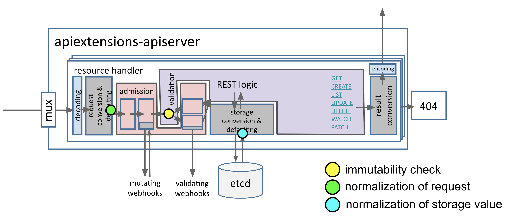

<!-- START doctoc generated TOC please keep comment here to allow auto update -->
<!-- DON'T EDIT THIS SECTION, INSTEAD RE-RUN doctoc TO UPDATE -->
**Table of Contents**  *generated with [DocToc](https://github.com/thlorenz/doctoc)*

- [KEPs](#keps)
  - [20180101 - apiserver dry-run](#20180101---apiserver-dry-run)
  - [20180415 - custom resource definition](#20180415---custom-resource-definition)
  - [20180731 - custom resource definition pruning](#20180731---custom-resource-definition-pruning)
  - [20190206 - watch bookmark](#20190206---watch-bookmark)
  - [20190325 - unions](#20190325---unions)
  - [20190329 - less object serializations](#20190329---less-object-serializations)
  - [20190426 - custom resource definition defaulting](#20190426---custom-resource-definition-defaulting)
  - [20190603 - immutable fields](#20190603---immutable-fields)
- [Feature & Design](#feature--design)
  - [(large) custom resource definition subresource](#large-custom-resource-definition-subresource)
  - [(large) custom resource definition validation](#large-custom-resource-definition-validation)
  - [(large) custom resource definition versioning](#large-custom-resource-definition-versioning)
  - [(large) aggregated api servers](#large-aggregated-api-servers)
  - [(large) garbage collector](#large-garbage-collector)
  - [(large) admission control extension, aka. dynamic admission control](#large-admission-control-extension-aka-dynamic-admission-control)
  - [(medium) admission control webhook bootstrapping, aka, namespace selector](#medium-admission-control-webhook-bootstrapping-aka-namespace-selector)
  - [(medium) apiserver auditing](#medium-apiserver-auditing)
  - [(medium) alternate representations of api resources](#medium-alternate-representations-of-api-resources)
  - [(medium) server side get](#medium-server-side-get)
  - [(medium) api chunking](#medium-api-chunking)
  - [(medium) event compression](#medium-event-compression)
  - [(medium) controllerref, aka, ownerreference](#medium-controllerref-aka-ownerreference)
  - [(small) admission control plugin configuration](#small-admission-control-plugin-configuration)
  - [(small) admission control plugin - eventratelimit](#small-admission-control-plugin---eventratelimit)
  - [(small) client structure and library proposal](#small-client-structure-and-library-proposal)
  - [(small) master count lease reconciler](#small-master-count-lease-reconciler)
  - [(deprecated) monitoring kubelet configuration](#deprecated-monitoring-kubelet-configuration)
  - [(deprecated) self-hosting authz webhook, aka, dynamic auth](#deprecated-self-hosting-authz-webhook-aka-dynamic-auth)
  - [(design pattern) node/pod api](#design-pattern-nodepod-api)
- [Implementation](#implementation)
  - [how watch works](#how-watch-works)
  - [how api rest is installed](#how-api-rest-is-installed)
  - [how go client library works](#how-go-client-library-works)
  - [how self-hosting works](#how-self-hosting-works)
  - [how apiserver proxy works](#how-apiserver-proxy-works)
  - [how api access works v1](#how-api-access-works-v1)
  - [how api access works v2](#how-api-access-works-v2)
  - [how api doc works](#how-api-doc-works)

<!-- END doctoc generated TOC please keep comment here to allow auto update -->

> A collection of proposals, designs, features in Kubernetes APIs.

- [SIG-API-Machinery KEPs](https://github.com/kubernetes/enhancements/blob/master/keps/sig-api-machinery)
- [SIG-API-Machinery Proposals](https://github.com/kubernetes/community/tree/master/contributors/design-proposals/api-machinery)
- [SIG-API-Machinery Community](https://github.com/kubernetes/community/tree/master/sig-api-machinery)

# KEPs

## 20180101 - apiserver dry-run

- *Date: 03/31/2020, v1.18, stable*

The apiserver dry-run is a feature to allow sending requests without any modification and side-effect
to the overall cluster state. One use case of apiserver dry-run is `kubectl diff`, which send a
dry-run request for a given object yaml, and compare the result with existing object in cluster.

> The goal is to be able to send requests to modifying endpoints, and see if the request would have
> succeeded (admission chain, validation, merge conflicts, ...) and/or what would have happened
> without having it actually happen. The response body for the request should be as close as possible
> to a non dry-run response.

To implement dry-run, the KEP outlines a few considerations:

**admission controller**

since some admission controllers can incur side-effect, the KEP proposes to include a new dry-run
flag in admission controller interface, all built-in admission controller with side-effect will need
to be updated. In addition, external admission controller will register to the apiserver with an
additional field "SideEffectClass" to indicate its side-effect: request will be rejected if it hits
an admission controller with unavoidable side-effect.

**generated values**

Some auto-generated values will be ignored (set to empty) like UUID, and some others will be returned
to client, like CreationTimestamp and DeletionTimestamp.

**storage**

Object will not be persisted in backend storage.

> A dry-run request should behave as close as possible to a regular request. Attempting to dry-run
> create an existing object will result in an AlreadyExists error to be returned. Similarly, if a
> dry-run update is performed on a non-existing object, a NotFound error will be returned.

*References*

- [apiserver dry run KEP link](https://github.com/kubernetes/enhancements/blob/000b16193b2e9833cd21884e58aaa05a03f11ef6/keps/sig-api-machinery/0015-dry-run.md)

## 20180415 - custom resource definition

- *Date: 07/16/2017, v1.7, alpha*
- *Date: 04/01/2018, v1.10, beta*
- *Date: 09/18/2019, v1.16, stable*

In kubernetes 1.7, third party resource is marked as deprecated in favor of custom resource definition
(TPR -> CRD). The fundamental concepts behind the two are the same. CRD is proposed as part of the
process to move TPR to beta, which aims to solve multiple issues with TPR, e.g.
- support non-namespace resource
- clearer custom resource naming (avoid TPR name conflicts)
- help remove extensions apigroup from kubernetes
- register short name for custom resources
- fix deleting custom resources while deleting namespace
- support finalizer
- etc

Note that code-wise, CRD doesn't have code directly in kubernetes; instead, its code locates at
[extension-apiserver](https://github.com/kubernetes/apiextensions-apiserver), which is a separate
API server, to be integrated into kube-apiserver via API aggregation. Once all the above knowns
issues are fixed and a solid ground is built, other features can be added to kubernetes, for
example, custom resource validation.

*Update on 04/01/2018, v1.10, beta*

CRD reaches beta in kubernetes 1.10. As of 1.10, the extension API server is still running in
process with the main API server. There is also three controllers running inside main API server:
crdController, namingController, and finalizingController, which deal with discovery, naming conflicts
detection, garbage collection respectively. finalizingController (garbage collection) finalizes the
CRD by deleting all the CRs associated with it.

*Update on 04/03/2020, v1.18, stable*

From CRDs GA graduation KEP, the objectives to graduate CRDs to GA are:
- Defaulting and pruning for custom resources is implemented
- CRD v1 schemas are restricted to a subset of the OpenAPI specification (and there is a v1beta1 compatibility plan)
- Generator exists for CRD Validation Schema v3 (Kubebuilder)
- CustomResourceWebhookConversion API is GA ready
- CustomResourceSubresources API is GA ready

Scale targets of CRDs:
- Suggested maximum number of CRDs in cluster
  - 500 (considering openapi publishing)
- Suggested maximum number of CRs in cluster
  - 40000 (4GB etcd storage, 50kb less in size for each CR)
  - 80000 (8GB etcd storage, 50kb less in size for each CR)
- Suggested maximum number of CRs per CRD
  - <=10kb (size),       1500 (each ns), 10000 (cluster)
  - (10kb - 25kb] (size), 600 (each ns), 4000  (cluster)
  - (25kb - 50kb] (size), 300 (each ns), 2000  (cluster)

*References*

- [crds to ga KEP link](https://github.com/kubernetes/enhancements/blob/d7306177022e9af921e5f6196b0dd592d01e5c28/keps/sig-api-machinery/20180415-crds-to-ga.md)
- [thirdpartyresources design doc](https://github.com/kubernetes/community/blob/506d09c218d39a7d7eba344c6ddddd53e0a91019/contributors/design-proposals/thirdpartyresources.md>)
- https://github.com/kubernetes/community/pull/708
- https://github.com/kubernetes/features/issues/95
- https://kubernetes.io/docs/concepts/api-extension/custom-resources

## 20180731 - custom resource definition pruning

- *Date: 12/09/2019, v1.17, stable*

TODO

## 20190206 - watch bookmark

- *Date: 08/28/2019, v1.15, alpha*
- *Date: 09/29/2019, v1.16, beta*
- *Date: 12/09/2019, v1.17, stable*

Background:

> Every Kubernetes object has a `resourceVersion` field representing the version of that resource as
> stored in the underlying database. The `resourceVersion` is a direct mapping from `Revision`, which
> is a global incremental count in etcd. When retrieving a collection of resources (either namespace
> or cluster scoped), the response from the server will contain a `resourceVersion` value that can be
> used to initiate a watch against the server. The server will return all changes (creates, deletes,
> and updates) that occur after the supplied `resourceVersion`.
>
> https://kubernetes.io/docs/reference/using-api/api-concepts/

As mentioned in the KEP, the `BOOKMARK` event type is useful when watcher is observing only a small
percentage of changes. For example, in the following watch, watcher is interested in pods with label
`name=example`:

```
$ curl "http://localhost:8080/api/v1/namespaces/default/pods?watch=1&labelSelector=name%3Dexample"
```

Now if we create pod with expected label:

```
$ kubectl run nginx --image=nginx:1.13 --generator=run-pod/v1 -l "name=example"
```

We'll receive the following events in the above watch (note the resourceVersion here is 207235):

```sh
# $ curl "http://localhost:8080/api/v1/namespaces/default/pods?watch=1&labelSelector=name%3Dexample"
{"type":"ADDED","object":{"kind":"Pod","apiVersion":"v1","metadata":{"name":"nginx1","namespace":"default","selfLink":"/api/v1/namespaces/default/pods/nginx1","uid":"b0ffb5a9-c99c-11e9-9954-260db7d50b8e","resourceVersion":"207232","creationTimestamp":"2019-08-28T14:04:03Z",
{"type":"MODIFIED","object":{"kind":"Pod","apiVersion":"v1","metadata":{"name":"nginx1","namespace":"default","selfLink":"/api/v1/namespaces/default/pods/nginx1","uid":"b0ffb5a9-c99c-11e9-9954-260db7d50b8e","resourceVersion":"207235","creationTimestamp":"2019-08-28T14:04:03Z",
```

Then if we create pod without the label, or anything else related to pods that's not particularly
interested to the watch, nothing will be returned to it. However, resourceVersion will now be larger
than 207235, say 221000.

The problem here is that if watch restarts, it will sends resourceVersion 207235 to apiserver, which
will pose unnecessary load on apiserver since we now have to process all events from 207235 to 221000
again, even if we know that there's nothing interesting to the watcher in between.

The `BOOKMARK` event is added to effectively send resourceVersion 221000 to watcher, so that in case
of restart, watcher can start from 221000, instead of 207235, reducing load on apiserver.

**Rejected Alternatives**

1. Cache in kube-apiserver

Adding cache means API Server has to remember watcher across its restart, which makes kube-apiserver stateful (or at least hard to implement) and doesn't work in HA setups.

2. API for send bookmark

This is similar to what was done an etcd, where an API was added to notify all watchers about current resourceVersion. However, such API would be hard to manage in kube-apiserver, and we don't really want to notify everyone at the same time.

*References*

- [watch bookmark KEP link](https://github.com/kubernetes/enhancements/blob/310c6ce25124e701a8e47f0221f3afd47084a505/keps/sig-api-machinery/20190206-watch-bookmark.md)
- https://github.com/kubernetes/enhancements/issues/956
- https://github.com/kubernetes/kubernetes/issues/73585

## 20190325 - unions

- *Date: 12/14/2019, v1.17, stable*

Kubernetes API doesn't provide a consistent behavior for union/oneof semantic. For example,
- `VolumeSource` is a structure that holds the definition of all the possible volume types, only one of them must be set, it doesn't have a discriminator.
- `DeploymentStrategy` is a structure that has a discrminator "DeploymentStrategyType" which decides if "RollingUpate" should be set.

Here, discriminator means a field which indicates "at most one of" the other fields is used in the
struct. For example, in the following struct, `UnionType` is the discriminator.

```go
type Union struct {
    UnionType string `json:"unionType"`

    FieldA int `json:"fieldA"`
    FieldB int `json:"fieldB"`
}
```

Lacking a discriminator causes probolems:
- Hard for people to understand how to use the API
- Client can't deal with the non-standard API semantics
- Client has to switch on every fields, instead of just if-else
- Server can't understand the user intent and normalize the object properly
- Server can't easily handle update operation

As an example, if user wants to change deployment strategy from `RollingUpdate` to `Recreate`, he
must explicitly set `rollingUpdate: nil`, i.e.

craeted with:

```
spec:
  replicas: 1
  strategy:
    type: RollingUpdate
    rollingUpdate:
      maxUnavailable: 1
      maxSurge: 1
```

then apply with:

```
spec:
  replicas: 1
  strategy:
    type: Recreate
    rollingUpdate: nil
```

The proposal proposes the following
- Go Tags: use `// +union`, `// +unionDiscriminator` and `// +unionDeprecated` for Kubernetes object type
- OpenAPI: use a new extension `x-kubernetes-unions` to describe the union behavior
- Discriminator: discriminators should be (strongly recommend) added to union structures
- Normalizing on updates: 'specification' of semantics upon update

Note depending on user intentions, apiserver can automatically set discriminator, or automatically
clear all other fields. Validation happends after the nomalization process.

An example new API in flowcontrol/v1alpha1:

```go
// Subject matches the originator of a request, as identified by the request authentication system. There are three
// ways of matching an originator; by user, group, or service account.
// +union
type Subject struct {
    // Required
    // +unionDiscriminator
    Kind SubjectKind
    // +optional
    User *UserSubject
    // +optional
    Group *GroupSubject
    // +optional
    ServiceAccount *ServiceAccountSubject
}

// SubjectKind is the kind of subject.
type SubjectKind string

// Supported subject's kinds.
const (
    SubjectKindUser           SubjectKind = "User"
    SubjectKindGroup          SubjectKind = "Group"
    SubjectKindServiceAccount SubjectKind = "ServiceAccount"
)
```

*References*

- [unions KEP link](https://github.com/kubernetes/enhancements/blob/fbf96b30684f036ac2b85f19318904f053b951fb/keps/sig-api-machinery/20190325-unions.md)
- https://github.com/kubernetes/community/issues/229

## 20190329 - less object serializations

- *Date: 12/14/2019, v1.17, stable*

kube-apiserver consumes considerable CPU cycles due to repeatedly serialize the same objects in API
requests. To be specific,

> The main reason for that is that for every watcher (Endpoints are being watched by kube-proxy
> running on every one) kube-apiserver independently serializes (which also requires deep-copy)
> every single object being send via this watch.
>
> While this problem is extremely visible for watch, the situation looks the same for regular
> GET/LIST operations - reading the same object N times will result in serializing that N times
> independently.

To solve the problem, the KEP proposes to add a `CacheableObject` interface, implementation of which
allows it to cache different serializations to avoid performing the same serialization multiple times.
All existing Encoders will add support for CacheableObject.

The implementation provides the following gains:
- eliminating kube-apiserver unresponsiveness in case of write of a single huge Endpoints object
- ~5% lower cpu-usage
- ~15% less memory allocations

*References*

- [less object serializations KEP link](https://github.com/kubernetes/enhancements/blob/000b16193b2e9833cd21884e58aaa05a03f11ef6/keps/sig-api-machinery/20190329-less-object-serializations.md)

## 20190426 - custom resource definition defaulting

- *Date: 12/09/2019, v1.17, stable*

TODO

## 20190603 - immutable fields

- *Date: 11/03/2019, v1.16, design*

A lot of fields in Kubernetes objects tend to be immutable after creation, but right now Kubernetes
lacks a way to declaratively specify that fields are immutable. Users either have to depend on the
validation for built-in types, or build custom validation using webhook.

To solve the problem, the KEP proposes "immutable fields" with the following goals:
- extend the CRD API to be able to specify immutability for fields.
- publish the immutability field of CRDs via OpenAPI as vendor extension.
- verify immutability on CR update and patch requests.
- propose a source code marker to be consumed by kubebuilder and openapi-gen.
- define the semantics of immutability
- the mechanism must be extensible

**Marker**

Marker is simple, just like `+required` and `+optional`, we can use code comment. The comment will
be recognized by kubebuilder and openapi-gen.

```go
// The name can not be changed after creation.
// +immutable
Name string

// The list of containers can not change AT ALL after creation.
// No single field in existing containers can be changed, added or deleted,
// no new containers can be added, no existing container can be removed.
// +immutable
Containers []Containers
```

Note fields like `metadata` is not allowed to mark as immutable.

**OpenAPI**

Either it's generated from code marker or hand-written, the immutable field will eventually be
represented in OpenAPI. Kubernetes uses two OpenAPI vendor extensions (i.e. custom properties) for
this purpose and defines two extensions: `x-kubernetes-immutable` and `x-kubernetes-immutable-key`.

The `x-kubernetes-immutable` vendor extension is set in the spec of fields, arrays and objects. It
recursively applies to the whole subtree. Note if it's set to an array, it means the array itself
is not mutable (e.g. delete the array), but the items in the array can be modified.

The `x-kubernetes-immutable-keys` vendor extension is used for objects with the concepts of "keys",
e.g. `sets`, `map`. With additional information from other vendor extensions like `x-kubernetes-list-type: map`
and `x-kubernetes-list-map-keys: ["name"]`, it can express more use cases, e.g.
- keys are mutable but values can be changed
- order of the keys are not important

**Process Chain**

Following is the process chain in apiserver. Note the validation will take effect for mutating
webhook as well.

> This process is meant to happen right before the update validation and after mutating, but before validating webhooks, and only run on updates.

<p align="center"></p>

*References*

- [immutable fields KEP link](https://github.com/kubernetes/enhancements/blob/c71c21d2f0f4875ce8f84663190c61bd2beb64e2/keps/sig-api-machinery/20190603-immutable-fields.md)

# Feature & Design

## (large) custom resource definition subresource

- *Date: 05/08/2018, v1.10, alpha*
- *Date: 06/22/2019, v1.15, beta*

The design aims to support `/status` and `/scale` subresources, two common patterns established in
Kubernetes API.

For status, when set,
- apiserver exposes a `/status` subresource for the custom resource
- PUT requests to the `/status` subresource take a custom resource object, and ignore changes to anything except the status stanza
- PUT/POST/PATCH requests to the custom resource ignore changes to the status stanza

For scale, users need to provide path to scale spec and status, e.g. `.spec.replicas` and
`.status.replicas`, as well as labels to select custome resources. Since the Scale object (defined
in autoscaling group) is the payload sent over the wire for `/scale`, POST/PUT/PATCH requests sent
to `/scale` will cause apiserver to copy Scale.Spec.Replicas back and forth to the above mentioned
scale path.

*References*

- [customresources subresources design doc](https://github.com/kubernetes/community/blob/4f9bc566a98517dbb6d1abc8ebc6cf2351e38e18/contributors/design-proposals/api-machinery/customresources-subresources.md)
- https://blog.openshift.com/kubernetes-custom-resources-grow-up-in-v1-10/

## (large) custom resource definition validation

- *Date: 05/08/2018, v1.10, beta*

Before custom resource (CR) validation, CR payload is free-form JSON. The validation aims to solve
the problem by first supporting open api v3 schema. Validation can be done both at server side
(apiserver) and client side (kubectl); to properly validate the CR against the spec in the CRD, the
proposal proposes that we MUST have server-side validation and we can have client-side validation.

The validation is done using [openapi validation library](https://github.com/go-openapi/validate).
For `/status` subresource, validation will only be applied to status, and the proposal does not
preclude implementation of other validation methods, e.g. validation webhook.

*References*

- [custom resource validation design doc](https://github.com/kubernetes/community/blob/4f9bc566a98517dbb6d1abc8ebc6cf2351e38e18/contributors/design-proposals/api-machinery/customresources-validation.md)

## (large) custom resource definition versioning

- *Date: 05/08/2018, v1.10, design*
- *Date: 07/25/2018, v1.11, alpha*
- *Date: 06/22/2019, v1.15, beta*

The goal of the design is to support versioning in CRD. As of kubernetes 1.10, there can be only a
single version in CRD. Later, CRD versioning is supported in Kubernetes v1.11, here is a [tutorial](https://kubernetes.io/docs/tasks/access-kubernetes-api/custom-resources/custom-resource-definition-versioning/).
Following is the CRD golang type as of Kubernetes v1.11.

<details><summary>CRD definition</summary><p>

```go
// CustomResourceDefinitionSpec describes how a user wants their resource to appear
type CustomResourceDefinitionSpec struct {
  // Group is the group this resource belongs in
  Group string
  // Version is the version this resource belongs in
  // Should be always first item in Versions field if provided.
  // Optional, but at least one of Version or Versions must be set.
  // Deprecated: Please use `Versions`.
  Version string
  // Names are the names used to describe this custom resource
  Names CustomResourceDefinitionNames
  // Scope indicates whether this resource is cluster or namespace scoped.  Default is namespaced
  Scope ResourceScope
  // Validation describes the validation methods for CustomResources
  Validation *CustomResourceValidation
  // Subresources describes the subresources for CustomResources
  Subresources *CustomResourceSubresources
  // Versions is the list of all supported versions for this resource.
  // If Version field is provided, this field is optional.
  // Validation: All versions must use the same validation schema for now. i.e., top
  // level Validation field is applied to all of these versions.
  // Order: The version name will be used to compute the order.
  // If the version string is "kube-like", it will sort above non "kube-like" version strings, which are ordered
  // lexicographically. "Kube-like" versions start with a "v", then are followed by a number (the major version),
  // then optionally the string "alpha" or "beta" and another number (the minor version). These are sorted first
  // by GA > beta > alpha (where GA is a version with no suffix such as beta or alpha), and then by comparing
  // major version, then minor version. An example sorted list of versions:
  // v10, v2, v1, v11beta2, v10beta3, v3beta1, v12alpha1, v11alpha2, foo1, foo10.
  Versions []CustomResourceDefinitionVersion
  // AdditionalPrinterColumns are additional columns shown e.g. in kubectl next to the name. Defaults to a created-at column.
  AdditionalPrinterColumns []CustomResourceColumnDefinition
}

type CustomResourceDefinitionVersion struct {
  // Name is the version name, e.g. “v1”, “v2beta1”, etc.
  Name string
  // Served is a flag enabling/disabling this version from being served via REST APIs
  Served bool
  // Storage flags the version as storage version. There must be exactly one flagged
  // as storage version.
  Storage bool
}
```
</p></details></br>

In Kubernetes v1.15, `version` is deprecated and changed to `version` to support multiple versions,
and it's possible to convert different versions using conversion webhook.

<details><summary>CRD example</summary><p>

```yaml
apiVersion: apiextensions.k8s.io/v1beta1
kind: CustomResourceDefinition
metadata:
  # name must match the spec fields below, and be in the form: <plural>.<group>
  name: crontabs.example.com
spec:
  # group name to use for REST API: /apis/<group>/<version>
  group: example.com
  # list of versions supported by this CustomResourceDefinition
  versions:
  - name: v1beta1
    # Each version can be enabled/disabled by Served flag.
    served: true
    # One and only one version must be marked as the storage version.
    storage: true
    # Each version can define it's own schema when there is no top-level
    # schema is defined.
    schema:
      openAPIV3Schema:
        properties:
          hostPort:
            type: string
  - name: v1
    served: true
    storage: false
    schema:
      openAPIV3Schema:
        properties:
          host:
            type: string
          port:
            type: string
  conversion:
    # a Webhook strategy instruct API server to call an external webhook for any conversion between custom resources.
    strategy: Webhook
    # webhookClientConfig is required when strategy is `Webhook` and it configure the webhook endpoint to be
    # called by API server.
    webhookClientConfig:
      service:
        namespace: default
        name: example-conversion-webhook-server
        path: /crdconvert
      caBundle: <pem encoded ca cert that signs the server cert used by the webhook>
  # either Namespaced or Cluster
  scope: Namespaced
  names:
    # plural name to be used in the URL: /apis/<group>/<version>/<plural>
    plural: crontabs
    # singular name to be used as an alias on the CLI and for display
    singular: crontab
    # kind is normally the CamelCased singular type. Your resource manifests use this.
    kind: CronTab
    # shortNames allow shorter string to match your resource on the CLI
    shortNames:
    - ct
```

</p></details></br>

*References*

- [customresources versioning design doc](https://github.com/kubernetes/community/blob/4f9bc566a98517dbb6d1abc8ebc6cf2351e38e18/contributors/design-proposals/api-machinery/customresources-versioning.md)

## (large) aggregated api servers

- *Date: 01/13/2018, v1.9, beta*
- *Date: 05/15/2018, v1.10, stable*

The end goal of the proposal is to run multiple kubernetes style API servers in a single cluster, see
following docs for motivation. In 1.7 the aggregation layer runs in-process with the kube-apiserver.
Until an extension resource is registered, the aggregation layer will do nothing. To register an
API, users must add an `APIService` object, which "claims" the URL path in the Kubernetes API. At
that point, the aggregation layer will proxy anything sent to that API path (e.g. `apis/myextension.mycompany.io/v1`)
to the registered APIService. As mentioned above, CRD is also implemented as an aggregated API server.
The `APIService` API is defined in [kube-aggregator](https://github.com/kubernetes/kube-aggregator).

An example service:

```yaml
apiVersion: apiregistration.k8s.io/v1beta1
kind: APIService
metadata:
  name: v1alpha1.wardle.k8s.io
spec:
  insecureSkipTLSVerify: true
  group: wardle.k8s.io
  groupPriorityMinimum: 1000
  versionPriority: 15
  service:
    name: api
    namespace: wardle
  version: v1alpha1
```

The APIService is usually implemented by an extension-apiserver in a pod running in the cluster.
Also, the server needs to support kubernetes style discovery endpoint, and is commonly built using
generic apiserver (k8s.io/apiserver). For example:

```console
$ kubectl exec -it wardle-server-sfxjn -n wardle bash
Defaulting container name to wardle-server.
Use 'kubectl describe pod/wardle-server-sfxjn' to see all of the containers in this pod.
[root@wardle-server-sfxjn /]# curl -k https://localhost
{
  "paths": [
    "/apis",
    "/apis/wardle.k8s.io",
    "/apis/wardle.k8s.io/v1alpha1",
    "/healthz",
    "/healthz/etcd",
    "/healthz/ping",
    "/healthz/poststarthook/generic-apiserver-start-informers",
    "/healthz/poststarthook/start-sample-server-informers",
    "/version"
  ]
}
```

One of the benefits of using aggregated API server over CRD is to use a separate storage backend. It
is recommended to run aggregated API service in a dedicated namespace to limit attack surface. Although
as of Kubernetes 1.9, aggregation layer still runs in-process with the kube-apiserver, the end
architecture is to run aggregation server separately, with both kube-apiserver and addon API servers
running under aggregation server. The dependency order look like this:
- etcd
- kube-apiserver
- core scheduler, kubelet, service proxy (enough stuff to create a pod, run it on a node, and find it via service)
- kubernetes-aggregator as a pod/service - default summarizer and proxy
- controllers
- other API servers and their controllers
- clients, web consoles, etc

The addon API servers can and should depend on kube-apiserver, e.g. it should use kube-apiserver
finalizer framework to make sure deleting a namespace also deletes its resources.

*Update on 04/21/2018, v1.10*

Aggregation API reaches stable in v1.10. Here we talk a little bit more about auth in aggregation
api service. In above section, we create APIService with `insecureSkipTLSVerify: true`; in real
deployment, it is better to use TLS for server communication. For this purpose, we create aggregation
APIService like this:

```yaml
apiVersion: apiregistration.k8s.io/v1beta1
kind: APIService
metadata:
  name: v1alpha1.wardle
spec:
  caBundle: <base64-encoded-serving-ca-certificate>
  group: wardle
  version: v1alpha1
  groupPriorityMinimum: 1000
  versionPriority: 15
  service:
    name: wardle-server
    namespace: wardle-namespace
```

The `caBundle` option is the CA provided via cluster admin. Aggregation server uses this CA to verify
serving certificates (should be signed by the CA) of addon API server. Aggregation server, on the other
hand, also starts with few certificates:

```
--proxy-client-cert-file=<path to aggregator proxy cert>
--proxy-client-key-file=<path to aggregator proxy key>
```

When the aggregator receives a request that it needs to proxy, it first performs authentication using
the authentication methods configured for the main Kubernetes API server, as well as authorization.
Once it has completed authentication, it records the authentication information in headers, and
forwards the request to the appropriate addon API server, as well as submitting it's own proxy client
certificates to identify itself to the addon API server. Note while the aggregator performs
authentication and authorization, this does not mean that addon API servers can skip performing
authentication and authorization themselves. The API servers are exposed behind regular Kubernetes
services, so clients are free to access the API servers directly. Below is a brief summary of the
[auth doc](https://github.com/kubernetes-incubator/apiserver-builder/blob/e809ac2f9f0c238f08d08a876f8b3f499604f941/docs/concepts/auth.md):

- Certificates Overview
  - serving CA: used for addon API server
  - client CA: used for kubernetes client
  - RequestHeader client CA: used for aggregation server
- Authentication
  - Client Certificate Authentication: this is the standard client auth, where kubernetes apiserver
    use certificate CN, etc, to verify user identity.
  - Delegated Token Authentication: used for addon API server to send 'TokenReview' request to main
    kubernetes API server. In RBAC enabled cluster, in order for addon API servers to be able to
    send the requests, they should be bound to 'system:auth-delegator'. Another role is
    'extension-apiserver-authentication-reader', allowing addon API server to read out CA bunble
    config map created by main API server; so that addon API server can authn/z the same set of users.
  - RequestHeader Authentication: this authenticates connections from API server proxies, which
    themselves have already authenticated the client. Similar to client certificate authentication:
    addon server validates the certificate of the proxy using a CA certificate. However, it then
    allows the proxy to masquerade as any other user, by reading a series of headers set by the
    proxy. This allows addon API servers to run behind the API server aggregator.
- Authorization
  - Addon API servers use delegated authorization. This means that they query for authorization
    against the main Kubernetes API server using 'SubjectAccessReview', allowing cluster admins to
    store policy for addon API servers in the same place as the policy used for the main Kubernetes
    API server, and in the same format (e.g. Kubernetes RBAC). Note however, nothing prevents addon
    API servers to do authorization on their own.

*References*

- [aggregated apiservers design doc](https://github.com/kubernetes/community/blob/5c72116259a131b03f4c6b5e6a7c5ffa289e556f/contributors/design-proposals/api-machinery/aggregated-api-servers.md)
- [minikube walkthrough](https://github.com/kubernetes/sample-apiserver/blob/637c5e26e5de100689e9550c92fafd1337522655/docs/minikube-walkthrough.md)
- [api builder concepts](https://github.com/kubernetes-incubator/apiserver-builder/tree/e809ac2f9f0c238f08d08a876f8b3f499604f941/docs/concepts)
- https://github.com/kubernetes/enhancements/issues/263

## (large) garbage collector

- *Date: 06/20/2017, v1.6, design*
- *Date: 04/01/2018, v1.10, beta*
- *Date: 03/25/2020, v1.18, stable*

Garbage collector controller implements cascading deletion for all API resources in a generic way.
For example, it deletes all pods when a replicaset is deleted.
- GC controller will look for `OwnerReferences` field of an object. If the list is not nil and ALL
  objects in the list are deleted, GC controller will delete the object. If `OwnerReferences` is nil
  (e.g. a bare pod), then GC controller will skip it.
- GC controller uses 'finalizer' framework to ophan an object. API Server adds a finalizer (named
  'orphon') to an object's finalizer (e.g. to rs's finalizer list). When GC sees the object being
  deleted, it removes the object from its dependents' OwnerReference (e.g. it removes rs from pod's
  OwnerReference). At last, GC controller removes 'orphon' finalizer from the object's finalizer.

To simply put, if an object is being deleted with `OrphanDependents=false`, GC controller will be
able to find all of its dependents and remove them. If an object is being deleted with `OrphanDependents=true`,
API server will add a "orphon" finalizer to the object, and the finalizer is responsible to remove
"OwnerReference" of dependents so that GC controller will not delete dependents.

```go
type ObjectMeta struct {
  ...
  OwnerReferences []OwnerReference
}
```

The first proposal garbage collects resources in background; the second proposal extends it to garbage
collect in foreground, i.e. synchronous garbage collection. The idea is to add a new finalizer
'foregroundDeletion' in addition to 'orphan'. Apart from finalizer, dependent that will block the
owner deletion process will have its "ownerReference.blockOwnerDeletion" set to true.

Prior to Kubernetes 1.9, the default garbage collection policy for many controller resources was
orphan. This included ReplicationController, ReplicaSet, StatefulSet, DaemonSet, and Deployment.
For kinds in the extensions/v1beta1, apps/v1beta1, and apps/v1beta2 group versions, unless you
specify otherwise, dependent objects are orphaned by default. In Kubernetes 1.9, for all kinds in
the apps/v1 group version, dependent objects are deleted by default.

*References*

- [async gc design doc](https://github.com/kubernetes/community/blob/45988676be1714cc275b8e736b42e0820aa57362/contributors/design-proposals/garbage-collection.md)
- [sync gc design doc](https://github.com/kubernetes/community/blob/45988676be1714cc275b8e736b42e0820aa57362/contributors/design-proposals/synchronous-garbage-collection.md)
- https://kubernetes.io/docs/concepts/workloads/controllers/garbage-collection/

## (large) admission control extension, aka. dynamic admission control

- *Date: 07/17/2017, v1.7, alpha*
- *Date: 03/10/2018, v1.10, beta*
- *Date: 09/29/2019, v1.16, stable*

Before kubernetes 1.7, there's only built-in admission controllers, and these controllers are shipped
with kubernetes releases. If user wants to add new type of admission controller, he/she must add
source code to kubernetes apiserver and re-build kubernetes binary. If user wants to enable/disable
built-in controller, he/she must change command line flag and restart apiserver.

The proposal aims at making admission more extensible. Two mechanisms are proposed, one is initializers
and the other is webhook. They have different use cases, e.g. initializers are suitable for aysnc
operations which takes a long time, while webhook is suitable for sync operations like validating
fields.

**initializers**

Every kubernetes object has `metadata.initializers`, which, if non-empty, means an external
initialization is required for this object. The external controller must watch the object and when
successfully initialize the object, remove itself from `metadata.initializers`.

Note that only priviledged admin can add initializers directly: they are mostly dynamically added
by using `InitializerConfiguration` from `admissionregistration.k8s.io/v1alpha1` API group. Upon
object creation, the object is compared against all InitializerConfiguration, and if there is a match,
corresponding initializer will be added to the object. The comparison is done in a new admission
controller called 'Initializer'. As of now, 'creator' information is not exposed via initializer,
i.e. only the created or updated object is available.

```yaml
apiVersion: admissionregistration.k8s.io/v1alpha1
kind: InitializerConfiguration
metadata:
  name: example-config
initializers:
  # the name needs to be fully qualified, i.e., containing at least two "."
  - name: podimage.example.com
    rules:
      # apiGroups, apiVersion, resources all support wildcard "*".
      # "*" cannot be mixed with non-wildcard.
      - apiGroups:
          - ""
        apiVersions:
          - v1
        resources:
          - pods
```

*Update on 06/29/2019, v1.15, deprecated*

Initializers are deprecated in favor of webhook admission.

**external webhook**

External webhook calls an external server (deployed in kubernetes) about admission decision. A new
admission controller named `GenericAdmissionWebhook` is added to make the call. Like InitializerConfiguration,
external admission hook is can also be added dynamically via `ExternalAdmissionHookConfiguration` in
`admissionregistration.k8s.io/v1lapha1` API group. Upon object creation, the object is compared
against all `ExternalAdmissionHookConfiguration`, and if there is a match, corresponding external
webhook will be called with `AdmissionReview` API object:

```yaml
apiVersion: admissionregistration.k8s.io/v1alpha1
kind: ExternalAdmissionHookConfiguration
metadata:
  name: config1
spec:
  externalAdmissionHooks:
    - name: podimage
      rules:
        - operations:
            - CREATE
          apiGroups:
            - ""
          apiVersions:
            - v1
          resources:
            - pods
      failurePolicy: Fail
      clientConfig:
        service:
          namespace: default
          name: webhook
        caBundle:

apiVersion: admission.k8s.io/v1alpha1
kind: AdmissionReview
spec:
  name: xxx
  namespace: xxx
  object: xxx
  oldObject: xxx
```

*Update on 03/10/2018, v1.10, beta*

The new proposal extends the previous proposal, and promotes webhook to beta in Kubernetes 1.10; it
only deals with webhooks, not initializer (initializer is still alpha in 1.10). In particular,
the original `GenericAdmissionWebhook` admission controller is split into two webhooks:
- MutatingAdmissionWebhook
- ValidatingAdmissionWebhook

The `ExternalAdmissionHookConfiguration` mentioned above is split into two APIs:
- MutatingAdmissionWebhookConfiguration
- ValidatingAdmissionWebhookConfiguration

A few other notes from the design doc:
- For mutating webhook, operations will run in serial, to ensure conflicts are resolved deterministically.
  The order is the sort order of all the WebhookConfigs, by name, and by index within the Webhooks
  list. For validating webhook, it is already parallel, so it will stay parallel.
- Objects in Kubernetes can have multiple version and group, e.g. `deployments.v1beta1.extensions`
  and `deployments.v1.apps`. Webhook authors are responsible to register both types. There might be
  plans to make it easier to do this before GA.
- All communication to webhooks will be JSON formatted, with a request body of type `admission.k8s.io/v1beta1`.
  For GA, we will likely also allow proto, via a TBD mechanism.
- Webhooks should work with Custom Resources created by CRDs.
- Webhooks should work with Custom Resources on Aggregated API Servers. Aggregated API Servers should
  watch apiregistraton on the main APIserver, and should identify webhooks with rules that match any
  of their resources, and call those webhooks.
- Mutating Webhooks, Non-mutating webhooks, Initializers, and Finalizers are collectively called
  `Object Lifecycle Extensions`.
- The document summarizes recommendations for porting static admission controllers to `Object Lifecycle Extensions`;
  but I'm not sure about the detailed plan.
- For mutating webhook response, see [this doc](https://docs.google.com/document/d/1BT8mZaT42jVxtC6l14YMXpUq0vZc6V5MPf_jnzDMMcg/edit).
  Basically, as of 1.10, Kubernetes uese patch, due to
  - simpler than the negotiation protocol proposed in the design doc
  - support parallel updates
  - avoid dropping field problem (e.g. old client drops new fields which it doesn't understand)

*References*

- [admission control extension design doc](https://github.com/kubernetes/community/blob/a616ab2966ce4caaf5e9ff3f71117e5be5d9d5b4/contributors/design-proposals/api-machinery/admission_control_extension.md)
- [admission control webhooks design doc](https://github.com/kubernetes/community/blob/a616ab2966ce4caaf5e9ff3f71117e5be5d9d5b4/contributors/design-proposals/api-machinery/admission-control-webhooks.md)
- https://github.com/kubernetes/community/pull/132
- https://github.com/kubernetes/features/issues/492

## (medium) admission control webhook bootstrapping, aka, namespace selector

- *Date: 04/14/2018, v1.10, proposal*

Admission webhooks are in the critical path of admitting REST requests, broken webhooks could:
- block the reboot of self-hosted system component
- block the reboot of system addons
- block the reboot of the webhooks (if they are running in pod as well)

This design presents a way to avoid such bootstrap deadlocks; the goal is that:
- if one or more webhooks are down, it should be able restart them automatically
- if a core system component that supports webhooks is down, the component should be able to restart

The design idea is to add 'NamespaceSelector' field to webhook registration API object, in order to
select the namespaces to apply the webhook, and in reverse, the namespaces to not apply the webhook.
The design doc presents 3 runlevels:
- runlevel 0: namespaces that host core system components, like kube-apiserver and kube-controller-manager.
- runlevel 1: namespaces that host add-ons that are part of the webhook serving stack, e.g., kube-dns.
- runlevel 2: namespaces that host webhooks deployments and services.

To make sure the design works as expected, the namespaces need to be properly labeled, and since
this is critical for maintaining cluster, labeling namespace is a privileged operation.

<details><summary>Webhook definition (as of v1.18)</summary><p>

```go
type XxxWebhook struct {
    ...

    // FailurePolicy defines how unrecognized errors from the admission endpoint are handled -
    // allowed values are Ignore or Fail. Defaults to Ignore.
    // +optional
    FailurePolicy *FailurePolicyType

    // matchPolicy defines how the "rules" list is used to match incoming requests.
    // Allowed values are "Exact" or "Equivalent".
    //
    // - Exact: match a request only if it exactly matches a specified rule.
    // For example, if deployments can be modified via apps/v1, apps/v1beta1, and extensions/v1beta1,
    // but "rules" only included `apiGroups:["apps"], apiVersions:["v1"], resources: ["deployments"]`,
    // a request to apps/v1beta1 or extensions/v1beta1 would not be sent to the webhook.
    //
    // - Equivalent: match a request if modifies a resource listed in rules, even via another API group or version.
    // For example, if deployments can be modified via apps/v1, apps/v1beta1, and extensions/v1beta1,
    // and "rules" only included `apiGroups:["apps"], apiVersions:["v1"], resources: ["deployments"]`,
    // a request to apps/v1beta1 or extensions/v1beta1 would be converted to apps/v1 and sent to the webhook.
    //
    // +optional
    MatchPolicy *MatchPolicyType

    // NamespaceSelector decides whether to run the webhook on an object based
    // on whether the namespace for that object matches the selector. If the
    // object itself is a namespace, the matching is performed on
    // object.metadata.labels. If the object is another cluster scoped resource,
    // it never skips the webhook.
    //
    // For example, to run the webhook on any objects whose namespace is not
    // associated with "runlevel" of "0" or "1";  you will set the selector as
    // follows:
    // "namespaceSelector": {
    //   "matchExpressions": [
    //     {
    //       "key": "runlevel",
    //       "operator": "NotIn",
    //       "values": [
    //         "0",
    //         "1"
    //       ]
    //     }
    //   ]
    // }
    //
    // If instead you want to only run the webhook on any objects whose
    // namespace is associated with the "environment" of "prod" or "staging";
    // you will set the selector as follows:
    // "namespaceSelector": {
    //   "matchExpressions": [
    //     {
    //       "key": "environment",
    //       "operator": "In",
    //       "values": [
    //         "prod",
    //         "staging"
    //       ]
    //     }
    //   ]
    // }
    //
    // See
    // https://kubernetes.io/docs/concepts/overview/working-with-objects/labels/
    // for more examples of label selectors.
    //
    // Default to the empty LabelSelector, which matches everything.
    // +optional
    NamespaceSelector *metav1.LabelSelector

    // ObjectSelector decides whether to run the webhook based on if the
    // object has matching labels. objectSelector is evaluated against both
    // the oldObject and newObject that would be sent to the webhook, and
    // is considered to match if either object matches the selector. A null
    // object (oldObject in the case of create, or newObject in the case of
    // delete) or an object that cannot have labels (like a
    // DeploymentRollback or a PodProxyOptions object) is not considered to
    // match.
    // Use the object selector only if the webhook is opt-in, because end
    // users may skip the admission webhook by setting the labels.
    // Default to the empty LabelSelector, which matches everything.
    // +optional
    ObjectSelector *metav1.LabelSelector
    ...
}
```

</p></details></br>

*References*

- [admission webhook bootstrapping design doc](https://github.com/kubernetes/community/blob/53641448047f41c29f46d158b3a2f7d3b4c3aebb/contributors/design-proposals/api-machinery/admission-webhook-bootstrapping.md)
- https://github.com/kubernetes/community/pull/1287

## (medium) apiserver auditing

- *Date: 06/02/2018, v1.10, beta*

Auditing was implemented in [this PR](https://github.com/kubernetes/kubernetes/pull/27087), which
simply logs API request just like apache, nginx. The proposal aims to provide a more advanced
auditing with much more flxibility, and provides more insight into request/response flow. The
proposal leaves room to implement CADF, Cloud Aduiting Data Federation, which is implemented by
OpenStack.

The design proposes to:
- integrate logging into apiserver instead of using a standalone proxy
- use RESThandler instead of admission controller since the former has more information of a request/response.

The design has few important concepts:
- an audit event: the API presented to different components and end user
- an audit level: how many information should be audited
- an audit filter: not defined yet
- an audit output log: where to store audit log, e.g. local file or webhook

Audit configuration can be passed to apiserver via `--audit-policy-file` flag.

<details><summary>Configuration YAML</summary><p>

```yaml
apiVersion: audit.k8s.io/v1beta1 # This is required.
kind: Policy
# Don't generate audit events for all requests in RequestReceived stage.
omitStages:
  - "RequestReceived"
rules:
  # Log pod changes at RequestResponse level
  - level: RequestResponse
    resources:
    - group: ""
      # Resource "pods" doesn't match requests to any subresource of pods,
      # which is consistent with the RBAC policy.
      resources: ["pods"]
  # Log "pods/log", "pods/status" at Metadata level
  - level: Metadata
    resources:
    - group: ""
      resources: ["pods/log", "pods/status"]

  # Don't log requests to a configmap called "controller-leader"
  - level: None
    resources:
    - group: ""
      resources: ["configmaps"]
      resourceNames: ["controller-leader"]

  # Don't log watch requests by the "system:kube-proxy" on endpoints or services
  - level: None
    users: ["system:kube-proxy"]
    verbs: ["watch"]
    resources:
    - group: "" # core API group
      resources: ["endpoints", "services"]

  # Don't log authenticated requests to certain non-resource URL paths.
  - level: None
    userGroups: ["system:authenticated"]
    nonResourceURLs:
    - "/api*" # Wildcard matching.
    - "/version"

  # Log the request body of configmap changes in kube-system.
  - level: Request
    resources:
    - group: "" # core API group
      resources: ["configmaps"]
    # This rule only applies to resources in the "kube-system" namespace.
    # The empty string "" can be used to select non-namespaced resources.
    namespaces: ["kube-system"]

  # Log configmap and secret changes in all other namespaces at the Metadata level.
  - level: Metadata
    resources:
    - group: "" # core API group
      resources: ["secrets", "configmaps"]

  # Log all other resources in core and extensions at the Request level.
  - level: Request
    resources:
    - group: "" # core API group
    - group: "extensions" # Version of group should NOT be included.

  # A catch-all rule to log all other requests at the Metadata level.
  - level: Metadata
    # Long-running requests like watches that fall under this rule will not
    # generate an audit event in RequestReceived.
    omitStages:
      - "RequestReceived"
```

</p></details></br>

For more design issues, see the original proposal. Note the design doc is slightly outdated than
current implementation (see [user guide](https://kubernetes.io/docs/tasks/debug-application-cluster/audit/)).

Apart from auditing policy, another feature called Audit backends persist audit events to an external
storage. Kube-apiserver out of the box provides three backends:
- Log backend, which writes events to a disk
- Webhook backend, which sends events to an external API
- Dynamic backend, which configures webhook backends through an `AuditSink` API object. `AuditSink`
  can be found under `auditregistration` API group in main Kubernetes.

*References*

- [auditing design doc](https://github.com/kubernetes/community/blob/cf54b3484b89d51d7976f816aba95db75cbeccc3/contributors/design-proposals/api-machinery/auditing.md)
- https://github.com/kubernetes/apiserver/tree/release-1.10/pkg/apis/audit

## (medium) alternate representations of api resources

- *Date: 04/21/2018, v1.10*

The proposal aims to provide more representations of Kubernetes API resources to free naive clients
to deal with growing API version and groups, extended resources, etc, via providing a set of common
mechanisms for them. Below is a few examples from the proposal:

In this example, client can request the server to return scale resource as a `Scale` resource in
`meta.k8s.io/v1` API version. Current API provides no way for a client to discover whether a Scale
response returned by 'batch/v2alpha1' is the same as the Scale resource returned by 'autoscaling/v1'.
Using this common meta resource, the problem goes away.

```
GET /api/v1/namespace/example/replicasets/test/scale
Accept: application/json;g=meta.k8s.io,v=v1,as=Scale, application/json

200 OK
Content-Type: application/json;g=meta.k8s.io,v=v1,as=Scale
{
  "apiVersion": "meta.k8s.io/v1",
  "kind": "Scale",
  "spec": {
    "replicas": 1
  }
  ...
}
```

In this example, client can request the server to only return 'ObjectMeta'. This can be significantly
more performant for client who only cares about object meta, e.g. garbage collector.

```
GET /api/v1/namespaces
Accept: application/json;g=meta.k8s.io,v=v1,as=PartialObjectMetadata, application/json

200 OK
Content-Type: application/json;g=meta.k8s.io,v=v1,as=PartialObjectMetadata
{
  "apiVersion": "meta.k8s.io/v1",
  "kind": "PartialObjectMetadataList",
  "items": [
    {
      "apiVersion": "meta.k8s.io/v1",
      "kind": "PartialObjectMetadata",
      "metadata": {
        "name": "foo",
        "resourceVersion": "10",
        ...
      }
    },
    ...
  ]
}
```

*References*

- [alternate api representations design doc](https://github.com/kubernetes/community/blob/d09814f618cfeae6f3a19744520fc13773409c92/contributors/design-proposals/api-machinery/alternate-api-representations.md)

## (medium) server side get

- *Date: 03/07/2018, v1.10*

server side get is part of alternate representations of api resources.

The proposal adds a new type `Table` to meta API (k8s.io/apimachinery), which is a tabular representation
of a set of API resources. The server transforms the object into a set of preferred columns for quickly
reviewing the objects. In this way, client doesn't have to duplicate the work to perform the same
transformation for every type, making cli implementation much easier. This design also works well
with extension API types.

*References*

- [server get design doc](https://github.com/kubernetes/community/blob/e208e4dc74e690ea9c7d82cb67acece5f1f665fc/contributors/design-proposals/api-machinery/server-get.md)

## (medium) api chunking

- *Date: 10/27/2017, v1.8, alpha*
- *Date: 04/21/2018, v1.10, beta*

On large clusters, performing API queries that return all of the objects of a given resource type
(GET /api/v1/pods, GET /api/v1/secrets) can lead to significant variations in peak memory use on the
server and contribute substantially to long tail request latency. Right now, when loading very large
sets of objects, the system will:
- Construct the full range description in etcd in memory and serialize it as protobuf in the client
- The data from etcd has to be transferred to the apiserver in one large chunk
- The kube-apiserver also has to deserialize that response into a single object, and then re-serialize it back to the client
- An API client like kubectl get will then decode the response from JSON or protobuf

The proposal aims to solve the problem via chunking, i.e. by efficiently splitting large list ranges
from etcd to clients into many smaller list ranges. The proposed API looks like:

```
GET /api/v1/pods?limit=500
{
  "metadata": {"continue": "ABC...", "resourceVersion": "147"},
  "items": [
     // no more than 500 items
   ]
}
GET /api/v1/pods?limit=500&continue=ABC...
{
  "metadata": {"continue": "DEF...", "resourceVersion": "147"},
  "items": [
     // no more than 500 items
   ]
}
GET /api/v1/pods?limit=500&continue=DEF...
{
  "metadata": {"resourceVersion": "147"},
  "items": [
     // no more than 500 items
   ]
}
```

There are a few properties for the token `continue` returned from server:
- it is an opaque token, i.e. client is not supposed to parse and understand the token
- the server may limit the amount of time a token is valid for (within mintues)
- the token does not encode the filter parameter of initial request, so client can theoretically
  alter filtering parameters on subsequent request; however, server may reject such request with
  '400' error, therefore in practice, client should not alter filtering parameter
- the token does encode resourceVersion information (for etcd backend), to allow consistent read
  (new item added after initial list request will not appear in subsquent requests using previous
  continue token)

Kubectl is updated to use API chunking via `--chunk` flag.

*References*

- [api chunking design doc](https://github.com/kubernetes/community/blob/d09814f618cfeae6f3a19744520fc13773409c92/contributors/design-proposals/api-machinery/api-chunking.md)

## (medium) event compression

- *Date: 04/21/2018*

Kubernetes components can generate tons of events, the proposal aims to reduce the number of events
and thus reducing load on etcd via event compression. Two types of events are identified that can
be compressed:
- same: the event is identical to previous events except it varies only on timestamp
- similar: the event is identical to previous events except it varies on timestamp and message

The design doesn't introduce new running component to do the compression; instead, the individual
component that produces events should do the compression itself (with helper library). There are two
parts in this event compression design:
- Event API: three new fields are added to event API
  - FirstTimestamp: The date/time of the first occurrence of the event
  - LastTimestamp: The date/time of the most recent occurrence of the event
  - Count: The number of occurrences of this event between FirstTimestamp and LastTimestamp
- Existing Component: existing component that generates events will now perform compression with a
  set of library code:
  - EventAggregator: aggregate event based on key
  - EventLogger: observes the event out of EventAggregation and tracks the number of times it has
    observed that event previously
  - LRU cache: used to hold at most 4096 events

*References*

- [event compression design doc](https://github.com/kubernetes/community/blob/d09814f618cfeae6f3a19744520fc13773409c92/contributors/design-proposals/api-machinery/event_compression.md)

## (medium) controllerref, aka, ownerreference

- *Date: 05/02/2017, v1.6*

The main goal of ControllerRef (controller reference) is to solve the problem of controllers that
fight over controlled objects due to overlapping selectors. A secondary goal of ControllerRef is to
provide back-links from a given object to the controller that manages it. With ControllerRef,
controllers will adopt resources with matching labels and no ControllerRef field set.

The API change is a field known as `OwnerReference.Controller`.

*References*

- [controller ref design doc](https://github.com/kubernetes/community/blob/d09814f618cfeae6f3a19744520fc13773409c92/contributors/design-proposals/api-machinery/controller-ref.md)

## (small) admission control plugin configuration

- *Date: 06/29/2018, v1.15*

Admission controllers can be configured via apiserver flag `--admission-control-config-file`, with
the following content:

```yaml
apiVersion: apiserver.k8s.io/v1alpha1
kind: AdmissionConfiguration
plugins:
- name: EventRateLimit
  path: eventconfig.yaml
- name: ImagePolicyWebhook
  path: imagepolicyconfig.yaml
...
```

The config file of each plugin is plugin dependent.

## (small) admission control plugin - eventratelimit

- *Date: 04/14/2018, v1.10, alpha*

This document proposes an admission controller to enforce a limit on the number of event requests
that the API Server will accept in a given time slice. In a large cluster, the amount of events can
be large enough to overwhelm the API server. The design proposes four aspects to limit events, i.e.

```go
const (
  // ServerLimitType is a type of limit where there is one bucket shared by
  // all of the event queries received by the API Server.
  ServerLimitType LimitType = "server"
  // NamespaceLimitType is a type of limit where there is one bucket used by
  // each namespace
  NamespaceLimitType LimitType = "namespace"
  // UserLimitType is a type of limit where there is one bucket used by each
  // user
  UserLimitType LimitType = "user"
  // SourceAndObjectLimitType is a type of limit where there is one bucket used
  // by each combination of source and involved object of the event.
  SourceAndObjectLimitType LimitType = "sourceAndObject"
)
```

It has three config knobs: qps, burst and cacheSize. At time t, server will only accept "burst"
number of requests; and server will add "qps" budget for accepting requests every second, up to
"burst". The design doc has a detailed example for this.

*References*

- [admission control event rate limit design doc](https://github.com/kubernetes/community/blob/53641448047f41c29f46d158b3a2f7d3b4c3aebb/contributors/design-proposals/api-machinery/admission_control_event_rate_limit.md)

## (small) client structure and library proposal

- *Date: 05/08/2018, v1.10, beta*
- *Date: 03/25/2020, v1.18, stable*

There is an effort in Kubernetes to streamline the maintenance of clients in different languages.
This is originated from [this issue](https://github.com/kubernetes/kubernetes/issues/22405), and the
work is being done within [kubernetes-client org](https://github.com/kubernetes-client).

*References*

- [csi client structure design](https://github.com/kubernetes/community/blob/4f9bc566a98517dbb6d1abc8ebc6cf2351e38e18/contributors/design-proposals/api-machinery/csi-client-structure-proposal.md)
- [csi new client library design](https://github.com/kubernetes/community/blob/4f9bc566a98517dbb6d1abc8ebc6cf2351e38e18/contributors/design-proposals/api-machinery/csi-new-client-library-procedure.md)

## (small) master count lease reconciler

- *Date: 04/21/2018, v1.10*

The proposal aims to fix the problem where staled API server endpoints are not removed from the
`kubernetes` service; for example, when a Kubernetes master is down for some reason. Since quite a
few components use this built-in `kubernetes` service, e.g. dns, this can cause problems to
applications as well.

In older Kubernetes version, master has a reconciler to do this, but it removes staled API server
only when new apiserver is brought up again. It works by defining a flag `--apiserver-count`; the
reconciler maintains the endpoints to not exceeds the account. When new master is brought up, the
endpoint becomes `count + 1` and thus staled API endpoint is removed. However, if no new master is
brought up, the staled API endpoint will stay there forever, causing part of traffic via `kubernetes`
service to fail. Another minor issue with the reconciler is that if real apiserver count is above
`--apiserver-count`, then `kubernetes` endpoints will flap.

The design proposal to fix the problem is to use a lease reconciler: it uses a lease that is regularly
renewed by each apiserver replica. When a replica is down, it stops renewing its lease, and the other
replicas notice that the lease expired and remove it from the list of endpoints. You can switch to
the new reconciler by adding the flag `--endpoint-reconciler-type=lease` when starting your apiserver
replicas. The default lease TTL is 15s, and is checked 2/3 of this value. In very large clusters, this
value may be increased to reduce the possibility that the master endpoint record expires (due to other
load on the etcd server) and causes masters to drop in and out of the kubernetes service record. It
is not recommended to set this value below 15s.

- [apiserver count fix design doc](https://github.com/kubernetes/community/blob/d09814f618cfeae6f3a19744520fc13773409c92/contributors/design-proposals/api-machinery/apiserver-count-fix.md>)
- https://kubernetes.io/docs/admin/high-availability/building/#endpoint-reconciler

## (deprecated) monitoring kubelet configuration

- *Date: 08/16/2017, v1.7*
- *Date: 09/22/2018, v1.11, closed*

This proposal is about exposing component configuration via configz endpoint, using standard kubernetes
API machinery. Before the proposal, each component exposes their own config via `/configz`; the
proposal proposes to use versioned object and exposes via `/configz/{group}/{version}/{kind}`.

*References*

- [monitoring kubelet configuration design doc](https://docs.google.com/document/d/1kNVSdw7H9EqyvI2BYH4EqwVtcg9bi9ZCPpJs8aKZFmM/edit?ts=598cdcf8)

## (deprecated) self-hosting authz webhook, aka, dynamic auth

- *Date: 03/07/2018, v1.10, alpha delayed*
- *Date: 09/22/2018, v1.11, closed*

The proposal makes it possible (easy) to have the authorization webhook run as a pod in the cluster
being authorized. Before the feature, API server accepts a kubeconfig format config file via flag
`--authorization-webhook-config-file=SOME_FILENAME`. However, the file format is not extensible
and not conform to kubernetes style; therefore, a new format and a set of changes are proposed to fix
this. The format is based on the "dynamic admission control":

```yaml
apiVersion: kubeapiserverauthorization.config.k8s.io/v1alpha1
kind: ExternalAuthorizationHookConfiguration
metadata:
  name: example-config
externalAuthorizationHooks:
- name: webhook-name
  clientConfig:
    # The Certificate Authority (CA) certificate file path that signed the
    # webhook server certificate.  Used to verify the identity of the webhook
    # server at kube-apiserver side.
    serverCaFile: ...
    # Path to the certificate file for the webhook plugin to present to the
    # webhook server.
    clientCertFile: ...
    # The private key file corresponding to the client certificate file above.
    clientKeyFile: ...
    # Specify only one of 'url' or 'service'.
    url: <URL of the remote webhook>
    service:
      name: some-service # name of the front-end service
      namespace: some-namespace #<namespace of the front-end service>
```

The feature is later closed due to its wide involvement with other parts of Kubernetes, and potential
security issues with dynamic auth (dynamic admission is less risky).

The authn/z webhooks will continue to be specified via API server config file.

*References*

- [self hosting authorization webhook design doc](https://github.com/filmil/community/blob/56c6cbc35fb5bfd8c24a1f2736ad8a97d960994e/contributors/design-proposals/auth/self-hosting-authorization-webhook.md)
- https://github.com/kubernetes/kubernetes/issues/65109
- https://github.com/kubernetes/features/issues/516

## (design pattern) node/pod api

- *Date: 03/25/2015, v1.0*

The following pattern is being applied to all our API objects, currently most complete in Node and
Pod. Lots of early discussion about "states" (or lack thereof) was in #1365. Note that no field is
called "state". That's deliberate, as is the lack of a complex state-machine model.

- Phase is a monotonically progressing lifecycle phase. The intent is to keep the set of phases very
  small, such as Pending, Running/Active, Terminated (or Success/Failure, which was a compromise).
  Pending is the provisioning/instantiation period, everything up to the resource being fully realized.
  Terminated means that the node has been permanently deleted from the cloud provider or machine
  database -- it's gone, not just rebooting.
- Reason is intended to provide a single-word categorization of the cause the current phase or
  condition. Message is a longer description and may include specific details about the cause for
  that specific object/occurrence. Where these fields appear in an Status subobject, such as PodStatus
  or NodeStatus, they elaborate causes of the current Phase. Where they appear in a Condition, they
  elaborate causes of the current Condition Status.
- Conditions are most recently observed status, in different dimensions. Ready implies that the Kubelet
  (and, ideally, its dependencies, such as Docker) is fully operational and responsive. Reachable would
  imply that the node (not necessarily the Kubelet) can be contacted, such as via ping. Schedulable
  implies that scheduling is administratively permitted for the node -- it is not lamed or being
  shutdown. Runnable would imply that container execution is administratively permitted for the node
  -- it's not drained. We've also discussed adding conditions such as (root) Disk Full, and other
  hardware/system problems.

In order to implement more sophisticated pod and data durability policies (e.g., forgiveness #1574),
the node controller will need to distinguish between these different conditions. It's easy to imagine
the scheduler needing to do so, also.  It does make sense, however, to combine the information in
kubectl output. kubectl get should be the most concise. kubectl describe typically provides more
details, including joins. kubectl can/should also provide less terse, denormalized English descriptions
of the status.

# Implementation

## how watch works

*Date: 11/01/2014*

**API Server**

Every RESTStorage has an interface that handles New, List, Get, Delete, Create and Update. Apart
from these, if a RESTStorage wants to offer the ability to watch for changes through the watch API,
it needs to implement ResourceWatcher interface (see `pkg/apiserver/interfaces.go`), which contains
a single method - Watch. For example, Pod RESTStorage implements the Watch method, thus supporting
watch ability (see `pkg/registry/pod/rest.go`). If any changes in Pods match the given label
selectors, caller will be notified. Because RESTStorage is backed by etcd, the actual watch happens
in etcd (see `pkg/registry/etcd/etcd.go`).

Watch method returns a watch interface defined in `pkg/watch/watch.go`. The interface defines two
methods: one for callers to stop watching, another to get receiving channel.

When client requests a watch, it uses URL like the following:
```
http://127.0.0.1:8080/api/v1beta1/watch/pods?resourceVersion=3
```

The request goes to `pkg/apiserver/watch.go#(*WatchHandler)ServeHTTP`, where the above Watch method
is called, and then etcd WatchPods method is called. WatchPods calls into WatchList (see
`pkg/tools/etcd_tools_watch.go`, etcd_tools_watch.go does most of the work for etcd watch, e.g.
etcdWatcher. For now, the request call-chain is:
```
WatchHandler.ServeHTTP -> Watch -> WatchPods/Service/etc -> WatchList.
```

Throughout the call-chain, the parameter is similar, i.e. key to watch, filter function, and all
return watch interface.

WatchList creates two goroutines: The first one is `go w.translate()`, the second one is
`go w.etcdWatch()`. w.translate() runs forever, wait on etcd to notify changes on the specified key,
convert it into watch Event, then send it to the w.outgoing channel (outgoing is a field in
etcdWatcher that used to notify caller). w.etcdWatch() calls into etcd to start watching; it also
runs forever since itutilizes etcd's long term watching (by passing a etcdWatching channel).

With this setup, control goes back to WatchHandler.ServeHTTP. It gets a watch interface named
"watching", creates a WatchServer using watching, then delegates request to either HandleWS or
ServeHTTP. WatchServer will run forever, waiting on watching.ResultChan().

From previous paragrph, we know ResultChan() is sent from w.translate (using w.outgoing). Therefore,
whenever there is a corresponding change in etcd, ServerHTTP will flush an Event to client. The rough
response workflow looks like below:
```
etcd -> etcdWatch() -> translate() (Event) -> ServeHTTP -> Client
```

It is IMPORTANT to note here that before WatchServer.ServeHTTP entering infinite loop, it will first
call flusher.Flush() to write initial response to client. What this means is that client's Get() or
Do() call WILL return immediately, while it depends on stream reader to get body response from
WatchServer.

**Scheduler**

Scheduler is a watch interface client. It will watch on unscheduled pods, scheduled pods, etc, and
the URLs sent to apiserver look like the following: (Note that "DesiredState.Host!=" is not equal,
which means all scheduled pods, while "DesiredState.Host=" means all unscheduled pods).
```
http://127.0.0.1:8080/api/v1beta1/watch/pods?fields=DesiredState.Host%21%3D&resourceVersion=3
http://127.0.0.1:8080/api/v1beta1/watch/pods?fields=DesiredState.Host%3D&resourceVersion=3
```

In `pkg/scheduler/factory/factory.go#Create()`, some watches are created to watch on Pod changes.
For example, as mentioned above, a watch is created to watch on unscheduled pods. In client side,
Reflector is created to serve watch purpose. The main component of Reflecter is a store, which is
used to store items (as a cache); a ListerWatcher, which is used to list upstream data and perform
watch on those data. ListerWatcher is an interface that contains, surprisely, two method - List()
and Watch(). For scheduler, it is implemented by struct listWatch (see `pkg/scheduler/factory/factory.go`).

Reflector's main entry point is listAndWatch (see `client/cache/reflector.go`). It first calls
List() to get all current items, update its store; then starts watching on given resources (e.g.
unscheduled pods) using Watch(). Watch() returns watch.Interface (same interface as in apiserver)
for reflecter to get result or stop watching, see watchHandler() method. watchHandler runs in a for
loop, use `event, ok := <-w.ResultChan()` to get changes, and do corresponding updates.

The Watch method in ListWatcher simply calls request's Watch method (see `pkg/client/request.go#Watch`),
which do an HTTP request to the URL shown above, and creates a StreamWatcher (see `pkg/watch/iowatch.go`).
NOTE as mentioned before, `httpClient.Do(req)` will return immediately even though server doesn't
return (`pkg/apiserver/watch.go#WatchServer.ServeHTTP`). StreamWatcher also implements watch interface
(returned to Reflector). When created, StreamWatcher starts a goroutine to read result from a decoder
and send it to result channel (ResultChan). The decoder wraps response.Body, it produces result when
apiserver responds with Event (see `watch/json/decoder.go`). Updated response workflow:
```
API Server: etcd -> etcdWatch() -> translate() (Event) -> ServeHTTP -> Client: Decoder -> StreamWatcher -> watchHandler
```

## how api rest is installed

*Date: 02/12/2015*

API is installed in master.go, though apiserver.NewAPIGroupVersion. 'apiRoot' is root of api,
i.e. `/api/v1beta1`.

## how go client library works

*Date: 01/05/2015*

Offical Kubernetes Go client is located at `pkg/client` (before v1.0). This client first accepts a
configuration (`pkg/client/helper.go`), where apiVersion and codec is specified; if not specified,
a default value will be set (e.g. v1beta1). However, the types you're working with is the internal
type, for example:

```
kubeClient.Nodes.Create(&api.Node{...})
```

Internally, the client library will transform the internal type to the given version, e.g. v1beta1,
before sending to apiServer. apiServer will only accept external types - it will convert the external
type into internal type.

The official go client is separated from Kubernetes repository later, refer to [client-go](https://github.com/kubernetes/client-go).

## how self-hosting works

*Date: 04/19/2015*

self-hosting the idea of hosting kubernetes components as Pod. Kubelet discovers pod updates from 3
sources: file, http, and apiserver.

In self-hosting mode, a kubelet instance is running on the master, and watches for file updates. At
cluster bootstrap, pod config files for apiserver, kube-controller manager, etc are created and put
under some directory, e.g. `etc/kubernetes/manifest`.  When the master's kubelet starts running, it
finds thoses files and then creates corresponding Pod. Pods from non-apiserver sources are called
static pods, and API server is not aware of the existence of static pods. In order to monitor the
status of such pods, kubelet creates a mirror pod for each static pod via the API server, and that's
why we can list those core components when listing Pods.

## how apiserver proxy works

*Date: 01/18/2015*

API server proxy provides backholes for accessing other resources. Basically, it is a reverse proxy
in master. It will work on objects that implements the `Redirector` interface, see `pkg/apiserver/interfaces.go`,
`pkg/apiserver/proxy.go`.

**Example1:**

If api server is running at 10.0.0.1 and one minion is 10.1.1.1, then
```
http://10.0.0.1:8080/api/v1beta1/proxy/minions/10.1.1.1/health
```

equals

```
http://10.1.1.1:10250/health
```

In the proxy url, the `minions/10.1.1.1/health` part is generated from `rest.go#ResourceLocation`.

**Example2:**

api server is running at 130.211.172.186, and we have a minion named "kubernetes-minion-5lhs.c.lucid-walker-725.internal".
To get a pod info from api proxy, we can use:

```
https://130.211.172.186/api/v1beta1/proxy/nodes/kubernetes-minion-5lhs.c.lucid-walker-725.internal/api/v1beta1/podInfo?podID=elasticsearch-logging-controller-ls6k1&podNamespace=default
```

## how api access works v1

*Date: 01/07/2015*

**Accessing API**

https://github.com/GoogleCloudPlatform/kubernetes/blob/master/docs/accessing_the_api.md

1. localhost:8080 -> HTTP, All methods, only localhost
2. public_ip:7080 -> HTTP, Only Get method, rate limited
3. public_ip:8443 -> HTTPS with authN and authZ
4. (Optionlly) public_ip:443 -> HTTPS by proxy like nginx, proxy to localhost:8080

<a id="org644b15d"></a>

**Clustering**

https://github.com/GoogleCloudPlatform/kubernetes/blob/master/docs/design/clustering.md

The term "clustering" refers to the process of having all members of the Kubernetes cluster find and
trust each other. Current implementation:

- Master -> Node
  - Location (from the standpoint of master, it means "Where are the nodes?"):
    - Master is the central authority, it knows all the nodes.
  - Target AuthN (from the standpoint of master, it means "Is the node I'm talking to the one I can trust/the one it claims to be?")
    - Master just reaches out to node via HTTP now.
  - Caller AuthN/Z (from the standpoint of master, it means "I need to verify myself and my permissions to calling node.")
    - No plan yet.
- Node -> Master
  - Location (from the standpoint of node, it means "Where is the master?")
    - The location is currently distributed via salt.
  - Target AuthN (from the standpoint of node, it means "Is it master, can I trust it?")
    - Currently, it is via HTTP. Master is not verified.
  - Caller AuthN/Z (from the standpoint of ndoe, it means "I need to verify myself"):
    - Currently, node/kubelet is authenticated to the master via a token shared across all nodes;
      the token is distributed via salt, see [issue](https://github.com/GoogleCloudPlatform/kubernetes/pull/2387).

More about the PR: The `create-dynamic-salt-files.sh` runs in master, it creates a token and stores
in two different files under salt.
```
known_tokens_file="/srv/salt-overlay/salt/kube-apiserver/known_tokens.csv
kubelet_auth_file="/srv/salt-overlay/salt/kubelet/kubernetes_auth
```

The first file is then distributed to master itself, in `/srv/kubernetes/known_token.csv` (on master).
It is passed as the `-token_auth_file` param to apiserver, to secure its SecurePort. The second file
is then distributed to all nodes via salt, in `/var/lib/kubelet/kubernetes_auth` (on nodes). It is
passed as the `-auth_path` param to kubelet, to authenticate to master.

**Code pointers**

- pkg/client/helper.go
- pkg/client/transport.go
- pkg/auth/authenticator/bearertoken/bearertoken.go
- etc.

**Notes**

Checking bearer token makes sure the request comes from authenticated node. However, communication
is made via HTTP now, which means anyone who intercepts the request and gets the token can spoof
that they are nodes. Therefore, k8s also needs to use TLS to secure the communication.

(AuthN Master) master.InsecureHandler is used by localhost port and readonly port to handle insecure
connection, as discussed above. master.Handler is used for secure connection. Once apiserver starts,
the master.Handler has authenticator installed (which returns a handler function, like a middleware).
The handler calls `auth/authenticator/interfaces.go#AuthenticateRequest` to authenticate the request.
The actual implementation of authentication is under plugin. API server's certificate/key files are
used to secure SecurePort too, the files are under `/var/run/kubernetes`. Note unlike bearer token,
CA/key file is generated by apiserver itself (Go code), see `cmd/kube-apiserver/apiserver.go`.

(AuthN Node) Node will set HTTP header for authn, see `pkg/client/helper.go#TransportFor`. By default,
kubelet use https, port 6443 to connect to apiservers (set in salt config file).

(AuthZ) Authorization mode can be configured (alway allow, abac, etc). API server first extrats all
related attributes using NewRequestAttributeGetter, regardless of authZ mode. API server then call
Authorize() method, an interface method. ABAC authorizer is implemented under `pkg/auth/authorizer/abac/abac.go`.
Always Allow/Deny is implemented under `pkg/apiserver/authz.go`.

## how api access works v2

*Date: 07/18/2017, v1.7*

Accessing kubernetes API has four stages: authentication, authorization, admission control and
validation, refere to [accessing the api](https://kubernetes.io/docs/admin/accessing-the-api/).
For more details on AuthN/Z, see `auth.md`.

## how api doc works

*Date: 05/29/2016, v1.2*

`hack/update-generated-swagger-docs.sh` uses binary `cmd/genswaggertypedocs/swagger_type_docs.go`
to generate `types_swagger_doc_generated.go`, which is auto generated code for [go-restful swagger](https://github.com/emicklei/go-restful/pull/215).

`hack/update-swagger-spec.sh` uses various `types_swagger_doc_generated.go` files to generate a
`\*.json` files which satisfies swagger spec. It actually starts API server and curl its endpoint.

`hack/update-api-reference-docs.sh` uses the above `\*.json` files and uses gradle, [swagger2markup](https://github.com/Swagger2Markup/swagger2markup)
to convert swagger to markup (asciidoc), see `hack/gen-swagger-doc`.
