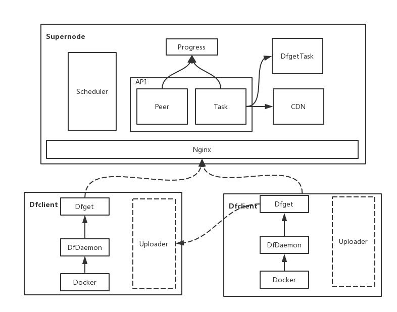

<!-- START doctoc generated TOC please keep comment here to allow auto update -->
<!-- DON'T EDIT THIS SECTION, INSTEAD RE-RUN doctoc TO UPDATE -->
**Table of Contents**  *generated with [DocToc](https://github.com/thlorenz/doctoc)*

- [Overview](#overview)
- [Architecture](#architecture)
- [References](#references)

<!-- END doctoc generated TOC please keep comment here to allow auto update -->

# Overview

[Dragonfly](https://github.com/dragonflyoss/Dragonfly) is an intelligent P2P based image and file
distribution system from alibaba. It's primarily used for container (docker) image distribution,
but the goal is to be a general content distribution system in the cloud native landscape.

# Architecture

*Date: 05/04/2019, v0.3.0*

Dragonfly contains two components:
- Supernode: also called cluster-manager, which is responsible to coordinate the p2p network by
  assigning appropriate peers to download content, as well as fetching content from remote data
  source.
- Dfclient: consists of Dfget and Dfdaemon. Dfget is used to contact supernode to download content,
  similar to wget. It will also serve content for other peers in p2p network. Dfdaemon is a long
  running process to intercept image pull request.

Following is a list of implementation details:
- Dfget will launch a server as a peer and register to Supernode, before it can download content
  from other peers. By default, it will keep the server running for 5 minutes if there is no other
  download/upload task; after then, it will send an offline request to Supernode.
- Dfget downloads content piece by piece: it can find a piece either from Supernode or from other
  peers, all determined and scheduled by Supernode. In addition, for each piece downloaded, Dfget
  will update pieceinfo in Supernode for two purposes:
  - to indicate that it has the piece for other peers to download
  - to get download information about other pieces it requires

# References

For more information, refer to:
- [architecture doc](https://github.com/dragonflyoss/Dragonfly/blob/v0.3.0/docs/design/design.md)
- [API reference doc](https://github.com/dragonflyoss/Dragonfly/blob/v0.3.0/docs/api_reference/apis.md)
