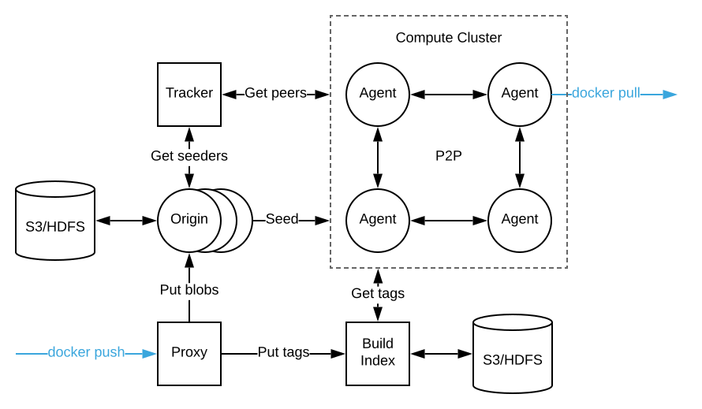

<!-- START doctoc generated TOC please keep comment here to allow auto update -->
<!-- DON'T EDIT THIS SECTION, INSTEAD RE-RUN doctoc TO UPDATE -->
**Table of Contents**  *generated with [DocToc](https://github.com/thlorenz/doctoc)*

- [Overview](#overview)
- [Architecture](#architecture)
- [References](#references)

<!-- END doctoc generated TOC please keep comment here to allow auto update -->

# Overview

[Kraken](https://github.com/uber/kraken) is a P2P-powered Docker registry from uber, focusing on
scalability and availability. Highlights of kraken:
- highly scalable
- highly available
- secure
- pluggable
- lossless cross cluster replication
- minimal dependencies

One drawback of Kraken is that to enjoy speed up, users must be aware of Kraken and explicitly use
Kraken agent or proxy, which is not desirable in some cases.

# Architecture

*Date: 05/04/2019, v0.1.2*

There are five components in Kraken:
- agent
- origin
- tracker
- proxy
- build-index

Additional components include nginx (all the above components run behind nginx), sqlite, etc.

<p align="center"></p>

**Agent**

Agent is deployed on every host of the compute cluster, and forms a p2p network. Agent implements
docker registry APIs; therefore, once deployed, we can treat it as if every host has a local docker
registry. Pulling images from the p2p network must be done using `localhost`, i.e.

```console
docker pull localhost:{agent_registry_port}/{repo}:{tag}
```

**Origin**

Origin is *dedicated* seeder, that is, they have all the container images in the p2p cluster. The
contents are saved as files on disk backed by pluggable storage (e.g. S3), and all seeders forms a
self-healing hash ring to distribute load. Contents in origin are pushed from users (`docker push`)
via kraken proxy component.

**Tracker**

Tracker Tracks which peers have what content (both in-progress and completed), and provides ordered
lists of peers to connect to for any given blob. All trackers forms a self-healing hash ring.

**Proxy**

Proxy also implements docker registry interface. It uploads each image layer to the responsible
origin (origins form a hash ring) and uploads tags to build-index. From user's perspective, images
are pushed to kraken via:

```console
docker push {proxy_host}:{proxy_port}/{repo}:{tag}
```

Note since proxy implements docker registry interface, users can also pull from proxy without going
through p2p network:

```console
docker pull {proxy_host}:{proxy_port}/{repo}:{tag}
```

**Build Index**

Build-index mapping iamge tag to blob hash (digest) and facilitate image replication between clusters.
All build-index forms a self-healing hash ring.

# References

For more information, refer to:
- [architecture doc](https://github.com/uber/kraken/blob/v0.1.2/docs/ARCHITECTURE.md)
- [endpoint doc](https://github.com/uber/kraken/blob/v0.1.2/docs/ENDPOINTS.md)
