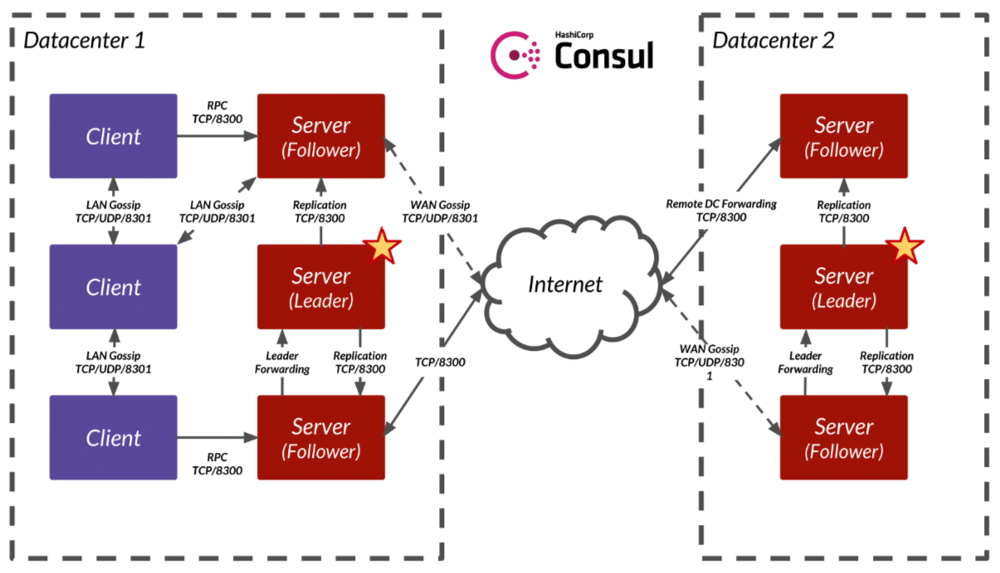

<!-- START doctoc generated TOC please keep comment here to allow auto update -->
<!-- DON'T EDIT THIS SECTION, INSTEAD RE-RUN doctoc TO UPDATE -->
**Table of Contents**  *generated with [DocToc](https://github.com/thlorenz/doctoc)*

- [Overview](#overview)
  - [Consul Agent](#consul-agent)
  - [Consul Connect](#consul-connect)
- [Projects](#projects)
  - [consul-template](#consul-template)
  - [envconsul](#envconsul)
  - [consul-k8s](#consul-k8s)
  - [confd](#confd)
  - [registrator](#registrator)
  - [fabio](#fabio)
- [Experiments (Agent)](#experiments-agent)
  - [Service Discovery](#service-discovery)
  - [Service Mesh](#service-mesh)
- [Experiments (Kubernetes)](#experiments-kubernetes)
  - [Installation](#installation)
  - [Information](#information)
- [References](#references)

<!-- END doctoc generated TOC please keep comment here to allow auto update -->

# Overview

*Date: 11/20/2019, v1.6*

[Consul](https://www.consul.io) is a service networking solution to connect and secure services,
use cases of Consul includes:
- Raw K/V store
- Configuration Management
- Service Discovery
- Service Mesh
- etc

*References*

- https://www.consul.io/docs/

## Consul Agent

Consul is a single binary (called Agent), when launched, it can run as client or server:
- Consul server works like etcd, it forms a quorum, ususally 3 or 5 nodes, with one leader node.
  A server is an agent with an expanded set of responsibilities including participating in the Raft
  quorum, maintaining cluster state, responding to RPC queries, exchanging WAN gossip with other
  datacenters, and forwarding queries to leaders or remote datacenters.
- Consul client connects to server for cases like registering services, etc; it's possible to call
  consul server API directly, but it's common to use client to forward request. A client is an agent
  that forwards all RPCs to a server. The client is relatively stateless. The only background activity
  a client performs is taking part in the LAN gossip pool. This has a minimal resource overhead and
  consumes only a small amount of network bandwidth.

Consul cluster contains both server and client. While consul server forms a quorum and has only
limited number of nodes, there can be many clients in a Consul cluster. In addition, since all
agents speak gossip protocol, detecting agent failure can be done across all agents, and is not
necessarily placed on the server.

> In a multi-agent Consul datacenter, each service would register with its local Consul client, and
> the clients would forward the registration to the Consul servers, which maintain the service catalog.

<p align="center"></p>

## Consul Connect

Consul service mesh solution is called "Consul Connect". Consul Connect doesn't depend on containers.
It needs a sidecar proxy for each registered service, which listens on a random or specific port:
application needs to be changed to call sidecar proxy on localhost (for security), instead of calling
remote service directly.

Despite not specifially designed for container, Consul Connect does have native integration with
Kubernetes, in that:
- Connect can automatically register services from Kubernetes to Consul server
- Connect can automatically inject envoy sidecar to Pod if auto-injection is enabled
- etc

If auto-injection is enabled, Connect will start a sidecar that listens on a random port registered
with Consul and proxies valid inbound connections to port in the pod. To establish a connection to
the pod using Connect, a client must use another Connect proxy. The client Connect proxy will use
Consul service discovery to find all available upstream proxies and their public ports. Both sidcar
proxy port and user container port are available:
- Client can use random port of sidecar proxy, thus leveraging Connect network
- Client can use public port of user container, thus bypassing Connect network

# Projects

## consul-template

[consul-template](https://github.com/hashicorp/consul-template) is usually deployed as a per-node
daemon process. It watches consul K/V store (mostly used as configuration store) and write data to
filesystem path.

For example, one common use case of consul-template is to populate haproxy/nginx configuration based
on provided template and data in consul.

Template:

```
global
    daemon
    maxconn {{key "service/haproxy/maxconn"}}
```

Start consul-template:

```
$ consul-template \
  -template="/tmp/haproxy.conf.ctmpl:/etc/haproxy/haproxy.conf"
```

Rendered file (if the key value is 4):

```
global
    daemon
    maxconn 4
```

## envconsul

[envconsul](https://github.com/hashicorp/envconsul) is a command line tool to launch a subprocess
with environment variables from consul. It will connect to Consul, read the data from the key-value
store, and populate environment variables corresponding to those values.

For example, starting redis with proper options:

```
$ envconsul \
  -consul demo.consul.io \
  -prefix redis/config \
  redis-server [opts...]
```

## consul-k8s

[consul-k8s](https://github.com/hashicorp/consul-k8s) contains a couple of tools for consul &
kubernetes integration, including syncing services, injecting Connect sidecars, and more.

## confd

[confd](https://github.com/kelseyhightower/confd) is very similar to consul-template, where it
looks for data in backend store, update template, then write out to disk.

confd support quite a few backend store, including consul, etcd, environment variable, zookeeper,
redis, etc, and can run in onetime mode or daemon mode.

## registrator

[registrator](https://github.com/gliderlabs/registrator) is used to automatically register docker
container service into consul. Registrator supports other store as well, e.g. etcd.

> Registrator watches for new Docker containers and inspects them to determine what services they
> provide. For our purposes, a service is anything listening on a port. Any services Registrator
> finds on a container, they will be added to a service registry, such as Consul or etcd.

## fabio

[fabio](https://github.com/fabiolb/fabio) is a HTTP/TCP loadbalancer for applications deployed with
consul. Using fabio with consul is simple:
- run application and register the service in consul
- start fabio and points it to the same consul server
- update the above registered service to include `urlprefix-` tag for fabio to pick up the paths it will serve
- fabio will do the rest

fabio doesn't use webserver like nginx, but instead implements loadbalancer using Golang.

# Experiments (Agent)

## Service Discovery

Run consul with a Service `web` registered. Another service `web-check` is unhealthy, thus we won't
be able to query it in DNS.

```
$ consul agent -dev -enable-script-checks -config-dir=./consul.d
==> Starting Consul agent...
           Version: 'v1.6.2'
           Node ID: '276b3b6d-ac8c-2e97-8b90-71e0f848cd78'
         Node name: 'mangosteen'
        Datacenter: 'dc1' (Segment: '<all>')
            Server: true (Bootstrap: false)
       Client Addr: [127.0.0.1] (HTTP: 8500, HTTPS: -1, gRPC: 8502, DNS: 8600)
      Cluster Addr: 127.0.0.1 (LAN: 8301, WAN: 8302)
           Encrypt: Gossip: false, TLS-Outgoing: false, TLS-Incoming: false, Auto-Encrypt-TLS: false

==> Log data will now stream in as it occurs:

    2019/11/20 15:18:36 [DEBUG] agent: Using random ID "276b3b6d-ac8c-2e97-8b90-71e0f848cd78" as node ID
    2019/11/20 15:18:36 [DEBUG] tlsutil: Update with version 1
    2019/11/20 15:18:36 [DEBUG] tlsutil: OutgoingRPCWrapper with version 1
    2019/11/20 15:18:36 [INFO]  raft: Initial configuration (index=1): [{Suffrage:Voter ID:276b3b6d-ac8c-2e97-8b90-71e0f848cd78 Address:127.0.0.1:8300}]
    2019/11/20 15:18:36 [INFO]  raft: Node at 127.0.0.1:8300 [Follower] entering Follower state (Leader: "")
    2019/11/20 15:18:36 [INFO] serf: EventMemberJoin: mangosteen.dc1 127.0.0.1
    2019/11/20 15:18:36 [INFO] serf: EventMemberJoin: mangosteen 127.0.0.1
    2019/11/20 15:18:36 [INFO] consul: Handled member-join event for server "mangosteen.dc1" in area "wan"
    2019/11/20 15:18:36 [INFO] consul: Adding LAN server mangosteen (Addr: tcp/127.0.0.1:8300) (DC: dc1)
    2019/11/20 15:18:36 [INFO] agent: Started DNS server 127.0.0.1:8600 (udp)
    2019/11/20 15:18:36 [INFO] agent: Started DNS server 127.0.0.1:8600 (tcp)
    2019/11/20 15:18:36 [INFO] agent: Started HTTP server on 127.0.0.1:8500 (tcp)
    2019/11/20 15:18:36 [INFO] agent: started state syncer
==> Consul agent running!
    2019/11/20 15:18:36 [INFO] agent: Started gRPC server on 127.0.0.1:8502 (tcp)
    2019/11/20 15:18:36 [WARN]  raft: Heartbeat timeout from "" reached, starting election
    2019/11/20 15:18:36 [INFO]  raft: Node at 127.0.0.1:8300 [Candidate] entering Candidate state in term 2
    2019/11/20 15:18:36 [DEBUG] raft: Votes needed: 1
    2019/11/20 15:18:36 [DEBUG] raft: Vote granted from 276b3b6d-ac8c-2e97-8b90-71e0f848cd78 in term 2. Tally: 1
    2019/11/20 15:18:36 [INFO]  raft: Election won. Tally: 1
    2019/11/20 15:18:36 [INFO]  raft: Node at 127.0.0.1:8300 [Leader] entering Leader state
    2019/11/20 15:18:36 [INFO] consul: cluster leadership acquired
    2019/11/20 15:18:36 [INFO] consul: New leader elected: mangosteen
    2019/11/20 15:18:36 [INFO] connect: initialized primary datacenter CA with provider "consul"
    2019/11/20 15:18:36 [DEBUG] consul: Skipping self join check for "mangosteen" since the cluster is too small
    2019/11/20 15:18:36 [INFO] consul: member 'mangosteen' joined, marking health alive
    2019/11/20 15:18:36 [DEBUG] agent: Skipping remote check "serfHealth" since it is managed automatically
    2019/11/20 15:18:36 [INFO] agent: Synced service "web"
    2019/11/20 15:18:36 [DEBUG] agent: Node info in sync
    2019/11/20 15:18:36 [DEBUG] agent: Service "web" in sync
    2019/11/20 15:18:36 [DEBUG] agent: Node info in sync
    2019/11/20 15:18:37 [DEBUG] agent: Skipping remote check "serfHealth" since it is managed automatically
    2019/11/20 15:18:37 [DEBUG] agent: Service "web" in sync
    2019/11/20 15:18:37 [DEBUG] agent: Node info in sync
    2019/11/20 15:18:38 [DEBUG] tlsutil: OutgoingRPCWrapper with version 1
    2019/11/20 15:18:48 [DEBUG] dns: request for name web.service.consul. type A class IN (took 178.09µs) from client 127.0.0.1:37800 (udp)
    2019/11/20 15:18:55 [DEBUG] dns: request for name web.service.consul. type SRV class IN (took 245.274µs) from client 127.0.0.1:51242 (udp)
    2019/11/20 15:19:26 [DEBUG] http: Request GET /v1/catalog/service/web (1.811739ms) from=127.0.0.1:43388
```

Query using DNS:

```
$ dig @127.0.0.1 -p 8600 web.service.consul

$ dig @127.0.0.1 -p 8600 web.service.consul SRV
```

Or directly using API:

```
curl http://localhost:8500/v1/catalog/service/web
```

Or use web UI at http://localhost:8500/ui/dc1/services.

To update a service:

> You can update service definitions without any downtime by changing the service definition file
> and sending a SIGHUP to the agent or running consul reload. Alternatively, you can use the HTTP
> API to add, remove, and modify services dynamically.

## Service Mesh

Consul provides Service Mesh:

> In addition to providing IP addresses directly to services with the DNS interface or HTTP API,
> Consul can connect services to each other via sidecar proxies that you deploy locally with each
> service instance. This type of deployment (local proxies that control network traffic between
> service instances) is a service mesh. Because sidecar proxies connect your registered services,
> Consul's service mesh feature is called Consul Connect.

**Step1**

Run a service listening on 8181:

```
socat -v tcp-l:8181,fork exec:"/bin/cat"
```

**Step2**

The consul configuration directory has a `socat.json` with a `connect` field, which means we've
instructed consul that there will be a sidecar running alongside with `socat`. From the UI, we can
see a new service `socat-sidecar-proxy`, even though we only registered `socat` service. This
service is automatically registered and is assumed to listen on default port 21000. Initiall, the
service health check fails because proxy is not started yet.

> The configuration notifies Consul to register a sidecar proxy for this process on a dynamically
> allocated port. It also creates reasonable defaults that Consul will use to configure the proxy
> once you start it via the CLI. Consul does not automatically start the proxy process for you. This
> is because Consul Connect allows you to chose the proxy you'd like to use.

**Step3**

Run sidecar proxy.

Consul comes with a built-in proxy, for testing purpose, we can just use the proxy:

```
$ consul connect proxy -sidecar-for socat
==> Consul Connect proxy starting...
    Configuration mode: Agent API
        Sidecar for ID: socat
              Proxy ID: socat-sidecar-proxy

==> Log data will now stream in as it occurs:

    2019/11/20 18:22:58 [INFO] Proxy loaded config and ready to serve
    2019/11/20 18:22:58 [INFO] TLS Identity: spiffe://6ed529f6-5116-a9fa-cdce-36abf152ea9a.consul/ns/default/dc/dc1/svc/socat
    2019/11/20 18:22:58 [INFO] TLS Roots   : [Consul CA 7]
    2019/11/20 18:22:58 [INFO] public listener starting on 0.0.0.0:21000
```

Consul will find out itself that the upsteam service `socat` is listening on port 8181.

**Step4**

The service `socat-web-client` is a client for socat. The configuration "socat-web-client.json"
tells Consul that a sidecar process will be running at 9191.

Now start the proxy service, which will read the configuration and listens on 9191:

```
$ consul connect proxy -sidecar-for socat-web-client
==> Consul Connect proxy starting...
    Configuration mode: Agent API
        Sidecar for ID: socat-web-client
              Proxy ID: socat-web-client-sidecar-proxy

==> Log data will now stream in as it occurs:

    2019/11/20 18:37:27 [INFO] 127.0.0.1:9191->service:default/socat starting on 127.0.0.1:9191
    2019/11/20 18:37:27 [INFO] Proxy loaded config and ready to serve
    2019/11/20 18:37:27 [INFO] TLS Identity: spiffe://568aded3-2f45-fe20-e62a-3cb09e408a39.consul/ns/default/dc/dc1/svc/socat-web-client
    2019/11/20 18:37:27 [INFO] TLS Roots   : [Consul CA 7]
    2019/11/20 18:37:27 [INFO] public listener starting on 0.0.0.0:21001

```

Now we can acess socat using:

```
nc 127.0.0.1 9191
```

The network flow is:

nc -> socat-web-client-proxy -> socat-proxy -> socat

> If we were running a real web service it would talk to its proxy on a loopback address. The proxy
> would encrypt its traffic and send it over the network to the sidecar proxy for the socat service.
> Socat's proxy would decrypt the traffic and send it locally to socat on a loopback address at port
> 8181. Because there is no web service running, you will pretend to be the web service by talking
> to its proxy on the port that we specified (9191).

# Experiments (Kubernetes)

## Installation

Installing Consul via Helm. Here the workloads include:
- consul server running as statefulset; in local environment it's a single instance
- consul client running as daemonset, i.e. one consul client per node
- an injector-webhook running as deployment

```
$ git clone https://github.com/hashicorp/consul-helm.git

$ helm install -f helm-consul-values.yaml --name armadillo ./consul-helm
NAME:   armadillo
LAST DEPLOYED: Thu Nov 21 12:43:27 2019
NAMESPACE: default
STATUS: DEPLOYED

RESOURCES:
==> v1/ClusterRole
NAME                                       AGE
armadillo-consul-client                    0s
armadillo-consul-connect-injector-webhook  0s
armadillo-consul-server                    0s

==> v1/ClusterRoleBinding
NAME                                                          AGE
armadillo-consul-client                                       0s
armadillo-consul-connect-injector-webhook-admin-role-binding  0s
armadillo-consul-server                                       0s

==> v1/ConfigMap
NAME                            DATA  AGE
armadillo-consul-client-config  1     0s
armadillo-consul-server-config  1     0s

==> v1/DaemonSet
NAME              DESIRED  CURRENT  READY  UP-TO-DATE  AVAILABLE  NODE SELECTOR  AGE
armadillo-consul  1        1        0      1           0          <none>         0s

==> v1/Deployment
NAME                                                  READY  UP-TO-DATE  AVAILABLE  AGE
armadillo-consul-connect-injector-webhook-deployment  0/1    1           0          0s

==> v1/Pod(related)
NAME                                                             READY  STATUS             RESTARTS  AGE
armadillo-consul-connect-injector-webhook-deployment-5c4bd5slfr  0/1    ContainerCreating  0         0s
armadillo-consul-xqwmp                                           0/1    ContainerCreating  0         0s

==> v1/Service
NAME                                   TYPE       CLUSTER-IP      EXTERNAL-IP  PORT(S)                                                                  AGE
armadillo-consul-connect-injector-svc  ClusterIP  10.105.134.234  <none>       443/TCP                                                                  0s
armadillo-consul-dns                   ClusterIP  10.108.28.29    <none>       53/TCP,53/UDP                                                            0s
armadillo-consul-server                ClusterIP  None            <none>       8500/TCP,8301/TCP,8301/UDP,8302/TCP,8302/UDP,8300/TCP,8600/TCP,8600/UDP  0s
armadillo-consul-ui                    NodePort   10.103.218.57   <none>       80:31831/TCP                                                             0s

==> v1/ServiceAccount
NAME                                                   SECRETS  AGE
armadillo-consul-client                                1        0s
armadillo-consul-connect-injector-webhook-svc-account  1        0s
armadillo-consul-server                                1        0s

==> v1/StatefulSet
NAME                     READY  AGE
armadillo-consul-server  0/1    0s

==> v1beta1/MutatingWebhookConfiguration
NAME                                   AGE
armadillo-consul-connect-injector-cfg  0s

==> v1beta1/PodDisruptionBudget
NAME                     MIN AVAILABLE  MAX UNAVAILABLE  ALLOWED DISRUPTIONS  AGE
armadillo-consul-server  N/A            0                0                    0s

```

## Information

Logs from Consul server:

```
$ kubectl logs armadillo-consul-server-0
BootstrapExpect is set to 1; this is the same as Bootstrap mode.
bootstrap = true: do not enable unless necessary
==> Starting Consul agent...
           Version: 'v1.6.1'
           Node ID: '04d3c3d0-f213-2f75-3d9e-7500811acbf3'
         Node name: 'armadillo-consul-server-0'
        Datacenter: 'minidc' (Segment: '<all>')
            Server: true (Bootstrap: true)
       Client Addr: [0.0.0.0] (HTTP: 8500, HTTPS: -1, gRPC: -1, DNS: 8600)
      Cluster Addr: 172.17.0.5 (LAN: 8301, WAN: 8302)
           Encrypt: Gossip: false, TLS-Outgoing: false, TLS-Incoming: false, Auto-Encrypt-TLS: false

==> Log data will now stream in as it occurs:

    2019/11/21 04:45:46 [INFO]  raft: Initial configuration (index=1): [{Suffrage:Voter ID:04d3c3d0-f213-2f75-3d9e-7500811acbf3 Address:172.17.0.5:8300}]
    2019/11/21 04:45:46 [INFO] serf: EventMemberJoin: armadillo-consul-server-0.minidc 172.17.0.5
    2019/11/21 04:45:46 [INFO]  raft: Node at 172.17.0.5:8300 [Follower] entering Follower state (Leader: "")
    2019/11/21 04:45:46 [INFO] serf: EventMemberJoin: armadillo-consul-server-0 172.17.0.5
    2019/11/21 04:45:46 [INFO] agent: Started DNS server 0.0.0.0:8600 (udp)
    2019/11/21 04:45:46 [INFO] consul: Adding LAN server armadillo-consul-server-0 (Addr: tcp/172.17.0.5:8300) (DC: minidc)
    2019/11/21 04:45:46 [INFO] consul: Handled member-join event for server "armadillo-consul-server-0.minidc" in area "wan"
    2019/11/21 04:45:46 [INFO] agent: Started DNS server 0.0.0.0:8600 (tcp)
    2019/11/21 04:45:46 [INFO] agent: Started HTTP server on [::]:8500 (tcp)
    2019/11/21 04:45:46 [INFO] agent: Retry join LAN is supported for: aliyun aws azure digitalocean gce k8s mdns os packet scaleway softlayer triton vsphere
    2019/11/21 04:45:46 [INFO] agent: Joining LAN cluster...
    2019/11/21 04:45:46 [INFO] agent: (LAN) joining: [armadillo-consul-server-0.armadillo-consul-server.default.svc]
    2019/11/21 04:45:46 [INFO] agent: started state syncer
==> Consul agent running!
    2019/11/21 04:45:48 [INFO] agent: (LAN) joined: 1
    2019/11/21 04:45:48 [INFO] agent: Join LAN completed. Synced with 1 initial agents
    2019/11/21 04:45:53 [WARN]  raft: Heartbeat timeout from "" reached, starting election
    2019/11/21 04:45:53 [INFO]  raft: Node at 172.17.0.5:8300 [Candidate] entering Candidate state in term 2
    2019/11/21 04:45:53 [INFO]  raft: Election won. Tally: 1
    2019/11/21 04:45:53 [INFO]  raft: Node at 172.17.0.5:8300 [Leader] entering Leader state
    2019/11/21 04:45:53 [INFO] consul: cluster leadership acquired
    2019/11/21 04:45:53 [INFO] consul: New leader elected: armadillo-consul-server-0
    2019/11/21 04:45:53 [INFO] connect: initialized primary datacenter CA with provider "consul"
    2019/11/21 04:45:53 [INFO] consul: member 'armadillo-consul-server-0' joined, marking health alive
    2019/11/21 04:45:53 [INFO] agent: Synced node info
==> Failed to check for updates: Get https://checkpoint-api.hashicorp.com/v1/check/consul?arch=amd64&os=linux&signature=827eada4-f541-7341-3699-3e3dedb70d87&version=1.6.1: net/http: request canceled while waiting for connection (Client.Timeout exceeded while awaiting headers)
    2019/11/21 04:46:15 [INFO] serf: EventMemberJoin: minikube 172.17.0.4
    2019/11/21 04:46:15 [INFO] consul: member 'minikube' joined, marking health alive
```

Logs from Consul client:

```
$ kubectl logs armadillo-consul-xqwmp
==> Starting Consul agent...
           Version: 'v1.6.1'
           Node ID: '6311b005-f63c-1ca9-09bc-ae1f62bdc3ed'
         Node name: 'minikube'
        Datacenter: 'minidc' (Segment: '')
            Server: false (Bootstrap: false)
       Client Addr: [0.0.0.0] (HTTP: 8500, HTTPS: -1, gRPC: 8502, DNS: 8600)
      Cluster Addr: 172.17.0.4 (LAN: 8301, WAN: 8302)
           Encrypt: Gossip: false, TLS-Outgoing: false, TLS-Incoming: false, Auto-Encrypt-TLS: false

==> Log data will now stream in as it occurs:

    2019/11/21 04:45:31 [INFO] serf: EventMemberJoin: minikube 172.17.0.4
    2019/11/21 04:45:31 [INFO] agent: Started DNS server 0.0.0.0:8600 (udp)
    2019/11/21 04:45:31 [INFO] agent: Started DNS server 0.0.0.0:8600 (tcp)
    2019/11/21 04:45:31 [INFO] agent: Started HTTP server on [::]:8500 (tcp)
    2019/11/21 04:45:31 [INFO] agent: Started gRPC server on [::]:8502 (tcp)
    2019/11/21 04:45:31 [INFO] agent: Retry join LAN is supported for: aliyun aws azure digitalocean gce k8s mdns os packet scaleway softlayer triton vsphere
    2019/11/21 04:45:31 [INFO] agent: Joining LAN cluster...
    2019/11/21 04:45:31 [INFO] agent: (LAN) joining: [armadillo-consul-server-0.armadillo-consul-server.default.svc]
    2019/11/21 04:45:31 [INFO] agent: started state syncer
==> Consul agent running!
    2019/11/21 04:45:31 [WARN] manager: No servers available
    2019/11/21 04:45:31 [ERR] agent: failed to sync remote state: No known Consul servers
    2019/11/21 04:45:37 [WARN] manager: No servers available
    2019/11/21 04:45:37 [ERR] http: Request GET /v1/status/leader, error: No known Consul servers from=127.0.0.1:43978
==> Newer Consul version available: 1.6.2 (currently running: 1.6.1)
    2019/11/21 04:45:43 [WARN] agent: (LAN) couldn't join: 0 Err: 1 error occurred:
        * Failed to join 223.87.179.156: dial tcp 223.87.179.156:8301: i/o timeout

    2019/11/21 04:45:43 [WARN] agent: Join LAN failed: <nil>, retrying in 30s
    2019/11/21 04:45:47 [WARN] manager: No servers available
    2019/11/21 04:45:47 [ERR] http: Request GET /v1/status/leader, error: No known Consul servers from=127.0.0.1:44720
    2019/11/21 04:45:51 [WARN] manager: No servers available
    2019/11/21 04:45:51 [ERR] agent: failed to sync remote state: No known Consul servers
    2019/11/21 04:45:57 [WARN] manager: No servers available
    2019/11/21 04:45:57 [ERR] http: Request GET /v1/status/leader, error: No known Consul servers from=127.0.0.1:32818
    2019/11/21 04:46:07 [WARN] manager: No servers available
    2019/11/21 04:46:07 [ERR] http: Request GET /v1/status/leader, error: No known Consul servers from=127.0.0.1:32918
    2019/11/21 04:46:13 [INFO] agent: (LAN) joining: [armadillo-consul-server-0.armadillo-consul-server.default.svc]
    2019/11/21 04:46:15 [INFO] serf: EventMemberJoin: armadillo-consul-server-0 172.17.0.5
    2019/11/21 04:46:15 [INFO] agent: (LAN) joined: 1
    2019/11/21 04:46:15 [INFO] consul: adding server armadillo-consul-server-0 (Addr: tcp/172.17.0.5:8300) (DC: minidc)
    2019/11/21 04:46:15 [INFO] agent: Join LAN completed. Synced with 1 initial agents
    2019/11/21 04:46:17 [INFO] agent: Synced node info
```

With this setup, we'll have two nodes (members) in Consul cluster. Note the output of `consul members`
is based on the gossip protocol, not the raft consensus protocol.

```
$ kubectl exec -it armadillo-consul-server-0 sh
/ # consul members
Node                       Address          Status  Type    Build  Protocol  DC      Segment
armadillo-consul-server-0  172.17.0.5:8301  alive   server  1.6.1  2         minidc  <all>
minikube                   172.17.0.4:8301  alive   client  1.6.1  2         minidc  <default>


$ kubectl get pods -o wide
NAME                                                              READY   STATUS    RESTARTS   AGE   IP           NODE       NOMINATED NODE   READINESS GATES
armadillo-consul-connect-injector-webhook-deployment-5c4bd5slfr   1/1     Running   0          36m   172.17.0.3   minikube   <none>           <none>
armadillo-consul-server-0                                         1/1     Running   0          36m   172.17.0.5   minikube   <none>           <none>
armadillo-consul-xqwmp                                            1/1     Running   0          36m   172.17.0.4   minikube   <none>           <none>
```

# References

- https://medium.com/velotio-perspectives/a-practical-guide-to-hashicorp-consul-part-1-5ee778a7fcf4
- https://medium.com/velotio-perspectives/a-practical-guide-to-hashicorp-consul-part-2-3c0ebc0351e8
