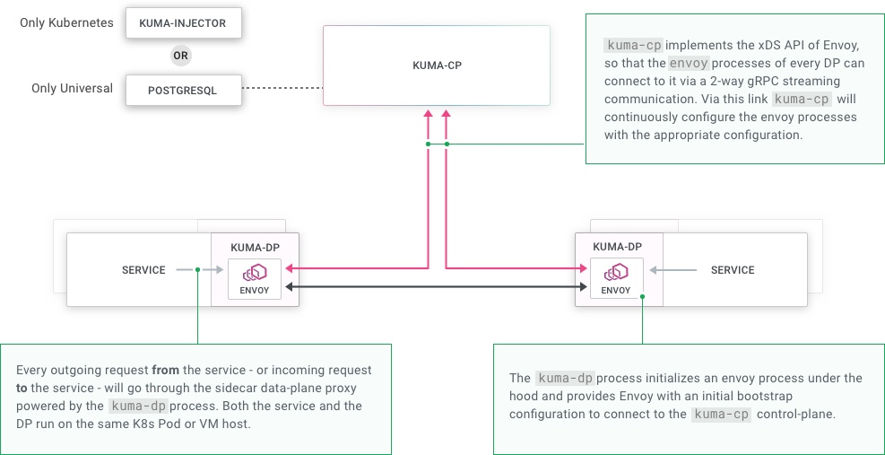

<!-- START doctoc generated TOC please keep comment here to allow auto update -->
<!-- DON'T EDIT THIS SECTION, INSTEAD RE-RUN doctoc TO UPDATE -->
**Table of Contents**  *generated with [DocToc](https://github.com/thlorenz/doctoc)*

- [Overview](#overview)
  - [Introduction](#introduction)
  - [Components](#components)
  - [Concepts](#concepts)
  - [Running Mode](#running-mode)
  - [Policies](#policies)
- [Experiments](#experiments)
  - [On Kubernetes](#on-kubernetes)
  - [On Universal](#on-universal)

<!-- END doctoc generated TOC please keep comment here to allow auto update -->

# Overview

- *Date: 11/18/2019, v0.2.2*
- *Date: 05/09/2020, v0.4.0*

## Introduction

[Kuma](https://github.com/Kong/kuma) is a universal open source control-plane for Service Mesh and
Microservices that can run and be operated natively across both Kubernetes and VM environments, in
order to be easily adopted by every team in the organization.

Kuma differentiates itself from other projects by:
- Universal and Kubernetes-Native: Platform-agnostic, can run and operate anywhere.
- Easy to use: Via automation and a gradual learning curve to Service Mesh policies.
- Simple to deploy: In one step, across both Kubernetes and other platforms.
- Enterprise-Ready: Pragmatic platform for the Enterprise that delivers business value today.

Kuma is built by Kong team.

## Components

A list of components in kuma:
- kuma-cp: this is the main Kuma executable (single binary) that runs the control plane (CP).
- kuma-dp: this is the Kuma data-plane (DP) executable that - under the hood - invokes envoy.
- envoy: this is the Envoy executable that we **bundle** for convenience into the archive: user
  doesn't need to start envoy - it runs as a child process of kuma-dp.
- kumactl: this is the the user CLI to interact with Kuma (kuma-cp) and its data.

Following is a detailed architecture:

<p align="center"></p>

## Concepts

**Mesh**

A single installation of Kuma support multiple `Meshes` to support multi-tenancy. Creating a Mesh is
as simple as creating a configuration.

With Kubernetes:

```yaml
apiVersion: kuma.io/v1alpha1
kind: Mesh
metadata:
  namespace: kuma-system
  name: default
```

With Universal:

```yaml
type: Mesh
name: default
```

For each application, a Mesh is selected using annotation:

```
apiVersion: apps/v1
kind: Deployment
metadata:
  name: kuma-tcp-echo
  namespace: kuma-app
spec:
  replicas: 2
  selector:
    matchLabels:
      app: kuma-tcp-echo
  template:
    metadata:
      labels:
        app: kuma-tcp-echo
      annotations:
        kuma.io/mesh: default
    spec:
      containers:
      - name: kuma-tcp-echo
        image: kong-docker-kuma-docker.bintray.io/kuma-tcp-echo:0.1.0
        imagePullPolicy: Always
        ports:
        - containerPort: 8000
```

**Dataplane Entity**

It's useful to think of a dataplane entity as a combination of user application and envoy sidecar.

From API perspective, the relationship between Mesh and Dataplane:

```
/meshes/{name}/dataplanes/{name}
```

## Running Mode

**Running on Kubernetes**

No external dependencies required, since it leverages the underlying K8s API server to store its
configuration. A `kuma-injector` service will also start in order to automatically inject sidecar
data-plane proxies without human intervention. The entire architecture and workflow is very similar
to other servicemesh solution like istio.

When running on Kubernetes, the HTTP API is read-only: kuma can only be configured via CRDs.

**Running on Universal**

Kuma requires a PostgreSQL database as a dependency in order to store its configuration. PostgreSQL
is a very popular and easy database. You can run Kuma with any managed PostgreSQL offering as well,
like AWS RDS or Aurora.

Universal installation runs a "sidecar process" alongside with user application, and it requires
application modification in order to leverage service mesh capability.

For inbound:

```
echo "type: Dataplane
mesh: default
name: redis-1
networking:
  inbound:
  - interface: 127.0.0.1:9000:6379
    tags:
      service: redis" | kumactl apply -f -

KUMA_CONTROL_PLANE_BOOTSTRAP_SERVER_URL=http://control-plane:5682 \
KUMA_DATAPLANE_MESH=default \
KUMA_DATAPLANE_NAME=redis-1 \
kuma-dp run
```

Here, any external client who wants to consume Redis service will have to make a request to the DP
on port 9000 (instead of port 6379), which internally will be redirected to the Redis service
listening on port 6379.

For outbound:

```
echo "type: Dataplane
mesh: default
name: backend-1
networking:
  inbound:
  - interface: 127.0.0.1:8000:80
    tags:
      service: backend
  outbound:
  - interface: :10000
    service: redis" | kumactl apply -f -

KUMA_CONTROL_PLANE_BOOTSTRAP_SERVER_URL=http://control-plane:5682 \
KUMA_DATAPLANE_MESH=default \
KUMA_DATAPLANE_NAME=backend-1 \
kuma-dp run
```

Here, in order for the backend service to successfully consume Redis, we specify an outbound networking
section in the Dataplane configuration instructing the DP to listen on a new port 10000 and to proxy
any outgoing request on port 10000 to the redis service. For this to work, we must update our application
to consume redis on 127.0.0.1:10000.

## Policies

Policies are used to configure Kuma service mesh:
- Mesh
- Mutual TLS
- Traffic Permissions
- Traffic Route
- Traffic Tracing
- Traffic Log
- Proxy Template

Configuring Kuma for Kubernetes uses CRDs, and uses REST API for Universal installation.

# Experiments

## On Kubernetes

To install with Kubernetes, run:

```
kumactl install control-plane | kubectl apply -f -
```

Installed components:

```
$ kubectl get all -n kuma-system
NAME                                      READY   STATUS    RESTARTS   AGE
pod/kuma-control-plane-67f86bd9f8-lzz76   1/1     Running   0          16m
pod/kuma-injector-84b8bbf459-9t956        1/1     Running   0          16m

NAME                         TYPE        CLUSTER-IP   EXTERNAL-IP   PORT(S)                                                AGE
service/kuma-control-plane   ClusterIP   10.0.0.19    <none>        443/TCP,5677/TCP,5678/TCP,5679/TCP,5681/TCP,5682/TCP   16m
service/kuma-injector        ClusterIP   10.0.0.160   <none>        443/TCP                                                16m

NAME                                 READY   UP-TO-DATE   AVAILABLE   AGE
deployment.apps/kuma-control-plane   1/1     1            1           16m
deployment.apps/kuma-injector        1/1     1            1           16m

NAME                                            DESIRED   CURRENT   READY   AGE
replicaset.apps/kuma-control-plane-67f86bd9f8   1         1         1       16m
replicaset.apps/kuma-injector-84b8bbf459        1         1         1       16m

$ kubectl get crd
NAME                         CREATED AT
dataplaneinsights.kuma.io    2019-11-18T06:33:01Z
dataplanes.kuma.io           2019-11-18T06:33:01Z
meshes.kuma.io               2019-11-18T06:33:01Z
proxytemplates.kuma.io       2019-11-18T06:33:01Z
trafficlogs.kuma.io          2019-11-18T06:33:01Z
trafficpermissions.kuma.io   2019-11-18T06:33:01Z
```

## On Universal

Run control-plane:

```
./kuma-cp run
2019-11-18T16:49:51.220+0800	INFO	Skipping reading config from file
2019-11-18T16:49:51.577+0800	INFO	bootstrap.auto-configure	auto-generated TLS certificate for SDS server	{"crtFile": "/tmp/606940129.crt", "keyFile": "/tmp/903829452.key"}
2019-11-18T16:49:51.577+0800	INFO	bootstrap	Creating default mesh from the settings	{"mesh": {"mtls":{"ca":{"Type":null}}}}
2019-11-18T16:49:51.649+0800	INFO	kuma-cp.run	starting Control Plane
2019-11-18T16:49:51.649+0800	INFO	api-server	starting	{"port": ":5681"}
2019-11-18T16:49:51.649+0800	INFO	xds-server.diagnostics	starting	{"port": 5680}
2019-11-18T16:49:51.649+0800	INFO	bootstrap-server	starting	{"port": 5682}
2019-11-18T16:49:51.672+0800	INFO	xds-server.grpc	starting	{"port": 5678}
2019-11-18T16:49:51.676+0800	INFO	sds-server.grpc	starting	{"port": 5677, "tls": true}
```

Run an application:

<details><summary>Application</summary><p>

```
./kuma-tcp-echo -port 9000
2019/11/18 16:52:04 Kuma TCP Echo - Listening to connections on port 9000
```

```
echo "type: Dataplane
mesh: default
name: dp-echo-1
networking:
  inbound:
  - interface: 127.0.0.1:10000:9000
    tags:
      service: echo" | ./bin/kumactl apply -f -

$ ./bin/kumactl inspect dataplanes dp-echo-1
MESH      NAME        TAGS           STATUS    LAST CONNECTED AGO   LAST UPDATED AGO   TOTAL UPDATES   TOTAL ERRORS
default   dp-echo-1   service=echo   Offline   never                never              0               0
```

</p></details></br>

Creating dataplane configuration and kuma-dataplane proxy:

<details><summary>Dataplane</summary><p>

```
KUMA_CONTROL_PLANE_BOOTSTRAP_SERVER_URL=http://127.0.0.1:5682 \
  KUMA_DATAPLANE_MESH=default \
  KUMA_DATAPLANE_NAME=dp-echo-1 \
  kuma-dp run
[2019-11-18 16:55:42.407][227532][info][main] [source/server/server.cc:238] initializing epoch 0 (hot restart version=disabled)
[2019-11-18 16:55:42.407][227532][info][main] [source/server/server.cc:240] statically linked extensions:
[2019-11-18 16:55:42.407][227532][info][main] [source/server/server.cc:242]   access_loggers: envoy.file_access_log,envoy.http_grpc_access_log
[2019-11-18 16:55:42.407][227532][info][main] [source/server/server.cc:245]   filters.http: envoy.buffer,envoy.cors,envoy.csrf,envoy.ext_authz,envoy.fault,envoy.filters.http.dynamic_forward_proxy,envoy.filters.http.grpc_http1_reverse_bridge,envoy.filters.http.header_to_metadata,envoy.filters.http.jwt_authn,envoy.filters.http.original_src,envoy.filters.http.rbac,envoy.filters.http.tap,envoy.grpc_http1_bridge,envoy.grpc_json_transcoder,envoy.grpc_web,envoy.gzip,envoy.health_check,envoy.http_dynamo_filter,envoy.ip_tagging,envoy.lua,envoy.rate_limit,envoy.router,envoy.squash
[2019-11-18 16:55:42.407][227532][info][main] [source/server/server.cc:248]   filters.listener: envoy.listener.original_dst,envoy.listener.original_src,envoy.listener.proxy_protocol,envoy.listener.tls_inspector
[2019-11-18 16:55:42.407][227532][info][main] [source/server/server.cc:251]   filters.network: envoy.client_ssl_auth,envoy.echo,envoy.ext_authz,envoy.filters.network.dubbo_proxy,envoy.filters.network.mysql_proxy,envoy.filters.network.rbac,envoy.filters.network.sni_cluster,envoy.filters.network.thrift_proxy,envoy.filters.network.zookeeper_proxy,envoy.http_connection_manager,envoy.mongo_proxy,envoy.ratelimit,envoy.redis_proxy,envoy.tcp_proxy
[2019-11-18 16:55:42.407][227532][info][main] [source/server/server.cc:253]   stat_sinks: envoy.dog_statsd,envoy.metrics_service,envoy.stat_sinks.hystrix,envoy.statsd
[2019-11-18 16:55:42.407][227532][info][main] [source/server/server.cc:255]   tracers: envoy.dynamic.ot,envoy.lightstep,envoy.tracers.datadog,envoy.tracers.opencensus,envoy.zipkin
[2019-11-18 16:55:42.407][227532][info][main] [source/server/server.cc:258]   transport_sockets.downstream: envoy.transport_sockets.alts,envoy.transport_sockets.tap,raw_buffer,tls
[2019-11-18 16:55:42.407][227532][info][main] [source/server/server.cc:261]   transport_sockets.upstream: envoy.transport_sockets.alts,envoy.transport_sockets.tap,raw_buffer,tls
[2019-11-18 16:55:42.407][227532][info][main] [source/server/server.cc:267] buffer implementation: old (libevent)
[2019-11-18 16:55:42.411][227532][warning][main] [source/server/server.cc:327] No admin address given, so no admin HTTP server started.
[2019-11-18 16:55:42.412][227532][info][main] [source/server/server.cc:432] runtime: layers:
  - name: base
    static_layer:
      {}
  - name: admin
    admin_layer:
      {}
[2019-11-18 16:55:42.412][227532][warning][runtime] [source/common/runtime/runtime_impl.cc:497] Skipping unsupported runtime layer: name: "base"
static_layer {
}

[2019-11-18 16:55:42.412][227532][info][config] [source/server/configuration_impl.cc:61] loading 0 static secret(s)
[2019-11-18 16:55:42.412][227532][info][config] [source/server/configuration_impl.cc:67] loading 2 cluster(s)
[2019-11-18 16:55:42.438][227532][info][upstream] [source/common/upstream/cluster_manager_impl.cc:144] cm init: initializing cds
[2019-11-18 16:55:42.447][227532][info][config] [source/server/configuration_impl.cc:71] loading 0 listener(s)
[2019-11-18 16:55:42.447][227532][info][config] [source/server/configuration_impl.cc:96] loading tracing configuration
[2019-11-18 16:55:42.447][227532][info][config] [source/server/configuration_impl.cc:116] loading stats sink configuration
[2019-11-18 16:55:42.448][227532][info][main] [source/server/server.cc:516] starting main dispatch loop
[2019-11-18 16:55:43.490][227532][info][upstream] [source/common/upstream/cluster_manager_impl.cc:489] add/update cluster localhost:9000 during init
[2019-11-18 16:55:43.491][227532][info][upstream] [source/common/upstream/cluster_manager_impl.cc:148] cm init: all clusters initialized
[2019-11-18 16:55:43.491][227532][info][main] [source/server/server.cc:500] all clusters initialized. initializing init manager
[2019-11-18 16:55:43.502][227532][info][upstream] [source/server/lds_api.cc:60] lds: add/update listener 'inbound:127.0.0.1:10000'
[2019-11-18 16:55:43.502][227532][info][config] [source/server/listener_manager_impl.cc:761] all dependencies initialized. starting workers
```

</p></details></br>

Now it's possible to curl application via `127.0.0.1:10000`.
