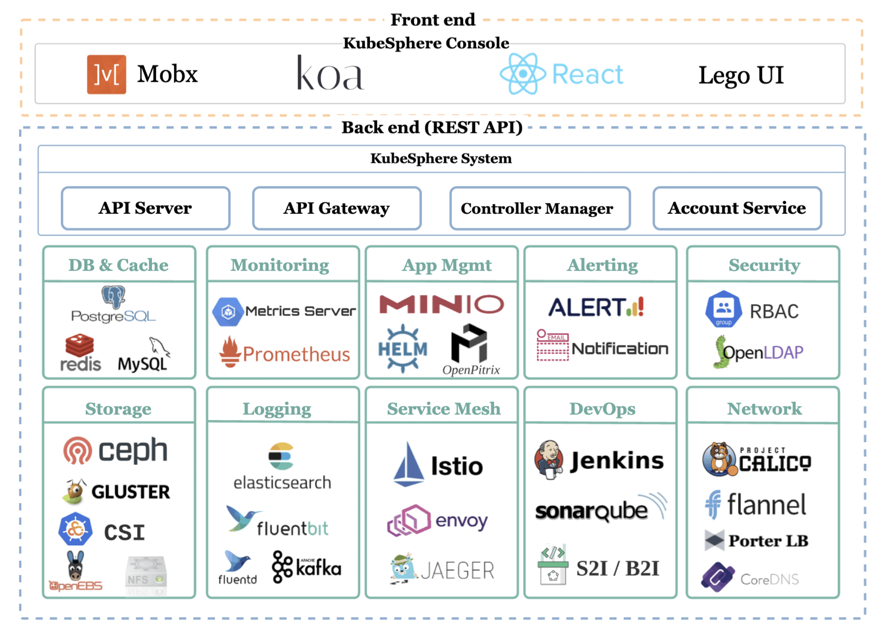

<!-- START doctoc generated TOC please keep comment here to allow auto update -->
<!-- DON'T EDIT THIS SECTION, INSTEAD RE-RUN doctoc TO UPDATE -->
**Table of Contents**  *generated with [DocToc](https://github.com/thlorenz/doctoc)*

- [Overview](#overview)
  - [Introduction](#introduction)
  - [Architecture](#architecture)
- [Implementation](#implementation)
  - [ks-apigateway](#ks-apigateway)
  - [ks-apiserver](#ks-apiserver)
  - [ks-controller-manager](#ks-controller-manager)
  - [ks-account](#ks-account)
  - [ks-console](#ks-console)
  - [ks-installer](#ks-installer)
- [Projects](#projects)
  - [porter](#porter)
- [Experiments (v2.1.1)](#experiments-v211)

<!-- END doctoc generated TOC please keep comment here to allow auto update -->

# Overview

*Date: 04/28/2020, v2.1.1*

## Introduction

KubeSphere is a system built on top of Kuberentes, with many bundled cloud native tools/stacks.

<p align="center"></p>

## Architecture

Note: as of v2.1.1, the architecture only supports a single Kubernetes cluster.

> The flowchart below illustrates KubeSphere API's architecture. All requests will be authenticated by
> the API Gateway and then sent to the corresponding service components. In the architecture graph,
> `/kapi/xxx.kubesphere.io` is the API for KubeSphere extended aggregation services, while APIs started
> with `/api` and `/apis` are Kubernetes' native APIs. It forwards users' requests of KubeSphere's
> native resources to Kubernetes API server through API Gateway in order to operate and manage native
> resources.

<p align="center"></p>

The core components running in kubesphere are:
- ks-apigateway
- ks-apiserver
- ks-controller-manager
- ks-account (ks-iam)
- ks-console
- ks-installer

Minimal external dependencies are:
- redis
- openldap
- prometheus & prometheus-operator
- node-exporter
- kube-state-metrics

Complete external dependencies are:
- Jenkins
- Istio
- FluentBit
- Elasticsearch
- Jaeger
- MySQL
- SonarQube
- Harbor
- etc

In addition:
- node-exporter & kube-state-metrics in `kubesphere-monitoring-system` namespace runs a sidecar [kube-rbac-proxy](https://github.com/brancz/kube-rbac-proxy).
- prometheus in `kubesphere-monitoring-system` namespace runs sidecar [configmap-reloader](https://github.com/jimmidyson/configmap-reload).
- kubectl-admin is pod with `kubectl` command, the entrypoint is an endless sleep.
- there are two instances of prometheus: one for general monitoring and one for system monitoring.
- there are three namespaces `kubesphere-controls-system`, `kubesphere-monitoring-system` and `kubesphere-system`.

# Implementation

## ks-apigateway

The ks-apigateway is built using [caddy](https://github.com/caddyserver/caddy) as a library, a
golang webserver. There are three caddy plugins in apiserver, namely "swagger", "authenticate",
"authentication". Token is saved in Redis.

In addition, the proxy configuration for api-gateway (Caddyfile) is created as a configmap during
ks-install. The configuration is static and created from [an ansible template](https://github.com/kubesphere/ks-installer/blob/v2.1.1/roles/ks-core/prepare/templates/ks-apigateway-init.yaml.j2).

```
$ kubectl get configmap -n kubesphere-system caddyfile
NAME        DATA   AGE
caddyfile   1      66m
```

## ks-apiserver

The ks-apiserver is a REST API server that provides access to all kubesphere features. It is built
using [go-restful](https://github.com/emicklei/go-restful).

> The KubeSphere API server validates and configures data for the API objects which include Kubernetes
> objects. The API Server services REST operations and provides the frontend to the cluster's shared
> state through which all other components interact.

All APIs are registered in [kubesphere/pkg/apis](https://github.com/kubesphere/kubesphere/tree/v2.1.1/pkg/apis).
The set of API groups registered include:
- /kapis/resources.kubesphere.io/v1alpha2/{...}
- /kapis/openpitrix.io/v1/{...}
- /kapis/tenant.kubesphere.io/v1alpha2/{...}
- /kapis/devops.kubesphere.io/v1alpha2/{...}
- /kapis/monitoring.kubesphere.io/v1alpha2/{...}
- /kapis/logging.kubesphere.io/v1alpha2/{...}

For many APIs, there are multiple levels, e.g:
- kapis/openpitrix.io/v1/namespaces/{namespace}/applications/{application}
- kapis/devops.kubesphere.io/v1alpha2/devops/{devops}/pipelines/{pipeline}/branches/{branch}/runs/{run}/nodes

Depending on API requested, ks-apiserver performs different tasks, e.g.
- interact with Kubernetes API, e.g. read resourcequota
- interact with external systems like Jenkins, Prometheus, etc

The ks-apiserver maintains quite a few clients:

```go
func CreateClientSet(conf *apiserverconfig.Config, stopCh <-chan struct{}) error {
    csop := &client.ClientSetOptions{}

    csop.SetDevopsOptions(conf.DevopsOptions).
        SetSonarQubeOptions(conf.SonarQubeOptions).
        SetKubernetesOptions(conf.KubernetesOptions).
        SetMySQLOptions(conf.MySQLOptions).
        SetLdapOptions(conf.LdapOptions).
        SetS3Options(conf.S3Options).
        SetOpenPitrixOptions(conf.OpenPitrixOptions).
        SetPrometheusOptions(conf.MonitoringOptions).
        SetKubeSphereOptions(conf.KubeSphereOptions).
        SetElasticSearchOptions(conf.LoggingOptions)

    client.NewClientSetFactory(csop, stopCh)

    return nil
}
```

## ks-controller-manager

The ks-controller-manager is a standard Kubernetes controller manager (a collection of controllers).
It reconciles various states in kubesphere.

> ks-controller-manager takes care of business logic, for example, when creating a workspace, the
> controller will automatically create corresponding permissions and configurations for it.

The set of controllers enabled are:

```go
controllers := map[string]manager.Runnable{
    "virtualservice-controller":  vsController,
    "destinationrule-controller": drController,
    "application-controller":     apController,
    "job-controller":             jobController,
    "s2ibinary-controller":       s2iBinaryController,
    "s2irun-controller":          s2iRunController,
    "volumeexpansion-controller": volumeExpansionController,
}
```

## ks-account

The ks-account service provides APIs for account and role management, as well user management like
invitation. ks-account maintains following clients:

```go
func Run(s *options.ServerRunOptions, stopChan <-chan struct{}) error {
    csop := client.NewClientSetOptions()
    csop.SetKubernetesOptions(s.KubernetesOptions).
        SetLdapOptions(s.LdapOptions).
        SetRedisOptions(s.RedisOptions).
        SetMySQLOptions(s.MySQLOptions)

    client.NewClientSetFactory(csop, stopChan)
    ...
}
```

## ks-console

KubeSphere console offers KubeSphere console service.

## ks-installer

The ks-installer is an ansible based installer that installs kubesphere on existing kubernetes
cluster. It accepts a [configuration file](https://github.com/kubesphere/ks-installer/blob/v2.1.1/kubesphere-minimal.yaml)
which controls pluggable component installation.
- persistence
- etcd
- common
- console
- monitoring
- openpitrix
- logging
- devops
- metrics_server
- servicemesh
- notification
- alerting

Apart from persistence, etcd and common, which is required parameters, minimal installation will
only install console and monitoring. A complete installation will install all components.

# Projects

## porter

[Porter](https://github.com/kubesphere/porter) is an open source load balancer designed for bare
metal Kubernetes clusters. It is similar to [MetalLB](https://metallb.universe.tf/).

# Experiments (v2.1.1)

A minimal installation of kubesphere includes the following components:

<details><summary>kubectl get all --all-namespaces</summary><p>

```
$ kubectl get all --all-namespaces
NAMESPACE                      NAME                                        READY   STATUS    RESTARTS   AGE
kube-system                    pod/hostpath-provisioner                    1/1     Running   0          16m
kube-system                    pod/kube-dns-547db76c8f-qk8kh               3/3     Running   0          16m
kube-system                    pod/tiller-deploy-c7bcc796b-w92ks           1/1     Running   0          15m
kubesphere-controls-system     pod/default-http-backend-5d464dd566-k86fq   1/1     Running   0          10m
kubesphere-controls-system     pod/kubectl-admin-6c664db975-h7czz          1/1     Running   0          9m34s
kubesphere-monitoring-system   pod/kube-state-metrics-566cdbcb48-kz5cc     4/4     Running   0          9m30s
kubesphere-monitoring-system   pod/node-exporter-sx2xj                     2/2     Running   5          9m28s
kubesphere-monitoring-system   pod/prometheus-k8s-0                        3/3     Running   1          9m14s
kubesphere-monitoring-system   pod/prometheus-k8s-system-0                 3/3     Running   1          9m14s
kubesphere-monitoring-system   pod/prometheus-operator-6b97679cfd-xzbjc    1/1     Running   0          9m29s
kubesphere-system              pod/ks-account-789cd8bbd5-xt74h             1/1     Running   0          9m50s
kubesphere-system              pod/ks-apigateway-5664c4b76f-n5gk4          1/1     Running   0          9m52s
kubesphere-system              pod/ks-apiserver-75f468d48b-xr84p           1/1     Running   0          9m51s
kubesphere-system              pod/ks-console-78bddc5bfb-gzmds             1/1     Running   0          9m47s
kubesphere-system              pod/ks-controller-manager-d4788677-5j8m8    1/1     Running   0          9m49s
kubesphere-system              pod/ks-installer-75b8d89dff-n9df5           1/1     Running   0          11m
kubesphere-system              pod/openldap-0                              1/1     Running   0          10m
kubesphere-system              pod/redis-6fd6c6d6f9-5w9gg                  1/1     Running   0          10m

NAMESPACE                      NAME                                       TYPE        CLUSTER-IP   EXTERNAL-IP   PORT(S)             AGE
default                        service/kubernetes                         ClusterIP   10.0.0.1     <none>        443/TCP             17m
kube-system                    service/kube-controller-manager-headless   ClusterIP   None         <none>        10252/TCP           9m29s
kube-system                    service/kube-dns                           ClusterIP   10.0.0.10    <none>        53/UDP,53/TCP       17m
kube-system                    service/kube-scheduler-headless            ClusterIP   None         <none>        10251/TCP           9m29s
kube-system                    service/kubelet                            ClusterIP   None         <none>        10250/TCP           9m14s
kube-system                    service/tiller-deploy                      ClusterIP   10.0.0.199   <none>        44134/TCP           15m
kubesphere-controls-system     service/default-http-backend               ClusterIP   10.0.0.166   <none>        80/TCP              10m
kubesphere-monitoring-system   service/kube-state-metrics                 ClusterIP   None         <none>        8443/TCP,9443/TCP   9m30s
kubesphere-monitoring-system   service/node-exporter                      ClusterIP   None         <none>        9100/TCP            9m29s
kubesphere-monitoring-system   service/prometheus-k8s                     ClusterIP   None         <none>        9090/TCP            9m29s
kubesphere-monitoring-system   service/prometheus-k8s-system              ClusterIP   None         <none>        9090/TCP            9m29s
kubesphere-monitoring-system   service/prometheus-operated                ClusterIP   None         <none>        9090/TCP            9m14s
kubesphere-monitoring-system   service/prometheus-operator                ClusterIP   None         <none>        8080/TCP            9m30s
kubesphere-system              service/ks-account                         ClusterIP   10.0.0.234   <none>        80/TCP              9m50s
kubesphere-system              service/ks-apigateway                      ClusterIP   10.0.0.193   <none>        80/TCP              9m52s
kubesphere-system              service/ks-apiserver                       ClusterIP   10.0.0.84    <none>        80/TCP              9m51s
kubesphere-system              service/ks-console                         NodePort    10.0.0.132   <none>        80:30880/TCP        9m46s
kubesphere-system              service/openldap                           ClusterIP   None         <none>        389/TCP             10m
kubesphere-system              service/redis                              ClusterIP   10.0.0.34    <none>        6379/TCP            10m

NAMESPACE                      NAME                           DESIRED   CURRENT   READY   UP-TO-DATE   AVAILABLE   NODE SELECTOR                 AGE
kubesphere-monitoring-system   daemonset.apps/node-exporter   1         1         1       1            1           beta.kubernetes.io/os=linux   9m29s

NAMESPACE                      NAME                                    READY   UP-TO-DATE   AVAILABLE   AGE
kube-system                    deployment.apps/kube-dns                1/1     1            1           17m
kube-system                    deployment.apps/tiller-deploy           1/1     1            1           15m
kubesphere-controls-system     deployment.apps/default-http-backend    1/1     1            1           10m
kubesphere-controls-system     deployment.apps/kubectl-admin           1/1     1            1           9m34s
kubesphere-monitoring-system   deployment.apps/kube-state-metrics      1/1     1            1           9m30s
kubesphere-monitoring-system   deployment.apps/prometheus-operator     1/1     1            1           9m30s
kubesphere-system              deployment.apps/ks-account              1/1     1            1           9m50s
kubesphere-system              deployment.apps/ks-apigateway           1/1     1            1           9m52s
kubesphere-system              deployment.apps/ks-apiserver            1/1     1            1           9m51s
kubesphere-system              deployment.apps/ks-console              1/1     1            1           9m47s
kubesphere-system              deployment.apps/ks-controller-manager   1/1     1            1           9m49s
kubesphere-system              deployment.apps/ks-installer            1/1     1            1           11m
kubesphere-system              deployment.apps/redis                   1/1     1            1           10m

NAMESPACE                      NAME                                              DESIRED   CURRENT   READY   AGE
kube-system                    replicaset.apps/kube-dns-547db76c8f               1         1         1       16m
kube-system                    replicaset.apps/tiller-deploy-7b9dcc445d          0         0         0       15m
kube-system                    replicaset.apps/tiller-deploy-c7bcc796b           1         1         1       15m
kubesphere-controls-system     replicaset.apps/default-http-backend-5d464dd566   1         1         1       10m
kubesphere-controls-system     replicaset.apps/kubectl-admin-6c664db975          1         1         1       9m34s
kubesphere-monitoring-system   replicaset.apps/kube-state-metrics-566cdbcb48     1         1         1       9m30s
kubesphere-monitoring-system   replicaset.apps/prometheus-operator-6b97679cfd    1         1         1       9m30s
kubesphere-system              replicaset.apps/ks-account-789cd8bbd5             1         1         1       9m50s
kubesphere-system              replicaset.apps/ks-apigateway-5664c4b76f          1         1         1       9m52s
kubesphere-system              replicaset.apps/ks-apiserver-75f468d48b           1         1         1       9m51s
kubesphere-system              replicaset.apps/ks-console-78bddc5bfb             1         1         1       9m47s
kubesphere-system              replicaset.apps/ks-controller-manager-d4788677    1         1         1       9m49s
kubesphere-system              replicaset.apps/ks-installer-75b8d89dff           1         1         1       11m
kubesphere-system              replicaset.apps/redis-6fd6c6d6f9                  1         1         1       10m

NAMESPACE                      NAME                                     READY   AGE
kubesphere-monitoring-system   statefulset.apps/prometheus-k8s          1/1     9m14s
kubesphere-monitoring-system   statefulset.apps/prometheus-k8s-system   1/1     9m14s
kubesphere-system              statefulset.apps/openldap                1/1     10m
```
</p></details></br>

<details><summary>kubectl get cm --all-namespaces</summary><p>

```
$ kubectl get cm --all-namespaces
NAMESPACE                      NAME                                 DATA   AGE
kube-system                    extension-apiserver-authentication   6      17m
kube-system                    ks-openldap.v1                       1      10m
kube-system                    kube-dns                             0      17m
kubesphere-controls-system     kubeconfig-admin                     1      10m
kubesphere-controls-system     kubeconfig-sonarqube                 1      10m
kubesphere-monitoring-system   prometheus-k8s-rulefiles-0           1      9m47s
kubesphere-monitoring-system   prometheus-k8s-system-rulefiles-0    1      9m47s
kubesphere-system              caddyfile                            1      10m
kubesphere-system              ks-console-config                    1      10m
kubesphere-system              ks-installer                         1      11m
kubesphere-system              ks-router-config                     2      10m
kubesphere-system              kubesphere-config                    1      10m
kubesphere-system              policy-rules                         2      10m
kubesphere-system              sample-bookinfo                      1      10m
kubesphere-system              user-init                            1      10m
```

</p></details></br>

<details><summary>kubectl get crds</summary><p>

```
$ kubectl get crds
NAME                                        CREATED AT
alertmanagers.monitoring.coreos.com         2020-04-27T23:39:49Z
applications.app.k8s.io                     2020-04-27T23:38:49Z
destinationrules.networking.istio.io        2020-04-27T23:38:49Z
fluentbits.logging.kubesphere.io            2020-04-27T23:38:49Z
podmonitors.monitoring.coreos.com           2020-04-27T23:39:49Z
prometheuses.monitoring.coreos.com          2020-04-27T23:39:50Z
prometheusrules.monitoring.coreos.com       2020-04-27T23:39:50Z
s2ibinaries.devops.kubesphere.io            2020-04-27T23:38:49Z
s2ibuilders.devops.kubesphere.io            2020-04-27T23:38:49Z
s2ibuildertemplates.devops.kubesphere.io    2020-04-27T23:38:49Z
s2iruns.devops.kubesphere.io                2020-04-27T23:38:49Z
servicemonitors.monitoring.coreos.com       2020-04-27T23:39:50Z
servicepolicies.servicemesh.kubesphere.io   2020-04-27T23:38:49Z
strategies.servicemesh.kubesphere.io        2020-04-27T23:38:49Z
virtualservices.networking.istio.io         2020-04-27T23:38:49Z
workspaces.tenant.kubesphere.io             2020-04-27T23:38:49Z
```
</p></details></br>

<details><summary>kubectl get apiservices (no apiservices)</summary><p>

```
$ kubectl get apiservices | grep -v "Local"
NAME                                   SERVICE   AVAILABLE   AGE
```

</p></details></br>
