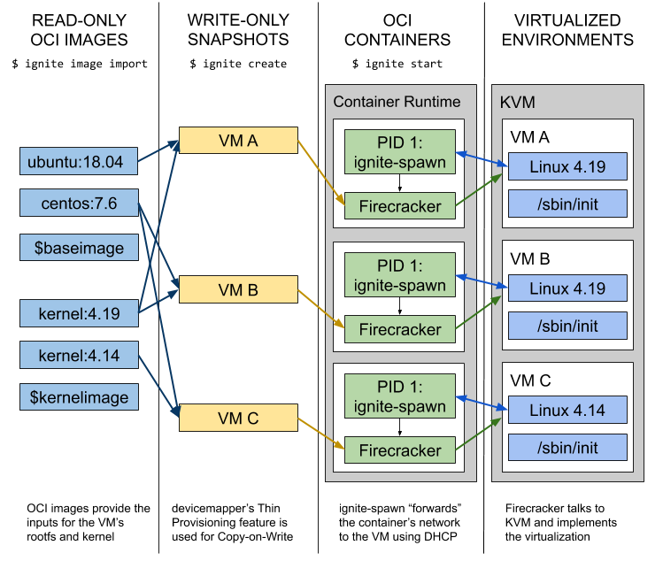

<!-- START doctoc generated TOC please keep comment here to allow auto update -->
<!-- DON'T EDIT THIS SECTION, INSTEAD RE-RUN doctoc TO UPDATE -->
**Table of Contents**  *generated with [DocToc](https://github.com/thlorenz/doctoc)*

- [Overview](#overview)
  - [Introduction](#introduction)
  - [Architecture](#architecture)
- [Project: firecracker-containerd](#project-firecracker-containerd)
  - [Overview](#overview-1)
  - [Architecture](#architecture-1)
- [Project: Ignite](#project-ignite)
  - [Overview](#overview-2)
  - [Architecture](#architecture-2)
  - [Kubernetes](#kubernetes)
  - [Experiments](#experiments)

<!-- END doctoc generated TOC please keep comment here to allow auto update -->

# Overview

## Introduction

[Firecracker](https://github.com/firecracker-microvm/firecracker) is a new virtualization technology
that enables customers to deploy lightweight micro Virtual Machines or microVMs. Firecracker microVMs
combine the security and workload isolation properties of traditional VMs with the speed, agility and
resource efficiency enabled by containers. They provide a secure, trusted environment for multi-tenant
services, while maintaining minimal overhead.

Firecracker is a VMM (Virtual Machine Manager), leveraging KVM for virtualization, and emulates only
5 devices. Firecracker can be seen as an alternative to QEMU, with very minimal overhead and attack
surface, purposely built for running container and function-based services.

## Architecture

The [design doc](https://github.com/firecracker-microvm/firecracker/blob/v0.20.0/docs/design.md)
and [specification](https://github.com/firecracker-microvm/firecracker/blob/v0.20.0/SPECIFICATION.md)
provides a detailed description of firecracker architecture.

**Each firecracker process encapsulates one and only one microVM; there is no daemon in firecracker**.
The process runs the following threads: API, VMM and vCPU(s). API thread is the control plane
listening on unix socket; VMM exposes machine model, VirtIO/block and VirtIO/net emulated devices,
I/O rate limiting, etc; vCPU(s) are started from `KVM_RUN`.

The firecracker process should be started only via the `jailer` binary, which sets up system
resources that require elevated permissions (e.g., cgroup, chroot), drops privileges, and then
exec()s into the firecracker binary, thus firecracker process can run as unpriviledged process.
Each firecracker microVM is further encapsulated into a cgroup.

Firecracker has also been integrated in container runtimes, for example Kata Containers, Containerd,
Weaveworks Ignite, etc.

For experiment, refer to [getting-started](https://github.com/firecracker-microvm/firecracker/blob/v0.20.0/docs/getting-started.md).

# Project: firecracker-containerd

## Overview

firecracker-containerd enables use of container runtime manager, containerd, to manage Firecracker
microVMs. To maintain compatibility with the container ecosystem, where possible, fc-containerd uses
container standards such as the OCI image format.

To simply put, fc-containerd runs standard linux container(s) in its own microVM.
- a control plugin inside containerd to create microVM
- a containerd runtime shim v2 implementation to run container in the microVM

## Architecture

Components in fc-containerd repository includes:
- snapshotters: containerd out-of-process gRPC plugins. Snapshotters create container images and
  expose container filesystem to container running inside of the microVM. In another word, the
  snapshot (or container image) loacates in the host, and is mounted to VM then used as container
  filesystem.
- control plugin: containerd in-process plugin, i.e. compiled into containerd. Control-plugin
  provides API for managing Firecracker VM, i.e. configures microVM disk image/kernel image,
  allocate resources like cpu, net device, etc. It also proxies command from containerd to runtime.
- runtime: first-half of containerd shim v2 API, out-of-process running outside of microVM. Runtime
  links containerd to components in microVM. It implements containerd V2 API and proxies container
  management command, I/O streams, events, etc from/to containerd. Since containerd only cares about
  the container running inside the microVM, i.e. the microVM is transparent to containerd, thus we
  need to proxy everything.
- agent: second-half of containerd shim v2 API, out-of-process running inside of microVM. Agent
  creates container via runc in the microVM, maps block device to appropriate container, manage
  container inside of the VM, and communicates with runtime over vsock to complete the other half
  of proxy.
- Image builder: A root file filesystem image builder that constructs a firecracker microVM root
  filesystem containing runc and the firecracker-containerd agent.

An architecture diagram, note:
- runtime and agent together form the container v2 runtime
- fc-containerd doesn't support multiple containers yet
- snapshotters are not included in the diagram

<p align="center"></p>

*References*

- [getting-started](https://github.com/firecracker-microvm/firecracker-containerd/blob/fe2ba1b6091a61173eb7bb5d8ec2c9ad7b15f98f/docs/getting-started.md)
- [architecture](https://github.com/firecracker-microvm/firecracker-containerd/blob/fe2ba1b6091a61173eb7bb5d8ec2c9ad7b15f98f/docs/architecture.md)
- [design-approaches](https://github.com/firecracker-microvm/firecracker-containerd/blob/fe2ba1b6091a61173eb7bb5d8ec2c9ad7b15f98f/docs/design-approaches.md)
- [deep dive into firecracker-containerd](https://www.youtube.com/watch?v=0wEiizErKZw)

# Project: Ignite

## Overview

[Weave Ignite](https://github.com/weaveworks/ignite) is an open source Virtual Machine (VM) manager
with a container UX (e.g. docker run, docker stop, etc) and built-in GitOps management (i.e.
monitoring Git repository and manage ignite VMs).
- Combines Firecracker MicroVMs with Docker / OCI images to unify containers and VMs.
- Works in a GitOps fashion and can manage VMs declaratively and automatically like Kubernetes and Terraform.

## Architecture

<p align="center"></p>

Use the architecture diagram as a reference for the following experiment.

As of v0.6, most operations are inside the `ignite` CLI: the goal is to refactor `ignite` to be a
thin wrapper around `ignited`. Right now, `ignited` is optional and only:
- watches a directory for YAML manifests
- performs GitOps

Firecracker process represents a microVM, and the firecracker process itself is running inside a
container:
> Firecracker should not be run on host without sandboxing, as per their security model. Firecracker
> provides the jailer binary to do sandboxing/isolation from the host for the Firecracker process,
> but a container does this equally well, if not better.

## Kubernetes

There is no native Kubernetes integration as of v0.6, the plan is:
- `ignited` will register as a Virtual Kubelet in the target Kubernetes cluster, i.e. user will run
  a Pod using custom NodeSelector, then `ignited` will spawn a VM for the Pod.
- The `VM` API type will be register as a `CustomResourceDefinition` in Kubernetes.

## Experiments

*Date: 01/15/2020, v0.6.3*

**Run Ignite VM**

To use ignite, an OCI image must be imported. Here, we use image `weaveworks/ignite-ubuntu:latest`,
which can be found on DockerHub. The image is imported directly into firecracker from containerd, we
can find the image from containerd (but not docker). Note ignite uses namespace `firecracker`.

```
$ sudo ignite image import weaveworks/ignite-ubuntu
INFO[0000] containerd image "weaveworks/ignite-ubuntu:latest" not found locally, pulling...
INFO[0045] Starting image import...
INFO[0048] Imported OCI image "weaveworks/ignite-ubuntu:latest" (226.5 MB) to base image with UID "5da0a01eacb8c89b"
INFO[0048] Created image with ID "5da0a01eacb8c89b" and name "weaveworks/ignite-ubuntu:latest"

$ sudo ctr --address="/var/run/docker/containerd/containerd.sock" --namespace="firecracker" images ls
REF                                        TYPE                                                      DIGEST                                                                  SIZE     PLATFORMS               LABELS
docker.io/weaveworks/ignite-ubuntu:latest  application/vnd.docker.distribution.manifest.v2+json      sha256:ad984fa5f6f2db55a0a48860d263a02a0f77aee3bbefa0d71648b4bc287ac13c 77.8 MiB linux/amd64             -

$ docker images | grep weaveworks
```

Similar to docker, we can create a VM and then start it.

```
$ sudo ignite create weaveworks/ignite-ubuntu \
  --name my-vm \
  --cpus 2 \
  --memory 1GB \
  --size 6GB \
  --ssh
INFO[0000] containerd image "weaveworks/ignite-kernel:4.19.47" not found locally, pulling...
INFO[0012] Imported OCI image "weaveworks/ignite-kernel:4.19.47" (49.6 MB) to kernel image with UID "fdf58a69b7d58dd7"
INFO[0013] Created VM with ID "c508251a0e342ec6" and name "my-vm"

$ sudo ignite start my-vm
INFO[0000] Pulling image "weaveworks/ignite:v0.6.3"...
INFO[0018] Networking is handled by "cni"
INFO[0018] Started Firecracker VM "c508251a0e342ec6" in a container with ID "ignite-c508251a0e342ec6"
```

The above three commands can be done using a single command `ignite run`, just like `docker run`.
Note here:
- The imported image comes from user (here `weaveworks/ignite-ubuntu:latest`), which should contain application code
- The image `weaveworks/ignite-kernel:4.19.47` pulled when creating VM, is the actual kernel for the VM
- The image `weaveworks/ignite:v0.6.3` pulled when starting VM, is the sandbox container image for running firecracker

To ssh the VM:

```
$ sudo ignite ssh my-vm
Welcome to Ubuntu 18.04.2 LTS (GNU/Linux 4.19.47 x86_64)

 * Documentation:  https://help.ubuntu.com
 * Management:     https://landscape.canonical.com
 * Support:        https://ubuntu.com/advantage
This system has been minimized by removing packages and content that are
not required on a system that users do not log into.

To restore this content, you can run the 'unminimize' command.

The programs included with the Ubuntu system are free software;
the exact distribution terms for each program are described in the
individual files in /usr/share/doc/*/copyright.

Ubuntu comes with ABSOLUTELY NO WARRANTY, to the extent permitted by
applicable law.

root@localhost:~# free -mh
              total        used        free      shared  buff/cache   available
Mem:           990M         35M        912M        144K         42M        864M
Swap:            0B          0B          0B
root@localhost:~# uname -a
Linux localhost.localdomain 4.19.47 #1 SMP Tue Jul 16 18:57:23 UTC 2019 x86_64 x86_64 x86_64 GNU/Linux
root@localhost:~# lscpu
Architecture:        x86_64
CPU op-mode(s):      32-bit, 64-bit
Byte Order:          Little Endian
CPU(s):              2
On-line CPU(s) list: 0,1
Thread(s) per core:  2
Core(s) per socket:  1
Socket(s):           1
NUMA node(s):        1
Vendor ID:           GenuineIntel
CPU family:          6
Model:               94
Model name:          Intel(R) Xeon(R) Processor @ 3.40GHz
Stepping:            3
CPU MHz:             3407.998
BogoMIPS:            6815.99
Virtualization:      VT-x
Hypervisor vendor:   KVM
Virtualization type: full
L1d cache:           32K
L1i cache:           32K
L2 cache:            256K
L3 cache:            8192K
NUMA node0 CPU(s):   0,1
Flags:               fpu vme de pse tsc msr pae mce cx8 apic sep mtrr pge mca cmov pat pse36 clflush mmx fxsr sse sse2 ss ht syscall nx pdpe1gb rdtscp lm constant_tsc rep_good nopl xtopology nonstop_tsc cpuid tsc_known_freq pni pclmulqdq vmx ssse3 fma cx16 pcid sse4_1 sse4_2 x2apic movbe popcnt tsc_deadline_timer aes xsave avx f16c rdrand hypervisor lahf_lm abm 3dnowprefetch cpuid_fault invpcid_single pti ssbd ibrs ibpb stibp tpr_shadow vnmi flexpriority ept vpid ept_ad fsgsbase tsc_adjust bmi1 hle avx2 smep bmi2 erms invpcid rtm mpx rdseed adx smap clflushopt xsaveopt xsavec xgetbv1 xsaves arat umip md_clear arch_capabilities
root@localhost:~# ps aux
USER       PID %CPU %MEM    VSZ   RSS TTY      STAT START   TIME COMMAND
root         1  0.5  0.8  77132  8136 ?        Ss   23:47   0:00 /sbin/init
root         2  0.0  0.0      0     0 ?        S    23:47   0:00 [kthreadd]
root         3  0.0  0.0      0     0 ?        I<   23:47   0:00 [rcu_gp]
root         4  0.0  0.0      0     0 ?        I<   23:47   0:00 [rcu_par_gp]
root         5  0.0  0.0      0     0 ?        I    23:47   0:00 [kworker/0:0-eve]
root         6  0.0  0.0      0     0 ?        I<   23:47   0:00 [kworker/0:0H-kb]
root         7  0.0  0.0      0     0 ?        I    23:47   0:00 [kworker/u4:0-ev]
root         8  0.0  0.0      0     0 ?        I<   23:47   0:00 [mm_percpu_wq]
root         9  0.0  0.0      0     0 ?        S    23:47   0:00 [ksoftirqd/0]
root        10  0.0  0.0      0     0 ?        I    23:47   0:00 [rcu_sched]
root        11  0.0  0.0      0     0 ?        I    23:47   0:00 [rcu_bh]
root        12  0.0  0.0      0     0 ?        S    23:47   0:00 [migration/0]
root        13  0.0  0.0      0     0 ?        S    23:47   0:00 [cpuhp/0]
root        14  0.0  0.0      0     0 ?        S    23:47   0:00 [cpuhp/1]
root        15  0.0  0.0      0     0 ?        S    23:47   0:00 [migration/1]
root        16  0.0  0.0      0     0 ?        S    23:47   0:00 [ksoftirqd/1]
root        17  0.0  0.0      0     0 ?        I    23:47   0:00 [kworker/1:0-mm_]
root        18  0.0  0.0      0     0 ?        I<   23:47   0:00 [kworker/1:0H-kb]
root        19  0.0  0.0      0     0 ?        S    23:47   0:00 [kdevtmpfs]
root        20  0.0  0.0      0     0 ?        I<   23:47   0:00 [netns]
root        21  0.0  0.0      0     0 ?        I    23:47   0:00 [kworker/u4:1-ev]
root        24  0.0  0.0      0     0 ?        S    23:47   0:00 [kauditd]
root        26  0.0  0.0      0     0 ?        I    23:47   0:00 [kworker/1:1-eve]
root        27  0.0  0.0      0     0 ?        I    23:47   0:00 [kworker/u4:2-ev]
root        33  0.0  0.0      0     0 ?        I    23:47   0:00 [kworker/1:2-cgr]
root        34  0.0  0.0      0     0 ?        I    23:47   0:00 [kworker/0:1-ipv]
root        76  0.0  0.0      0     0 ?        I    23:47   0:00 [kworker/u4:3-ev]
root       170  0.0  0.0      0     0 ?        S    23:47   0:00 [oom_reaper]
root       171  0.0  0.0      0     0 ?        I<   23:47   0:00 [writeback]
root       173  0.0  0.0      0     0 ?        S    23:47   0:00 [kcompactd0]
root       174  0.0  0.0      0     0 ?        SN   23:47   0:00 [ksmd]
root       175  0.0  0.0      0     0 ?        SN   23:47   0:00 [khugepaged]
root       176  0.0  0.0      0     0 ?        I<   23:47   0:00 [crypto]
root       177  0.0  0.0      0     0 ?        I<   23:47   0:00 [kintegrityd]
root       179  0.0  0.0      0     0 ?        I<   23:47   0:00 [kblockd]
root       300  0.0  0.0      0     0 ?        S    23:47   0:00 [kswapd0]
root       376  0.0  0.0      0     0 ?        I<   23:47   0:00 [kworker/u5:0]
root       455  0.0  0.0      0     0 ?        I<   23:47   0:00 [kthrotld]
root       501  0.0  0.0      0     0 ?        I<   23:47   0:00 [iscsi_eh]
root       527  0.0  0.0      0     0 ?        I<   23:47   0:00 [ipv6_addrconf]
root       529  0.0  0.0      0     0 ?        I    23:47   0:00 [kworker/0:2-eve]
root       538  0.0  0.0      0     0 ?        I<   23:47   0:00 [kstrp]
root       556  0.0  0.0      0     0 ?        S    23:47   0:00 [jbd2/vda-8]
root       557  0.0  0.0      0     0 ?        I<   23:47   0:00 [ext4-rsv-conver]
root       558  0.0  0.0      0     0 ?        I<   23:47   0:00 [kworker/1:1H-kb]
root       577  0.0  0.9  78436  9192 ?        S<s  23:47   0:00 /lib/systemd/systemd-journald
root       806  0.0  0.0      0     0 ?        I<   23:47   0:00 [kworker/0:1H-kb]
root       808  0.0  0.3  42608  3872 ?        Ss   23:47   0:00 /lib/systemd/systemd-udevd
systemd+   826  0.0  0.5  70616  5200 ?        Ss   23:47   0:00 /lib/systemd/systemd-resolved
systemd+   830  0.0  0.3 141916  3312 ?        Ssl  23:47   0:00 /lib/systemd/systemd-timesyncd
root       870  0.1  1.6 167476 16640 ?        Ssl  23:47   0:00 /usr/bin/python3 /usr/bin/networkd-dispatcher --run-startup-triggers
message+   872  0.0  0.4  49928  4132 ?        Ss   23:47   0:00 /usr/bin/dbus-daemon --system --address=systemd: --nofork --nopidfile
root       873  0.0  0.5  70464  5880 ?        Ss   23:47   0:00 /lib/systemd/systemd-logind
root       877  0.0  0.5  72296  5700 ?        Ss   23:47   0:00 /usr/sbin/sshd -D
root       882  0.0  0.1  13020  1920 ttyS0    Ss+  23:47   0:00 /sbin/agetty -o -p -- \u --keep-baud 115200,38400,9600 ttyS0 vt220
root       899  0.0  0.1  13244  1916 tty1     Ss+  23:47   0:00 /sbin/agetty -o -p -- \u --noclear tty1 linux
root       955  3.0  0.7 107984  7188 ?        Ss   23:48   0:00 sshd: root@pts/0
root       957  0.0  0.7  76376  7428 ?        Ss   23:48   0:00 /lib/systemd/systemd --user
root       958  0.0  0.1 108816  1780 ?        S    23:48   0:00 (sd-pam)
root       975  1.0  0.3  18508  3416 pts/0    Ss   23:48   0:00 -bash
root       983  0.0  0.3  36700  3124 pts/0    R+   23:48   0:00 ps aux
root@localhost:~# logout
Connection to 10.61.0.2 closed.
```

**Inspection**

To inspect various artifacts created from ignite, run:

```
$ sudo ignite kernels
KERNEL ID		NAME					CREATED	SIZE	VERSION
fdf58a69b7d58dd7	weaveworks/ignite-kernel:4.19.47	8m2s	49.6 MB	4.19.47

$ sudo ignite images
IMAGE ID		NAME				CREATED	SIZE
5da0a01eacb8c89b	weaveworks/ignite-ubuntu:latest	12m	226.5 MB

$ sudo ignite vms
VM ID			IMAGE				KERNEL					SIZE	CPUS	MEMORY		CREATED		STATUS	IPS		PORTS	NAME
c508251a0e342ec6	weaveworks/ignite-ubuntu:latest	weaveworks/ignite-kernel:4.19.47	6.0 GB	2	1024.0 MB	8m8s ago	Up 54s	10.61.0.2		my-vm
```

All data locates at `/var/lib/firecracker`:

```
$ tree /var/lib/firecracker
/var/lib/firecracker
├── image
│   └── 5da0a01eacb8c89b
│       ├── image.ext4
│       └── metadata.json
├── kernel
│   └── fdf58a69b7d58dd7
│       ├── kernel.tar
│       ├── metadata.json
│       └── vmlinux
└── vm
    └── c508251a0e342ec6
        ├── firecracker_log.fifo
        ├── firecracker_metrics.fifo
        ├── firecracker.sock
        ├── id_c508251a0e342ec6
        ├── id_c508251a0e342ec6.pub
        ├── metadata.json
        ├── overlay.dm
        ├── prometheus.sock
        ├── runtime.containerd.resolv.conf
        └── runtime.containerd.resolv.conf.sha256

6 directories, 15 files
```

Underline containers & images can be found via containerd:

```
$ sudo ctr --address="/var/run/docker/containerd/containerd.sock" --namespace="firecracker" images ls
REF                                        TYPE                                                      DIGEST                                      SIZE     PLATFORMS               LABELS
docker.io/weaveworks/ignite-kernel:4.19.47 application/vnd.docker.distribution.manifest.v2+json      sha256:bfac196a3e66d798bde3e75fc93183bb19625b09b58f30f02afb69da22f52d05 13.4 MiB linux/amd64             -
docker.io/weaveworks/ignite-ubuntu:latest  application/vnd.docker.distribution.manifest.v2+json      sha256:ad984fa5f6f2db55a0a48860d263a02a0f77aee3bbefa0d71648b4bc287ac13c 77.8 MiB linux/amd64             -
docker.io/weaveworks/ignite:v0.6.3         application/vnd.docker.distribution.manifest.list.v2+json sha256:d9989a0396b2930d1491e02dc947cdeea565fd4096f9ef4e69f80ea84e78f4b5 17.1 MiB linux/amd64,linux/arm64 -

$ sudo ctr --address="/var/run/docker/containerd/containerd.sock" --namespace="firecracker" containers ls
CONTAINER                  IMAGE                                 RUNTIME
ignite-c508251a0e342ec6    docker.io/weaveworks/ignite:v0.6.3    io.containerd.runc.v2

$ sudo ctr --address="/var/run/docker/containerd/containerd.sock" --namespace="firecracker" tasks exec --exec-id foo -t ignite-c508251a0e342ec6 sh
/ # ls
bin           ignite-spawn  proc          sys           vmlinux
dev           lib           root          tmp           volumes
etc           media         run           usr
firecracker   mnt           sbin          var
home          opt           srv           vm.json
/ # ps
PID   USER     TIME  COMMAND
    1 root      3:57 /usr/local/bin/ignite-spawn --log-level=info c508251a0e342
   18 root      0:19 firecracker --api-sock /var/lib/firecracker/vm/c508251a0e3
   44 root      0:00 sh
   51 root      0:00 ps
```

Processes running in the host (here `ignite-spawn` and `firecracker` are running in a container):

```
$ ps aux | grep ignite
root      488768  0.1  0.0 112192  7340 ?        Sl   09:24   0:00 /usr/bin/containerd-shim-runc-v2 -namespace firecracker -id ignite-c508251a0e342ec6 -address /var/run/docker/containerd/containerd.sock
root      488789  1.0  0.1 123404 17188 pts/0    Ssl+ 09:24   0:04 /usr/local/bin/ignite-spawn --log-level=info c508251a0e342ec6

$ ps aux | grep fire
root      506677  1.7  0.0 112064  8616 ?        Sl   09:33   0:00 /usr/bin/containerd-shim-runc-v2 -namespace firecracker -id ignite-c508251a0e342ec6 -address /var/run/docker/containerd/containerd.sock
root      506788  5.0  0.6 1057208 107672 pts/0  Sl+  09:33   0:01 firecracker --api-sock /var/lib/firecracker/vm/c508251a0e342ec6/firecracker.sock

$ ps aux | grep kvm
root      489139  0.0  0.0      0     0 ?        I    09:24   0:00 [kworker/0:1-kvm-irqfd-cleanup]
root      489301  0.0  0.0      0     0 ?        I    09:24   0:00 [kworker/0:2-kvm-irqfd-cleanup]
root      508928  0.0  0.0      0     0 ?        S    09:34   0:00 [kvm-nx-lpage-re]
root      508929  0.0  0.0      0     0 ?        S    09:34   0:00 [kvm-pit/18]

$ pstree | grep ignite -C 1
        |-colord---2*[{colord}]
        |-containerd-shim-+-ignite-spawn-+-firecracker---3*[{firecracker}]
        |                 |              `-14*[{ignite-spawn}]
        |                 `-13*[{containerd-shim}]
```

**Stop Ignite VM**

To stop VM, run `ignite stop`. Note here sandbox container and KVM process are both shutdown.

```
$ sudo ignite stop my-vm
INFO[0000] Removing the container with ID "ignite-c508251a0e342ec6" from the "cni" network
INFO[0000] Stopped VM with name "my-vm" and ID "c508251a0e342ec6"

$ ps aux | grep ignite

$ ps aux | grep fire

$ ps aux | grep kvm
root     1266008  0.0  0.0      0     0 ?        I    16:12   0:00 [kworker/1:2-kvm-irqfd-cleanup]
root     1266009  0.0  0.0      0     0 ?        I    16:12   0:00 [kworker/1:3-kvm-irqfd-cleanup]
```
