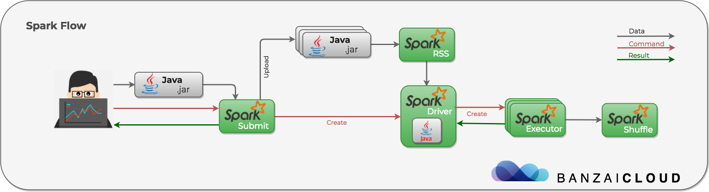

<!-- START doctoc generated TOC please keep comment here to allow auto update -->
<!-- DON'T EDIT THIS SECTION, INSTEAD RE-RUN doctoc TO UPDATE -->
**Table of Contents**  *generated with [DocToc](https://github.com/thlorenz/doctoc)*

- [Introduction](#introduction)
- [Architecture](#architecture)
  - [Overview](#overview)
  - [Scheduling](#scheduling)
  - [RDDs](#rdds)
- [Clusters](#clusters)
  - [Overview](#overview-1)
  - [Submission](#submission)
  - [Kubernetes](#kubernetes)
- [Spark Programming](#spark-programming)
- [Built-in Libraries](#built-in-libraries)
  - [Spark MLlib](#spark-mllib)
  - [Spark SQL](#spark-sql)
  - [Spark Streaming](#spark-streaming)
  - [Spark GraphX](#spark-graphx)
- [Experiments (v2.3.0)](#experiments-v230)
- [Experiments (v2.4.0)](#experiments-v240)
- [Experiments (streaming)](#experiments-streaming)
- [References](#references)

<!-- END doctoc generated TOC please keep comment here to allow auto update -->

# Introduction

Apache Spark is a fast and general engine for big data processing, with built-in modules for
streaming, SQL, machine learning and graph processing.

# Architecture

## Overview

Spark uses a master/worker architecture. There is a driver that talks to a single coordinator called
master that manages workers in which executors run. The driver and the executors run in their own
Java processes. In short:
- Driver (master) contains spark context, scheduler backend, etc. It doesn't run any computation but
  instead coordicates computation and talks to cluster managers like mesos, kubernetes, etc.
- Executor (worker) does the actual computation from user code. It is launched by driver, with
  resources allocated from cluster manager. Executor sends result back to driver.

Do not confuse the master/worker (or driver/executor) architecture with master/slave of spark standalone
cluster - the standalone cluster is spark's implementation of cluster manager, relative to mesos, yarn,
etc, see below for more information.

For Spark internals, user written program is the master (driver program), mostly because of `SparkContext`,
which contains DAG scheduler, task scheduler, etc. Functional-wise, driver program will:
- call cluster manager to acquire resources and executors
- translates user code and submit jobs to executors, see [here](https://stackoverflow.com/questions/31366467/how-spark-driver-serializes-the-task-that-is-sent-to-executors)
- monitors executor status

Spark application is a collaboration of driver and its executors, all of them are separate java
processes. For more information, ref:
- https://stackoverflow.com/a/30685279/1613256
- https://techvidvan.com/tutorials/spark-architecture/
- https://jaceklaskowski.gitbooks.io/mastering-apache-spark/spark-architecture.html

Here is a quick overview of a general workflow:

<p align="center"></p>

The components are:
- driver: see above
- executor: see above
- resource staging server (rss): only used when using local dependencies, see below
- external shuffle service: only used when using dynamic resource allocation, see below

There is also a component called History Server, which is an extension of Spark UI to hold completed
job logs. It shares persistent log directory with Spark driver, so that after driver completes, it
can serve logs; otherwise, we risk losing driver logs.

## Scheduling

Broadly speaking, when we discuss Spark scheduling, we are talking about two aspacts:
- scheduling across applications
- scheduling within application

**scheduling across applications**

Scheduling across applications means different Spark application (SparkContext instance) can share
underline resources in a cluster. This is primarily the ability to dynamic allocate resource for
executors, that is, Spark driver will request more executors when running tasks, and remove idle
executors after sometime to save resources. If not enabled, a Spark application contains fixed number
of executors, specified from user configuration.

Most options for dynamic allocations are under `spark.dynamicAllocation.*` and `spark.shuffle.service.*`,
including request policy (requesting more executors), remove policies (removing executors), etc

One thing to note is that to gracefully decommission executors, we need to run external shuffle
services, otherwise, if an executor exits, we'll no longer access results from that executor. To
understand this, we need to know how shuffle works. During a shuffle, the Spark executor first writes
its own map outputs locally to disk, and then acts as the server (using netty) for those files when
other executors attempt to fetch them. When running external shuffle service, executors will not
fetch data from other executors, instead, they will fetch data from the external shuffle service.
External shuffle service is usually running as per-node agent.

For more information about shuffle:
- http://hydronitrogen.com/apache-spark-shuffles-explained-in-depth.html
- https://blog.cloudera.com/blog/2015/01/improving-sort-performance-in-apache-spark-its-a-double/
- https://docs.google.com/document/d/1S9OMnFaeSf_UUxWpMpvC7ERcWx-jDr2g85MWri3Hccc/edit#

**scheduling within application**

Scheduling within application means inside a given Spark application (SparkContext instance), multiple
parallel jobs can run simultaneously if they were submitted from separate threads. By 'job' here, we
mean a Spark action (e.g. save, collect) and any tasks that need to run to evaluate that action.

The policies for scheduling in-application jobs are FIFO, Fair.

## RDDs

Resilient Distributed Datasets (RDD) is the main data structure in Spark. RDDs support two types of
operations: transformations and actions.

Transformation creates a new dataset from an existing one. For example, map is a transformation
that passes each dataset element through a function and returns a new RDD representing the results.
At high level, there are two transformations that can be applied onto the RDDs, namely narrow
transformation and wide transformation.
- wide transformation: wide transformations basically result in stage boundaries, requires the data
  to be shuffled, for example, reduceByKey etc.
- narrow transformation: doesn't require the data to be shuffled across the partitions, for example,
  map, filter etc.

Actions returns a value to the driver program after running a computation on the dataset, e.g.
reduce is an action that aggregates all the elements of the RDD using some function and returns the
final result to the driver program.

Partition is a logical chunk of a large data set, it is usually part of a RDD.

*References*

- https://medium.com/parrot-prediction/partitioning-in-apache-spark-8134ad840b0
- http://dev.sortable.com/spark-repartitio/

# Clusters

## Overview

As of v2.3.0, spark officially [supports four cluster managers](https://spark.apache.org/docs/2.3.0/cluster-overview.html):
standalone, mesos, yarn and kubernetes. Third party projects exist to support other cluster manager,
e.g. nomad.

Note that standalone cluster mode is different from local:
- Spark standalone is a resource manager which works as a cluster. It is simply the built in resource
  manager as opposed to an external one like yarn.
- Spark local runs without any resource manager, everything runs in a single jvm (you can decide the
  number of threads). This is aimed for testing locally.

Therefore, we can treat the relationship like the following:
- cluster mode: standalone, mesos, yarn, kubernetes, etc
- local mode: single jvm process

To use standalone cluster, additional setup is required, i.e. start standalone master, standalone
slave: just like setting up external resource manager; while for local, no setup is required.

## Submission

Applications are usually submitted via `spark-submit` script. This script takes care of setting up
the classpath with Spark and its dependencies, and can support different cluster managers and deploy
modes that Spark supports. The script supports both local mode and cluster mode, as described above:

```
# local mode
spark-submit --master "local[K]"

# cluster mode
spark-submit --master "spark://"  # standalone
spark-submit --master "mesos://"
spark-submit --master "yarn://"
spark-submit --master "k8s://"
```

Another important option is deploy mode: cluster vs client.
- cluster: If your application is submitted from a machine far from the worker machines (e.g.
  locally on your laptop), it is common to use cluster mode to minimize network latency between
  the drivers and the executors. In cluster mode, the driver is launched from one of the Worker
  processes inside the cluster, and the client process exits as soon as it fulfills its
  responsibility of submitting the application without waiting for the application to finish.
- client: In client mode, the driver is launched directly within the spark-submit process which
  acts as a client to the cluster. The input and output of the application is attached to the
  console. A common deployment strategy is to submit your application from a gateway machine that
  is physically co-located with your worker machines (e.g. Master node in a standalone EC2 cluster).
  In this setup, client mode is appropriate.

## Kubernetes

Spark 2.3.0 has native Kubernetes support, following is a short workflow:
- When client runs `spark-submit`, spark creates a driver running in a Kubernetes pod, just like
  creating a regular pod, see [here](https://github.com/apache/spark/blob/v2.3.0/resource-managers/kubernetes/core/src/main/scala/org/apache/spark/deploy/k8s/submit/KubernetesClientApplication.scala).
  The kubernetes scheduler backend is invoked in the driver associated with a particular job. The
  driver may run outside the cluster (client mode) or within (cluster mode).
- The driver creates executors which are also running within Kubernetes pods and connects to them,
  and executes application code. The scheduler backend configures and creates executor pods with
  properties like docker image, environment variables, request & limit, namespace, etc. In the
  driver, a separate ​`kubernetes-pod-allocator`​ thread handles the creation of new executor pods
  with appropriate throttling and monitoring. This indirection is required because the Kubernetes
  API Server accepts requests for new executor pods optimistically, with the anticipation of being
  able to eventually run them. However, it is undesirable to have a very large number of pods that
  cannot be scheduled and stay pending within the cluster.
- When the application completes, the executor pods terminate and are cleaned up, but the driver
  pod persists logs and remains in "completed" state in the Kubernetes API until it’s eventually
  garbage collected or manually cleaned up.
- Above all, the driver and executor pod scheduling is handled by Kubernetes. A little bit comparison
  between tensorflow on kubernetes. In distributed tensorflow case, both ps and worker are created
  via a client program, though scheduling of ps and workers are handled by Kubernetes as well.

Apart from running driver and executors, another requirement for running spark on kubernetes is
dependency management, e.g. source file, bootstrap data, etc. Spark on kubernetes supports three
cases:
- A single docker image containing both the application resources and the Spark distribution. This
  is pretty straightforward, since in Kubernetes, everything runs in container. With this approach,
  we can specify resource using `local://`.
- Specifying a URL (`http://`, `s3://` or `hdfs://`) that is accessible to the cluster and having
  Spark download the dependencies or files. This is done using init container - init container will
  be injected into executor pod to first download said dependencies, and the whole process is
  transparent to spark user. Note however, looks like init-container approach is going to bo removed
  to reduce maintenance cost, refer to [the spark change](https://github.com/apache/spark/pull/20669),
  which is part of the [refactor design doc](https://docs.google.com/document/d/1XPLh3E2JJ7yeJSDLZWXh_lUcjZ1P0dy9QeUEyxIlfak/edit#).
- Uploading locally hosted compiled code to the driver and executor pods with spark-submit. This is
  achieved in the Kubernetes case using the Resource Staging Server (RSS). The RSS would be a
  completely separate standalone component that can be launched into the cluster. Spark-submit would
  have knowledge necessary to upload said dependency from the local machine to the RSS. Following
  this, driver and executor pods would utilize the flow in (2), using init-containers to fetch the
  uploaded resources from the staging server to the individual driver and executor pods. Note however,
  this is just a rough design, Spark 2.3.0 (even 2.4.0) doesn't come with local dependency support.

All workloads (driver, executors) are running as bare pod, there's [a proposal](https://github.com/apache/spark/pull/21067)
to change from running driver in pod to running in job; however, it is rejected due to lack of
exact-once semantics from kubernetes job controller: there is risk to cause split-brain problem.

To follow spark on kubernetes progress, use following links:
- PRs: https://github.com/apache/spark/pulls?page=1&q=is%3Apr+K8S&utf8=%E2%9C%93
- Issues: https://issues.apache.org/jira/browse/SPARK-24028?jql=project%20%3D%20SPARK%20AND%20component%20%3D%20kubernetes

*References*

- [A series of great post from banzaicloud](https://banzaicloud.com/blog/spark-k8s/)
- https://issues.apache.org/jira/browse/SPARK-18278
- https://github.com/kubernetes/kubernetes/issues/34377
- https://spark.apache.org/docs/2.3.0/running-on-kubernetes.html
- https://kubernetes.io/blog/2018/03/apache-spark-23-with-native-kubernetes/
- http://apache-spark-developers-list.1001551.n3.nabble.com/SPIP-Spark-on-Kubernetes-td22147.html

_**Update on 11/27/2018, v2.4.0**_

Spark 2.4.0 was release on 11/2018, with few notable features:
- client mode: now we can run driver in client mode, either on a client machine or in a kubernetes pod
- pyspark and R: running spark on Kubernetes with python and R is now available
- mount volumes: now spark supports mounting hostPaht, emptyDir and PersistentVolumeClaim into driver/executor:
  ```
  --conf spark.kubernetes.driver.volumes.[VolumeType].[VolumeName].mount.path=<mount path>
  --conf spark.kubernetes.driver.volumes.[VolumeType].[VolumeName].mount.readOnly=<true|false>
  ```

As mentioned above, init container is removed to make the whole system more Spark-native. The idea
is that instead of using init container to download dependencies, which is more kubernetes-native,
Spark driver uses spark-submit client mode for this purpose. Here is a [dev thread](http://apache-spark-developers-list.1001551.n3.nabble.com/Kubernetes-why-use-init-containers-td23113.html)
on this topic. The new process is simple:
- Spark driver pod uses client mode spark-submit to download dependencies (HTTP, S3, etc)
- After downloading, Spark driver serves the dependencies to all other executors

External shuffle service and local application dependencies are still not yet supported. Following
is a list of high priority remaining items:
- Support for using a pod template to customize the driver and executor pods.
- Dynamic resource allocation and external shuffle service.
- Support for Kerberos authentication, e.g., for accessing secure HDFS.
- Better support for local application dependencies on submission client machines.
- Driver resilience for Spark Streaming applications.
- Spark Application Management.
- Job Queues and Resource Management.

For more information about Spark 2.4.0, ref [this blog](https://databricks.com/blog/2018/09/26/whats-new-for-apache-spark-on-kubernetes-in-the-upcoming-apache-spark-2-4-release.html).

# Spark Programming

**Overview**

The core spark programming concept is RDDs, these are the elements that run and operate on multiple
nodes to do parallel processing on a cluster. Spark supports Scala, Java, Python, R; for more
programming constructs, see "experiments" (check out "python").

**PySpark**

Apache Spark is written in Scala programming language. To support Python with Spark, Apache Spark
Community released a tool, PySpark. It is because of a library called `Py4J` that they are able to
achieve this. Py4J enables Python programs running in a Python interpreter to dynamically access
Java objects in a Java Virtual Machine.
- PySpark is an interactive shell for basic testing and is not supposed to be used for production environment.
- PySpark doesn't accept script.
- PySpark accepts a `--master` flag to specify the master URL, default is `local[*]`.
- PySpark itself is running as the driver program.

Internally, pyspark launches a [python spark shell](https://github.com/apache/spark/blob/v2.3.0/python/pyspark/shell.py)
with a JVM process running. It's equivalent to start ipython and import pyspark, i.e.

```
$ ipython
Python 3.6.7 (default, Nov 24 2018, 14:05:46)
Type 'copyright', 'credits' or 'license' for more information
IPython 7.1.1 -- An enhanced Interactive Python. Type '?' for help.

In [1]: import pyspark

In [2]: sc = pyspark.SparkContext(appName="app")
2018-11-26 09:12:06 WARN  Utils:66 - Your hostname, mangosteen resolves to a loopback address: 127.0.0.1; using 192.168.3.34 instead (on interface enp0s31f6)
2018-11-26 09:12:06 WARN  Utils:66 - Set SPARK_LOCAL_IP if you need to bind to another address
2018-11-26 09:12:07 WARN  NativeCodeLoader:62 - Unable to load native-hadoop library for your platform... using builtin-java classes where applicable
Setting default log level to "WARN".
To adjust logging level use sc.setLogLevel(newLevel). For SparkR, use setLogLevel(newLevel).
```

Running the line `pyspark.SparkContext` will [start a JVM process](https://github.com/apache/spark/blob/v2.3.0/python/pyspark/java_gateway.py)
ready to work with Spark job.

**Jupyter**

Based on the above `ipython` senario, there is nothing special to do when running with Jupyter. We
can just import pyspark and create a Spark context: Jupyter kernel will start Java gateway and work
with Java object.

There's a few [old link](https://blog.sicara.com/get-started-pyspark-jupyter-guide-tutorial-ae2fe84f594f)
about setting up Jupyter, but it seems unnecessary for now (pip install pyspark is enough).

**Real-world examples**

- https://github.com/openzipkin/zipkin-dependencies
- https://github.com/jaegertracing/spark-dependencies

*References*

- https://spark.apache.org/docs/latest/rdd-programming-guide.html
- https://spark.apache.org/docs/latest/sql-programming-guide.html
- https://github.com/mahmoudparsian/pyspark-tutorial
- https://www.tutorialspoint.com/pyspark/index.htm

# Built-in Libraries

## Spark MLlib

MLlib is Apache Spark's scalable machine learning library. It's similar to other libraries like
sklearn, but is more suitable for large scale processing:

> Apache Spark's machine learning library is meant for distributed processing whereas scikit learn
> can work only on data that fits on a single machine. If you compare on the basis of richness of
> algorithms available then scikit learn is far richer than spark ml lib.

MLlib benefits from the various components within the Spark ecosystem. At the lowest level, Spark
core provides a general execution engine with over 80 operators for transforming data, e.g., for
data cleaning and featurization. MLlib also leverages the other high-level libraries packaged with
Spark. Spark SQL provides data integration functionality, SQL and structured data processing which
can simplify data cleaning and preprocessing, and also supports the DataFrame abstraction which is
fundamental to the `spark.ml` package. GraphX supports large-scale graph processing and provides a
powerful API for implementing learning algorithms that can naturally be viewed as large, sparse
graph problems, e.g., LDA. Additionally, Spark Streaming allows users to process live data streams
and thus enables the development of online learning algorithms, as in Freeman. Moreover, performance
improvements in Spark core and these high-level libraries lead to corresponding improvements in MLlib.

Note that Spark divides the library into two packages:
- `spark.mllib` contains the original API built on top of RDDs.
- `spark.ml` provides higher-level API built on top of DataFrames for constructing ML pipelines.

Using `spark.ml` is recommended because with DataFrames the API is more versatile and flexible. Spark
will keep supporting `spark.mllib` along with the development of `spark.ml`. Only bugfix will be
checked in to `spark.mllib` though, with the goal to deprecate `spark.mllib` in Spark 3.0.

For python examples, ref [here](https://github.com/apache/spark/tree/master/examples/src/main/python/ml), e.g.
```
./bin/spark-submit --master local ./examples/src/main/python/ml/decision_tree_classification_example.py
```

*References*

- https://spark.apache.org/docs/latest/ml-guide.html

## Spark SQL

Spark SQL is Apache Spark's module for working with structured data. Internally, Spark SQL uses this
extra information to perform extra optimizations. There are two APIs used to interact with Spark SQL:
- SQL: user can execute SQL queries using HiveSQL language
- Dataset and Dataframe: Dataset is a distributed collection of data, while DataFrame is a Dataset
  organized into named columns. It is conceptually equivalent to a table in a relational database or
  a data frame in R/Python, but with richer optimizations under the hood.

The two APIs can be used interchangeably. In fact, when computing a result the same execution engine
is used, independent of which API/language you are using to express the computation. Also, when running
SQL from within another programming language the results will be returned as a Dataset/DataFrame.

For java examples, ref [here](https://github.com/apache/spark/blob/master/examples/src/main/java/org/apache/spark/examples/sql/JavaSparkSQLExample.java), e.g.
```
./bin/spark-submit --master local \
  --class org.apache.spark.examples.sql.JavaSparkSQLExample \
  ./examples/jars/spark-examples_2.11-2.3.0.jar
```

*References*

- https://spark.apache.org/docs/latest/sql-programming-guide.html

## Spark Streaming

Spark Streaming is an extension of the core Spark API that enables scalable, high-throughput,
fault-tolerant stream processing of live data streams. Data can be ingested from many sources like
Kafka, Flume, Kinesis, or TCP sockets, and can be processed using complex algorithms expressed with
high-level functions like map, reduce, join and window. Finally, processed data can be pushed out to
filesystems, databases, and live dashboards. In fact, you can apply Spark's machine learning and
graph processing algorithms on data streams.

Internally, it works as follows. Spark Streaming receives live input data streams and divides the
data into batches, which are then processed by the Spark engine to generate the final stream of
results in batches.

Spark Streaming provides a high-level abstraction called discretized stream or DStream, which
represents a continuous stream of data. DStreams can be created either from input data streams
from sources such as Kafka, Flume, and Kinesis, or by applying high-level operations on other
DStreams. Internally, a DStream is represented as a sequence of RDDs, which is Spark's abstraction
of an immutable, distributed dataset. Each RDD in a DStream contains data from a certain interval.

Quick note about [messaging & streaming](https://stackoverflow.com/questions/41744506/difference-between-stream-processing-and-message-processing):

- In traditional message processing, you apply simple computations on the messages -- in most cases individually per message.
- In stream processing, you apply complex operations on multiple input streams and multiple records (ie, messages) at the same time (like aggregations and joins).

*References*

- https://spark.apache.org/docs/latest/streaming-programming-guide.html

## Spark GraphX

GraphX is a new component in Spark for graphs and graph-parallel computation. At a high level, GraphX
extends the Spark RDD by introducing a new Graph abstraction: a directed multigraph with properties
attached to each vertex and edge. To support graph computation, GraphX exposes a set of fundamental
operators (e.g., subgraph, joinVertices, and aggregateMessages) as well as an optimized variant of
the Pregel API. In addition, GraphX includes a growing collection of graph algorithms and builders
to simplify graph analytics tasks.

*References*

- https://spark.apache.org/docs/latest/graphx-programming-guide.html

# Experiments (v2.3.0)

*Date: 03/25/2018, v2.3.0*

**Installation v1 (local mode)**

To install Spark, follow this useful [guide](https://medium.com/@josemarcialportilla/installing-scala-and-spark-on-ubuntu-5665ee4b62b1).
To simply put, we need to install correct version of Java, Python and Scala. As of Spark version
2.3.0, the requirements are:

> Spark runs on Java 8+, Python 2.7+/3.4+ and R 3.1+. For the Scala API, Spark
> 2.3.0 uses Scala 2.11. You will need to use a compatible Scala version (2.11.x).
> Note that support for Java 7, Python 2.6 and old Hadoop versions before 2.6.5
> were removed as of Spark 2.2.0. Support for Scala 2.10 was removed as of 2.3.0.

Spark only requires Java to run program, but installing optional packages unlocks more toolings.
After running `./bin/spark-shell` from the guide, we are starting spark in local mode.

All following commands are relative to unzipped spark bin directory; to make it easier, run:

```
# spark artifacts are copied to $HOME/code/source.
$ export PATH=$PATH:$HOME/code/source/spark-2.3.0-bin-hadoop2.7/bin
```

**Installation v2 (local mode with pyspark)**

Installing pyspark will install all necessary components, i.e. simply run `pip install pyspark`
and start Spark with command `pyspark`, we'll have a working Spark environment. As mentioned above,
this is used for testing only.

It's possible to run Scala shell from pyspark site package, e.g.

```
./.pyenv/versions/3.6.7/lib/python3.6/site-packages/pyspark/bin/spark-shell
```

**Installation v3 (standalone mode with docker)**

Another option to run a spark cluster is through docker, see [here](https://github.com/big-data-europe/docker-spark).
The repository starts Spark in standalone cluster mode.

**Installation v4 (build from source)**

To build from source, clone spark source and use maven:

```
# clone spark source code
$ cd $HOME/code/workspace/src/github.com/apache
$ git clone https://github.com/apache/spark
$ git checkout v2.3.0

# Build spark (note that building 2.3.0 requires java 8 (java 9 is not compatible with scala version)
$ ./dev/make-distribution.sh --name custom-spark --pip --r --tgz -Psparkr -Phadoop-2.7 -Phive -Phive-thriftserver -Pmesos -Pyarn -Pkubernetes

$ export PATH=$HOME/code/workspace/src/github.com/apache/spark/bin:$PATH
```

The build artifacts locate at "dist" directory.

**QuickStart (local mode)**

The quick start guide introduces two approaches to use spark: interactive and self-contained
applications. For interactive approach, just follow [this guide](https://spark.apache.org/docs/2.3.0/quick-start.html).
For self-contained application, check out to "experiments/java" directory and run `mvn package` to
build example application. Caveat: 'pom.xml' is updated to specify Java language source and target.
Then, run following command to start example:

```
$ cd experiments/java
$ spark-submit --class "SimpleApp" --master "local[4]" target/simple-project-1.0.jar
```

This will print number of lines with character 'a' and 'b' respectively.

Python version:

```
$ cd experiments/python
$ spark-submit --master "local[4]" simpleapp.py
```

**Submit apps (local mode)**

[The guide](https://spark.apache.org/docs/2.3.0/submitting-applications.html) gives a lot of options
to submit spark applications; right now, we do not have any cluster, so let's submit a spark
application via local mode:

```
./bin/spark-submit \
  --class org.apache.spark.examples.SparkPi \
  --master "local[4]" \
  ./examples/jars/spark-examples_2.11-2.3.0.jar \
  100
```

**History Server (local mode)**

To enable History Server, we need start it and add few options:

```
# Start History Server:
$ ./sbin/start-history-server.sh

# Create default log directory:
$ mkdir /tmp/spark-events

# Submit Spark Application:
$ ./bin/spark-submit \
  --class org.apache.spark.examples.SparkPi \
  --conf spark.eventLog.dir=/tmp/spark-events \
  --conf spark.eventLog.enabled=true \
  --master "local[4]" \
  ./examples/jars/spark-examples_2.11-2.3.0.jar \
  100
```

After application finished, we can find Spark application at http://192.168.1.6:18080. Here is a
[quick tutorial](https://www.supergloo.com/fieldnotes/spark-tutorial-performance-monitoring-history-server/)
on history server.

**Standalone cluster**

Start [standalone cluster](https://www.davidadrian.cc/posts/2017/08/how-to-spark-cluster/) via:

```
# Start spark standalone master, visit localhost:8080 for web UI.
./sbin/start-master.sh

# Add a slave (node itself) to the cluster. Note the master URL is
# copied from spark web UI.
./sbin/start-slave.sh spark://sugarcane:7077

# Connect to cluster master via interactive shell.
./bin/spark-shell --master spark://sugarcane:7077
```

**Submit apps in standalone cluster (client mode vs cluster mode)**

Similar to local mode, we can use `spark-submit` to run spark application in standalone cluster.
For example, the `simpleapp.py` application is able to run in a cluster:

```
spark-submit --master "spark://mangosteen:7077" simpleapp.py
```

Visit master UI "http://localhost:8080" to view the submission. Following is a list of examples from
spark official site:

```
# client mode
./bin/spark-submit \
  --class org.apache.spark.examples.SparkPi \
  --master spark://sugarcane:7077 \
  --executor-memory 1G \
  --total-executor-cores 2 \
  ./examples/jars/spark-examples_2.11-2.3.0.jar \
  1000

# cluster mode
./bin/spark-submit \
  --class org.apache.spark.examples.SparkPi \
  --deploy-mode cluster \
  --supervise \
  --master spark://sugarcane:7077 \
  --executor-memory 1G \
  --total-executor-cores 2 \
  ./examples/jars/spark-examples_2.11-2.3.0.jar \
  1000
```

In client mode, we'll see the `spark-submit` script runs in foreground and outputs a lot of logs,
and there are two additional java processes, one client program, i.e. spark-submit, the other is
driver program. In cluster mode, there is only one additional java program, i.e. the driver program,
spark-submit will exit once application is submitted successfully.

**Kubernetes**

Since kubernetes runs all application in containers, we need to build a docker image:

```
# Build docker image, this will create an image: ddysher/spark:v2.3.0
./bin/docker-image-tool.sh -r ddysher -t v2.3.0 build

# To inspect the image, run
docker run -it --entrypoint "bash" ddysher/spark:v2.3.0
```

Now run `spark-submit`. Note that `local://` is local to the docker image, not files on local
machine. Using application dependencies from the submission client’s local file system is currently
not yet supported. That is, the `local://` URI is the location of the example jar that is already
in the Docker image. There are different approaches as to how to manage dependencies, e.g. using
init containers to download jar, use pre-mounted custom built Docker image, etc.

```
# Driver program needs to create pods, configmap, etc; make sure it have appropriate privileges
kubectl create serviceaccount spark
kubectl create clusterrolebinding spark-role --clusterrole=edit --serviceaccount=default:spark --namespace=default

# Now submit application.
./bin/spark-submit \
  --master k8s://https://localhost:6443 \
  --deploy-mode cluster \
  --name spark-pi \
  --class org.apache.spark.examples.SparkPi \
  --conf spark.executor.instances=5 \
  --conf spark.kubernetes.container.image=ddysher/spark:v2.3.0 \
  --conf spark.kubernetes.authenticate.driver.serviceAccountName=spark \
  local:///opt/spark/examples/jars/spark-examples_2.11-2.3.0.jar
```

Note driver and executor will both use image `ddysher/spark:v2.3.0`, see [Config.scala](https://github.com/apache/spark/blob/v2.3.0/resource-managers/kubernetes/core/src/main/scala/org/apache/spark/deploy/k8s/Config.scala).
The image's entrypoint will execute different instructions based on input, see [docker build directory](https://github.com/apache/spark/tree/v2.3.0/resource-managers/kubernetes/docker/src/main/dockerfiles/spark).

Once submitted, driver pod starts running, which in turn creates required number of executor pods.
Executor pods will be deleted after work is done, and driver pod will stay in Completed status. Use
`kubectl get pods -a` to view driver pods.

# Experiments (v2.4.0)

*Date: 11/26/2018, v2.4.0*

Install v2.4.0 from distribution:

```
$ wget http://apache.website-solution.net/spark/spark-2.4.0/spark-2.4.0-bin-hadoop2.7.tgz
$ tar xvf spark-2.4.0-bin-hadoop2.7.tgz
```

Build docker image:

```
$ ./bin/docker-image-tool.sh -r ddysher -t v2.4.0 build
```

**PySpark, SparkR**

Running python or spark is the same as scala.

```
kubectl create serviceaccount spark
kubectl create clusterrolebinding spark-role --clusterrole=edit --serviceaccount=default:spark --namespace=default

./bin/spark-submit \
  --master "k8s://https://localhost:6443" \
  --deploy-mode cluster \
  --conf spark.executor.instances=2 \
  --conf spark.kubernetes.container.image=ddysher/spark-py:v2.4.0 \
  --conf spark.kubernetes.authenticate.driver.serviceAccountName=spark \
  --conf spark.kubernetes.executor.request.cores=0.5 \
  local:///opt/spark/examples/src/main/python/pi.py
```

Note here:
- we've changed the image to `ddysher/spark-py:v2.4.0`
- we've changed executor instances to 2, and Spark behavior doesn't change
- Spark 2.4.0 support adding executor core request `spark.kubernetes.executor.request.cores`

**Client Mode**

Run a Kubernetes cluster (here we are running `local-up-cluster.sh`), then submit with client mode:

```
./bin/spark-submit \
  --master k8s://https://localhost:6443 \
  --deploy-mode client \
  --name spark-pi \
  --class org.apache.spark.examples.SparkPi \
  --conf spark.driver.host=192.168.3.34 \
  --conf spark.driver.port=9999 \
  --conf spark.executor.instances=5 \
  --conf spark.kubernetes.container.image=ddysher/spark:v2.4.0 \
  --conf spark.kubernetes.authenticate.driver.serviceAccountName=spark \
  --driver-class-path `pwd`/examples/jars/spark-examples_2.11-2.4.0.jar \
  local:///opt/spark/examples/jars/spark-examples_2.11-2.4.0.jar
```

Pay attention to a few points:
- The option `deploy-mode` is changed to `client`.
- Executors are unable to access driver via the default driver host value (`local hostname`), thus
  we explicitly set host:port value pair here. port is IP address of the machine running as client,
  port is chosen randomly.
- Driver application class is located at client machine while executor class located inside the
  container image. We need to explicitly provide the `driver-class-path` otherwise driver will
  trying to locate class on the wrong path.

# Experiments (streaming)

*Date: 12/09/2018, v2.4.0*

Basic streaming example in local machine:

```
$ nc -lk 9999
```

Note on Mac, netcat installed from homebrew must use:

```
$ nc -lp 9999
```

Then in another terminal (make sure `spark-submit` is accessible):

```
$ cd ./experiments/java
$ spark-submit --class "JavaNetworkWordCount" --master "local[4]" target/simple-project-1.0.jar localhost 9999
```

# References

- https://spark.apache.org/docs/latest/
- https://github.com/JerryLead/SparkInternals
- https://data-flair.training/blogs/spark-tutorial/
