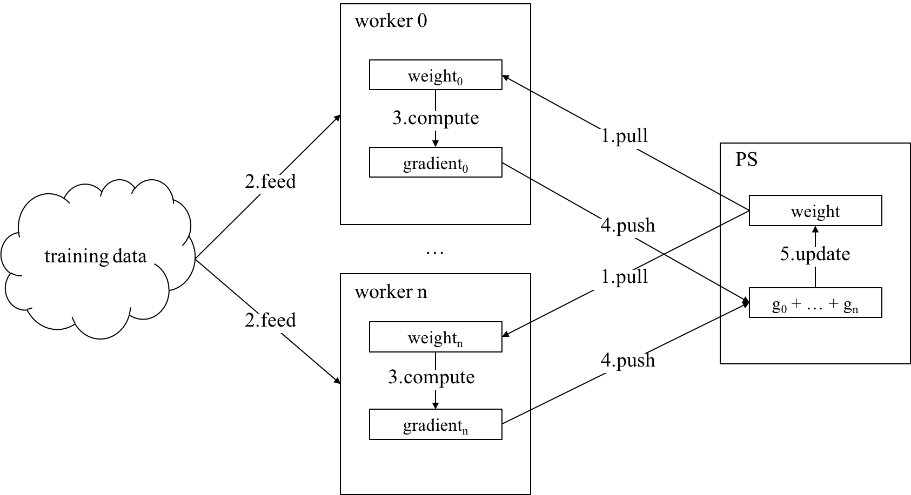
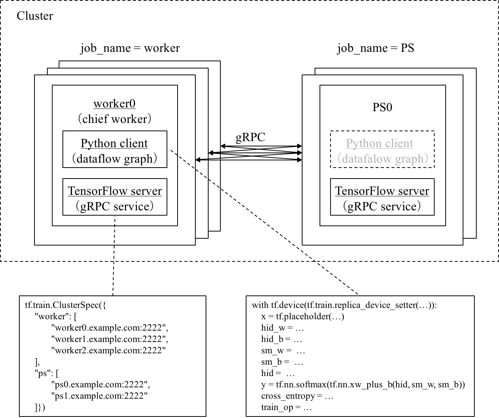
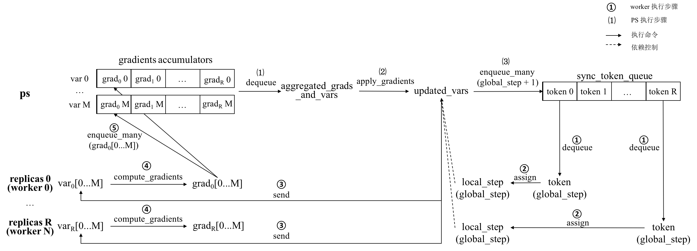

##### 5.2 TensorFlow分布式程序编程框架

TensorFlow的细粒度API为分布式程序的设计与开发提供了高度的灵活性，用户可以将不同的分布式架构应用于TensorFlow程序。PS-worker是一种经典的分布式架构，在大规模分布式机器学习、深度学习系统领域得到了广泛的应用。TensorFlow提供对PS-worker架构支持，作为其推荐的、标准的分布式编程框架。

本节主要介绍TensorFlow分布式程序的编程框架，以流程图的形式展现分布式程序的关键步骤。目前大多数分布式程序均采用数据并行的模式加速模型训练，TensorFlow也为此专门设计了具有高可用性的同步优化器，以便于用户快速构建分布式程序。TensorFlow提供的Supervisor以灵活易用的方式提升了模型训练过程的健壮性，同时简化了模型微调和重训练的流程。本节结合理论与实践，由浅入深地引导读者掌握TensorFlow分布式程序编程框架的设计思想、工作流程和使用方法。

###### 5.2.1 PS-worker架构概述

PS-worker架构有效解决了大规模参数在分布式存储和更新时的一致性问题，兼具通用性和高效性。典型的PS-worker架构如图5-2所示，所有模型参数唯一地存储在PS的内存中。当模型参数规模超过一台服务器的内存大小时，则需要分布式地存储在多个PS中。最简单的分布式存储策略为循环（round-robin）：按照用户定义模型参数的顺序，将参数依次循环保存到各PS中，尽可能保证每个PS存储的参数个数相等。假如模型一共有9个参数，按照循环策略分布式存储在3个PS中，则各PS存储的参数分别是［1，4，7］、［2，5，8］和［3，6，9］。模型训练过程中的主要计算——前向图推理计算和后向图梯度计算均由worker完成。训练数据一般存储在共享文件系统或分布式文件系统中（注：本小节仅讨论数据并行训练模式，即各worker数据流图拓扑结构相同，填充的训练数据不同）。



图5-2  典型PS-worker架构训练分布式模型的流程

简单起见，我们假设一个PS能够存储所有模型参数。在这种情况下，使用PS-worker架构训练分布式模型的流程如下：

（1）pull：各worker根据数据流图的拓扑结构，从PS拉取最新的模型参数；

（2）feed：各worker按照一定的规则填充不同批次的批数据；

（3）compute：各worker使用相同的模型参数和不同的批数据计算梯度，得出不同的梯度值；

（4）push：各worker将（3）中计算得到的梯度值推送到PS；

（5）update：PS汇总来自n个worker的总计n份梯度值，求出梯度平均值后更新模型参数。

分布式模型的单步训练主要由这5步构成。训练分布式模型的过程就是不断循环执行这5步的过程，直到达到最大训练步数或损失值小于阈值。

PS-worker架构的核心思想是将模型和训练解耦合。它将一个模型的训练过程分为两类作业（job）：一类是模型相关的作业，包括模型参数的存储、分发、汇总、更新，由PS执行；另一类是训练相关的作业，包括推理计算和梯度计算等，由worker执行。同类作业内部可以包含多个并行执行的任务（task）。每个任务的工作流程相同，但处理的数据不同。

###### 5.2.2 分布式程序编程框架概述

分布式程序是指由多个进程协同执行的程序。在TensorFlow的分布式编程框架中，每个PS和worker都由单独的进程实现。图5-3展示了使用TensorFlow分布式程序编程框架的关键步骤。以开发流程中操作的核心对象为依据，编写分布式程序主要分为创建集群（Cluster）、创建分布式数据流图（Graph），以及创建并运行分布式会话（GrpcSession）这3个步骤：

- Cluster：创建集群。包括定义集群中所有进程对应的服务器主机名（或IP地址）和端口，并启动各个服务；
- Graph：创建分布式数据流图。数据流图上的节点包括表示输入数据集的占位符、保存模型参数的变量、前向图和后向图的计算操作，以及专门为分布式模型设计的同步优化器和同步标记队列（sync_token_queue）的初始化操作（sync_init_op）；
- GrpcSession：创建并运行分布式会话。涉及使用模型训练管理组件（Supervisor）创建分布式会话，然后在会话中执行数据流图的各项操作（如同步标记队列的初始化操作、全局变量的初始化操作、模型的恢复和保存操作、单步推理和单步训练操作等）。


图5-3  使用TensorFlow分布式程序编程框架的关键步骤

TensorFlow分布式程序处理的数据与单机程序类似，数据来源也仍然是文件系统、checkpoint文件和命令行参数。不同之处在于，分布式程序从命令行解析的参数除了模型超参数外还新增了集群配置参数。TensorFlow分布式程序使用的同步优化器是对普通优化器的封装。同步优化器的梯度计算部分由其封装的优化器实现，多worker间操作的依赖控制和模型参数更新模式由同步优化器的apply_gradients方法实现。下面我们逐一介绍使用TensorFlow分布式程序编程框架的流程，并分析其中的设计思想。

###### 5.2.3 创建TensorFlow集群

从应用视角看，TensorFlow集群是指完成一次完整的深度学习训练或推理工作所需的分布式运行实体及其相关的资源集合。与很多深度学习系统类似，TensorFlow集群中的每个任务在运行时映射到操作系统中的一个进程。任务按照所属作业类型不同可分为PS和worker两类，同类任务通过不同的任务编号（task_index）加以区分。通常，我们将任务编号为0的worker称为chief worker。它与其它worker任务略有不同，除了按部就班地训练模型外，还需要在训练开始前初始化全局变量，以及在训练过程中将全局变量保存到checkpoint文件。现在我们可以根据作业名称（job_name）和任务编号唯一确定TensorFlow集群中的任意一个服务器。此处的“服务器”是TensorFlow集群中特定任务（PS或worker）中的一种上层抽象，而不是指物理服务器。为了方便解释说明，下文以PS任务或worker任务代指TensorFlow集群中的这种服务器抽象。

典型的TensorFlow分布式应用程序的进程包含两个部分：

（1）TensorFlow服务端：响应集群内其它任务的服务请求，负责协调会话的运行及本地设备上的局部图执行；

（2）TensorFlow客户端：维护用户创建的数据流图和会话，通过访问TensorFlow服务端执行数据流图。

TensorFlow服务端和客户端通常并存于同一个程序中。客户端组件一般是指用户使用上层API（如Python、C++、Java等）编写的模型，而服务端组件一方面包括用户编写的会话运行入口代码，同时也包括TensorFlow核心库内部实现的会话和数据流图执行逻辑。PS任务通常仅执行TensorFlow服务端组件，而worker任务同时执行TensorFlow服务端和客户端组件。

TensorFlow集群的逻辑部署结构如图5-4所示。TensorFlow集群可以使用tf.train.ClusterSpec类进行定义，该类的构造方法接受一个描述集群中所有任务的字典，其键为作业名称，值为属于该作业类型的所有任务的主机名和端口。用户需要显式指定该字典，以确保每个任务能够以点对点方式和集群中任意其它的任务通信。TensorFlow任务内部的服务器抽象是tf.train.Server类，其构造方法接受的主要输入参数为tf.train.ClusterSpec实例，以及当前任务的作业名称和任务编号。



图5-4  TensorFlow集群的逻辑部署结构（以Python API为例）

因为TensorFlow没有提供一次性启动整个集群的解决方案，所以用户需要在每台机器上逐个手动启动一个集群的所有PS和worker任务。为了能够以同一份代码启动不同的任务，我们需要将所有worker任务的主机名和端口、所有PS任务主机名和端口、当前任务的作业名称以及任务编号这4个集群配置项参数化。通过输入不同的命令行参数组合，用户就可以使用同一份代码正确地启动每一个任务。典型的配置参数如表5-2所示。

表5-2  TensorFlow集群的4个典型配置参数

| 参数名称         | 功能说明              | 输入样例                          |
| ------------ | ----------------- | ----------------------------- |
| job_name     | 作业名称              | "worker"                      |
| task_index   | 任务编号              | 0                             |
| ps_hosts     | 所有PS任务的主机名和端口     | "10.0.0.1:2222"               |
| worker_hosts | 所有worker任务的主机名和端口 | "10.0.0.2:2223,10.0.0.3:2223" |

**最佳实践**

现在，我们参考图5-3中创建集群的流程，使用表5-2推荐的参数名称和配置来创建TensorFlow集群。我们不妨将下面的文件命名为trainer.py。这一段代码的主要功能是定义并解析集群参数，从而创建并启动TensorFlow集群。

```python
"""trainer.py"""
from tensorflow import flags
import tensorflow as tf

# 定义TensorFlow集群参数
flags.DEFINE_integer("task_index", None,
                     "Worker task index, should be >= 0. task_index=0 is "
                     "the master worker task the performs the variable "
                     "initialization.")
flags.DEFINE_string("ps_hosts", None,
                    "Comma-separated list of hostname:port pairs")
flags.DEFINE_string("worker_hosts", None,
                    "Comma-separated list of hostname:port pairs")
flags.DEFINE_string("job_name", None, "job name: worker or PS")

def main(unused_argv):
  # 解析集群参数ps_hosts和worker_hosts
  PS_spec = FLAGS.ps_hosts.split(",")
  worker_spec = FLAGS.worker_hosts.split(",")
  # 定义TensorFlow集群
  cluster = tf.train.ClusterSpec({
      "PS": PS_spec,
      "worker": worker_spec})

  server = tf.train.Server(
      cluster, job_name=FLAGS.job_name, task_index=FLAGS.task_index)
  # 如果是PS任务，则开始监听各worker的请求（join函数持续等待，不会返回）
  if FLAGS.job_name == "PS":
    server.join()
  # 如果是worker任务，则将任务编号为0的worker设置为chief worker
  is_chief = (FLAGS.task_index == 0)
```

现在，如果我们要启动一个包含2个PS和2个worker的TensorFlow集群，那么可以使用如下所示的4条命令。我们通过命令行参数指定不同进程的作业名称和任务编号。

```shell
# On ps0.example.com:
$ python trainer.py \
     --ps_hosts=ps0.example.com:2222,ps1.example.com:2222 \
     --worker_hosts=worker0.example.com:2222,worker1.example.com:2222 \
     --job_name=PS --task_index=0
# On ps1.example.com:
$ python trainer.py \
     --ps_hosts=ps0.example.com:2222,ps1.example.com:2222 \
     --worker_hosts=worker0.example.com:2222,worker1.example.com:2222 \
     --job_name=PS --task_index=1
# On worker0.example.com:
$ python trainer.py \
     --ps_hosts=ps0.example.com:2222,ps1.example.com:2222 \
     --worker_hosts=worker0.example.com:2222,worker1.example.com:2222 \
     --job_name=worker --task_index=0
# On worker1.example.com:
$ python trainer.py \
     --ps_hosts=ps0.example.com:2222,ps1.example.com:2222 \
     --worker_hosts=worker0.example.com:2222,worker1.example.com:2222 \
     --job_name=worker --task_index=1
```

###### 5.2.4 将操作放置到目标设备

如果所有任务都使用同一份代码启动，那么我们必须将各任务的操作放置到对应的设备上执行。我们已经知道可以使用`with tf.device`语句来指定某一代码作用域对应的目标设备。tf.device方法的一种简单用法是直接传入代表设备名称的字符串。该字符串由作业名称、任务编号和可选的设备编号组成。典型代码如下所示：

```python
# 放置变量weights_1和biases_1到PS 0任务所在的设备执行
with tf.device("/job:PS/task:0"):
  weights_1 = tf.Variable(...)
  biases_1 = tf.Variable(...)
# 放置变量weights_2和biases_2到PS 1任务所在的设备执行
with tf.device("/job:PS/task:1"):
  weights_2 = tf.Variable(...)
  biases_2 = tf.Variable(...)
# 放置操作input、layer_1和logits到worker 2所在的设备执行
with tf.device("/job:worker/task:2"):
  input = tf.placeholder
  layer_1 = tf.nn.relu(tf.matmul(input, weights_1) + biases_1)
  logits = tf.nn.relu(tf.matmul(layer_1, weights_2) + biases_2)
```

tf.device方法亦接受以“设备名称生成函数”作为参数。这种使用方式有利于设计高级的操作放置策略，简化复杂策略的代码实现。TensorFlow内置了一种名为tf.train.replica_device_setter的设备设置器方法，它能够返回tf.device所接受的设备名称生成函数，主要用于在数据并行的场景下放置操作。它的主要输入参数是worker_device、ps_device和cluster，分别表示worker任务绑定的设备名称、PS任务绑定的设备名称和TensorFlow集群实例。这种方式的典型代码如下所示：

```python
if FLAGS.num_gpus > 0:
  if FLAGS.num_gpus < num_workers:
    raise ValueError("number of gpus is less than number of workers")
  gpu = (FLAGS.task_index % FLAGS.num_gpus)
  worker_device = "/job:worker/task:%d/gpu:%d" % (FLAGS.task_index, gpu)
elif FLAGS.num_gpus == 0:
  cpu = 0
  worker_device = "/job:worker/task:%d/cpu:%d" % (FLAGS.task_index, cpu)

with tf.device(
    tf.train.replica_device_setter(
        worker_device=worker_device,
        ps_device="/job:ps/cpu:0",
        cluster=cluster)):
```

###### 5.2.5 TensorFlow数据并行模式

目前业界通常采用数据并行的方式加速模型训练。在这种方式下，所有worker共享PS上存储的模型参数，并按照相同拓扑结构的数据流图进行计算。因为不同的worker填充了不同的批数据，所以每个worker计算出的梯度值不一样。PS汇总各worker的梯度值，然后用梯度平均值更新模型参数。这种方式的好处是有效避免了单批数据的噪音对最优化方向的影响，相当于同时派出多个人参考不同批次数据寻找梯度下降最快的方向，并最终投票选出令所有人满意的最优化方向。

根据数据流图的构建模式，我们可以将数据并行分为以下2类：

- **图内复制（In-graph replication）**：单进程、“单机多卡”的数据并行训练，需要用户自己实现梯度的汇总和平均计算。典型实例如`models/tutorials/image/cifar10/cifar10_multi_gpu_train.py`中CIFAR-10的多GPU训练。

- **图间复制（Between-graph replication）**：多进程、可跨多机的分布式并行训练，用户需要调用同步优化器（SyncReplicasOptimizer）实现分布式模型的梯度计算和模型参数更新。典型实例如`tensorflow/tools/dist_test/python/mnist_replica.py`中的MNIST分布式模型（以下简称MNIST replica模型）。

根据训练时的模型参数更新机制，我们可以将数据并行分为以下2类：

- **异步训练（Asynchronous training）**：每个worker独立训练，计算出梯度值后立即（或按照预置的策略等待特定事件发生后）进行模型参数更新或汇总计算。每个worker无需阻塞等待其它所有worker的梯度计算完成。

- **同步训练（Synchronous training）**：每个worker独立训练，直到所有worker计算出梯度值后再进行模型参数的汇总计算，并更新当前训练步的模型参数。计算较快的worker需要阻塞等待计算较慢的worker。

两种训练机制都同时适用于图内复制和图间复制模式。通常情况下，同步训练比异步训练的收敛速度更快，训练步数更少；异步训练的单步耗时更少，但容易受到单批数据的影响，训练步数反而更多。

###### 5.2.6 TensorFlow同步训练机制

我们已经学习了TensorFlow单机模型的训练方法。在此基础上，本小节主要介绍分布式模型的同步训练机制。TensorFlow的同步训练机制基于同步标记队列和同步优化器，它们能够确保分布式模型每一步的训练过程都是公平和公正的，不受个别计算力强的worker任务的影响。

我们一般将决定是否使用同步训练的超参数命名为FLAGS.sync_replicas。如果它等于True，则表示使用同步训练机制更新参数。这种情况下，同步优化器自动将各worker任务计算出的梯度值进行汇总，然后使用梯度的平均值进行模型参数的更新。否则，使用异步训练机制。这时所有worker独自训练，仅共享模型参数。下面的代码展示了如何使用同步优化器实现MNIST模型的同步训练。

```python
# 创建数据流图，得出推理结果y
y = tf.nn.softmax(tf.nn.xw_plus_b(hid, sm_w, sm_b))
# 使用交叉熵评估两个概率分布间的相似性
# 因为概率取值范围为[0, 1]，为避免出现无意义的log(0)，故将y值裁剪到[1e-10, 1.0]
cross_entropy = -tf.reduce_sum(y_ * tf.log(tf.clip_by_value(y, 1e-10, 1.0)))
# 使用Adam做最优化求解
opt = tf.train.AdamOptimizer(FLAGS.learning_rate)
# 如果使用同步训练机制，则创建同步优化器
if FLAGS.sync_replicas:
  if FLAGS.replicas_to_aggregate is None:
    replicas_to_aggregate = num_workers
  else:
    replicas_to_aggregate = FLAGS.replicas_to_aggregate
  # 创建名为mnist_sync_replicas的同步优化器
  opt = tf.train.SyncReplicasOptimizer(
      opt,
      replicas_to_aggregate=replicas_to_aggregate,
      total_num_replicas=num_workers,
      name="mnist_sync_replicas")
# 如果使用异步训练机制，则各worker直接使用Adam优化器独自训练，仅共享模型参数
train_step = opt.minimize(cross_entropy, global_step=global_step)
```

如上面代码所示，用户需要在已定义的普通优化器基础上，再创建一个包含普通优化器和各项配置参数的同步优化器实例。表5-3列出了同步优化器的主要配置参数。用户通常需要从命令行输入这些配置参数，然后利用4.3.2节介绍的flags模块对其进行解析。

表5-3 同步优化器的主要配置参数

| 参数名称                  | 功能说明                           | 缺省值         |
| --------------------- | ------------------------------ | ----------- |
| replicas_to_aggregate | 并行副本数                          | num_workers |
| total_num_replicas    | 实际副本数或worker任务数                | num_workers |
| Nonevariable_averages | 是否使用`ExponentialMovingAverage` | None        |
| variables_to_average  | 需要进行平均值计算的模型参数列表               | None        |

表5-3中的num_workers（worker任务数）是用户在集群配置的worker_hosts参数中声明的worker任务数量，可通过解析命令行得到。TensorFlow的worker任务是承担梯度计算的实体，副本是模型训练过程中单独处理一份批数据的抽象。下面我们介绍表5-3中两个极易混淆的参数：并行副本数和实际副本数。

**并行副本数**：模型单步训练中需要参与并行计算的副本数量，即用户期望单步训练的并行数据个数。

**实际副本数**：模型单步训练中实际参与计算的worker任务数。

通过配置不同的并行副本数和实际副本数，TensorFlow为用户提供了灵活的同步训练机制及多样化的模型参数更新模式。典型的模式包括以下3种：

（1）`replicas_to_aggregate=total_num_replicas`，“全民参与”模式。每个worker任务都领取一份不同的批数据进行训练，每一步训练一般都会由所有worker共同参与计算。

（2）`replicas_to_aggregate>total_num_replicas`，“能者多劳”模式。因为并行副本数大于worker任务数，所以每一步训练都存在计算力强的worker计算多份梯度的情况。在每一步训练中，计算力强的worker将自己本次计算得出的梯度推送到PS后，如果发现尚未训练的批数据，就会再次领取一份批数据进行训练。当PS接收的梯度值份数达到并行副本数后，它会计算得出梯度的平均值，然后更新模型参数，进入下一步训练。

（3）`replicas_to_aggregate<total_num_replicas`，“替补等位”模式，因为并行副本数小于worker任务数，所以个别worker不需要参与训练。在某些worker任务出现异常时，空闲的worker可以作为“替补”，确保TensorFlow分布式训练过程的高可用。

**同步优化器工作原理**

同步优化器在计算梯度时与普通优化器没有区别，均直接调用基类Optimizer的compute_gradients成员方法。但是，在应用梯度更新模型参数时，它为分布式程序做了特别的设计。同步优化器重写了Optimizer的apply_gradients成员方法，感兴趣的读者可以阅读tensorflow/python/training/sync_replicas_optimizer.py文件对该方法的定义。图5-6展示了同步优化器中最常用的参数更新模式——“全民参与”模式的工作流程。


图5-5  同步优化器“全民参与”模式的工作流程

为方便说明，我们假设模型参数个数为M，并行副本数和实际副本数均为N，且每个worker都接收并使用全量共M个模型参数进行训练。“全民参与”模式中，同步优化器涉及两个重要组件：梯度聚合器（gradients accumulator）和同步标记队列。

**梯度聚合器**：存储梯度值的队列。以模型参数作为区分，每个模型参数拥有一个单独的队列。队列收集来自于不同worker、根据不同批数据计算出的该模型参数对应的梯度值。如图5-5所示，梯度聚合器共包含M个队列，对应M个模型参数，每个队列收集来自于N个worker计算出的N个梯度值。

**同步标记队列**：存储同步标记的队列。同步标记决定worker是否能够执行梯度计算任务。当队列中没有同步标记时，worker无法从PS获取更新后的模型参数，也就无法进行梯度计算。

图5-5展示的工作流程的执行实体是worker和PS，下面我们分别介绍它们在“全民参与”模式中的具体工作步骤。

**worker**：（1）从同步标记队列中取出一个值为global_step、表示全局训练步数的同步标记。（2）将同步标记的值赋予worker的本地训练步数（local_step）。（3）从PS获取最新的模型参数。（4）计算得到M个模型参数对应的M个梯度值。（5）将计算出的M个梯度值推送到PS上对应的M个模型参数的梯度队列中。

**PS**：（1）PS上的梯度聚合器收集worker推送来的梯度值。当每个梯度队列收集到N份当前训练步（值为global_step）的梯度值时，就求出该模型参数对应的梯度平均值。直到所有梯度队列都收集齐对应的梯度值后，最终出队得到包含M对｛模型参数，对应梯度平均值｝的聚合元组（aggreagated_grads_and_vars）。（2）将梯度平均值更新到对应的模型参数，得到更新后的模型参数。（3）向同步标记队列推送下一步训练需要的值为global_step+1的N个同步标记。

同步更新机制是一种基于全局同步时序更新模型参数的机制。在梯度聚合器和同步标记队列的配合下，同步优化器确保每一步训练时各个worker在不同批数据上计算出的梯度能够被统一聚合并做平均，然后一次性同步更新到PS的模型参数中。同步更新机制实现了真正的数据并行，它将单机无法处理的数据横向扩展到多个不同的worker上并行计算。所有参与计算的worker共同组成了一个拥有更强算力的虚拟计算设备，以此提升数据处理能力。

下面我们基于图5-5的工作流程，介绍同步更新机制的实现原理。梯度聚合器在收集梯度值时会校验当前梯度的版本号（应该被赋值为local_step）。如果某个worker的local_step不等于global_step（说明它们不属于同一个训练步，不符合同步更新的定义），那么梯度聚合器就会拒绝收集它推送的梯度值。直到收集够N份当前训练步的梯度后，PS才更新对应的模型参数。计算力强的worker完成梯度计算并将其推送到PS后，它可能阻塞在第（5）步。因为同步标记队列中的标记已被其他worker全部取出，所以计算力强的worker只能等待其他worker完成当前步的执行步骤。直到当前训练步的模型参数更新后，PS才会向同步标记队列入队新的同步标记。此时，所有worker再开始下一步训练。

同步更新机制依赖于同步标记队列的状态。每一步训练启动的前提是同步标记队列被填满了N个值为global_step的同步标记。在第一次训练开始前，因为PS没有更新模型参数，所以不会向同步标记队列入队标记。为此，我们需要执行一个初始化同步标记队列的操作——sync_init_op。它不依赖于模型参数的更新操作，而是直接向同步标记队列填充N个值为0的标记。于是，该初始化操作如同触发器一样开启了整个训练过程。

除了初始化同步标记队列，表5-4列出了用户在训练分布式模型前需要执行的其他主要初始化操作。不过，如果用户使用TensorFlow的模型管理类——Supervisor，那么可以将这些初始化操作全部交给Supervisor内部实现。

表5-4 使用同步训练机制时的主要初始化操作

| 操作名称                            | 常用变量名或简称                | 功能说明                |
| ------------------------------- | ----------------------- | ------------------- |
| opt.local_step_init_op          | local_init_op           | 设置local_step的初始值    |
| opt.chief_init_op               | local_init_op           | 设置global_step的初始值   |
| opt.ready_for_local_init_op     | ready_for_local_init_op | 为未初始化的Variable设置初始值 |
| opt.get_init_tokens_op          | sync_init_op            | 为同步标记队列入队初始值        |
| tf.global_variables_initializer | init_op                 | 为全局Variable设置初始值    |

注：opt特指tf.SyncReplicasOptimizer。

下面的代码给出表5-4中初始化操作的典型使用方法。

```python
# 使用同步训练机制
if FLAGS.sync_replicas:
  # 非chief worker：为local_step设置初始值
  local_init_op = opt.local_step_init_op
  # chief worker：为global_step设置初始值
  if is_chief:
    local_init_op = opt.chief_init_op
  # 定义对未初始化变量设置初始值的操作
  ready_for_local_init_op = opt.ready_for_local_init_op

  # 定义启动同步标记队列的QueueRunner实例
  chief_queue_runner = opt.get_chief_queue_runner()
  # 定义对同步标记队列入队初始值的操作
  sync_init_op = opt.get_init_tokens_op()
# 定义对全局变量设置初始值的操作
init_op = tf.global_variables_initializer()
```

接下来，我们简要介绍“能者多劳”模式。对比“全民参与”和“能者多劳”两种模式的工作流程，有助于进一步理解数据并行的本质。数据并行解决的核心问题是增大单个训练步的批数据规模。当计算资源不足时，可以借助梯度聚合器和同步标记队列实现数据并行。图5-6展示了该模式的工作流程。



图5-6  同步优化器“能者多劳”模式的工作流程

为了方便说明，我们仍然假设模型参数个数为M，worker任务数为N。另设并行副本数为R（R > N）。下面介绍“全民参与”模式下梯度聚合器和同步标记队列的功能变化。

**梯度聚合器**：因为模型个数不变，所以我们仍然需要M个梯度队列来收集不同批数据上计算出的梯度值。但是，每个梯度队列需要收集的梯度份数为R，大于worker任务数，这说明部分计算力强的worker每一步都必须领取多批数据计算梯度。

**同步标记队列**：存储R个同步标记，确保每一步训练时梯度聚合器都能够收集R份数据上并行计算出的梯度。计算力强的worker在推送梯度到PS后，最多可以从同步标记队列中获取剩余的R - N个同步标记。

在学习了“全民参与”和“能者多劳”模式的工作流程后，读者可以自行思考“替补等位”模式的工作流程。

###### 5.2.7 TensorFlow异步训练机制

使用TensorFlow异步训练分布式模型时，既不需要创建同步优化器实例，也不需要执行额外的初始化操作。异步训练机制的本质是将存储在PS上的模型参数共享给所有的worker，每个worker计算出的梯度值都直接更新模型参数，不用等待其他worker。程序不做梯度聚合器校验和梯度收集，也不需要从同步标记队列中获取同步标记。所有worker的训练行为与单机模型训练几乎一致，唯一不同在于模型参数需要从其他进程（PS）获取。当不同的worker同时进行参数更新和拉取操作时，TensorFlow内部的锁机制保证模型参数的数据一致性。图5-7展示了TensorFlow异步训练的工作原理。


图5-7  异步训练的工作原理

异步训练过程因为没有创建同步优化器实例，所以也没有并行副本数和实际副本数的概念。异步训练的好处是提高了资源利用率，它保证没有worker处于“替补”或空闲状态。所有的worker都可以持续不断地进行本地训练，不必担心任何的控制依赖问题。因此，异步训练机制下各worker的本地训练步数与全局训练步数也不相等，计算力强的本地训练步数相对较大，计算力弱的本地训练步数相对较小。

###### 5.2.8 使用Supervisor管理模型训练

在使用TensorFlow训练模型的过程中，难免出现意外导致训练异常结束。为了提升模型训练过程的健壮性，TensorFlow为用户提供了训练管理类——Supervisor。Supervisor同时支持单机和分布式模型训练的管理，它以一种尽可能简单的使用方式为用户提供了以下3种功能：

1. 在模型训练过程中，定期保存模型参数到checkpoint文件；
2. 在重新启动训练程序时，从checkpoint文件中读取和恢复模型参数，并继续训练；
3. 在异常发生时，处理程序关闭和异常退出，同时完成内存回收等清理工作。

Supervisor将大部分定期操作和异常处理封装成接口。用户只需在初始化Supervisor时设置好相关参数，之后便不再需要做额外的逻辑控制和条件判断。Supervisor本质上是对3个类——`Saver` 、`SessionManager`和`Coordinator`的封装，它们的功能如下：

- Saver：模型参数的存储和恢复；
- Coordinator：多线程服务的生命周期管理；
- SessionManager：单机和分布式会话的管理。

Saver的功能与使用方法已在4.2节介绍。除了前述基本功能，Saver还能够定期执行汇总操作，并将输出结果序列化保存到汇总事件文件中。这些文件中可用于多种不同类型的可视化，我们将在下一章详细介绍基于这一机制实现的TensorBoard可视化工具。现在，让我们把目光聚焦在模型训练管理上。

Coordinator主要负责监控训练程序中启动的多个线程是否运行正常。在模型训练过程中，任何服务抛出异常时都会向Supervisor报告。此时，Coordinator会将程序的停止条件设置为True，Supervisor随即停止模型的训练，并清理工作现场（关闭会话、回收内存等）。其他服务检测到停止条件变为True后，便会停止运行，并关闭各自的线程。

如果说Saver和Coordinator的组合增强了模型训练的健壮性，那么SessionManager则为模型训练提供了实际的运行环境。SessionManager帮助用户创建并管理单机或分布式会话，以便简化数据流图算法的生命周期维护逻辑。同时，它还负责将checkpoint文件中存储的模型参数恢复到会话加载的数据流图中。

使用Supervisor管理模型训练的典型流程为：

- 创建一个Supervisor实例，向其构造方法传入checkpoint文件和汇总事件文件的存储目录（logdir）；
- 调用tf.train.Supervisor.managed_session方法，从Supervisor实例获取一个会话实例；
- 使用该会话执行训练操作，并在训练过程中检查停止条件，以确保模型训练的正确性。

用户在调用managed_session方法获取会话实例时，Supervisor通过QueueRunner同时启动了以下3个独立运行在各自线程中的标准服务：

- 检查点服务：将数据流图中的模型参数定期保存到logdir下的checkpoint文件。如果用户在数据流图中正确地添加了`global_step`，那么checkpoint会根据`global_step`的值生成文件名。默认每10分钟执行一次。
- 汇总服务：执行所有的汇总操作，并将输出结果追加到logdir下的汇总事件文件中。默认每2分钟执行一次。
- 步数计数器服务：通过观察global_step的变化，记录当前执行的训练步数。同时，向汇总事件文件追加一条当前训练步执行时间的记录，汇总标记为global_step/sec。默认每2分钟执行一次。

当训练正常结束或异常退出后，最新的checkpoint文件和汇总事件文件都会保存在logdir目录下。用户使用managed_session方法重新创建会话时，Supervisor能够自动恢复logdir目录下最新的checkpoint文件，为数据流图中的模型参数赋予此前保存的值，然后继续训练。

下面我们给出使用Supervisor管理单机和分布式模型训练的简单代码实现。

**单机模型**

```python
# ...创建数据流图...
# 创建一个Supervisor实例
sv = tf.train.Supervisor(logdir="/my/training/directory")
# 获取一个进程内的会话实例，并完成模型参数的初始化
with sv.managed_session() as sess:
  # 初始化完成后，使用该会话训练模型
  while not sv.should_stop():
    sess.run(train_op)
```

**分布式模型**

```python
# ...创建数据流图...
server = tf.train.Server(cluster,
                         job_name=FLAGS.job_name,
                         task_index=FLAGS.task_index)
# 判断当前进程是否为chief worker
is_chief = (FLAGS.task_index == 0)
# 创建一个Supervisor实例，将日志目录设置在共享文件系统上，
# 并指明当前进程是否为chief worker
sv = tf.train.Supervisor(logdir="/shared_directory/...",
                         is_chief=is_chief)
# 在TensorFlow集群的指定server上获取一个会话实例
# 如果当前进程是chief worker，那么初始化全局的模型参数
# 如果当前进程不是chief worker，那么等待chief worker完成初始化
with sv.managed_session(server.target) as sess:
  # 初始化完成后，使用该会话训练模型
  while not sv.should_stop():
    sess.run(train_op)
```

如果当前进程是chief worker，那么Supervisor启动的服务与单机模型的情况一致。如果当前进程不是chief worker，那么Supervisor在实例化会话后，将等待chief worker完成全局模型参数的初始化。直到chief worker初始化完成后，非chief worker才会得到一个可用的分布式会话对象，进而可以开始训练模型。

当TensorFlow集群中某个worker异常退出并重启程序时，managed_session方法会检查全局的模型参数是否已完成初始化。如果是，那么该方法将直接返回一个可用的分布式会话，并继续训练；如果否，那么chief worker将重新初始化全局模型参数，非chief worker则会停止训练并等待模型参数初始化完成。

###### 5.2.9 分布式同步训练的最佳实践

本小节给出一组完整的分布式同步训练的最佳实践代码。我们结合前几节学习的内容，通过丰富的注释，从代码实现层面解析TensorFlow分布式程序编程框架的工作流程和使用方法。

```python
"""5.2_best_practice.py"""
from __future__ import absolute_import
from __future__ import division
from __future__ import print_function

import math
import sys
import tempfile
import time

import tensorflow as tf
from tensorflow.examples.tutorials.mnist import input_data


flags = tf.app.flags
flags.DEFINE_string("data_dir", "/tmp/mnist-data",
                    "Directory for storing mnist data")
flags.DEFINE_string("train_dir", "/tmp/mnist-log",
                    "Directory for storing checkpoint and summary files")
flags.DEFINE_integer("task_index", None,
                     "Worker task index, should be >= 0. task_index=0 is "
                     "the master worker task the performs the variable "
                     "initialization ")
flags.DEFINE_integer("replicas_to_aggregate", None,
                     "Number of replicas to aggregate before parameter update"
                     "is applied (For sync_replicas mode only; default: "
                     "num_workers)")
flags.DEFINE_integer("hidden_units", 100,
                     "Number of units in the hidden layer of the NN")
flags.DEFINE_integer("train_steps", 200,
                     "Number of (global) training stePS to perform")
flags.DEFINE_integer("batch_size", 100, "Training batch size")
flags.DEFINE_float("learning_rate", 0.01, "Learning rate")
flags.DEFINE_boolean("sync_replicas", False,
                     "Use the sync_replicas (synchronized replicas) mode, "
                     "wherein the parameter updates from workers are aggregated "
                     "before applied to avoid stale gradients")
flags.DEFINE_string("ps_hosts","localhost:2222",
                    "Comma-separated list of hostname:port pairs")
flags.DEFINE_string("worker_hosts", "localhost:2223,localhost:2224",
                    "Comma-separated list of hostname:port pairs")
flags.DEFINE_string("job_name", None,"job name: worker or PS")

FLAGS = flags.FLAGS


IMAGE_PIXELS = 28


def main(unused_argv):
  mnist = input_data.read_data_sets(FLAGS.data_dir, one_hot=True)

  if FLAGS.job_name is None or FLAGS.job_name == "":
    raise ValueError("Must specify an explicit `job_name`")
  if FLAGS.task_index is None or FLAGS.task_index =="":
    raise ValueError("Must specify an explicit `task_index`")

  # 解析PS和worker的主机名、端口列表
  PS_spec = FLAGS.ps_hosts.split(",")
  worker_spec = FLAGS.worker_hosts.split(",")

  # 计算worker的数量
  num_workers = len(worker_spec)

  cluster = tf.train.ClusterSpec({
      "PS": PS_spec,
      "worker": worker_spec})

  # 如果是PS，直接启动服务，并开始监听worker发起的请求
  if FLAGS.job_name == "PS":
      server.join()

  # 根据TensorFlow集群的定义和当前设备的信息，放置对应的模型参数和计算操作
  with tf.device(
      tf.train.replica_device_setter(
          worker_device=worker_device,
          PS_device="/job:PS/cpu:0",
          cluster=cluster)):
      global_step = tf.Variable(0, name="global_step", trainable=False)

      # 隐层模型参数
      hid_w = tf.Variable(
          tf.truncated_normal(
              [IMAGE_PIXELS * IMAGE_PIXELS, FLAGS.hidden_units],
              stddev=1.0 / IMAGE_PIXELS),
          name="hid_w")
      hid_b = tf.Variable(tf.zeros([FLAGS.hidden_units]), name="hid_b")

      # softmax层模型参数
      sm_w = tf.Variable(
          tf.truncated_normal(
              [FLAGS.hidden_units, 10],
              stddev=1.0 / math.sqrt(FLAGS.hidden_units)),
          name="sm_w")
      sm_b = tf.Variable(tf.zeros([10]), name="sm_b")

      # 根据任务编号放置对应的placeholder
      x = tf.placeholder(tf.float32, [None, IMAGE_PIXELS * IMAGE_PIXELS])
      y_ = tf.placeholder(tf.float32, [None, 10])
      # tf.nn.xw_plus_b即为matmul(x, w) + b
      hid_lin = tf.nn.xw_plus_b(x, hid_w, hid_b)
      # 使用relu作为激活函数，hid为隐层输出
      hid = tf.nn.relu(hid_lin)
      # 定义softmax层的输出y，即推理计算出的标签值
      y = tf.nn.softmax(tf.nn.xw_plus_b(hid, sm_w, sm_b))
      # 使用交叉熵评估两个概率分布间的相似性
      # 因为概率取值范围为[0, 1]，为避免出现无意义的log(0)，故将y值裁剪到[1e-10, 1.0]
      cross_entropy = -tf.reduce_sum(y_ * tf.log(tf.clip_by_value(y, 1e-10, 1.0)))
      # 使用Adam做最优化求解
      opt = tf.train.AdamOptimizer(FLAGS.learning_rate)

    # 如果使用同步训练机制
    if FLAGS.sync_replicas:
      # 如果用户没有输入并行副本数，则令其等于worker任务数
      if FLAGS.replicas_to_aggregate is None:
        replicas_to_aggregate = num_workers
      # 如果用户输入了并行副本数，则赋值为命令行解析的并行副本数
      else:
        replicas_to_aggregate = FLAGS.replicas_to_aggregate
      # 创建同步优化器实例，负责计算梯度和更新模型参数
      opt = tf.train.SyncReplicasOptimizer(
          opt,
          replicas_to_aggregate=replicas_to_aggregate,
          total_num_replicas=num_workers,
          name="mnist_sync_replicas")
	# 单步训练操作，即利用同步优化器最优化交叉熵
    train_op = opt.minimize(cross_entropy, global_step=global_step)

    # 使用同步训练机制
    if FLAGS.sync_replicas:
      # 其它worker：为local_step设置初始值
      local_init_op = opt.local_step_init_op
      # chief worker：为global_step设置初始值
      if is_chief:
        local_init_op = opt.chief_init_op
      # 定义未初始化的Variable设置初始值的操作
      ready_for_local_init_op = opt.ready_for_local_init_op

      # 定义启动同步标记队列的QueueRunner实例
      chief_queue_runner = opt.get_chief_queue_runner()
      # 定义同步标记队列入队初始值的操作
      sync_init_op = opt.get_init_tokens_op()
    # 定义全局Variable设置初始值的操作
    init_op = tf.global_variables_initializer()
    # 判断当前是否为chief worker的任务进程
    is_chief = (FLAGS.task_index == 0)

    # 使用同步训练机制，传入本地初始化相关操作
    if FLAGS.sync_replicas:
      sv = tf.train.Supervisor(
          is_chief=is_chief,
          logdir=FLAGS.train_dir,
          init_op=init_op,
          local_init_op=local_init_op,
          ready_for_local_init_op=ready_for_local_init_op,
          recovery_wait_secs=1,
          global_step=global_step)
    # 使用异步更新机制，各worker独自训练，与单机模型一致
    else:
      sv = tf.train.Supervisor(
          is_chief=is_chief,
          logdir=FLAGS.train_dir,
          init_op=init_op,
          recovery_wait_secs=1,
          global_step=global_step)
    # 配置分布式会话：
    #     在没有可用的GPU时，将操作放置到CPU
    #     不打印设备放置信息
    #     过滤未绑定在PS和worker上的操作
    sess_config = tf.ConfigProto(
        allow_soft_placement=True,
        log_device_placement=False,
        device_filters=["/job:PS", "/job:worker/task:%d" % FLAGS.task_index])

    # 如果是chief worker，则初始化所有worker的分布式会话
    if is_chief:
      print("Worker %d: Initializing session..." % FLAGS.task_index)
    # 如果是其它worker，则等待chief worker返回的会话
    else:
      print("Worker %d: Waiting for session to be initialized..." %
            FLAGS.task_index)

    sess = sv.prepare_or_wait_for_session(server.target, config=sess_config)

    print("Worker %d: Session initialization complete." % FLAGS.task_index)
    # 如果是同步更新模式，并且当前进程为chief worker
    if FLAGS.sync_replicas and is_chief:
      # 初始化同步标记队列
      sess.run(sync_init_op)
      # 通过QueueRunner启动3个线程，并运行各自的标准服务
      sv.start_queue_runners(sess, [chief_queue_runner])

    # 记录并打印训练开始前的时间
    time_begin = time.time()
    print("Training begins @ %f" % time_begin)
	# 将local_step赋值为0
    local_step = 0
    while True:
      # 填充训练数据
      batch_xs, batch_ys = mnist.train.next_batch(FLAGS.batch_size)
      train_feed = {x: batch_xs, y_: batch_ys}
      # 执行单步训练操作
      _, step = sess.run([train_op, global_step], feed_dict=train_feed)
      local_step += 1
	  # 记录并打印完成当前单步训练所需的时间
      now = time.time()
      print("%f: Worker %d: training step %d done (global step: %d)" %
            (now, FLAGS.task_index, local_step, step))
      # 如果当前超过最大训练步数，退出训练循环
      if step >= FLAGS.train_steps:
        break
	# 记录并打印训练结束的时间
    time_end = time.time()
    print("Training ends @ %f" % time_end)
    # 总训练时间为两者的时间差
    training_time = time_end - time_begin
    print("Training elapsed time: %f s" % training_time)

    # 填充验证数据
    val_feed = {x: mnist.validation.images, y_: mnist.validation.labels}
    # 在验证数据集上计算模型的交叉熵
    val_xent = sess.run(cross_entropy, feed_dict=val_feed)
    print("After %d training step(s), validation cross entropy = %g" %
          (FLAGS.train_steps, val_xent))


if __name__ == "__main__":
  tf.app.run()
```
