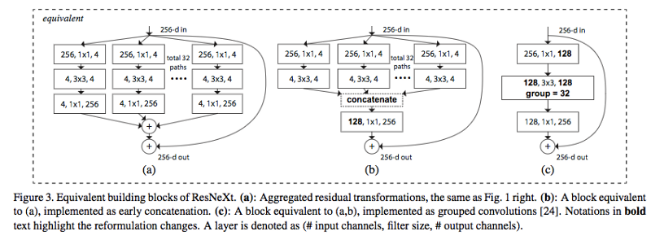

<!-- START doctoc generated TOC please keep comment here to allow auto update -->
<!-- DON'T EDIT THIS SECTION, INSTEAD RE-RUN doctoc TO UPDATE -->
**Table of Contents**  *generated with [DocToc](https://github.com/thlorenz/doctoc)*

- [Activation Function](#activation-function)
  - [Linear](#linear)
  - [Sigmoid](#sigmoid)
  - [Tanh](#tanh)
  - [ReLU](#relu)
  - [Softmax](#softmax)
- [Loss Function](#loss-function)
  - [Mean Absolution Error (MAE)](#mean-absolution-error-mae)
  - [Mean Square Error (MSE)](#mean-square-error-mse)
  - [Likelihood Loss](#likelihood-loss)
  - [Log Loss](#log-loss)
  - [Cross Entropy Loss](#cross-entropy-loss)
  - [Hinge Loss](#hinge-loss)
  - [CTC Loss](#ctc-loss)
  - [Triplet Loss](#triplet-loss)
- [Optimization Function](#optimization-function)
  - [Batch Gradient Descent](#batch-gradient-descent)
  - [Stochastic Gradient Descent (SGD)](#stochastic-gradient-descent-sgd)
  - [Mini-batch Gradient Descent (SGD)](#mini-batch-gradient-descent-sgd)
  - [Momentum](#momentum)
  - [Nesterov Accelerated Gradient (NAG)](#nesterov-accelerated-gradient-nag)
  - [AdaGrad](#adagrad)
  - [AdaDelta](#adadelta)
  - [RMSprop](#rmsprop)
  - [Adam](#adam)
  - [AdaMax](#adamax)
  - [Nadam](#nadam)
  - [Learning Rate Schedule](#learning-rate-schedule)
  - [Miscellaneous](#miscellaneous)
- [Evaluation Metrics](#evaluation-metrics)
  - [Confusion Matrix](#confusion-matrix)
  - [Accuracy](#accuracy)
  - [Precision](#precision)
  - [Recall (aka, Sensitivity)](#recall-aka-sensitivity)
  - [Specificity](#specificity)
  - [F1-Score](#f1-score)
  - [AUC-ROC](#auc-roc)
  - [IoU](#iou)
- [Normalization](#normalization)
  - [Batch Normalization (BN)](#batch-normalization-bn)
  - [Local Response Normalization](#local-response-normalization)
- [Regularization](#regularization)
  - [L1 & L2 & Elastic Net](#l1--l2--elastic-net)
  - [Dropout](#dropout)
  - [Earlystopping](#earlystopping)
  - [Max-Norm Regularization](#max-norm-regularization)
- [Ensemble Methods](#ensemble-methods)
  - [Voting Classifier](#voting-classifier)
  - [Bagging](#bagging)
  - [Boosting](#boosting)
  - [Stacking](#stacking)
- [Neural Network Architectural Paradigms](#neural-network-architectural-paradigms)
  - [Feedforward Neural Networks](#feedforward-neural-networks)
  - [Convolutional Neural Networks](#convolutional-neural-networks)
  - [Recurrent Neural Networks](#recurrent-neural-networks)
  - [Encoder-Decoder Architectures](#encoder-decoder-architectures)
  - [Autoencoders](#autoencoders)
  - [Generative Adversarial Networks](#generative-adversarial-networks)
- [ML Glossary: General](#ml-glossary-general)
  - [Active Learning](#active-learning)
  - [Affine Layer](#affine-layer)
  - [Attention Mechanism](#attention-mechanism)
  - [Backpropagation](#backpropagation)
  - [Backpropagation Through Time (BPTT)](#backpropagation-through-time-bptt)
  - [Cross-Validation](#cross-validation)
  - [Data Augmentation](#data-augmentation)
  - [Embedding](#embedding)
  - [Fine-Tuning](#fine-tuning)
  - [Gaussian Process](#gaussian-process)
  - [Hyperparameters](#hyperparameters)
  - [Latent Space](#latent-space)
  - [Saturating](#saturating)
  - [Surrogate model](#surrogate-model)
  - [Transfer learning](#transfer-learning)
  - [Unsupervised Pretraining (semi-supervised)](#unsupervised-pretraining-semi-supervised)
  - [Vectorization (Flatten)](#vectorization-flatten)
  - [Miscellaneous](#miscellaneous-1)
- [ML Glossary: Vision](#ml-glossary-vision)
  - [Anchor Box](#anchor-box)
  - [Bounding-box Regression](#bounding-box-regression)
  - [Convolution: Feature Map](#convolution-feature-map)
  - [Convolution: 1x1 Convolution](#convolution-1x1-convolution)
  - [Convolution: Depthwise Separable Convolution](#convolution-depthwise-separable-convolution)
  - [Convolution: Dilated Convolution](#convolution-dilated-convolution)
  - [Convolution: Grouped Convolution](#convolution-grouped-convolution)
  - [Convolution: Strided Convolution](#convolution-strided-convolution)
  - [Convolution: Transposed Convolution](#convolution-transposed-convolution)
  - [Image Pyramids](#image-pyramids)
  - [Multi-scale Training](#multi-scale-training)
  - [Non-max Suppression](#non-max-suppression)
  - [One-shot Learning](#one-shot-learning)
  - [Pooling: RoI](#pooling-roi)
  - [Pooling: SPP](#pooling-spp)
  - [Receptive Field](#receptive-field)
  - [Stride](#stride)
- [ML Glossary: Sequence](#ml-glossary-sequence)
  - [Bag of word model](#bag-of-word-model)
  - [N-gram model](#n-gram-model)
  - [Skip-gram model](#skip-gram-model)
  - [Sequence to Sequence](#sequence-to-sequence)
  - [Teacher Force](#teacher-force)
- [Math Glossary](#math-glossary)
  - [Bilinear Interpolation](#bilinear-interpolation)
  - [Gradient](#gradient)
  - [Likelihood vs Probability](#likelihood-vs-probability)
  - [Markov Chains](#markov-chains)
  - [Monte Carlo and Las Vegas Method](#monte-carlo-and-las-vegas-method)
  - [Norm](#norm)
  - [Variables](#variables)
- [Trending & State of the Art](#trending--state-of-the-art)
  - [2018](#2018)
- [Engineering in ML](#engineering-in-ml)

<!-- END doctoc generated TOC please keep comment here to allow auto update -->

Personal notes on machine learning topics.

For completeness and quick lookup, some contents are copy/pasted (with minior modification) from
reference links. If there is any violation, please let me know.

Many of the contents come from:
- https://www.coursera.org/specializations/deep-learning
- https://github.com/ageron/handson-ml
- https://www.deeplearningbook.org/

# Activation Function

In artificial neural networks, the activation function of a node defines the output of that node
given an input or set of inputs. The node (or neuron) calculates a "weighted sum" of its input,
adds a bias and then activation function decides whether it should be "fired" (activated) or not.

While one can use linear activation function, the core purpose of the activation function is to
introduce **non-linearity into the network**. Another way to think of it: without a non-linear
activation function in the network, a NN, no matter how many layers it had, would behave just like
a single-layer perceptron, because summing these layers would give you just another linear function.

There are quite a few activation functions, the most commonly used activation function is relu,
which supercedes previously used ones like sigmoid, tanh, etc.

*References*

- [understanding activation functions in neural networks](https://medium.com/the-theory-of-everything/understanding-activation-functions-in-neural-networks-9491262884e0)
- [why must a nonlinear activation function be used in a backpropagation neural net](https://stackoverflow.com/questions/9782071/why-must-a-nonlinear-activation-function-be-used-in-a-backpropagation-neural-net)
- https://zhuanlan.zhihu.com/p/25110450

## Linear

Linear activation function can not learn complex features thus is generally not useful in practice.

A common usage is to use linear activation function in vanilla autoencoders, i.e. autoencoders with
a single hidden layer, for both the hidden and output layers. This can approximate principal component
analysis (PCA).

## Sigmoid

Sigmoid function curve looks like a s-shape. It mapps linear output to probability distribution
(ranges between 0 and 1); therefore, it is used for models where we have to predict the probability
as an output.

Sigmoid function is defined as `1/(1+exp(-x))`, it ranges from (0, 1). It is a special case of
logistic function, i.e. L = K = 1, x0 = 0

<p align="center"></p>

## Tanh

Tanh is also sigmoidal (s-shaped). It is like logistic sigmoid but better. The range of the tanh
function is from (-1 to 1).

<p align="center"></p>

## ReLU

Rectified Linear Unit (ReLU) is the most used activation function. It ranges from 0 to +Inf.

The nice thing about ReLU is that it's a non-saturating function, meaning that it's output is
infinite if the input is infinite. This can help avoid the vanishing gradient problem.

However, ReLU has a problem called "dying relu", meaning that if a neuron outputs 0, then it
will stop learning. To solve the problem, a couple variants are proposed, e.g. Leaky ReLu, etc.

<p align="center"></p>

## Softmax

Softmax function is a generalized logistic activation function which is used for multiclass
classification. As shown in the image below, softmax turns the input vector `y` into a probability
distribution; whereas in logistic activation, `y` is a single number and logistic function turns it
into a single probability number. The input vector `y` is also called `logits`.

Softmax is commonly used as the activation function of output layer.

<p align="center"></p>

*References*

- [what is the meaning of the word logits in tensorflow](https://stackoverflow.com/questions/41455101/what-is-the-meaning-of-the-word-logits-in-tensorflow)
- [what are the differences between logistic function and sigmoid function](https://stats.stackexchange.com/questions/204484/what-are-the-differences-between-logistic-function-and-sigmoid-function)

# Loss Function

Loss function is a way to penalize model output, which is then used to adjust model parameters.
Generally, if the model is doing good, then loss function outputs a lower number. Loss function
will vary based on the domain of the problem.

Defining loss function is very important: it can directly affect model performance. Quite a few
models are popular due to defining noval loss functions.

## Mean Absolution Error (MAE)

Mean Absolute Error (MAE) measures the average magnitude of the errors in a set of predictions,
without considering their direction. It's the average over the test set of the absolute differences
between prediction and actual observation where all individual differences have equal weight.

MAE is also called L1 loss.

## Mean Square Error (MSE)

Mean square error (MSE) is the most basic loss function. To calculate MSE, you take the difference
between your predictions and the ground truth, square it, and average it out across the whole dataset.

Another metric is Root Mean Square Error (RMSE), which takes the square root of MSE. The square root
is introduced to make scale of the errors to be the same as the scale of targets. In practice, MSE
is a little bit easier to work with, so everybody uses MSE instead of RMSE. Note that even though
RMSE and MSE are really similar in terms of models scoring, they can be not immediately interchangeable
for gradient based methods (since gradient change rate is different).

Compared to MAE, MSE has the benefit of penalizing large errors more so can be more appropriate in
some cases, for example, if being off by 10 is more than twice as bad as being off by 5. But if being
off by 10 is just twice as bad as being off by 5, then MAE is more appropriate.
> MAE is widely used in finance, where $10 error is usually exactly two times worse than $5 error.
> On the other hand, MSE metric thinks that $10 error is four times worse than $5 error. MAE is
> easier to justify than RMSE.

MSE is also called L2 loss.

*References*

- https://medium.com/human-in-a-machine-world/mae-and-rmse-which-metric-is-better-e60ac3bde13d
- [how-to-select-the-right-evaluation-metric-for-machine-learning-models-part-1-regrression-metrics](https://towardsdatascience.com/how-to-select-the-right-evaluation-metric-for-machine-learning-models-part-1-regrression-metrics-3606e25beae0)

## Likelihood Loss

The likelihood function is relatively simple, and is commonly used in classification problems. The
function takes the predicted probability for each input example and multiplies them.

For example, consider a model that outputs probabilities of [0.4, 0.6, 0.9, 0.1] for the ground truth
labels of [0, 1, 1, 0]. The likelihood loss would be computed as (0.6) * (0.6) * (0.9) * (0.9) = 0.2916.
Since the model outputs probabilities for TRUE (or 1) only, when the ground truth label is 0 we take
(1-p) as the probability.

## Log Loss

Log Loss measures the performance of a classification model whose output is a probability value
between 0 and 1. It is a loss function for binary classification, for multiclass, see following
cross entropy loss (log loss is essentially binary-class cross entropy loss).

Log loss penalizes model heavily on wrong predictions with high probability, i.e. predictions that
are confident and wrong.

```python
def LogLoss(yHat, y):
  if y == 1:
    return -log(yHat)
  else:
    return -log(1 - yHat)
```

## Cross Entropy Loss

Cross entropy is a straightforward modification of the likelihood function with logarithms.
Essentially, cross entropy is used to compare the similarity between two probability distribution.

In classification problem, we use activation function like softmax which produces probabilities for
each class, and cross entropy is a loss function which is used in such problems to evaluate model.
For example, for a 3 class classification problem with label [0, 1, 0], and we have two results:
[0.2, 0.6, 0.2], [0.1, 0.8, 0.1] from softmax. Using cross entropy, we are able to tell that the
second distribution is closer to the real label, and also produces two number indicating the
differences. Cross entropy loss has nice kicks:
- it cares more about the 'right class': better value means better model.
- it penalizes heavily for being very confident and very wrong. Predicting high probabilities for
  the wrong class makes the function go crazy.

Following is the equation for cross entropy. `p(x)` is the ground truth probability distribution
for input x, and `q(x)` the network output. In the above example, p(x) = [0, 1, 0], and q(x) =
[0.2, 0.6, 0.2]. Note `log0 =+inf`, `log1=0`.

<p align="center"></p>

As we can see from the equation, for binary cross entropy (BCE), or log loss as mentioned above,
we can expand it and write it as:

```
BCE = -[y * log(y_hat) + (1-y) * log(1-y_hat)]
```

Conceptually, we can think of the relationship between cross entropy and log loss as:
```
Softmax -----(output)-----> Cross Entropy Loss
Sigmoid -----(output)-----> Log Loss
```

However, in practice, people use the terminology `Log Loss` and `Cross Entropy Loss` interchangably.

*References*

- https://towardsdatascience.com/demystifying-cross-entropy-e80e3ad54a8
- https://rdipietro.github.io/friendly-intro-to-cross-entropy-loss/

## Hinge Loss

In machine learning, the hinge loss is a loss function used for training classifiers. The hinge loss
is used for "maximum-margin" classification, most notably for support vector machines (SVMs).

> To summarize, when working with an SVM, if a computed value gives a correct classification and is
> larger than the margin, there is no hinge loss. If a computed value gives a correct classification
> but is too close to zero (where too close is defined by a margin) there is a small hinge loss. If
> a computed value gives an incorrect classification there will always be a hinge loss.

<p align="center"></p>

*References*

- https://jamesmccaffrey.wordpress.com/2018/10/04/hinge-loss-explained-with-a-table-instead-of-a-graph/

## CTC Loss

CTC Loss stands for Connectionist Temporal Classification Loss.

TBD

## Triplet Loss

Triplet loss is a loss function introduced in the paper `FaceNet` from Google, to learn good
embeddings (or "encodings") of faces. In the embedding space, faces from the same person should be
close together and form well separated clusters.

The core idea behind triplet loss is to take three instances, i.e. anchor, positive, negtive, then
minimize the distance between anchor and positive (both have the same identity, e.g. same person),
and also maximize the distance between anchor and negtive.

Below is a formal definition of triplet loss (for one instance):

<p align="center"></p>

In the equation:
- `f(A)` is the feature vector of anchor, `f(P)` is the feature vector of positive, etc
- `max` is used here because if the output from the first part is negtive, then A and P is 'very close', thus loss is 0
- `alpha` is the 'margin' term to make the network robust; otherwise it's trivial for the network to learn f(A)=f(P)=f(N)
- triplet uses L2 norm to measure the distance between two feature vectors

Note the feature vector is the logits (or output from fully connected layer) of classic CNN, that is,
we use the logits as feature vector, instead of feeding them to a softmax classifier.

One other thing to note is that we need to choose triplets that are 'hard' to train on, i.e. triplets
where the negative is closer to the anchor than the positive. If we choose triplets randomly, the
network will learn little information.

*References*

- https://omoindrot.github.io/triplet-loss

# Optimization Function

Optimization algorithms help us to minimize (or maximize) an Objective function E(x) which is simply
a mathematical function dependent on the Model's internal learnable parameters which are used in
computing the target values (Y) from the set of predictors (X) used in the model.

For example, in neural networks, we call the Weights (W) and the Bias (b) values of the neural
network as its internal learnable parameters which are used in computing the output values and are
learned and updated in the direction of optimal solution, i.e minimizing the Loss by the network's
training process.

**List of Common Parameters**

- learning rate: denoted as alpha or lr; some optimizers require it to be tuned while others don't
- momentum term: fraction of the update step of past gradients, usually set to 0.9 or a similar value
- epsilon: a very small number to prevent any division by zero in optimization implementation, e.g. 10E-8
- beta1/beta2: exponential decay rate for the first/second moment, usually set to 0.9 and 0.999
- decay: learning rate decay over each update

**Summary**

- Gradient Descent Variants
  - Batch Gradient Descent
  - Stochastic Gradient Descent
  - Mini-batch Gradient Descent
- Optimization on SGD
  - Momentum
  - Nesterov Accelerated Gradient
  - Learning Rate Schedule
- Adaptive SGD
  - AdaGrad
  - AdaDelta
  - RMSprop
- Adaptive SGD with Optimization
  - Adam
  - AdaMax
  - Nadam

*References*

- http://ruder.io/optimizing-gradient-descent/
- [types of optimization algorithms used in neural networks and ways to optimize gradient](https://towardsdatascience.com/types-of-optimization-algorithms-used-in-neural-networks-and-ways-to-optimize-gradient-95ae5d39529f)
- https://blog.paperspace.com/intro-to-optimization-in-deep-learning-gradient-descent/
- https://blog.paperspace.com/intro-to-optimization-momentum-rmsprop-adam/

## Batch Gradient Descent

Gradient Descent is the most important optimization algorithm. It uses the gradient of the loss
function with respect to all the parameters, and update the parameters in the opposite direction
of the gradient to minimize the loss. For example, in neural networks, we use backpropagation to
calculate the gradient of loss function w.r.t all weights, and then use gradient descent to minimize
the loss function. Formally speaking, `θ = θ - η⋅∇J(θ)` is the formula of the parameter updates,
where `η` is the learning rate, `∇J(θ)` is the gradient of loss function J(θ).

In practice, we use different variants of gradient descent, notably SGD, due to performance reasons.
However, there are some challenges for both Batch Gradient Descent and SGD:
- Choosing a proper learning rate can be difficult
- The same learning rate applies to all parameter updates, but we might want to use differnt rate for different features
- Gradient Descent can reach sub-optimal local minima and can hardly escape

## Stochastic Gradient Descent (SGD)

The traditional batch, or standard gradient descent will calculate the gradient of the whole dataset
but will perform only one update, which means to reach local optima, we have to iterate the dataset
a lot of times, hence it can be very slow and hard to control for datasets which are very large and
don't fit in the memory.

On the other hand, Stochastic Gradient Descent (SGD) performs a parameter update **for each training
example**. It is usually much faster technique. Formally speaking, the formula is `θ = θ − η⋅∇J(θ;x(i);y(i))`,
where `{x(i),y(i)}` is the i'th training example. It is called stochastic because samples are selected
randomly (or shuffled) instead of as a single group (as in batch gradient descent) or in the order
they appear in the training set.

Now due to these frequent updates, parameters updates have **high variance** and causes the loss
function to **fluctuate to different intensities** (since gradient computed for two training
examples can vary a lot). This is actually a good thing because it helps us discover new and
possibly better local minima, whereas batch gradient descent will only converge to the minimum
of the basin.

The real problem with SGD is that due to the frequent updates and fluctuations it ultimately
complicates the convergence to the exact minimum and will keep overshooting due to the frequent
fluctuations. However, it is shown that by gradually decreasing the learning rate, SGD shows the
same convergence pattern as batch gradient descent.

## Mini-batch Gradient Descent (SGD)

An improvement to avoid all the problems and demerits of SGD and batch Gradient Descent would be to
use Mini-batch Gradient Descent as it takes the best of both techniques and performs an update for
every batch with n training examples in each batch.

Commonly mini-batch sizes range from 50 to 256, and is typically the algorithm of choice when
training a neural network nowadays. Actually, the term SGD is used also when mini-batch gradient
descent is used.

## Momentum

A very popular technique that is used along with SGD is called Momentum. Instead of using only the
gradient of the current step to guide the search, momentum also accumulates the gradient of the past
steps to determine the direction to go. It is one of the most popular optimization algorithms and
many state-of-the-art models are trained using it.

Momentum simply adds a fraction `m` of the previous weight update to the current one. When the
gradient keeps pointing in the same direction, this will increase the size of the steps taken
towards the minimum. When the gradient keeps changing direction, momentum will smooth out the
variations. Momentum can help the network out of local minima.

> If you include a momentum term, then instead of just relying on the gradient at each new stopping
> point to determine your movement, your direction now also depends on the size and direction of
> your movement in the previous update.

Essentially, momentum is `exponentially weighed averages`, or in another word, it keeps a 'memory'
of previous gradients and update current one according to `beta` parameter. It works because in SGD,
we do not calculate the exact derivative of our dataset, rather, we are estimating it using mini-batch.
Exponentially weighted average can provide us a better estimate which is closer to the actual derivate
than our noisy calculations.

<p align="center"></p>

*References*

- https://towardsdatascience.com/stochastic-gradient-descent-with-momentum-a84097641a5d
- https://www.willamette.edu/~gorr/classes/cs449/momrate.html

## Nesterov Accelerated Gradient (NAG)

Nesterov Accelerated Gradient is an improvement over Momentum, it can be viewed as the correction
factor for Momentum method. The idea of Nesterov Momentum optimization is to measure the gradient
of the cost function not at the local position but slightly ahead in the direction of the momentum.
The only difference from vanilla Momentum optimization is that the gradient is measured at `θ + βm`
rather than at `θ`.

In other words, while Momentum first computes the current gradient and then takes a big jump in the
direction of the updated accumulated gradient, NAG first makes a big jump in the direction of the
previous accumulated gradient, measures the gradient and then makes a correction. This anticipatory
update prevents us from going too fast and results in increased responsiveness, which has significantly
increased the performance of RNNs on a number of tasks.

<p align="center"></p>

## AdaGrad

Adagrad is short for Adaptive Gradient Descent. It simply allows the learning rate to adapt based on
the parameters, i.e. it makes big updates for infrequent parameters and small updates for frequent
parameters. For this reason, it is well-suited for dealing with sparse data.

Adagrad modifies the general learning rate at each time step t for every parameter `θ(i)` based on
the past accumulated gradients that have been computed for `θ(i)`. The main benefit of Adagrad is
that we don't need to manually tune the learning rate. Most implementations use a default value of
0.01 and leave it at that.

However, the main weakness is the accumulation of gradients: since accumulation is always positive,
the learning rate is always decreasing and decaying, and eventually become so small that the model
just stops learning entirely and stops acquiring new additional knowledge.

<p align="center"></p>

## AdaDelta

Adadelta is an extension of Adagrad that seeks to reduce its aggressive, monotonically decreasing
learning rate. Instead of accumulating all past squared gradients, Adadelta restricts the window of
accumulated past gradients to some fixed size `w`. Note instead of inefficiently storing `w` previous
squared gradients, the sum of gradients is recursively defined as a decaying average of all past
squared gradients.

## RMSprop

RMSprop and Adadelta have both been developed independently around the same time stemming from the
need to resolve Adagrad's radically diminishing learning rates. RMSprop stands for RMS propagation,
it as well divides the learning rate by an exponentially decaying average of squared gradients.

Unlike AdaDelta, RMSprop requires an initial learning rate to be specified, but the general idea of
RMSprop and Adadelta is very similar.

<p align="center"></p>

## Adam

Since we are calculating individual learning rates for each parameter, why not calculate individual
momentum changes for each parameter and store them separately. This is where a new modified technique
and improvement comes into play called as Adam.

Adam is short for Adaptive Moment Estimation. it is another method that computes adaptive learning
rates for each parameter. In addition to storing an exponentially decaying average of past squared
gradients `vt` like Adadelta and RMSprop, Adam also keeps an exponentially decaying average of past
gradients `mt`, similar to momentum. Two parameters beta1 and beta2 control the decay rates of these
moving averages.

> Adam works well in practice and compares favorably to other adaptive learning-method algorithms
> as it converges very fast and the learning speed of the Model is quiet fast and efficient and
> also it rectifies every problem that is faced in other optimization techniques such as vanishing
> learning rate, slow convergence or high variance in the parameter updates which leads to
> fluctuating loss function.

<p align="center"></p>

Adam is essentially RMSprop with momentum. It is the recommended default optimizer.

*References*

- https://machinelearningmastery.com/adam-optimization-algorithm-for-deep-learning/

## AdaMax

AdaMax is a variant of Adam based on the infinity norm.

## Nadam

Nadam is short for Nesterov-accelerated Adaptive Moment Estimation. Much like Adam is essentially
RMSprop with momentum, Nadam is Adam RMSprop with Nesterov momentum.

## Learning Rate Schedule

Learning rate schedules seek to adjust the learning rate during training by reducing the learning
rate according to a pre-defined schedule. Common learning rate schedules include time-based decay,
step decay, exponential decay, etc.

Unlike above learning rate adaptive methods, learning rate schedules need to be pre-defined and do
not update learning rate per parameter. On the other hand, the two are not mutually exclusive, i.e.
you can use learning rate schedules and adaptive methods together, depending on the problem.

## Miscellaneous

**Exploding Gradient Problem**

The Exploding Gradient Problem is the opposite of the Vanishing Gradient Problem. In deep neural
networks gradients may explode during backpropagation, resulting number overflows. This typically
happens in recurrent neural network.

A common technique to deal with exploding gradients is to perform Gradient Clipping, which will
clip the gradients between two numbers to prevent them from getting too large. There exist various
ways to perform gradient clipping, but a common one is to normalize the gradients of a parameter
vector when its L2 norm exceeds a certain threshold:
```
new_gradients = gradients * threshold / l2_norm(gradients)
```

**Vanishing Gradient Problem**

The Vanishing Gradient Problem is the opposite of the Exploding Gradient Problem. It arises in very
deep Neural Networks, typically Recurrent Neural Networks, that use activation functions whose
gradients tend to be small (in the range of 0 from 1). Because these small gradients are multiplied
during backpropagation, they tend to "vanish" throughout the layers, preventing the network from
learning long-range dependencies.

Common ways to counter this problem is to
- use activation functions like ReLUs that do not suffer from small gradients (non-saturating function)
- use better parameter initialization strategy like `Xavier and He Initialization`
- use architectures like LSTMs and GRUs that explicitly combat vanishing gradients.
- use techniques like batch normalization, etc

# Evaluation Metrics

## Confusion Matrix

Confusion matrix itself is not an evaluation metric, but the following classification metrics like
accuracy, precision, recall, specificity, etc are all derived from it. It is used for classification
problem where the output can be of two or more types of classes.

Confusion matrix defines the following four terms:
- True Positive (TP): model correctly classify a sample as a class
- True Negative (TN): model correctly classify a sample as not a class
- False Positive (FP): model incorrectly classify a sample as a class
- False Negative (FN): model incorrectly classify a sample as not a class

*References*

- [performance metrics for classification problems](https://medium.com/greyatom/performance-metrics-for-classification-problems-in-machine-learning-part-i-b085d432082b)

## Accuracy

Definition:
```
Accuracy = (TP + TN) / (TP + TN + FP + FN)
```

Accuracy means number of correct predictions across all data. It is a good measurement when data
are evenly distributed.

> Ex: In our cancer detection example with 100 people, only 5 people have cancer. Let's say our model
> is very bad and predicts every case as No Cancer. In doing so, it has classified those 95 non-cancer
> patients correctly and 5 cancerous patients as Non-cancerous. Now even though the model is terrible
> at predicting cancer, The accuracy of such a bad model is also 95%.

## Precision

Definition:
```
Precision = TP / (TP + TN)
```

Precision means for all the items that we classify as one class, are indeed in that class.

> Ex: In our cancer detection example with 100 people, only 5 people have cancer. Let's say our model
> is very bad and predicts every case as Cancer. Since we are predicting everyone as having cancer,
> our denominator (True positives and False Positives) is 100 and the numerator, person having cancer
> and the model predicting his case as cancer is 5. So in this example, we can say that precision of
> such model is 5%.
>
> If the model predicts every case as No Cancer, then TP is 0 and our model precision is 0.

## Recall (aka, Sensitivity)

Definition:
```
Recall = TP / (TP + FN)
```

Recall or Sensitivity means for all the items that are in a class, are correctly classified as the
class.

> Ex: In our cancer detection example with 100 people, only 5 people have cancer. Let's say our model
> is very bad and predicts every case as Cancer. So our denominator (True positives and False Negatives)
> is 5 and the numerator, person having cancer and the model predicting his case as cancer is also 5
> (Since we predicted 5 cancer cases correctly). So in this example, we can say that the Recall of
> such model is 100%.

Precision vs Recall

- Precision is about being precise. So even if we managed to capture only one cancer case, and we
  captured it correctly, then we are 100% precise.
- Recall is not so much about capturing cases correctly but more about capturing all cases that have
  "cancer" with the answer as "cancer". So if we simply always say every case as "cancer", we have
  100% recall.

## Specificity

Definition:
```
Specificity = TN / (TN + FP)
```

Specificity means for all the items that are not in a class, are correctly classified as not the
class. Specificity is the exact opposite of recall.

> Ex: In our cancer detection example with 100 people, only 5 people have cancer. Let’s say our model
> is very bad and predicts every case as Cancer. So our denominator (False positives and True Negatives)
> is 95 and the numerator, person not having cancer and the model predicting his case as no cancer is 0
> (Since we predicted every case as cancer). So in this example, we can that that Specificity of such
> model is 0%.

## F1-Score

Definition:
```
F1-Score = 2 * Precision * Recall / (Precision + Recall)
```

F1-Score combines Precision and Recall into a single metric using Harmonic Mean. Compared with
Arithmetic Mean, Harmonic Mean is closer to smaller number, which is better. For example, in the
above example, Precision is 5% and Recall is 100%, then Arithmetic Mean is 52.5% while Harmonic
Mean is 9.5%. It is evident that 9.5% is a better evalution for the model.

## AUC-ROC

AUC-ROC is short for "Area Under the ROC Curve". It is also derived from confusion matrix.

The above metrics deal with ones and zeros, meaning you either got the class label right or you
didn't. But many classifiers are able to quantify their uncertainty about the answer by outputting
a probability value. To compute accuracy from probabilities you need a threshold to decide when
zero turns into one. The most natural threshold is of course 0.5.

AUC-ROC indicates how well the probabilities from the positive classes are separated from the
negative classes. AUC ranges from 0 to 1, but score of a random classifier for balanced data is
0.5, so real value should be larger that 0.5 at least. Generally, the bigger the number, the
better the model.

For an intuitive introduction, see the following youtube link.

*References*

- https://www.youtube.com/watch?v=OAl6eAyP-yo
- https://towardsdatascience.com/understanding-auc-roc-curve-68b2303cc9c5
- http://fastml.com/what-you-wanted-to-know-about-auc/

## IoU

IoU is short for Intersection over Union, it is a metric used to evaluate objection detection
algorithm. Basically, it is the intersection of predicted box and ground-truth box divided by the
union of the two boxes.

IoU = 1 means a perfect detector. A typical threshhold for a good detector is 0.5.

# Normalization

Feature scaling is a method used to standardize the range of independent variables or features of
data. In data processing, it is also known as data normalization and is generally performed during
the data preprocessing step.

Note that Normalization, Standarization, Feature Scaling are often used interchangeably, but they
are different concepts:
- Feature Scaling: This means transforming data so that it fits within a specific scale, like 0-100
  or 0-1. Feature Scaling includes Standarization and Normalization.
- Standarization: Standarization is also called "Z-score normalization". This is a more radical
  transformation. The point of standarization is to change your observations so that they can be
  described as a normal distribution, i.e. substract from mean and divide by standard deviation,
  or in an other word, shifting inputs to zero-mean and unit variance.
- Normalization: Normalization is called Min-Max scaling (common cause for ambiguities), where
  data is substracted from min and then divided by max-min. **In some literature and blogs,
  normalization is described as Standarization**, i.e. shifting inputs to zero-mean and unit
  variance.

Despite the difference, in the context of machine learning, all of them refer to a preprocessing
step to clean up data, thus making it easier for ml algorithms to learn, since without normalization,
models tend to penalize large values because they contribute more to the final losses. However,
normalization can vary final results a lot while using certain algorithms and have a minimal or no
effect in others.

*References*

- https://en.wikipedia.org/wiki/Feature_scaling
- https://sebastianraschka.com/Articles/2014_about_feature_scaling.html
- [when should you perform feature scaling and mean normalization](https://www.quora.com/When-should-you-perform-feature-scaling-and-mean-normalization-on-the-given-data-What-are-the-advantages-of-these-techniques)

## Batch Normalization (BN)

Normalization (here, shifting inputs to zero-mean and unit variance) is often used as a pre-processing
step to make the input data comparable across features. However, as the data flows through a deep
network, the weights and parameters adjust those values, sometimes making the data too big or too
small again - a problem referred to as "internal covariate shift". In another words, the distribution
of each layer's inputs changes during training, as the parameters of the previous layers change.

[Batch Normalization (BN)](https://arxiv.org/abs/1502.03167) consists of adding an operation in the
model just **before** the activation function of each layer, simply zero-centering and normalizing
the inputs, then scaling and shifting the result using two new parameters per layer (one for scaling,
the other for shifting). In other words, this operation lets the model learn the optimal scale and
mean of the inputs for each layer.

In order to zero-center and normalize the inputs, the algorithm needs to estimate the inputs' mean
and standard deviation. It does so by evaluating the mean and standard deviation of the inputs over
the current mini-batch (hence the name "Batch Normalization").

By normalizing the input of each layer in each mini-batch, the "internal covariate shift" problem
is largely avoided. Basically, rather than just performing normalization once in the beginning, with
BN, you're doing it at every layer. BN can improve training speed, improve accuracy, etc. Now most
CNN uses BN in their architecture; and in fact, when batch normalization is used, other kind of
regularization like dropout can be removed.

During inference, there is no mini-batch to compute the empirical mean and standard deviation, so
instead we simply use the whole training set's mean and standard deviation.

Example code:

```python
model.add(Conv2D(32, (3, 3)))
model.add(BatchNormalization())
model.add(Activation('relu'))

model.add(Dense(32, (3, 3)))
model.add(BatchNormalization())
model.add(Activation('relu'))
```

*References*

- https://www.learnopencv.com/batch-normalization-in-deep-networks/
- https://www.jeremyjordan.me/batch-normalization/
- https://www.quora.com/Why-does-batch-normalization-help
- https://arxiv.org/pdf/1502.03167.pdf

## Local Response Normalization

In neurobiology, there is a concept called "lateral inhibition". This refers to the capacity of an
excited neuron to subdue its neighbors. We basically want a significant peak so that we have a form
of local maxima. This tends to create a contrast in that area, hence increasing the sensory perception.

Local Response Normalization (LRN) layer implements the lateral inhibition. This layer is useful
when we are dealing with ReLU neurons, because ReLU neurons have unbounded activations and we need
LRN to normalize that. We want to detect high frequency features with a large response. If we
normalize around the local neighborhood of the excited neuron, it becomes even more sensitive as
compared to its neighbors. To be specific, LRN is implemented over `n` "adjacent" kernel maps at
the same spatial position.

At the same time, it will dampen the responses that are uniformly large in any given local
neighborhood. If all the values are large, then normalizing those values will diminish all of them.
So basically we want to encourage some kind of inhibition and boost the neurons with relatively
larger activations.

LRN is proposed in AlexNet, but right now Batch Normalization is commonly used in place of LRN.

*Reference*

- http://yeephycho.github.io/2016/08/03/Normalizations-in-neural-networks/

# Regularization

In mathematics, statistics, and computer science, particularly in the fields of machine learning
and inverse problems, regularization is a process of introducing additional information in order
to solve an ill-posed problem or to prevent overfitting.

## L1 & L2 & Elastic Net

In L1 & L2 regularizer, a regularization term is added to loss function, in order to penalize
learned parameters to avoid overfitting. There are L1 regularizer, L2 regularizer and a combined
regularizer:
- Ridge regression, i.e. L2 regularizer, adds "squared magnitude" of coefficient as penalty term
  to the loss function.
- Lasso Regression (Least Absolute Shrinkage and Selection Operator), i.e. L1 regularizar, adds
  "absolute value of magnitude" of coefficient as penalty term to the loss function.
- Elastic Net: Elastic Net is a middle ground between Ridge Regression and Lasso Regression by
  adding a mix ratio of L1 and L2 term.

The key difference between these techniques is that Lasso shrinks the less important feature’s
coefficient to zero thus, removing some feature altogether. So, this works well for feature
selection in case we have a huge number of features.

In practice, Ridge regression is a good default. If you suspect that only a few features are
actually useful, then use Lasso or Elastic Net (Elastic Net is more perferable).

## Dropout

At each training stage, individual nodes are either dropped out of the net with probability 1-p
or kept with probability p, so that a reduced network is left. The incoming and outgoing edges to
a dropped-out node are also removed. The reason to perform dropout is to prevent over-fitting,
and it essentially is a regularization approach. Note after training, neurons don't get dropped
anymore.

There is one small but important technical detail. Suppose p = 50, in which case during testing a
neuron will be connected to twice as many input neurons as it was (on average) during training. To
compensate for this fact, we need to multiply each neuron's input connection weights by 0.5 after
training. If we don't, each neuron will get a total input signal roughly twice as large as what the
network was trained on, and it is unlikely to perform well.

## Earlystopping

Earlystopping is basically stopping the training once your loss starts to increase (or in other
words validation accuracy starts to decrease). It is essentially a different way to regularize
a model to avoid overfitting.

In the context of hp tuning, earlystopping means stop training if the model's performance won't
outperform models trained with other hyperparameters.

## Max-Norm Regularization

Another regularization technique that is quite popular for neural networks is called max-norm
regularization: for each neuron, it constrains the weights `w` of the incoming connections such
that L2 norm of `w <= r`, where `r` is the max-norm hyperparameter.

# Ensemble Methods

Ensemble methods are meta-algorithms that combine several machine learning techniques into one
predictive model in order to decrease variance (bagging), bias (boosting), or improve predictions
(stacking). Ensemble methods are usually used near the end of a project, once you have already
built a few good predictors, to combine them into an even better predictor.

*References*

- https://blog.statsbot.co/ensemble-learning-d1dcd548e936
- https://towardsdatascience.com/ensemble-learning-in-machine-learning-getting-started-4ed85eb38e00
- https://machinelearningmastery.com/boosting-and-adaboost-for-machine-learning/

## Voting Classifier

The idea behind the Voting Classifier is to combine conceptually different machine learning
classifiers and use a majority vote or the average predicted probabilities (soft vote) to predict
the class labels. Such a classifier can be useful for a set of equally well performing model in
order to balance out their individual weaknesses.

## Bagging

Bagging uses the same training algorithm for every predictor, but to train them on different random
subsets of the training set. When sampling is performed with replacement, this method is called
`bagging`, short for bootstrap aggregating (bootstrapping means sampling with replacement, i.e.
a sample will be put back into the pool in every sample peroid). When sampling is performed without
replacement, it is called `pasting`.

In other words, both bagging and pasting allow training instances to be sampled several times across
multiple predictors, but only bagging allows training instances to be sampled several times for the
same predictor.

The aggregation function is typically the statistical mode (i.e., the most frequent prediction, just
like a `hard voting classifier`) for classification, or the average for regression. Generally, the
net result is that the ensemble has a similar bias but a lower variance than a single predictor
trained on the original training set.

Two more concepts:

- Random Patches: sampling dataset as well as features
- Random Subspaces: only sampling dataset

## Boosting

Boosting (originally called hypothesis boosting) refers to any Ensemble method that can combine
several weak learners into a strong learner. The general idea of most boosting methods is to train
predictors sequentially, each trying to correct its predecessor. There are many boosting methods
available, but by far the most popular are `AdaBoost` (short for Adaptive Boosting) and `Gradient
Boosting`.

**AdaBoost**

One way for a new predictor to correct its predecessor is to pay a bit more attention to the training
instances that the predecessor underfitted. This results in new predictors focusing more and more on
the hard cases. This is the technique used by AdaBoost.

For example, to build an AdaBoost classifier, a first base classifier (such as a Decision Tree) is
trained and used to make predictions on the training set. The relative weight of misclassified
training instances is then increased. A second classifier is trained using the updated weights and
again it makes predictions on the training set, weights are updated, and so on.

Note the weights here are defined inside of AdaBoost: it's part of the algorithm details, not the
weights parameter for predictor models.

<p align="center"></p>
<p align="center"><a href="https://github.com/ageron/handson-ml" style="font-size: 12px">Image Source: handson-ml</a></p>

**Gradient Boost**

Just like AdaBoost, Gradient Boosting works by sequentially adding predictors to an ensemble, each
one correcting its predecessor. However, instead of tweaking the instance weights at every iteration
like AdaBoost does, this method tries to fit the new predictor to the residual errors made by the
previous predictor. Below is an example:

First, let's fit a `DecisionTreeRegressor` to the training set (for example, a noisy quadratic
training set):

```python
from sklearn.tree import DecisionTreeRegressor tree_reg1 = DecisionTreeRegressor(max_depth=2)
tree_reg1.fit(X, y)
```

Now train a second DecisionTreeRegressor on the residual errors made by the first predictor:

```python
y2 = y - tree_reg1.predict(X)
tree_reg2 = DecisionTreeRegressor(max_depth=2)
tree_reg2.fit(X, y2)
```

Then we train a third regressor on the residual errors made by the second predictor:

```python
y3 = y2 - tree_reg2.predict(X)
tree_reg3 = DecisionTreeRegressor(max_depth=2)
tree_reg3.fit(X, y3)
```

Now we have an ensemble containing three trees. It can make predictions on a new instance simply by
adding up the predictions of all the trees:

```python
y_pred = sum(tree.predict(X_new) for tree in (tree_reg1, tree_reg2, tree_reg3))
```

<p align="center"></p>
<p align="center"><a href="https://github.com/ageron/handson-ml" style="font-size: 12px">Image Source: handson-ml</a></p>

There are a couple of abbreviations for gradient boosting:
- GBM: Gradient Boost Machine
- GBDT: Gradient Boost Decision Tree
- GBRT: Gradient Boost Regression Tree
- MART: Multiple Additive Regression Tree

There are also some famous boosting frameworks like xgboost, lightgbm, etc

## Stacking

Stacking is based on a simple idea: instead of using trivial functions (such as hard voting) to
aggregate the predictions of all predictors in an ensemble, why don't we train a model to perform
this aggregation? For example, we can train three predictors each predicting its own value, and then
the final predictor (called a `blender`, or a `meta learner`) takes these predictions as inputs and
makes the final prediction. It's also possible to train multiple layers as well.

Stacking is a commonly used technique for winning the Kaggle data science competition. For example,
the first place for the Otto Group Product Classification challenge was won by a stacking ensemble
of over 30 models whose output was used as features for three meta-classifiers: XGBoost, Neural
Network, and Adaboost.

<p align="center"></p>
<p align="center"><a href="https://github.com/ageron/handson-ml" style="font-size: 12px">Image Source: handson-ml</a></p>

# Neural Network Architectural Paradigms

Below we list a couple of neural network architecture paradigms, they represent different design
patterns of neural networks.

<p align="center"></p>
<p align="center"><a href="https://medium.com/tensorflow/mit-deep-learning-basics-introduction-and-overview-with-tensorflow-355bcd26baf0" style="font-size: 12px">Image Source: MIT Medium</a></p>

## Feedforward Neural Networks

A feedforward neural network (FFNNs) is an artificial neural network wherein connections between
the nodes do not form a cycle. As such, it is different from recurrent neural networks. The
feedforward neural network was the first and simplest type of artificial neural network devised.

Technically, most networks in deep learning can be considered FFNNs (e.g. CNN), but usually "FFNN"
refers to its simplest variant: a densely-connected multilayer perceptron (MLP). Each perceptron
is a single layer of neurons, each connected to all the inputs.

## Convolutional Neural Networks

CNNs (aka ConvNets) are feed forward neural networks that use a spatial-invariance trick to
efficiently learn local patterns, most commonly, in images.

Convolutional neural networks (CNNs) are the current state-of-the-art model architecture for image
classification tasks. CNNs apply a series of filters to the raw pixel data of an image to extract
and learn higher-level features, which the model can then use for classification. CNNs contains
three components:
- Convolutional layers, which apply a specified number of convolution filters to the image. For
  each subregion, the layer performs a set of mathematical operations to produce a single value
  in the output feature map. Convolutional layers then typically apply a ReLU activation function
  to the output to introduce nonlinearities into the model.
- Pooling layers, which downsample the image data extracted by the convolutional layers to reduce
  the dimensionality of the feature map in order to decrease processing time. A commonly used
  pooling algorithm is max pooling, which extracts subregions of the feature map (e.g., 2x2-pixel
  tiles), keeps their maximum value, and discards all other values.
- Dense (fully connected) layers, which perform classification on the features extracted by the
  convolutional layers and downsampled by the pooling layers. In a dense layer, every node in the
  layer is connected to every node in the preceding layer.

Typically, a CNN is composed of a stack of convolutional modules that perform feature extraction.
Each module consists of a convolutional layer followed by a pooling layer. The last convolutional
module is followed by one or more dense layers that perform classification. The final dense layer
in a CNN contains a single node for each target class in the model (all the possible classes the
model may predict), with a softmax activation function to generate a value between 0–1 for each
node (the sum of all these softmax values is equal to 1). We can interpret the softmax values for
a given image as relative measurements of how likely it is that the image falls into each target
class.

*References*

- https://ujjwalkarn.me/2016/08/11/intuitive-explanation-convnets/
- http://colah.github.io/posts/2014-07-Conv-Nets-Modular/
- http://www.wildml.com/2015/11/understanding-convolutional-neural-networks-for-nlp/

## Recurrent Neural Networks

Recurrent Neural Networks (RNNs) are popular models that have shown great promise in many tasks
like NLP, Machine Translation, Time series prediction, Music composition, etc.

The idea behind RNNs is to make use of sequential information. In a traditional neural network we
assume that all inputs (and outputs) are independent of each other. But for many tasks that's a
very bad idea. If you want to predict the next word in a sentence you better know which words came
before it. RNNs are called recurrent because they perform the same task for every element of a
sequence, with the output being depended on the previous computations. Another way to think about
RNNs is that they have a "memory" which captures information about what has been calculated so far.

In theory RNNs can make use of information in arbitrarily long sequences, but in practice they are
limited to looking back only a few steps, due to the vanishing/exploding gradient problem. To solve
the issue, there a couple variants of RNNs, notably, LSTM and GRU. Note vanishing gradients aren't
exclusive to RNNs. They also happen in deep Feedforward Neural Networks. It's just that RNNs tend
to be very deep (as deep as the sentence length in our case), which makes the problem a lot more
common. For more information on why this is the case, refer to [this post](http://www.wildml.com/2015/10/recurrent-neural-networks-tutorial-part-3-backpropagation-through-time-and-vanishing-gradients/).

Unlike a traditional deep neural network, which uses different parameters at each layer, a RNN
shares the same parameters across all steps (timestep, sequence location, etc). This reflects the
fact that we are performing the same task at each step, just with different inputs. This greatly
reduces the total number of parameters we need to learn. If we compare this to CNNs, we'll see
that CNNs share weights across "space", while RNNs share weights across "time".

Because RNN's input and output is much more flexible than other network like CNN, there are quite
a few different types of RNNs, including:
- many-to-many (same length): for example, name entity recognition, i.e. find all names in a given sentence
- many-to-many (different length): for example, machine translation
- many-to-one: for example, sentiment analysis/classification
- one-to-many: for example, music generation
- one-to-one: just like regular neural network

My favorite quote:

> If training vanilla neural nets is optimization over functions, training recurrent nets is
> optimization over programs.

**RNNs Extension: Bidirectional RNNs**

Bidirectional RNNs are based on the idea that the output at time `t` may not only depend on the
previous elements in the sequence, but also future elements. For example, to predict a missing word
in a sequence you want to look at both the left and the right context. Bidirectional RNNs are quite
simple. They are just two RNNs stacked on top of each other. The output is then computed based on
the hidden state of both RNNs.

**RNNs Extension: Deep RNNs**

Deep RNNs are RNNs with multiple layers per timestep. In practice this gives us a higher learning
capacity (but we also need a lot of training data).

Note since unrolling a RNN cell across different timestep already makes it 'deep', it's not common
to use deep RNNs with more than 3 layers.

*References*

- http://www.wildml.com/2015/09/recurrent-neural-networks-tutorial-part-1-introduction-to-rnns/
- http://karpathy.github.io/2015/05/21/rnn-effectiveness/

## Encoder-Decoder Architectures

FFNNs, CNNs, and RNNs presented in first 3 sections are simply networks that make a prediction using
either a dense encoder, convolutional encoder, or a recurrent encoder, respectively. These encoders
can be combined or switched depending on the kind of raw data we're trying to form a useful
representation of. "Encoder-Decoder" architecture is a higher level concept that builds on the
encoding step to, instead of making a prediction, generate a high-dimensional output via a decoding
step by upsampling the compressed representation.

For this reason, Encoder-Decoder architecture is a generic architecture, where FFNNs, CNNs, RNNs and
Autoencoder can all be seen as a variant of it.

## Autoencoders

Autoencoders (AE) are neural networks that aims to copy their inputs to their outputs. They work by
encoding the input into a latent-space (or coding space) representation, and then decoding the output
from this representation. The idea of "representation learning" is central to the generative models
in GAN, RL, and all of deep learning.

Since the ground truth data comes from the input data, no human effort is required. In other words,
it's self-supervised (or unsupervised learning). The main applications of autoencoders are:
- dimensionality reduction
- feature extraction
- unsupervised pretraining
- generative model
- outlier detection (because autoencoder will generally not learn outliers)

One way to categorize autoencoder is the relationship between its internal representation and
input data:
- undercomplete: internal representation has lower dimensionality than the input data
- overcomplete: the opposite of undercomplete

It's often desirable to visualize the internal representations, main approaches are:
- for low-level representation, we can draw a diagram of the weights in a lower layer.
- for high-level representation, we can consider each neuron in every hidden layer, and find the
  training instances that activate it the most, e.g. if a neuron strongly activates when it sees
  a cat in a picture, it will be pretty obvious that the pictures that activate it the most all
  contain cats.
  activated neurons; e.g. a neuron always activates when seeing a picture of cat
- another approach is to input a random image to the network, measure the neuron we are interested
  in, then tweak the network to make the neurons activate more; the image will gradually turn into
  the most exciting image for the particular neuron.
- yet another approach is to measure performance of a supervised learning task if the autoencoders'
  outputs will be used later in a supervised learning task

There are many different types of autoencoder:

**Stacked Autoencoders**

Stacked Autoencoders (or Multilayer Autoencoder) have multiple hidden layers. The structure of
stacked autoencoder is often symmetrical with regards to the central hidden layer, i.e. the encoding
layer. One trick is to use "tying wight", namely to share weight between two mirroring layers. In
the following diagram, `hidden1` and `hidden3` will share weights.

<p align="center"></p>
<p align="center"><a href="https://github.com/ageron/handson-ml" style="font-size: 12px">Image Source: handson-ml</a></p>

It's very important to note that we must not make the autoencoder too powerful, otherwise it may not
learn useful patterns from the input, rather, it just simply learns to copy the input to output.

**Denoising Autoencoders**

Denosing Autoencoder work by adding noise to its inputs, training it to recover the original,
noise-free inputs. This prevents the autoencoder from simply copying the input.

The noise can be pure Gaussian noise added to the inputs, or it can be randomly switched off inputs,
just like dropout. The latter is more common in practice.

<p align="center"></p>
<p align="center"><a href="https://github.com/ageron/handson-ml" style="font-size: 12px">Image Source: handson-ml</a></p>

**Sparse Autoencoders**

Sparse Autoencoder constraint the reconstruction of autoencoder by imposing a constraint in its
loss, e.g. using sparsity loss or L1 regularization.

Sparsity loss is more involved:
- Compute the average activation of each neuron in the coding layer, over the whole training batch.
  e.g. we feed 500 inputs into the network, then measure how many time a neuron activates; if it
  activates 100 times, then the activation of this neuron is 20%. We do this for all neurons in a
  layer, and calculates the average.
- Penalize the neurons that are too active by adding a sparsity loss to the cost function. The
  sparsity loss is calculated using KL divergence, `q` equals the average activation of a coding
  layer from above step, as well, `p` equals to the target activation rate, say 10%.
- Sum up all losses, and add the result to the cost function. The final cost is reconstruction loss
  plus sparsity loss.

**Variational Autoencoders**

Variational Autoencoder are quite different from all the autoencoders, in particular:
- They are *probabilistic autoencoders*, meaning that their outputs are partly determined by chance,
  even after training (as opposed to denoising autoencoders, which use randomness only during training).
  This means that using variational autoencoder, we cannot 'recover' the original input, but instead
  a similar one.
- Most importantly, they are *generative autoencoders*, meaning that they can generate new instances
  that look like they were sampled from the training set. This works because each input is encoded
  into a distribution, thus we can retrieve a similar but different encoded data from the distribution;
  without such distribution, we can only retrieve encoded data itself. Think of it as a one to many
  encoding.

Instead of directly producing a coding for a given input, the encoder produces a mean coding `μ` and
a standard deviation `σ`. The actual coding is then sampled randomly from a Gaussian distribution
with mean `μ` and standard deviation `σ`. After that the decoder just decodes the sampled coding
normally.

<p align="center"></p>
<p align="center"><a href="https://github.com/ageron/handson-ml" style="font-size: 12px">Image Source: handson-ml</a></p>

*References*

- https://towardsdatascience.com/deep-inside-autoencoders-7e41f319999f

## Generative Adversarial Networks

GANs are a framework for training networks optimized for generating new realistic samples from a
particular representation. In its simplest form, the training process involves two networks. One
network, called the `generator`, generates new data instances, trying to fool the other network,
the `discriminator`, that classifies images as real or fake. Note that any two models can be used
to perform the generator and discriminator tasks. In practice, it is easier to just use artificial
neural networks.

So far (~2019), most of the models are `discriminative models`, that map a high-dimensional, rich
sensory input to a class label. GANs belong to another set of algorithms named `generative models`,
which approximate data distributions. These algorithms belong to the field of `unsupervised learning`,
a sub-set of ML which aims to study algorithms that learn the underlying structure of the given data,
without specifying a target value. There are other types of generative models, including variational
Autoencoders (VAEs) and pixelCNN/pixelRNN, etc. Each model has its own tradeoffs.

*References*

- https://github.com/eriklindernoren/Keras-GAN
- https://github.com/nashory/gans-awesome-applications

# ML Glossary: General

## Active Learning

In active learning, the algorithm gets a lot of data, but not the labels. The algorithm can then
explicitly request labels to individual examples. This can be helpful when we have a large amount
of unlabeled data, and we want the examples that we label manually to be as helpful for learning
as possible.

*References*

- https://becominghuman.ai/accelerate-machine-learning-with-active-learning-96cea4b72fdb

## Affine Layer

Affine Layer is a fancy term for Fully-Connected Layer in neural network.

Affine means that each neuron in the previous layer is connected to each neuron in the current layer.
In many ways, this is the "standard" layer of a Neural Network. Affine layers are often added on top
of the outputs of Convolutional Neural Networks or Recurrent Neural Networks before making a final
prediction. An affine layer is typically of the form `y = f(Wx + b)` where `x` are the layer inputs,
`W` the parameters, `b` a bias vector, and `f` a nonlinear activation function.

## Attention Mechanism

Attention Mechanisms are inspired by human visual attention, the ability to focus on specific parts
of an image. Attention mechanisms can be incorporated in both Language Processing and Image
Recognition architectures to help the network learn what to "focus" on when making predictions.

For example, most NMT (Neural Machine Translation) systems work by encoding the source sentence
(e.g. a German sentence) into a vector using a Recurrent Neural Network, and then decoding an
English sentence based on that vector, also using a RNN. With an attention mechanism we no longer
try encode the full source sentence into a fixed-length vector. Rather, we allow the decoder to
"attend" to different parts of the source sentence at each step of the output generation.

*References*

- http://www.wildml.com/2016/01/attention-and-memory-in-deep-learning-and-nlp/

## Backpropagation

Backpropagation is an algorithm to efficiently calculate the gradients in a Neural Network. It boils
down to applying the chain rule of differentiation starting from the network output and propagating
the gradients backward.

Backpropagation is the key algorithm that makes training deep models computationally tractable. The
general, application independent name for backpropagation is `reverse-mode differentiation`.

> Forward-mode differentiation tracks how one input affects every node. Reverse-mode differentiation
> tracks how every node affects one output.

In neural network, backpropagation allows us to compute how each parameter attributes to loss value,
and then apply derivatives to parameters to minimize the loss, i.e. gradient desent. The algorithm
contains two passes:
- The first pass is a normal forward computation. However, instead of just computing output from
  input using current parameters, the forward pass will essentially 'cache' the values (neuron
  outputs) for backward pass.
- The second pass is a backward computation using chain rules. For example, following is a diagram
  for computing `f(x,y) = x^2 * y + y + 2`. For node `n4`, the chain rule is `df/dn4 = df/dn5 * dn5/dn4`,
  where `df/dn5` equals 1 (already calculated), `dn5/dn4` equals 4 (since `n5 = n4 * n2` and `n2=4`).

<p align="center"></p>
<p align="center"><a href="https://github.com/ageron/handson-ml" style="font-size: 12px">Image Source: handson-ml</a></p>

> When training neural networks, we think of the cost (a value describing how bad a neural network
> performs) as a function of the parameters (numbers describing how the network behaves). We want to
> calculate the derivatives of the cost with respect to all the parameters, for use in gradient
> descent. Now, there's often millions, or even tens of millions of parameters in a neural network.
> So, reverse-mode differentiation, called backpropagation in the context of neural networks, gives
> us a massive speed up!

*References*

- http://colah.github.io/posts/2015-08-Backprop/

## Backpropagation Through Time (BPTT)

Backpropagation Through Time is the Backpropagation algorithm applied to Recurrent Neural Networks
(RNNs). BPTT can be seen as the standard backpropagation algorithm applied to an RNN, where each
time step represents a layer and the parameters are shared across layers. Because an RNN shares
the same parameters across all time steps, the errors at one time step must be backpropagated
"through time" to all previous time steps, hence the name. When dealing with long sequences
(hundreds of inputs), a truncated version of BPTT is often used to reduce the computational cost.
Truncated BPTT stops backpropagating the errors after a fixed number of steps.

*References*

- [recurrent-neural-networks-tutorial-part-3-backpropagation-through-time-and-vanishing-gradients](http://www.wildml.com/2015/10/recurrent-neural-networks-tutorial-part-3-backpropagation-through-time-and-vanishing-gradients/)

## Cross-Validation

Separating data into three different sets (as mentioned above) result in fewer data used for
training. In cross-validation, there is no explicit validation set: training set will be divided
into k-fold and each fold will be used as validation set in turn. This is computationally
expensive, but can fully make use of data.

*References*

- http://scikit-learn.org/stable/modules/cross_validation.html

## Data Augmentation

Data augmentation consists of generating new training instances from existing ones, artificially
boosting the size of the training set. This will reduce overfitting, making this a regularization
technique. Common data augmentation techniques include:
- mirroring, random cropping, rotation, etc
- color shifting, or color distortion (PCA color shifting)

Apart from avoiding overfitting, data augmentation can make network more robust. For example, in
image classification problem, we can generate multiple images by shifting color, thus the network
can tolerate test images with different contrast, etc.

**Multi-crop at test time**

Multi-crop at test time is a form of data augmentation that a model uses during test time, as
opposed to most data augmentation techniques that run during training time.

Broadly, the technique involves:
- cropping a test image in multiple ways
- using the model to classify these cropped variants of the test image
- averaging the results of the model's many predictions

Multi-crop at test time is a technique that some machine learning researchers use to improve accuracy
at test time. The technique found popularity among some competitors in the ImageNet competitions,
but it's generally not used in production system due to performance reasons.

## Embedding

Embedding essntially means Representation. It is a transformation from discrete values/scalars to
dense real value vectors.

Explanation one:

> An embedding is a mapping of a discrete, categorical variable to a vector of continuous numbers.
> In the context of neural networks, embeddings are low-dimensional, learned continuous vector
> representations of discrete variables. Neural network embeddings are useful because they can
> reduce the dimensionality of categorical variables and meaningfully represent categories in the
> transformed space.

Explanation two:

> An embedding is a relatively low-dimensional space into which you can translate high-dimensional
> vectors. Embeddings make it easier to do machine learning on large inputs like sparse vectors
> representing words. Ideally, an embedding captures some of the semantics of the input by placing
> semantically similar inputs close together in the embedding space. An embedding can be learned
> and reused across models.

For example, we can use a 100 dimension vector to represent a word in English. For a vocabulary
of 40,000 words, the embedding matrix shape is 40,000 x 100. For a 10 word sentence using a
100-dimensional embedding we would have a 10×100 matrix as our input. An alternative encoding scheme
is "one-hot encoding", where we use a very sparse vector to represent a word. In the example, each
word corresponds to a vector of size 40,000, with only a single value 1 and all other values are 0s,
and there are 40,000 such vectors.

Note that embedding is not just used in language models, for example, in face recognition, we use
embedding to represent faces and feed them to triplet loss function.

There are a couple of ways to use embedding:
- learn an embedding: this can be a slower, but tailors the model to a specific training dataset
  - embedding can be learned standalone and then used to other models
  - embedding can be learned along with neural network
- reuse pre-trained embedding such as Word2Vec, GloVe, etc
  - static embedding, i.e. embedding matrix never change
  - trainable embedding, i.e. embedding matrix can change over training

In Keras, the Embedding layer is essentially a lookup table.

*References*

- [what-is-embedding-in-machine-learning](https://www.quora.com/What-is-embedding-in-Machine-Learning-Could-you-give-a-simple-example-explanation/answer/Jessica-Hyde-4)
- https://towardsdatascience.com/neural-network-embeddings-explained-4d028e6f0526
- https://machinelearningmastery.com/what-are-word-embeddings/
- https://github.com/keras-team/keras/issues/3110#issuecomment-345153450

## Fine-Tuning

Fine-Tuning refers to the technique of initializing a network with parameters from another task
and then updating these parameters based on the task at hand. For example, NLP architecture often
use pre-trained word embeddings like word2vec, and these word embeddings are then updated during
training based for a specific task like Sentiment Analysis. As an other example, with autoencoder,
we can use it to train layers in unsupervised fasion, which can then be used in supervised tasks.

## Gaussian Process

From wiki:

> In probability theory and statistics, a Gaussian process is a stochastic process (a collection of
> random variables indexed by time or space), such that every finite collection of those random
> variables has a multivariate normal distribution, i.e. every finite linear combination of them
> is normally distributed. The distribution of a Gaussian process is the joint distribution of all
> those (infinitely many) random variables, and as such, it is a distribution over functions with
> a continuous domain, e.g. time or space.
>
> A machine-learning algorithm that involves a Gaussian process uses lazy learning and a measure of
> the similarity between points (the kernel function) to predict the value for an unseen point from
> training data. The prediction is not just an estimate for that point, but also has uncertainty
> information - it is a one-dimensional Gaussian distribution (which is the marginal distribution at
> that point).

A gaussian process provides you with its best guess and an uncertainty for every point of your
function. At the beginning the guess is not very good, it repeats back at you what you put in as the
prior for the possible functions. As you add more data however you get a better and better estimate.
All without having to make any assumptions about the shape of the function you are looking for. The
important notes here are:
- Every value in gaussian process follows a gaussian distribution. For example, if we are estimating
  a function `f(x)`, with known value `f(x0)=a, f(x1)=b, etc`, then the value for an unseen point
  `f(xi)` follows a normal distribution. If we sample the point from gaussian process and it returns
  `f(xi)=4`, it means that `f(xi)` happens to be `4` for this particular sampling.
- All points follow multivariate gaussian distribution, guided by a mean function (usually set to 0,
  but others like linear function can be used as well), and a covariance function (also called kernel,
  which describes how correlated each point is with every Periodic).
- Gaussian process is commonly used in bayesian optimization as a surrogate model for more complex
  functions. But note that gaussian process scale cubically with the number of observations, so it
  is hard to apply it to many observations.

*References*

- https://katbailey.github.io/post/gaussian-processes-for-dummies/
- https://zhuanlan.zhihu.com/p/27555501

## Hyperparameters

In the context of machine learning, hyperparameters are parameters whose values  are set prior to
the commencement of the learning process. By contrast, the values of other parameters are derived
via training. Examples of hyperparameter are Learning rate (in many models), Number of hidden layers
in a deep neural network, Number of clusters in a k-means clustering, etc.

*References*

- https://www.quora.com/What-are-hyperparameters-in-machine-learning

## Latent Space

The word "latent" means "hidden". It is pretty much used that way in machine learning - you observe
some data which is in the space that you can observe, and you want to map it to a latent space where
similar data points are closer together.

Before you use a neural network for a task (classification, regression, image reconstruction), the
usual architecture is to extract features through many layers (convolutional, recurrent, pooling
etc.). We say that the function that maps your input to this before last layer projects it on the
latent space. In other words, the latent space is the space where your features lie.

*References*

- https://www.quora.com/What-is-the-meaning-of-latent-space

## Saturating

By definition, a non-saturating function means the value of the function is infinite if the input
is infinite. Therefore, ReLU is a non-saturating while Sigmoid is a saturating function.

In another word, if a function becomes saturated, then it stops changing and its value is close to
its limit. For example, in Sigmoid, it will saturate at 0 when input is negatively very large and
1 when input is positively very large, and its derivative is very small at both sides. For this
reason, Sigmoid is not suited for deep neural network because it will stop learning when neuron
output are very (negtive & positive) large.

*References*

- https://stats.stackexchange.com/questions/174295/what-does-the-term-saturating-nonlinearities-mean
- https://www.quora.com/Why-would-a-saturated-neuron-be-a-problem

## Surrogate model

Surrogate model can be subdivided into Global Surrogate Model and Local Surrogate Model. In short,
It is an interpretable model that is trained to approximate the predictions of a black box model.
Surrogate model is used when the underlying black box model is complex and hard to interpret, so we
use surrogate model to approximate the predictions of the underlying model as accurately as possible
and to be interpretable at the same time. For example, in bayesian optimization, gaussian process is
commonly used as a surrogate model for blackbox optimization.

Perform the following steps to obtain a surrogate model:
- Select a dataset X. This can be the same dataset that was used for training the black box model
  or a new dataset from the same distribution. You could even select a subset of the data or a grid
  of points, depending on your application.
- For the selected dataset X, get the predictions of the black box model.
- Select an interpretable model type (linear model, decision tree, ...).
- Train the interpretable model on the dataset X and its predictions.
- Congratulations! You now have a surrogate model.
- Measure how well the surrogate model replicates the predictions of the black box model.
- Interpret the surrogate model.

One way to measure how well the surrogate replicates the black box model is the R-squared measure:
the larger the R-squared value, the better the surrogate replicates the predictions.

*References*

- https://christophm.github.io/interpretable-ml-book/global.html

## Transfer learning

Transfer learning is a machine learning method where a model developed for a task is reused as the
starting point for a model on a second task.

In typical deep learning tasks, one can download pre-trained model parameters and make some of the
layer parameters non-trainable (i.e. make them "frozen layers"), and replace the fully connected
layers & softmax with custom ones. Since every input will run multiple times during training, we can
cache activations of final frozen layer to speed up training. The number of layers to freeze depends
on the nubmer of training set: if we have more training set, then we can freeze less laysers.

*References*

- https://machinelearningmastery.com/transfer-learning-for-deep-learning/

## Unsupervised Pretraining (semi-supervised)

In cases we have less labeled training data, we can perform "unsupervised pretraining" using RBM
(Restricted Boltzmann Machine), or more recently, Autoencoders. The process is also called
"semi-supervised", shown below:
- Unsupervised training: Train a neural network with unlabeled data
- Network modification: Change something in the network. Often, the output layer is adjusted.
- Supervised training: Train the neural network with labeled data

In Autoencoders, unsupervised pretraining works by first train an autoencoder using all data, both
labeled and unlabeled, then use the lower layers (including encoding layers) as starting point for
our model.

## Vectorization (Flatten)

In mathematics, the vectorization of a matrix is a linear transformation which converts the matrix
into a column vector. Specifically, the vectorization of an `m × n` matrix A, denoted `vec(A)`, is
the `mn × 1` column vector obtained by stacking the columns of the matrix A on top of one another.

In NumPy, Keras, etc, vectorization is implemented via `flatten()` method, that is, `flatten()`
will take a tensor of any shape and transform it into a one dimensional tensor (plus the samples
dimension) but keeping all values in the tensor. For example a tensor (samples, 10, 20, 1) will be
flattened to (samples, 10 * 20 * 1).

*why flatten in CNN*

The last stage of a convolutional neural network (CNN) is a classifier. It is called a dense layer,
which is just an artificial neural network (ANN) classifier. And an ANN classifier needs individual
features, just like any other classifier. This means it needs a feature vector. Therefore, you need
to convert the output of the convolutional part of the CNN into a 1D feature vector, to be used by
the ANN part of it. This operation is called flattening. It gets the output of the convolutional
layers, flattens all its structure to create a single long feature vector to be used by the dense
layer for the final classification.

## Miscellaneous

**Epoch**

An epoch is one forward pass and one backward pass of ALL training examples. Note: epoch and
iterations are two different things. For example, for a set of 1000 images and a batch size of 10,
each iteration would process 10 images for a total of 100 such iterations to go over the entire set.
This is called one epoch. Training can go on for 100s of epochs.

**Bias Term**

Biases are almost always helpful. In effect, a bias value allows you to shift the activation
function to the left or right, which may be critical for successful learning. See [this thread](https://stackoverflow.com/questions/2480650/role-of-bias-in-neural-networks).

**Bias/Variance Tradeoff**

Bias is the generalization error arises from wrong assumptions about data. A high-bias model is most
likely to underfit the training data. Note this notion of bias is different from the bias term.

Variance is due to the model's excessive sensitivity to small variations in the training data. A
high-variance model is likely to overfit the training data.

**Dataset Split**

- Training set: A set of examples used for learning, that is to fit the parameters [i.e., weights] of the classifier.
- Validation set: A set of examples used to tune the parameters [i.e., architecture, not weights] of a classifier, for example to choose the number of hidden units in a neural network.
- Test set: A set of examples used only to assess the performance [generalization] of a fully specified classifier.

**Multiclass vs Multilabel vs Multioutput**

- Multiclass classification problems contains multiple class to classify, e.g. in MNIST dataset we have 10 classes
- Multilabel is the case where we output multiple labels, e.g. in face recognition we label multiple faces
- Multioutput is a generalization of multilabel where each label can have multiple class

# ML Glossary: Vision

## Anchor Box

In object detection task without anchor box, each input region can only detect one object; however,
it's possible that a input region contains multiple objects, i.e. center point of those objects are
located inside of the same input region. Depending on the type of network, input region can be:
-  a sliding window, i.e. in proposal network like R-CNN, a sliding window with `n x n` slides through the input image
-  a grid cell, i.e. in recognition network like YOLO, an image is divided into `n x n` grids

<p align="center"></p>

Anchor box is used to solve the problem by defining boxes with different shapes, and if multiple
objects locate in the same input region, then each should be associated with a particular anchor
box. Because of this, anchor boxes are not generated randomly, they are carefully pre-selected to
be diverse and cover real-life objects at different scales and aspect ratios reasonable well. The
object + anchor box binding is determined by IoU number: higher the number means an object is more
similar to an anchor box.

Note there are some limitations of anchor box:
- the max number of predictions equals to the number of anchor boxes, that is, if there are three
  objects and we only define two anchor boxes for each cell in the network, then one of the objects
  will not be detected
- if two objects have similar shape, then even if we have multiple anchor boxes, it's hard to
  detect both of them

In practice, since we have many grids (e.g. an 256x256 image is divided into 1024 grids, each has
the size 8x8), it's not too often that two objects are in the same grid cell. Generally, we can
define around 5~10 anchor boxes manually with different properties (aspect ratio, scale, locations),
or using algorithms to automatically select anchor box via clustering.

In the following image, anchor centers (red dots) are placed throughout the image.

<p align="center"></p>

The following image shows anchor boxes with different shapes for a single anchor center (left). In
the middle, we'll see how this anchor center applies to the original image: the tall box is likely
to be identified as matching our object. The right picture shows all anchors applied to the original
image.

<p align="center"></p>

> Anchors are also called priors or default boundary boxes in different papers.

*References*

- https://github.com/Nikasa1889/HistoryObjectRecognition
- https://tryolabs.com/blog/2018/01/18/faster-r-cnn-down-the-rabbit-hole-of-modern-object-detection/

## Bounding-box Regression

In object detection problem, by looking at an input region, **bounding-box regressor** (bbox
regressor) can infer the bounding box that fit the object inside, even if the object is only
partly visible. Therefore, one regressor can be trained to look at an input region and predict
the offset `∆(x, y, w, h)`between the input region box and the ground truth box.

If we have one regressor for each object class, it is called **class specific regression**,
otherwise, it is called **class-agnostic** (one regressor for all classes). A bounding box regressor
is often accompanied by a "bounding box classifier" (confidence scorer) to estimate the confidence
of object existence in the box. The classifier can also be class-specific or class-agnostic.

<p align="center"></p>

*References*

- https://github.com/Nikasa1889/HistoryObjectRecognition

## Convolution: Feature Map

Feature map is the output of one filter applied to the previous layer's output. A conv. layer
contains multiple filters, thus feature maps dimensions of a conv. layer can be summarized as:

<p align="center"></p>
<p align="center"><a href="http://cs231n.github.io/convolutional-networks" style="font-size: 12px">Image Source: CS231n</a></p>

In its depth, the convolutional feature map has encoded all the information for the image while
maintaining the location of the "things" it has encoded relative to the original image. For example,
if there was a red square on the top left of the image and the convolutional layers activate for it,
then the information for that red square would still be on the top left of the convolutional feature
map.

## Convolution: 1x1 Convolution

1x1 convolution is mainly used to reduce computational cost by decreasing channel depth, e.g. from
28x28x16 to 28x28x8 (height x wight x #channel). In this example, the filter size is 1x1x16, and we
have 8 filters. Because the third dimension of a filter must equal to input channel number (here 16),
it is usually ignored when talking about convolution filter size.

If filter depth is the same as input channel, e.g. in the above example, we use 16 filters, then the
output is also 28x28x16, in such case, the purpose of 1x1 convolution is to learn non-linear features,
though this is not commonly used.

1x1 convolution is popularized by the Inception network. The following link has great summary on
1x1 convolution. 1x1 convolution is also called "pointwise convolution".

*References*

- https://www.quora.com/How-are-1x1-convolutions-used-for-dimensionality-reduction/answer/Ajit-Rajasekharan

## Convolution: Depthwise Separable Convolution

In traditional convolution, a filter has size `f * f * c`, where `f` is the width and height (typically
set to the same value), and `c` is the size of input channels. For depthwise separable convolution,
the filter is converted to a two-setp operations:
- first a depthwise convolution, i.e. a total of `c` filters with size `f * f * 1` is applied to the
  input feature maps to change the spatial dimension
- second a pointwise convolution, which is actually a `1×1` convolution to change the channel dimension

<p align="center"></p>

Compared with standard convolution, depthwise separable convolution can be seen as an operation at
another end of a spectrum; that is, for standard convolution, spatial and channel convolutions are
applied together, while for depthwise separable convolution, they are totally separate.

Depthwise separable convolution is used in networks like Xception, MobileNets, etc.

## Convolution: Dilated Convolution

Dilated Convolution is also called Atrous Convolutions, it introduces another parameter called
`dilation rate` in order to expand the receptive field of a network while keeping the parameters
low. It is commonly used in image segamentation because of this property.

Consider a 3x3 convolution filter:
- if dilation rate is equal to 1, it behaves like a standard convolution
- if dilation rate is equal to 2, it can enlarge the kernel and makes it a 5x5 convolution filter
- if dilation rate is equal to 3, it can enlarge the kernel and makes it a 7x7 convolution filter

<p align="center"></p>

Each empty square is set to 0 and it's not trainable, e.g. for dilation rate 2, we have 16 zeros
(5x5 - 3x3), and still 9 parameters.

<p align="center"></p>
<p align="center"><a href="https://github.com/vdumoulin/conv_arithmetic" style="font-size: 12px">Image Source</a></p>

## Convolution: Grouped Convolution

A group convolution is simply several convolutions, each taking a portion of the input channels.
For example, if input feature map size is `c` and we have `g` groups/filters, then each filter
group depth is `c/g`, assuming each filter group has the same number of channels.

<p align="center">

====>

<p align="center"><a href="https://blog.yani.io/filter-group-tutorial" style="font-size: 12px">Image Source</a></p>
</p>

Group convolution is first used in AlexNet to combat low GPU memory, but is later proved to be
useful in other networks, e.g. MobileNets, ResNeXt, etc.

<p align="center"></p>
<p align="center"><a style="font-size: 12px">Grouped convolution in AlexNet (2 groups)</a></p>

<p align="center"></p>
<p align="center"><a style="font-size: 12px">Grouped convolution in ResNeXt Block (Figure (c), 32 groups)</a></p>

## Convolution: Strided Convolution

Strided Convolution refer to the case where convolution has stride value larger than 1. Strided
Convolution can largely reduce spatial dimensions.

In some networks (e.g. all convolutional nets, DCGAN, etc), strided convolution is used to replace
deterministic spatial pooling function (such as maxpooling), to allow the network to learn its own
spatial downsampling.

<p align="center"></p>
<p align="center"><a href="https://github.com/vdumoulin/conv_arithmetic" style="font-size: 12px">Image Source</a></p>

## Convolution: Transposed Convolution

Transposed Convolution is also called Fractionally Strided Convolutions.

A transposed convolutional layer carries out a regular convolution but reverts its spatial
transformation. Note Transposed Convolution is NOT Deconvolutions, which also reverts spatial
transformation of a convolution operation.

Following is `2D convolution with no padding, stride of 2 and kernel of 3`:

<p align="center"></p>
<p align="center"><a href="https://github.com/vdumoulin/conv_arithmetic" style="font-size: 12px">Image Source</a></p>

Then a `Transposed 2D convolution with no padding, stride of 2 and kernel of 3`:

<p align="center"></p>
<p align="center"><a href="https://github.com/vdumoulin/conv_arithmetic" style="font-size: 12px">Image Source</a></p>

In GAN network with CNN, transposed convolution is commonly used for generator network to generate
images.

*References*

- https://towardsdatascience.com/up-sampling-with-transposed-convolution-9ae4f2df52d0

## Image Pyramids

Image Pyramid is a multi-scale representation of an image. It is a collection of images, all arising
from a single original image, but downsampled with different scales.

The purpose of image paramids is:
- find objects in images at different scales, e.g. a way of data augmentation
- find objects in images in various locations (with sliding window)

<p align="center"></p>

*References*

- https://www.pyimagesearch.com/2015/03/16/image-pyramids-with-python-and-opencv/

## Multi-scale Training

Vision models need to deal with images with differnt scale and sizes, common approaches include:
- image pyramids: images are resized at multiple scales, and feature maps are computed for each scale
- filter pyramids: uses sliding windows of multiple scales (and/or aspect ratios) on the feature maps
- anchors pyramids: classifies and regresses objects with reference to anchor boxes of multiple scales and aspect ratios

<p align="center"></p>
<p align="center"><a href="https://arxiv.org/abs/1506.01497" style="font-size: 12px">Image Source: Faster R-CNN</a></p>

## Non-max Suppression

NMS is used to make sure that in object detection, a particular object is identified only once.
In the following image, the object is detected in multiple boxes, using non-max suppression, we
first find the bounding box with highest probability, then remove surrounding boxes that has IoU
value (with this bounding box) larger than a threshold (typically 0.5).

<p align="center"></p>

*References*

- https://www.quora.com/How-does-non-maximum-suppression-work-in-object-detection

## One-shot Learning

One-shot learning is an object categorization problem, found mostly in computer vision. Whereas most
machine learning based object categorization algorithms require training on hundreds or thousands of
samples/images and very large datasets, one-shot learning aims to learn information about object
categories from one, or only a few, training samples/images.

For example, in face recognition system, we might only have a few images of a person, say a dataset
with 10k images and 1k persons, and we need to train a network to verify a person's identity. One of
the solutions to the problem is to have the network learn a 'similarity' function: if the difference
score `d(img1, img2)` is below a threshhold, then we output yes (same person), otherwise no.

## Pooling: RoI

RoI stands for Region of Interest, it is used in object detection tasks to speed up training by reusing
feature map from the convolutional network (in two stage networks like R-CNN).

> The RoI pooling layer uses max pooling to convert the features inside any valid region of interest
> into a small feature map with a fixed spatial extent of H × W (e.g., 7 × 7), where H and W are layer
> hyper-parameters that are independent of any particular RoI. In this paper, an RoI is a rectangular
> window into a conv feature map. Each RoI is defined by a four-tuple (r, c, h, w) that specifies its
> top-left corner (r, c) and its height and width (h, w).
>
> RoI max pooling works by dividing the h × w RoI window into an H × W grid of sub-windows of approximate
> size h/H × w/W and then max-pooling the values in each sub-window into the corresponding output
> grid cell. Pooling is applied independently to each feature map channel, as in standard max
> pooling. The RoI layer is simply the special-case of the spatial pyramid pooling layer used in
> SPPnets in which there is only one pyramid level. We use the pooling sub-window calculation given
> in SPPnets.

Following is a single RoI pooling operation. In this case, h x w = 8 x 8 and H x W = 2 x 2.

<p align="center"></p>

Following is a RoI pooling applied to a network. Refer to "Faster R-CNN Model" for more details.

<p align="center"></p>

*References*

- https://deepsense.ai/region-of-interest-pooling-explained/

## Pooling: SPP

SPP stands for Spatial Pyramid Pooling, it is a technique which allows CNNs to use input images of
any size. Traditionally, most CNN networks operate on fixed input image size, e.g. 224x224. The
limitation comes from fully connected layers: while convolutional layers can operate on any size,
fully connected layers need fixed-size inputs.

<p align="center"></p>

It works by:
- first, each feature map is pooled to become one value (grey), thus 256-d vector is formed.
- then, each feature map is pooled to have 4 values (green), and form a 4×256-d vector.
- similarly, each feature map is pooled to have 16 values (blue), and form a 16×256-d vector.
- the above 3 vectors are concatenated to form a 1-d vector.
- finally, this 1-d vector is going into FC layers as usual.

Note the number of bins is fixed, e.g. in a 4-level SPPNet the pyramid can be `{6×6, 3×3, 2×2, 1×1}`,
for a total of 50 bins. If the number of input feature maps to SPP layer is 256, then SPP layer
will output 50x256 dimension vectors. Exactly how many pixels are located in each bin depends on
the size of an image.

*References*

- [review-sppnet-1st-runner-up-object-detection-2nd-runner-up-image-classification-in-ilsvrc](https://medium.com/coinmonks/review-sppnet-1st-runner-up-object-detection-2nd-runner-up-image-classification-in-ilsvrc-906da3753679)
- https://www.shortscience.org/paper?bibtexKey=journals/corr/1406.4729

## Receptive Field

The receptive field is defined as the region in the input space that a particular CNN's feature is
looking at (i.e. be affected by). It one of the most important concepts in Convolutional Neural
Networks (CNNs).

Generally, a feature in a higher layer has a bigger receptive field, which allows it to learn to
capture a more complex/abstract pattern. The ConvNet architecture determines how the receptive field
change layer by layer.

<p align="center"></p>
<p align="center"><a href="https://medium.com/mlreview/a-guide-to-receptive-field-arithmetic-for-convolutional-neural-networks-e0f514068807/" style="font-size: 12px">Image Source: Medium Blog</a></p>

*References*

- [a-guide-to-receptive-field-arithmetic-for-convolutional-neural-networks](https://medium.com/mlreview/a-guide-to-receptive-field-arithmetic-for-convolutional-neural-networks-e0f514068807)
- https://zhuanlan.zhihu.com/p/28492837

## Stride

Image representation in computer memory is a bit complicated for efficiency purpose.

<p align="center"></p>
<p align="center"><a href="https://medium.com/@oleg.shipitko/what-does-stride-mean-in-image-processing-bba158a72bcd" style="font-size: 12px">Image Source: Medium </a></p>

- the total number of bytes occupied by a pixel in memory is called pixel stride
- the number of bytes occupied in memory by a line of an image is called line stride

# ML Glossary: Sequence

## Bag of word model

A bag-of-words model, or BoW for short, is a way of extracting features from text for use in
modeling, such as with machine learning algorithms. It is called a "bag" of words, because any
information about the order or structure of words in the document is discarded. The model is only
concerned with whether known words occur in the document, not where in the document.

For the following two sentences:

```
(1) John likes to watch movies. Mary likes movies too.
(2) John also likes to watch football games.
```

BoW representation can be a dictionary:

```
BoW1 = {"John":1,"likes":2,"to":1,"watch":1,"movies":2,"Mary":1,"too":1};
BoW2 = {"John":1,"also":1,"likes":1,"to":1,"watch":1,"football":1,"games":1};
```

Or a list if each word has an index into a vocabulary:

```
(1) [1, 2, 1, 1, 2, 1, 1, 0, 0, 0]
(2) [1, 1, 1, 1, 0, 0, 0, 1, 1, 1]
```

*References*

- https://en.wikipedia.org/wiki/Bag-of-words_model
- https://machinelearningmastery.com/gentle-introduction-bag-words-model/

## N-gram model

An n-gram is a contiguous sequence of n items from a given sample of text or speech. While bag-of-word
model is an orderless document representation, the n-gram model can store this spatial information.

For the same text:

```
(1) John likes to watch movies. Mary likes movies too.
```

N-gram representation is a list below:

```
[
    "John likes",
    "likes to",
    "to watch",
    "watch movies",
    "Mary likes",
    "likes movies",
    "movies too",
]
```

*References*

- https://en.wikipedia.org/wiki/N-gram
- https://en.wikipedia.org/wiki/Bag-of-words_model

## Skip-gram model

Skip-grams are a generalization of n-grams in which the components (typically words) need not be
consecutive in the text under consideration, but may leave gaps that are skipped over. A k-skip-n-gram
is a length-n subsequence where the components occur at distance at most k from each other.

For example, in the input text:

```
the rain in Spain falls mainly on the plain
```

the set of 1-skip-2-grams includes all the bigrams (2-grams), and in addition the subsequences:

```
the in, rain Spain, in falls, Spain mainly, falls on, mainly the, on plain
```

*References*

- https://en.wikipedia.org/wiki/N-gram

## Sequence to Sequence

The "sequence to sequence" term can mean two things:
- The sequence to sequence problem, where given a sequence, we want to predict or generate a new sequence
- The sequence to sequence model that addresses the above problem, refer to "Models" section for more details

There is also a [seq2seq tensorflow library](https://github.com/google/seq2seq) from Google, which
let's you define a seq2seq model using configuration file (YAML) without writting code. Some of the
configuration include what cell to use (LSTM, GRU, etc), cell parameters, attention parameters, etc.

## Teacher Force

In sequence prediction models, it's common to use the output from last time step as input for the
next time step. For example, in language model, we use current predicted word as input for next step.

However, this process, when applied to training, can make the model converge and instable. For
instance, if the predicted word of current time step `t` is far off from the expected output, then
using this predicted word as input for time step `t+1` will not work well for sure. If we wait until
the whole sequence `T` is generated and backpropage the errors , the model convergence is quite
slow.

Teacher force is used to solve the problem. It was originally described and developed as an
alternative technique to backpropagation through time for training a recurrent neural network.

> Teacher forcing works by using the actual or expected output from the training dataset at the
> current time step y(t) as input in the next time step X(t+1), rather than the output generated
> by the network.

Following code demonstrate the process:

```py
class SimpleRNN(nn.Module):
    def __init__(self, hidden_size):
        super(SimpleRNN, self).__init__()
        self.hidden_size = hidden_size

        self.inp = nn.Linear(1, hidden_size)
        self.rnn = nn.LSTM(hidden_size, hidden_size, 2, dropout=0.05)
        self.out = nn.Linear(hidden_size, 1)

    def step(self, input, hidden=None):
        input = self.inp(input.view(1, -1)).unsqueeze(1)
        output, hidden = self.rnn(input, hidden)
        output = self.out(output.squeeze(1))
        return output, hidden

    def forward(self, inputs, hidden=None, force=True, steps=0):
        if force or steps == 0: steps = len(inputs)
        outputs = Variable(torch.zeros(steps, 1, 1))
        for i in range(steps):
            if force or i == 0:
                input = inputs[i]
            else:
                input = output
            output, hidden = self.step(input, hidden)
            outputs[i] = output
        return outputs, hidden
```

*Reference*

- https://machinelearningmastery.com/teacher-forcing-for-recurrent-neural-networks/
- https://gist.github.com/spro/ef26915065225df65c1187562eca7ec4

# Math Glossary

## Bilinear Interpolation

Image transforms like scaling, rotating, twisting or otherwise warping, effectively move pixels around
in the image. The result is that the pixels in the final image do not directly map to a single original
pixel in the original image. Suppose after rotation, a pixel should have the same color as pixel
(3.4, 5.6) in the original image. The only problem is that there is no such thing as fractional pixels!
Instead of simply choosing the color of the nearest available pixel, (3,6), we can get better results
by intelligently averaging the colors of the four closest pixels. In this case, the values of pixels
(3,5) (3,6) (4,5) and (4,6) would be intelligently averaged together to estimate the color of an
imaginary pixel at (3.4, 5.6). This is called interpolation, and it is used after image transforms to
provide a smooth, accurate and visually appealing images.

*References*

- http://supercomputingblog.com/graphics/coding-bilinear-interpolation/
- https://en.wikipedia.org/wiki/Bilinear_interpolation

## Gradient

A Gradient is a vector which is a multi-variable generalization of a derivative (dy/dx) which is the
instantaneous rate of change of y with respect to x. The difference is that to calculate a derivative
of a function which is dependent on more than one variable or multiple variables, a Gradient takes
its place.

Gradient is calculated using Partial Derivatives. For example, for a multi-variable function
`y = f(x1, x2)`, the gradient is `[dy/dx1, dy/dx2]`.

## Likelihood vs Probability

Suppose you have a probability model with parameters θ, p(x|θ) has two names:
- It can be called the probability of x (given θ),
- or the likelihood of θ (given that x was observed).

Therefore, Maximum-likelihood-estimation means that given observed x, calculate the parameter θ
which maximizes the probability that x occurs. This is also the basis of machine learning.

*References*

- https://zhuanlan.zhihu.com/p/26614750
- https://www.zhihu.com/question/54082000/answer/470252492

## Markov Chains

A Markov chain essentially consists of a set of states and transitions, where transitions are
determined by some probability distribution, that satisfy the Markov property.

*References*

- http://setosa.io/ev/markov-chains/
- https://towardsdatascience.com/introduction-to-markov-chains-50da3645a50d

## Monte Carlo and Las Vegas Method

Monte Carlo methods (or Monte Carlo experiments) are a broad class of computational algorithms that
rely on repeated random sampling to obtain numerical results. Their essential idea is using randomness
to solve problems that might be deterministic in principle.

*References*

- https://www.zhihu.com/question/20254139

## Norm

Norm is a function that assigns a strictly positive length or size to each vector in a vector space.
In a simple term, norm is a measurement of vector, allowing us to 'compare' different vectors. For
example, in real-number space, we can compare two numbers by their value, e.g. -1<2. In vector space,
we need a measurement to tell us how to compare two vectors, e.g. how to compare (-1,2) and (1,-2).

There are different kind of norms:
- The L0 norm that is calculated as the number of non-zero element in the vector.
- The L1 norm that is calculated as the sum of the absolute values of the vector.
- The L2 norm that is calculated as the square root of the sum of the squared vector values.
- The max norm that is calculated as the maximum vector values.

In machine learning, the L1 and L2 regularizers use L1 norm and L2 norm respectively.

## Variables

**Categorical variable**

A categorical variable (sometimes called a nominal variable) is one that has two or more categories,
but there is no intrinsic ordering to the categories. For example, gender is a categorical variable
having two categories (male and female) and there is no intrinsic ordering to the categories.

**Ordinal variable**

An ordinal variable is similar to a categorical variable. The difference between the two is that there
is a clear ordering of the variables. For example, suppose you have a variable, economic status, with
three categories (low, medium and high).  In addition to being able to classify people into these three
categories, you can order the categories as low, medium and high.

High-cardinality variables are those with many unique categories.

**Interval variable**

An interval variable is similar to an ordinal variable, except that the intervals between the values
of the interval variable are equally spaced. For example, suppose you have a variable such as annual
income that is measured in dollars, and we have three people who make $10,000, $15,000 and $20,000.

*References*

- [what-is-the-difference-between-categorical-ordinal-and-interval-variables](https://stats.idre.ucla.edu/other/mult-pkg/whatstat/what-is-the-difference-between-categorical-ordinal-and-interval-variables/)

# Trending & State of the Art

## 2018

- https://www.analyticsvidhya.com/blog/2018/12/key-breakthroughs-ai-ml-2018-trends-2019/

*References*

- https://paperswithcode.com/sota

# Engineering in ML

*References*

- https://www.jeremyjordan.me/ml-projects-guide/
