<!-- START doctoc generated TOC please keep comment here to allow auto update -->
<!-- DON'T EDIT THIS SECTION, INSTEAD RE-RUN doctoc TO UPDATE -->
**Table of Contents**  *generated with [DocToc](https://github.com/thlorenz/doctoc)*

- [Models: Traditional](#models-traditional)
  - [Linear Regression](#linear-regression)
  - [Logistic Regression](#logistic-regression)
  - [Generalized Linear Model](#generalized-linear-model)
  - [Generalized Additive Model](#generalized-additive-model)
  - [Naive Bayes](#naive-bayes)
  - [Gaussian Process](#gaussian-process)
  - [Bayesian Optimization](#bayesian-optimization)
  - [Support Vector Machine](#support-vector-machine)
  - [Decision Tree](#decision-tree)
  - [K Nearest Neighbors](#k-nearest-neighbors)
  - [Random Forest](#random-forest)
  - [Dimensionality Reduction](#dimensionality-reduction)
- [Models: GANs](#models-gans)
  - [GANs, 2014](#gans-2014)
  - [DCGAN, 2016](#dcgan-2016)
- [Models: AutoML](#models-automl)
  - [NAS with RL, 2016](#nas-with-rl-2016)
  - [NASNet, 2017](#nasnet-2017)
  - [PNAS, 2017](#pnas-2017)
  - [ENAS, 2018](#enas-2018)
  - [AutoKeras (Network Morphism), 2018](#autokeras-network-morphism-2018)
  - [DARTS, 2018](#darts-2018)
  - [AMC, 2018](#amc-2018)
- [Models: Misc](#models-misc)
  - [Wide & Deep Network, 2016](#wide--deep-network-2016)

<!-- END doctoc generated TOC please keep comment here to allow auto update -->

# Models: Traditional

## Linear Regression

Linear regression is a linear approach to modelling the relationship between a scalar response
(or dependent variable) and one or more explanatory variables (or independent variables). There
are different types of linear regression based on parameters used:
- least-squares: uses least square as error metrics.
- ridge: use L2 regularization (regularization is used to penalize parameters to avoid overfitting).
- lasso: use L1 regularization. Lasso regression has the effect of setting most w parameters to zero.
- polynomial: generates new features using polynomial combinations. polynomial regression is still a weighted linear combination of features, so it's still a linear model, and can use same least-squares estimation method to compute w and b parameters.

Note that normalization is also important, where we scale features to the same scale. MinMaxScaler
is a commonly used normalization approach.

## Logistic Regression

Logistic Regression uses sigmoid (or, logistic) function for binary classification, and uses softmax
function for multiclass classification. It is called Logistic Regression because it is essentially
linear regression + logistic, but despite the name, it is a classification algorithm.

## Generalized Linear Model

The linear regression model assumes that the outcome given the input features follows a Gaussian
distribution. This assumption excludes many cases: The outcome can also be a category (cancer vs.
healthy), a count (number of children), the time to the occurrence of an event (time to failure of
a machine) or a very skewed outcome with a few very high values (household income). The linear
regression model can be extended to model all these types of outcomes. This extension is called
Generalized Linear Models or GLMs for short. The core concept of any GLM is: Keep the weighted sum
of the features, but allow non-Gaussian outcome distributions and connect the expected mean of this
distribution and the weighted sum through a possibly nonlinear function. For example, the logistic
regression model assumes a Bernoulli distribution for the outcome and links the expected mean and
the weighted sum using the logistic function.

*References*

- https://christophm.github.io/interpretable-ml-book/extend-lm.html

## Generalized Additive Model

Linearity in linear models means that no matter what value an instance has in a particular feature,
increasing the value by one unit always has the same effect on the predicted outcome.

Why not 'simply' allow the (generalized) linear model to learn nonlinear relationships? That is the
motivation behind GAMs. GAMs relax the restriction that the relationship must be a simple weighted
sum, and instead assume that the outcome can be modeled by a sum of arbitrary functions of each
feature.

*References*

- https://christophm.github.io/interpretable-ml-book/extend-lm.html

## Naive Bayes

Bayes' theorem (alternatively Bayes' law or Bayes' rule, also written as Bayes's theorem) describes
the probability of an event, based on prior knowledge of conditions that might be related to the
event. For example, if cancer is related to age, then, using Bayes’ theorem, a person's age can be
used to more accurately assess the probability that they have cancer, compared to the assessment of
the probability of cancer made without knowledge of the person's age.

In machine learning, the theorem is used widely for classification problem. Naive Bayes classifier
calculates the probabilities for every factor (e.g. in case of spam email filtering, the factor
would be an email is spam or not for given input words); then it selects the outcome with highest
probability. This classifier assumes the features (in this case we had words as input) are independent,
hence the word naive. For a full spam filtering example, see [wikipedia](https://en.wikipedia.org/wiki/Naive_Bayes_spam_filtering).

There are a couple types of naive bayes,
- Gaussian naive Bayes: Gaussian Naive Bayes model assumes that for all classes, each feature fits into a normal distribution; for example, in spam class, the word "ads" fits normal distribution.
- Multinomial naive Bayes: With a multinomial event model, samples (feature vectors) represent the frequencies with which certain events have been generated by a multinomial.
- Bernoulli naive Bayes: In the multivariate Bernoulli event model, features are independent booleans (binary variables) describing inputs.

## Gaussian Process

From wiki:

> In probability theory and statistics, a Gaussian process is a stochastic process (a collection of
> random variables indexed by time or space), such that every finite collection of those random
> variables has a multivariate normal distribution, i.e. every finite linear combination of them
> is normally distributed. The distribution of a Gaussian process is the joint distribution of all
> those (infinitely many) random variables, and as such, it is a distribution over functions with
> a continuous domain, e.g. time or space.
>
> A machine-learning algorithm that involves a Gaussian process uses lazy learning and a measure of
> the similarity between points (the kernel function) to predict the value for an unseen point from
> training data. The prediction is not just an estimate for that point, but also has uncertainty
> information - it is a one-dimensional Gaussian distribution (which is the marginal distribution at
> that point).

A gaussian process provides you with its best guess and an uncertainty for every point of your
function. At the beginning the guess is not very good, it repeats back at you what you put in as the
prior for the possible functions. As you add more data however you get a better and better estimate.
All without having to make any assumptions about the shape of the function you are looking for. The
important notes here are:
- Every value in gaussian process follows a gaussian distribution. For example, if we are estimating
  a function `f(x)`, with known value `f(x0)=a, f(x1)=b, etc`, then the value for an unseen point
  `f(xi)` follows a normal distribution. If we sample the point from gaussian process and it returns
  `f(xi)=4`, it means that `f(xi)` happens to be `4` for this particular sampling.
- All points follow multivariate gaussian distribution, guided by a **mean function** (usually set
  to 0, but others like linear function can be used as well), and a **covariance function** (also
  called *kernel*, which describes how correlated each point is with every Periodic).
- Gaussian process is commonly used in bayesian optimization as a surrogate model for more complex
  functions. But note that gaussian process scale cubically with the number of observations, so it
  is hard to apply it to many observations. Many improvements have been built to deal with this issue.

*References*

- https://katbailey.github.io/post/gaussian-processes-for-dummies/
- https://zhuanlan.zhihu.com/p/27555501

## Bayesian Optimization

Bayesian optimization is widely used for black-box optimization. In AutoML, we can form an optimization
function from *model hyperparameter, model architecture, etc*, to *model accuracy, size, etc*. Thus
naturally, it's common to apply bayesian optimization in AutoML (NAS, Hyperparameter Tuning, etc).

Bayesian optimization is a class of machine-learning-based optimization methods focused on solving
the problem: `x = argmax(f(x))`, where the feasible set (search space) and objective function typically
have the following properties:
- Input dimension is not too large, typically <20
- The objective function `f` is continuous (required to model `f` using Gaussian process regression)
- `f` is expensive to evaluate and lacks known special structure like concavity or linearity
- `f(x)` can be observed, but not first- or second-order derivatives, i.e. `f` is derivative-free
- The focus is on finding a global rather than local optimum.

To summarize, Bayesian optimization is designed for black-box derivative-free global optimization.
Note the above properties are not restrictive, e.g. `f` can be discret in some cases.

Bayesian optimization builds a surrogate for the objective and quantifies the uncertainty in that
surrogate using a Bayesian machine learning technique, and then uses an acquisition function defined
from this surrogate to decide where to sample. This form involves two primary components:
- a method for statistical inference (i.e. the **surrogate model**), typically Gaussian process (GP) regression;
- an **acquisition function** for deciding where to sample, which is often expected improvement.

Apart from gaussian process, there are many other approaches used for building the surrogate model
such as polynomial interpolation, neural networks, support vector machines, random forests, etc
(some literature divides them into parametric and non-parametric surrogate models). In addition,
apart from expected improvement, there are also other aquisition functions like entropy search,
knowledge gradient, upper confidence bound, etc.

Following figure is a typical bayesian optimization process:

<p align="center">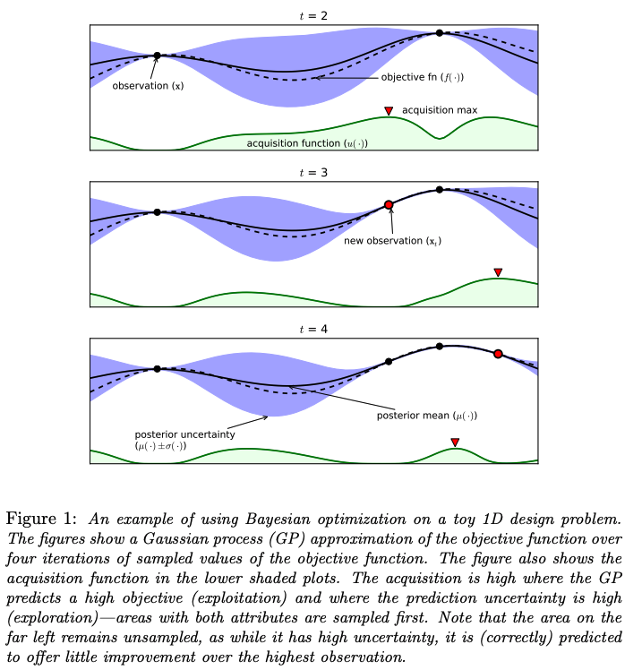</p>

*References*

- https://www.cs.ox.ac.uk/people/nando.defreitas/publications/BayesOptLoop.pdf
- https://arxiv.org/abs/1012.2599
- https://arxiv.org/abs/1807.02811

## Support Vector Machine

A Support Vector Machine (SVM) is a discriminative classifier formally defined by a separating
hyperplane. In other words, given labeled training data, the algorithm outputs an optimal hyperplane
which categorizes new examples. Usually, optimal is defined as providing the maximal classifier
margin. In two dimentional space this hyperplane is a line dividing a plane in two parts where in
each class lay in either side. Here's a simplified version of what SVMs do:
- Find lines that correctly classify the training data
- Among all such lines, pick the one that has the greatest distance to the points closest to it

**Kernel**

SVMs are good at finding hyperplanes (multi-dimentional linearly line), but a lot of real world
data are not linearly separable. The way SVMs handle this is to transform data, i.e. project the
data into a space where it is linearly separable and find a hyperplane in this space. Following
figure illustrates the process:

<p align="center">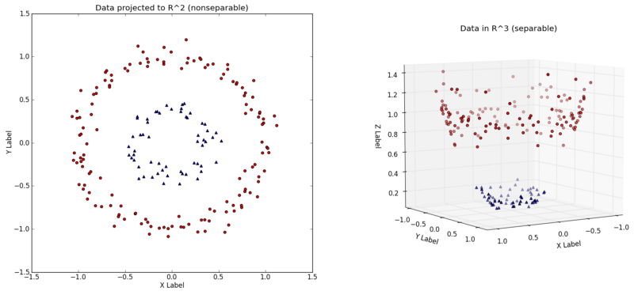</p>

The transformation is performed using a transformation function `φ`, e.g. following is second-degree
polynomial mapping which transforms features from 2-d to 3-d:

<p align="center">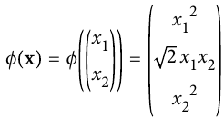</p>

The transformation means that in order to train a SVM model, we need to compare "similarities"
between different data in this high-dimentional space, which is infeasible in most cases. This
is where kernel comes into play. The nice thing above kernel is that it helps "visit" our data to
high-dimension space without actually visiting the space.

The key insight is that the **dual form** of linear SVM objective expects dot product `φ(x(i))_T ·φ(x(j))`,
and kernel is essentially dot product of two vectors. Therefore, instead of transforming data to
high-dimension space, we use kernel trick to directly return the dot product, without first transforming
`x` then calculate dot product.

Depending on the problem at hand, there are a couple of kernels to use, e.g. `rbf`, `polynomial`,
etc. In sklearn, the default kernel is `rbf`. In addition, each kernel has its own hyperparameters
to choose. At last, a regularization parameter `C` is generally required for kernels. Similar to
linear regression, normalization is also very important to SVMs.

For more information on kernels, see the reference links. Following is two common kernels in SVM:
- [Polynomial kernel](https://en.wikipedia.org/wiki/Polynomial_kernel): polynomial kernel using
  exponents of `d` to map our data into a `d` dimensional space.
- [Radial basis function kernel](https://en.wikipedia.org/wiki/Radial_basis_function_kernel): RBF,
  or Gaussian kernels, mathematically maps our data into an infinite dimension space.

**Regression**

SVM algorithm is quite versatile: not only does it support linear and nonlinear classification, but
it also supports linear and nonlinear regression. If we think of an SVM classifier as fitting the
widest possible street between the classes (large margin classification), then an SVM regressor is
to reverse the objective: instead of trying to fit the largest possible street between two classes
while limiting margin violations, SVM regression tries to fit as many instances as possible on the
street while limiting margin violations (i.e., instances off the street). The width of the street
is controlled by a hyperparameter.

**Compare with LR**

SVM and LR only differ in the loss function — SVM minimizes hinge loss while logistic regression
minimizes logistic loss. For more information, see the following link.

*References*

- https://stats.stackexchange.com/questions/31066/what-is-the-influence-of-c-in-svms-with-linear-kernel
- https://stats.stackexchange.com/questions/152897/how-to-intuitively-explain-what-a-kernel-is
- https://towardsdatascience.com/understanding-the-kernel-trick-e0bc6112ef78
- https://towardsdatascience.com/support-vector-machine-vs-logistic-regression-94cc2975433f

## Decision Tree

Decision Tree Classifier repetitively divides the working area into sub-part by identifying lines.
There are two commonly used critiera to measure the quality of a split: max information gain
(entropy), and Gini impurity (gini).
- Gini impurity measures node's purity: if a node is 'pure', meaning that it has only one class,
  then its gini score is 0. For example, for a 3 class classification problem, if a node has 54
  instances, out of which 0 comes from class 1, 49 comes from class 2 and 5 comes from class 3,
  then Gini impurity is calculated as `1 - (0/54)^2 - (49/54)^2 - (5/54)^2 = 0.168`.
- Entropy is another way to measure node impurity. In the above example, the entropy is calculated
  as `-0/54*log(0/54) - 49/54*log(49/54) - 5/54*log(5/54) = 0.31`.

In most cases, the two critieras lead to similar trees. In sklearn, the default is gini impurity
since it is faster (no need to calculate log). Training decision tree involves splitting the training
set into different subsets to make each subset with the smallest impurity. The default algorithm in
sklearn is CART, i.e. Classification And Regression Tree; other algorithms are ID3, etc. Note the
problem of finding the best division is NP-complete, so all algorithms are greedy search algorithms,
which means they can only find the 'reasonable good' solution.

Unlike SVM or Logistic regression, Decision Tree doesn't require much data preprocessing, e.g. it
doesn't require feature scaling. However, Decision Tree is very sensitive to small variances in the
training set. For example, if we rotate the dataset distribution by 45 degress, we'll likely get a
totally different model.

There are three commonly used parameters:
- max_depth
- max_leaf
- min_sample_leaf

In practice, using one of them is enough.

**Regression**

Decision Tree is also capable of performing regression task. The main difference is that instead of
predicting a class in each node, it predicts a value. The prediction value is simply the average
target value of all the instances associated with a leaf node.

## K Nearest Neighbors

An object is classified by a majority vote of its neighbors, with the object being assigned to the
class most common among its k nearest neighbors (k is a positive integer, typically small). To
search k nearest neighbors, there're few commonly used algorithms:
- Brute force search
- K-D tree: based on the observation that if A is very far from B and C is very close to B, we can
  infer that A is also far from C without explicitly measuring the distance
- Ball tree: A ball tree is a binary tree in which every node defines a D-dimensional hypersphere,
  or ball, containing a subset of the points to be searched (balls may intersect). Each point is
  assigned to one or the other ball in the partition according to its distance from the ball's center.
  Each leaf node in the tree defines a ball and enumerates all data points inside that ball.

It's more likely to overfit training data when K is small.

K-nearest neighbors is an example of instance-based learning where we store the training data and
use it directly to generate a prediction, rather than attempted to build a generalized model.

**Regression**

KNN can also be used for regression problem. For classification problem, by default, KNN uses the
majority of labels from K nearest neighbors as the label for new data (it's better to set K to an
odd number). For regression problem, by default, it uses the mean value from from K nearest neighbors.

## Random Forest

Random Forest Classifier is an ensemble algorithm: those which combines more than one algorithms
of same or different kind for classifying objects. Random forest classifier creates a set of decision
trees from randomly selected subset of training set. It then aggregates the votes from different
decision trees to decide the final class of the test object.

Random Forest is generally trained using *bagging* method, that is, random sampling with replacement,
and typically `max_samples` (max number of samples for each decision tree) is set to the size of the
training set. As shown below:

```python
from sklearn.ensemble import RandomForestClassifier
rnd_clf = RandomForestClassifier(n_estimators=500, max_leaf_nodes=16, n_jobs=-1)
    rnd_clf.fit(X_train, y_train)
    y_pred_rf = rnd_clf.predict(X_test)
```

is essentially the same as (except that sklearn applies some optimizations to `RandomForestClassifier`):

```python
bag_clf = BaggingClassifier(
    DecisionTreeClassifier(splitter="random", max_leaf_nodes=16),
    n_estimators=500, max_samples=1.0, bootstrap=True, n_jobs=-1
)
```

Apart from random sampling, for each Decision Tree in Random Forest, **the set of features used to
split sampled data is also random**. For example, if we have 10 features, then in a typical Decision
Tree Classifier, we choose 1 of the 10 features to split our data in the first node that leads to
the smallest gini impurity or entropy; however, in Random Forest, we can only choose 1 out of 6
randomly selected features. These added randomness will increase bias but with lower variance.

One useful feature of Random Forest is to quickly get an understanding of Feature Importance. If we
look at a Decision Tree, important features are likely to appear closer to the root of the tree,
while unimportant features will often appear closer to the leaves (or not at all). It is therefore
possible to get an estimate of a feature's importance by computing the average depth at which it
appears across all trees in the forest. For example, the following image shows feature importance
for a MNIST image.

<p align="center"></p>
<p align="center"><a href="https://github.com/ageron/handson-ml" style="font-size: 12px">Image Source: handson-ml</a></p>

## Dimensionality Reduction

There are two main approaches for dimensionality reduction:
- Projection
- Manifold Learning

Amongest the approaches, following is a list of specific dimensionality reduction algorithms:
- Principle Component Analysis
- Locally Linear Embedding
- t-Distributed Stochastic Neighbor Embedding

**Projection**

In most real-world problems, training instances are not spread out uniformly across all dimensions.
Many features are almost constant, while others are highly correlated. As a result, all training
instances actually lie within (or close to) a much lower-dimensional subspace of the high-dimensional
space. For example, in MNIST, the pixels on the image borders are almost always white, so you could
completely drop these pixels from the training set without losing much information.

To simply put, projection is an approach to project data from high-dimensional space to
low-dimensional space.

**Manifold Learning**

Manifold learning is an approach to non-linear dimensionality reduction. Algorithms for this task
are based on the idea that the dimensionality of many data sets is only artificially high. For
example, a circle in 2-d space can be represented in 1-d space using radius.

*References*

- https://www.zhihu.com/question/24015486/answer/194284643

**Principle Component Analysis (PCA)**

Principal component analysis (PCA) is a statistical procedure that uses an orthogonal transformation
to convert a set of observations of possibly correlated variables (entities each of which takes on
various numerical values) into a set of values of linearly uncorrelated variables called principal
components.

PCA identifies the axis that accounts for the largest amount of variance in the training set, i.e.
preserve the max variance. It also finds a second axis, orthogonal to the first one, that accounts
for the largest amount of remaining variance. It then finds a third axis, orthogonal to both previous
axes, and a fourth, a fifth, and so on-as many axes as the number of dimensions in the dataset.

For example, in the following image, projecting the data onto `C1` results in the largest variance,
so the first principle component is `c1`; similarly, the second principle component  `c2` gives the
second largest variance.

<p align="center"></p>
<p align="center"><a href="https://github.com/ageron/handson-ml" style="font-size: 12px">Image Source: handson-ml</a></p>

In practice, instead of arbitrarily choosing the right number of dimensions (or the number of principle
components) to reduce down to, it is generally preferable to choose the number of dimensions that
add up to a sufficiently large portion of the variance (e.g., 95%). Unless, of course, you are
reducing dimensionality for data visualization: in that case you will generally want to reduce the
dimensionality down to 2 or 3.

A few more concepts:
- Explained Variance Ratio: indicates the proportion of the dataset's variance of each axis
- Incremental PCA: used in case dataset can't fit into memory
- Randomized PCA: finds an approximation of the first `d` principal components (faster)
- Kernel PCA: suitable for nonlinear dataset

```python
from sklearn.datasets import fetch_openml
from sklearn.decomposition import PCA

from matplotlib import pyplot as plt

# Fetch data and view the first image.
X, y = fetch_openml('mnist_784', version=1, return_X_y=True)
plt.imshow(X[0].reshape((28, 28)), cmap='gray')
plt.show()

# Perform PCA, note the shape change.
pca = PCA(n_components=154)
X_reduced = pca.fit_transform(X)
print(X_reduced.shape)          # (70000, 154)

# Reverse PCA and view the first image.
X_recovered = pca.inverse_transform(X_reduced)
plt.imshow(X_recovered[0].reshape((28, 28)), cmap='gray')
plt.show()
```

**Locally Linear Embedding (LLE)**

LLE is another very powerful nonlinear dimensionality reduction (NLDR) technique. LLE works by first
measuring how each training instance linearly relates to its closest neighbors (c.n.), and then
looking for a low-dimensional representation of the training set where these local relationships are
best preserved.

**t-Distributed Stochastic Neighbor Embedding (t-SNE)**

t-SNE reduces dimensionality while trying to keep similar instances close and dissimilar instances
apart. It is mostly used for visualization, in particular to visualize clusters of instances in
high-dimensional space.

# Models: GANs

## GANs, 2014

The [GANs](https://arxiv.org/abs/1406.2661) paper is the first to introduce GAN network.

From the overview:

> We propose a new framework for estimating generative models via an adversarial process, in which
> we simultaneously train two models: a generative model G that captures the data distribution, and
> a discriminative model D that estimates the probability that a sample came from the training data
> rather than G. The training procedure for G is to maximize the probability of D making a mistake.
> This framework corresponds to a minimax two-player game. In the space of arbitrary functions G and
> D, a unique solution exists, with G recovering the training data distribution and D equal to 1/2
> everywhere. In the case where G and D are defined by multilayer perceptrons, the entire system can
> be trained with backpropagation. There is no need for any Markov chains or unrolled approximate
> inference networks during either training or generation of samples. Experiments demonstrate the
> potential of the framework through qualitative and quantitative evaluation of the generated samples.

Here, "D equal to 1/2" is a convergence state where Pg (generator distribution) and Pdata (real data
distribution) is similar and D is unable to distinguish the two, thus it's half wrong and half right.

The paper starts by mentioning that most of the success in deep learning have involved `discriminative
models`, but less with `generative models`, due to two main difficulties, which GANs do not suffer
from.

Mathmatically:

> A neural network G(z, θ₁) is used to model the Generator mentioned above. It's role is mapping
> input noise variables z to the desired data space x (say images). Conversely, a second neural
> network D(x, θ₂) models the discriminator and outputs the probability that the data came from the
> real dataset, in the range (0,1). In both cases, θᵢ represents the weights or parameters that
> define each neural network.

> As a result, the Discriminator is trained to correctly classify the input data as either real or
> fake. This means it's weights are updated as to maximize the probability that any real data input
> x is classified as belonging to the real dataset, while minimizing the probability that any fake
> image is classified as belonging to the real dataset. In more technical terms, the loss/error
> function used maximizes the function D(x), and it also minimizes D(G(z)).

> Furthermore, the Generator is trained to fool the Discriminator by generating data as realistic
> as possible, which means that the Generator's weight’s are optimized to maximize the probability
> that any fake image is classified as belonging to the real datase. Formally this means that the
> loss/error function used for this network maximizes D(G(z)).

The paper then provides  a theoretical analysis of adversarial nets, essentially showing that the
training criterion allows one to recover the data generating distribution as G and D are given enough
capacity, i.e., in the non-parametric limit.

In practice, training GANs is an iterative, numerical process, i.e. for each iteration, we alternate
between k steps of optimizing D and one step of optimizing G (the paper chooses k=1). This results in
D being maintained near its optimal solution, so long as G changes slowly enough.

*References*

- [gans-from-scratch-1-a-deep-introduction-with-code-in-pytorch-and-tensorflow](https://medium.com/ai-society/gans-from-scratch-1-a-deep-introduction-with-code-in-pytorch-and-tensorflow-cb03cdcdba0f)

## DCGAN, 2016

While supervised learning with convolutional networks (CNNs) has seen huge adoption in computer
vision applications, less has been done for unsupervised learning with CNNs. [DCGAN](https://arxiv.org/abs/1511.06434)
is the first to introduce deep convolutional network (with certain architectural constraint) into
GANs.

The main contribution of the paper:
- propose a new architecture to reliably train GAN (DCGAN)
- use the discriminator as feature extractor for supervised learning with decent result
- visualize the filters learnt by GANs and show that specific filters have learned to draw specific objects
- show the generators have interesting vector arithmetic properties allowing for easy manipulation
  of many semantic qualities of generated samples.

Architecture guidelines for stable Deep Convolutional GANs
- Replace any pooling layers with strided convolutions (discriminator) and fractional-strided convolutions (generator).
- Use batchnorm in both the generator and the discriminator.
- Remove fully connected hidden layers for deeper architectures.
- Use ReLU activation in generator for all layers except for the output, which uses Tanh.
- Use LeakyReLU activation in the discriminator for all layers.

<p align="center"></p>

*References*

- https://github.com/Newmu/dcgan_code
- https://www.slideshare.net/enakai/dcgan-how-does-it-work

# Models: AutoML

## NAS with RL, 2016

[NAS with RL](https://arxiv.org/abs/1611.01578) is where all the hype of Neural Architecture Search
started. It uses a recurrent network to generate the model descriptions of neural networks and train
this RNN with reinforcement learning to maximize the expected accuracy of the generated architectures
on a validation set.

In summary:

> This paper presents Neural Architecture Search, a gradient-based method for finding good architectures
> Our work is based on the observation that the structure and connectivity of a neural network can be
> typically specified by a variable-length string. It is therefore possible to use a recurrent network
> \- the controller - to generate such string. Training the network specified by the string - the "child
> network" - on the real data will result in an accuracy on a validation set. Using this accuracy as the
> reward signal, we can compute the policy gradient to update the controller. As a result, in the next
> iteration, the controller will give higher probabilities to architectures that receive high accuracies.
> In other words, the controller will learn to improve its search over time.

<p align="center">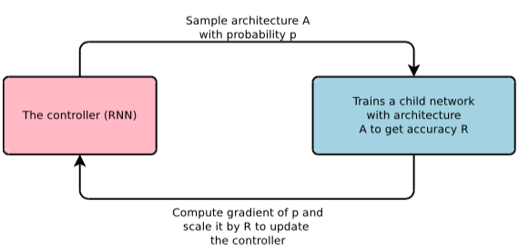</p>

**Controller (for CNN)**

Controller is responsible to generate architecture hyperparameters of neural networks. To be flexible
(i.e. variable-length), controller is implemented as recurrent neural network.

Following is a simple RNN controller implementation assuming only convolution layers. it predicts
filter height, filter width, stride height, stride width, and number of filters for one layer and
repeats. Every prediction is carried out by a softmax classifier and then fed into the next time
step as input. For more details, refer to [this implementation.](https://github.com/titu1994/neural-architecture-search)

<p align="center"></p>
<p align="center"><a style="font-size: 12px">NAS Controller for CNN</a></p>

Because of the importance of skip connection, the RNN controller can be extended to also predict
skip connections.

> At layer N, we add an anchor point which has N - 1 content-based sigmoids to indicate the previous
> layers that need to be connected. Each sigmoid is a function of the current hiddenstate of the
> controller and the previous hiddenstates of the previous N − 1 anchor points.

<p align="center">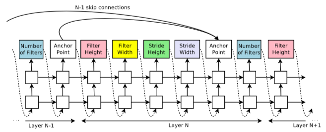</p>
<p align="center"><a style="font-size: 12px">NAS Controller for CNN with skip connection</a></p>

Another important 'hyperparameters' of the algorithm is **search space**, which is different based
on the problem at hand:

> In the experiment with cifar10, the search space consists of convolutional architectures, with
> rectified linear units as non-linearities, batch normalization and skip connections between layers.
> For every convolutional layer, the controller RNN has to select a filter height in [1, 3, 5, 7], a
> filter width in [1, 3, 5, 7], and a number of filters in [24, 36, 48, 64]. For strides, we perform
> two sets of experiments, one where we fix the strides to be 1, and one where we allow the controller
> to predict the strides in [1, 2, 3].

**Controller (for RNN)**

The RNN controller can be used to generate recurrent cell architecture as well. The computations
for basic RNN and LSTM cells can be generalized as a tree of steps that take `xt` and `ht−1` as
inputs and produce `ht` as final output.

<p align="center">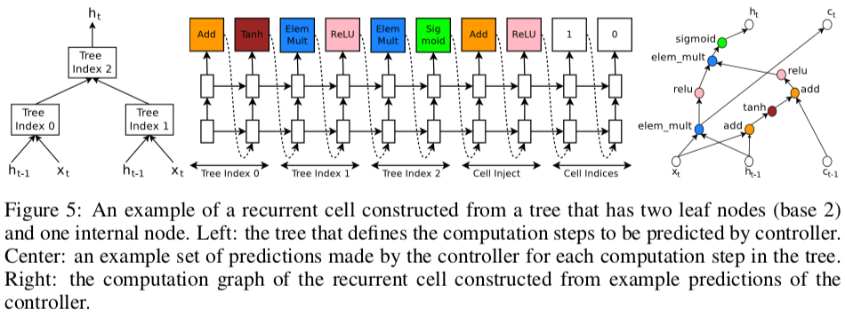</p>
<p align="center"><a style="font-size: 12px">NAS Controller for RNN</a></p>

**search space** for penn treebank:

> In the experiment with penn treebank, the controller sequentially predicts a combination method
> then an activation function for each node in the tree. For each node in the tree, the controller
> RNN needs to select a combination method in [add, elem mult] and an activation method in
> [identity,tanh,sigmoid,relu]. The number of input pairs to the RNN cell is called the "base
> number" and set to 8 in our experiments. When the base number is 8, the search space is has
> approximately 6 × 10^16 architectures, which is much larger than 15,000, the number of architectures
> that we allow our controller to evaluate.

**Training**

Training is done using REINFORCE rule. The list of tokens that the controller predicts can be viewed
as a list of actions `a1:T` to design an architecture for a child network (e.g. for CNN, the actions
can be `[3, 3, 2, 2, 0, 24, ...]`, which means filter height, filter width, etc). At convergence, this
child network will achieve an accuracy R on a held-out dataset. This accuracy R is used as the reward
signal and use reinforcement learning to train the controller.

NAS is very computationally expensive, it uses hundreds of GPUs (800) to search network architectures
even for small dataset like cifar10.

*References*

- https://github.com/titu1994/neural-architecture-search
- https://ai.googleblog.com/2017/05/using-machine-learning-to-explore.html

## NASNet, 2017

[NASNet](http://arxiv.org/abs/1707.07012) is based on NAS with RL. The main contribution of the work
is the design of an novel search space, such that the best architecture found on the cifar10 dataset
would scale to large, higher-resolution image dataset across as range of computational setting.

In summary:

> Applying NAS, or any other search methods, directly to a large dataset, such as the ImageNet dataset,
> is however computationally expensive. We therefore propose to search for a good architecture on a
> proxy dataset, for example the smaller CIFAR-10 dataset, and then transfer the learned architecture
> to ImageNet. We achieve this transferrability by designing a search space (which we call "the NASNet
> search space") so that the complexity of the architecture is independent of the depth of the network
> and the size of input images. More concretely, all convolutional networks in our search space are
> composed of convolutional layers (or "cells") with identical structure but different weights. Searching
> for the best convolutional architectures is therefore reduced to searching for the best cell structure.

**Search Space**

The novel search space mentioned in the paper can be visualized as follows:
- on the left is the overall architecture for CIFAR10 and ImageNet
- on the right is the best performing cell found by NASNet

<p align="center">
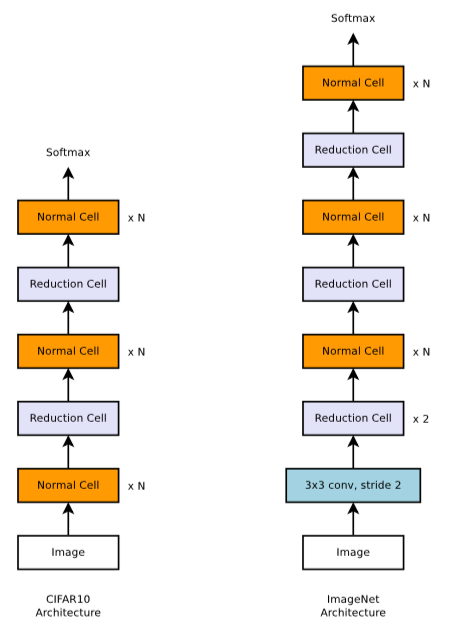
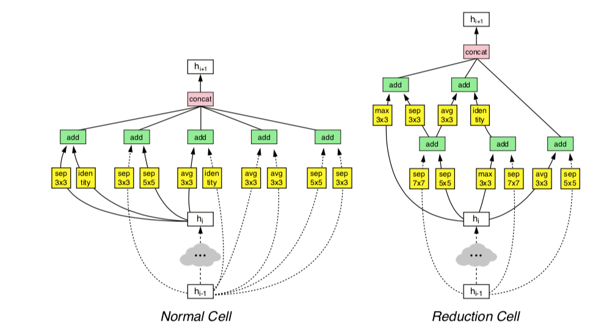
</p>

Note:
- The Normal Cell and Reduction Cell could have the architecture, but the authors found it beneficial
  to learn two separate architectures. A common heuristic is used to double the number of filters in
  the output whenever the spatial activation size is reduced in order to maintain roughly constant
  hidden state dimension.
- Each cell is further divided into `B` blocks, where `B` is a hyperparameter of NASNet. In the
  above cell, B is set to 5, where each block contains two yellow boxes plus a green box.

**Controller**

Following is the controller architecture. It is a one-layer LSTM with 100 hidden units at each layer
and `2 × 5B` softmax predictions for the two convolutional cells. To be precise:
- the controller predicts 5 parameters (output of softmax) for each block
  - the block repeats `B` times; if `B=5`, then the controller predicts 25 parameters
- the prediction above is repeated 2 times, one for normal cell, one for reduction cell
- then normal cell and reduction cell are stacked together `N` times, according to overall architecture

Note that all predictions are associated with a probability, and a joint probability will be used to
compute the gradient for the controller RNN.

<p align="center">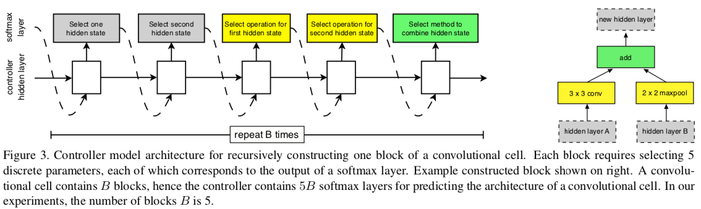</p>

For each block, the prediction contains 5 steps:
- Select a hidden state from `hi`, `hi−1` or from the set of hidden states created in previous blocks.
- Select a second hidden state from the same options as in Step1.
- Select an operation to apply to the hidden state selected in Step1.
- Select an operation to apply to the hidden state selected in Step2.
- Select a method to combine the outputs of Step 3 and 4 to create a new hidden state.

Unlike NAS, the set of operations are pre-determined in NASNet:

<p align="center">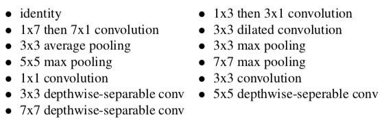</p>

and the combination operations are pre-determined as:
- element-wise addition between two hidden states
- concatenation between two hidden states along the filter dimension

NASNet is still computationally expensive though it is reported to be 7x faster than original NAS:
useing 450 GPUs it took 3-4 day to find the best performing network.

**ScheduledDropPath**

DropPath stochastically drop out each path (i.e., edge with a yellow box) in the cell with some
fixed probability. However, the authors found that DropPath alone does not help NASNet training
much, but DropPath with linearly increasing the probability of dropping out a path over the course
of training significantly improves the final performance for both CIFAR and ImageNet experiments.
The authors name this method `ScheduledDropPath`.

*References*

- https://ai.googleblog.com/2017/11/automl-for-large-scale-image.html
- https://www.fast.ai/2018/07/16/auto-ml2/

## PNAS, 2017

[PNAS](https://arxiv.org/abs/1712.00559) stands for Progress Neural Architecture Search. PNAS is
based on NASNet, in that the algorithm is tasked with searching for good convolutional "cell",
rather than a full CNN in NAS. Each cell also has `B` blocks, and each block contains pre-determined
operations. Following is the architecture found by PNAS:

<p align="center">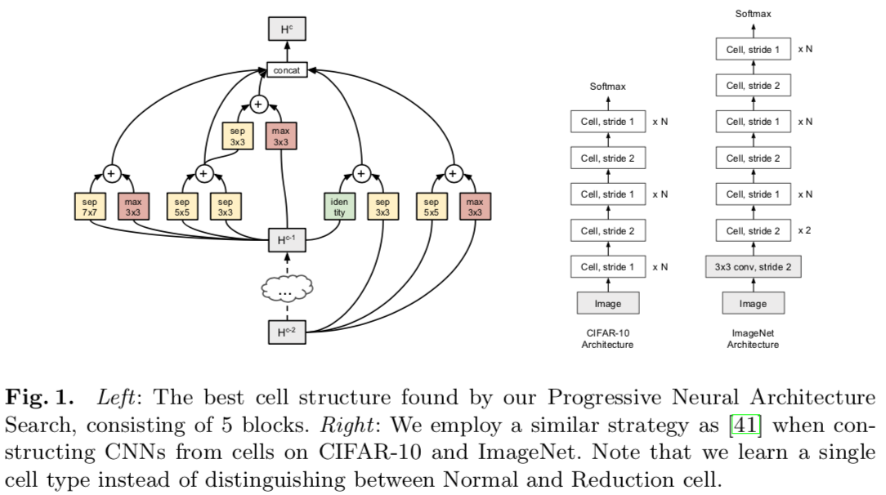</p>

However, unlike NASNet, which uses RL to search cell structures, PNAS uses heuristic search to search
the space of cell structures, starting with simple (shallow) models and progressing to complex ones,
pruning out unpromising structures as it goes. A detailed search process is:

<p align="center">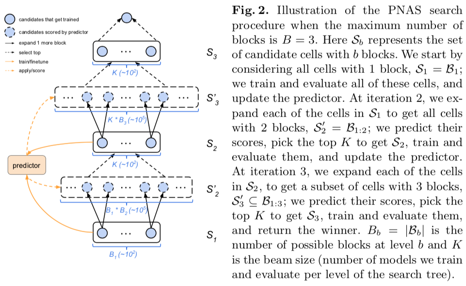</p>

The authors report PNAS to be 5x faster than NASNet.

## ENAS, 2018

[ENAS](https://arxiv.org/abs/1802.03268) stands for Efficient Neural Architecture Search. It is an
important attempt to make NAS more efficient, which is 1000x less expensive than standard NAS. In
all experiments, the authors use a single Nvidia GTX 1080Ti GPU, and the search for architectures
takes less than 16 hours.

The authors observe that the computational bottleneck of NAS is the training of each child model to
convergence, only to measure its accuracy whilst throwing away all the trained weights. Thus, the
main idea is to improve the efficiency of NAS by forcing all child models to share weights to eschew
training each child model from scratch to convergence.

**DAG Graph**

To share parameters of child models, the authors represents search space as a DAG graph, and each
child model is a sub-graph of the DAG.

<p align="center">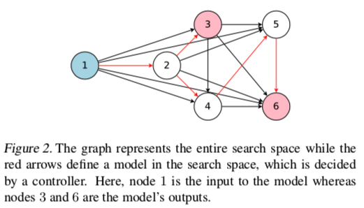</p>

For each pair of nodes `j < l`, there is an independent parameter matrix `W(l,j)`, where all cells
share the same set of parameters as long as the model has connections between `j` and `l`.

With this in mind, the remaining part of ENAS is very similar to original NAS.

**Designing recurrent neural network**

<p align="center">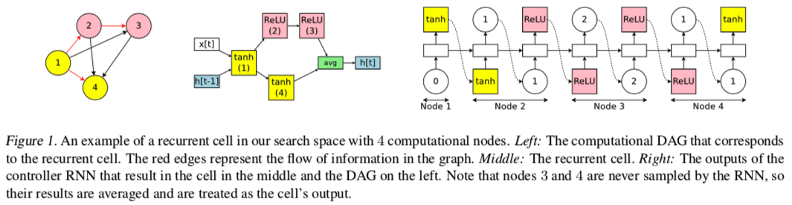</p>

**Designing convolutional network**

This will design a full convolutional network at once, similar to the original NAS. The parameter
for the controller is number of layers `L`, etc.

<p align="center">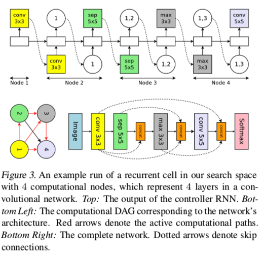</p>

**Designing convolutional cells**

This follows the design from NASNet. The parameter for the controller is number of blocks `B`, etc.

<p align="center">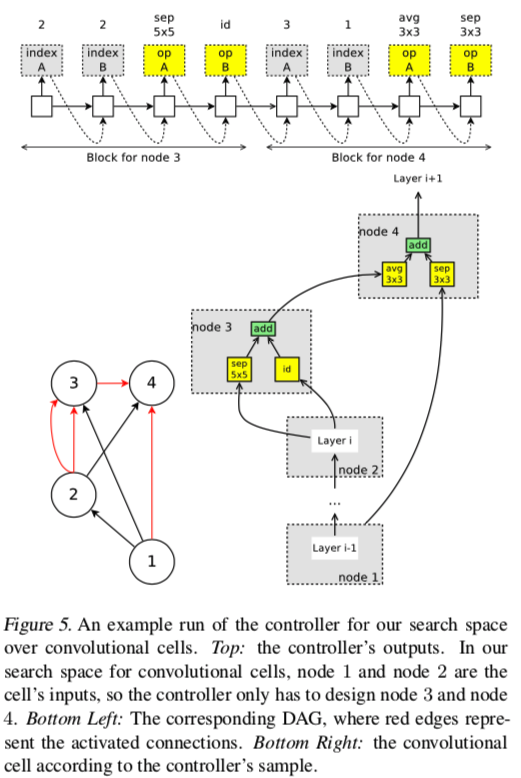</p>

## AutoKeras (Network Morphism), 2018

[Efficient neural architecture search with network morphism](https://arxiv.org/abs/1806.10282), aka,
the default search algorithm in autokeras, proposes a novel framework enabling Bayesian optimization
to guide the network morphism for efficient neural architecture search.

The main contributions of the paper are as follows:
- Propose an algorithm for efficient neural architecture search based on network morphism guided by Bayesian optimization.
- Conduct intensive experiments on benchmark datasets to demonstrate the superior performance of the proposed method over the baseline methods.
- Develop an open-source system, namely Auto-Keras, which is one of the most widely used AutoML systems.

**Network morphism**

Network morphism in neural architecture search is a technique to morph the architecture of a neural
network but keep its functionality: a trained neural network is transformed into a new architecture
using the network morphism operations, e.g., inserting a layer or adding a skip-connection. Only a
few more epochs are required to further train the new architecture towards better performance. Using
network morphism would reduce the average training time `t` (of child model) in neural architecture
search.

Apart from training time `t`, in NAS, the number of searched network `n` is also important (the
total search time is roughly `t*n`). Therefore, an important aspact of network morphism is the
selection of operation from operation set to morph an existing architecture to a new one. The
authors propose using bayesian optimization in guiding the network morphism to reduce the number
of trained neural networks to make the search more efficient.

The authors use four morphism operations:
- inserting a layer to a network to make it deeper, denoted as `deep(G,u)`
- widening a node in a network, denoted as `wide(G,u)`.
- adding an additive connection from node u to node v, denoted as `add(G,u,v)`
- adding an concatenative connection from node u to node v, denoted as `concat(G,u,v)`

In addition, in AutoKeras, the default network that is to be morphised by search algorithm, is
initialized with ResNet, DenseNet and a three-layer CNN. In the current implementation, ResNet18
and DenseNet121 specifically are chosen as the among all the ResNet and DenseNet architectures.
All the default architectures share the same fully-connected layers design. After all the
convolutional layers, the output tensor passes through a global average pooling layer followed
by a dropout layer, a fully-connected layer of 64 neurons, a ReLU layer, another fully-connected
layer, and a softmax layer.

**Bayesian optimization process**

Traditional Bayesian optimization consists of a loop of three steps: update, generation, and
observation. In the context of NAS, the proposed Bayesian optimization algorithm iteratively
conducts:
1. Update: train the underlying Gaussian process model with the existing architectures and their performance;
2. Generation: generate the next architecture to observe by optimizing a delicately defined acquisition function;
3. Observation: obtain the actual performance by training the generated neural architecture.

To successfully apply bayesian optimization, the authors addressed three challenges:
1. The NAS space is not a Euclidean space, which does not satisfy the assumption of traditional Gaussian process.
2. The optimization of the acquisition function.
3. Maintain the intermediate output tensor shape consistency when morphing the architectures.

For the first challenge, recall that GP relies on kernel method (covariance matrix) to measure
similarities of two points. Therefore, the authors propose a kernel that can effectively measure
the `distance` between two network architectures. The intuition behind the kernel function is the
edit-distance for morphing one neural architecture to another. More edits needed from one architecture
to another means the further distance between them, thus less similar they are.

For the second challenge, the author chooses `Upper Confidence Bound (UCB)` as acquisition function,
However, traditional optimization only works in Euclidean space, thus the authors propose a method
in order to optimize the acquisition function on tree-structured space (i.e. the architecture search
space).

For the third challenge, the problem is that any change of a single layer could have a butterfly
effect on the entire network. The authors discussed each operation in detail about how to solve
the problem, e.g. for widening operation `wide(G,u)`, apart from changing the output tensor size
of current layer, input tensor of next layer must also be changed.

**AutoKeras System**

The authors implement the NAS algorithm in a framework called `AutoKeras`, see below:

<p align="center">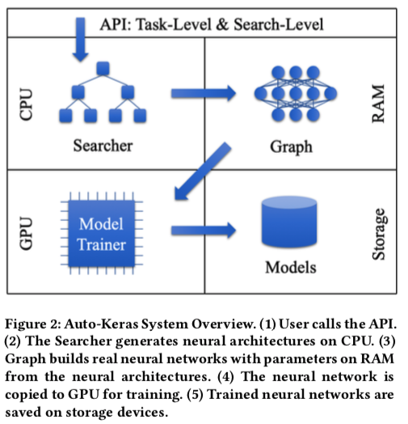</p>
<p align="center">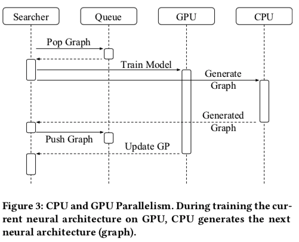</p>

## DARTS, 2018

[DARTS](https://arxiv.org/abs/1806.09055) stands for Differentiable ARchiTecture Search.

> Instead of searching over a discrete set of candidate architectures, we relax the search space to
> be continuous, so that the architecture can be optimized with respect to its validation set
> performance by gradient descent. The data efficiency of gradient-based optimization, as opposed
> to inefficient black-box search, allows DARTS to achieve competitive performance with the state
> of the art using orders of magnitude less computation resources.

The gradient-based search method proposed in DARTS is applicable to both convolutional and recurrent
architectures, and the learned architectures are transferable from small datasets to large datasets.
DARTS can be summarized into four sections:
- Search Space
- Continuous Relaxation and Optimization
- Approximation
- Deriving Discrete Architectures

**Search Space**

DARTS search space follows NASNet, i.e. search for a computation cell as the building block of the
final architecture. A cell is represented as a directed acyclic graph, where each node is a latent
representation (e.g. feature map), and each directed edge is associated with some operation (e.g.
convolution, max pooling). Each intermediate node is computed based on all of its predecessors. A
special `zero` operation is also included to indicate a lack of connection between two nodes, thus
*the task of learning the cell reduces to learning the operations on its edges.*

**Continuous Relaxation and Optimization**

To make the search space continous, DARTS relaxes the categorical choice of a particular operation
as a softmax over all possible operations. After the relaxation, the task of architecture search
reduces to learning a set of continuous variables `α`. At the end of search, a discrete architecture
is obtained by replacing each mixed operation with the most likely operation, i.e. `argmax(α)`.
Essentially, `α` can be seen as *the encoding of the architecture.*

<p align="center">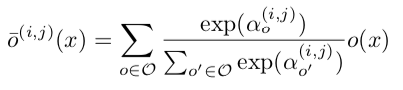</p>

After relaxation, the goal is to jointly learn the architecture `α` and the weights `w` within all
the mixed operations, which is a bilevel optimization problem. That is, we want to minimize the
final validation loss `Lval`, which is determined by both `α` and `w`; in addition, for each searched
architecture, the optimal `w` is learned by minimizing training loss `Ltrain`.

**Approximation**

Solving the bilevel optimization exactly is prohibitive, as it would require recomputing `w` whenever
there is any change in `α`, i.e. train every architecture just like original NAS. The authors propose
an approximate iterative optimization procedure where `w` and `α` are optimized by alternating between
gradient descent steps in the weight and architecture spaces respectively.

**Deriving Discrete Architecture**

After obtaining the continuous architecture encoding `α`, the discrete architecture is derived by
- retaining k strongest predecessors for each intermediate node
- replacing every mixed operation as the most likely operation by taking the argmax.

## AMC, 2018

[AutoML for Model Compression (AMC)](https://arxiv.org/abs/1802.03494#) is a method leverages
reinforcement learning to provide the model compression policy. This *learning-based* compression
policy outperforms conventional *rule-based* compression policy by having higher compression ratio,
better preserving the accuracy and freeing human labor.

A quick summary of model compression:

> The core of model compression technique is to determine the compression policy for each layer as
> they have different redundancy, which conventionally requires hand-crafted heuristics and domain
> expertise to explore the large design space trading off among model size, speed, and accuracy.

The authors proposes two compression policy search protocols for different scenarios:
- resource-constrained compression for latency-critical AI applications (e.g., mobile apps, self-driving
  cars), where action space (pruning ratio) is constrained such that the model compressed by the
  agent is always below the resources budget.
- accuracy-guaranteed compression for quality-critical AI applications (e.g., Google Photos), where
  agent reward a function of both accuracy and hardware resource.

**Problem Definition**

The authors scoped model compression into two categories: `fine-grained pruning` and `structured
pruning`, and restricted AMC to the latter approach.

> Model compression is achieved by reducing the number of parameters and computation of each layer
> in deep neural networks. There are two categories of pruning: fine-grained pruning and structured
> pruning.
>
> Fine-grained pruning aims to prune individual unimportant elements in weight tensors, which is
> able to achieve very high compression rate with no loss of accuracy. However, such algorithms
> result in an irregular pattern of sparsity, and it requires specialized hardware such as EIE for
> speed up.
>
> Coarse-grained / structured pruning aims to prune entire regular regions of weight tensors (e.g.,
> channel, row, column, block, etc.). The pruned weights are regular and can be accelerated directly
> with off-the-shelf hardware and libraries.
>
> Here we study structured pruning that shrink the input channel of each convolutional and fully
> connected layer.

The goal is for the RL agent to find the appropriate sparsity ratio (i.e. the action space).

> Our goal is to precisely find out the effective sparsity for each layer, which used to be manually
> determined in previous studies. Take convolutional layer as an example. The shape of a weight tensor
> is `n × c × k × k`, where `n,c` are output and input channels, and `k` is the kernel size. For
> fine-grained pruning, the sparsity is defined as the number of zero elements divided by the number
> of total elements, i.e. `#zeros/(n × c × k × h)`. For channel pruning, we shrink the weight tensor
> to `n × c′ × k × k` (where `c′` < `c`), hence the sparsity becomes `c′/c`.

**Search Algorithm**

The authors present the RL algorithm with:
- State Space: for each layer t, there are 11 features that characterize the state, e.g. n, c, k, etc.
- Action Space: as mentioned, the action space is sparsity ration, which is a continous space a ∈ (0,1].
- DDPG Agent: AMC uses deep deterministic policy gradient (DDPG) for continuous control of the compression ratio.
- Search Protocol: i.e. Reward. AMC uses different rewards for resource-constrained compression and
  accuracy-guaranteed compression. The former uses `Rerr = −Error`, while the later uses `RFLOPs = −Error · log(FLOPs)`
  and `RParam = −Error · log(#Param)`.

<p align="center">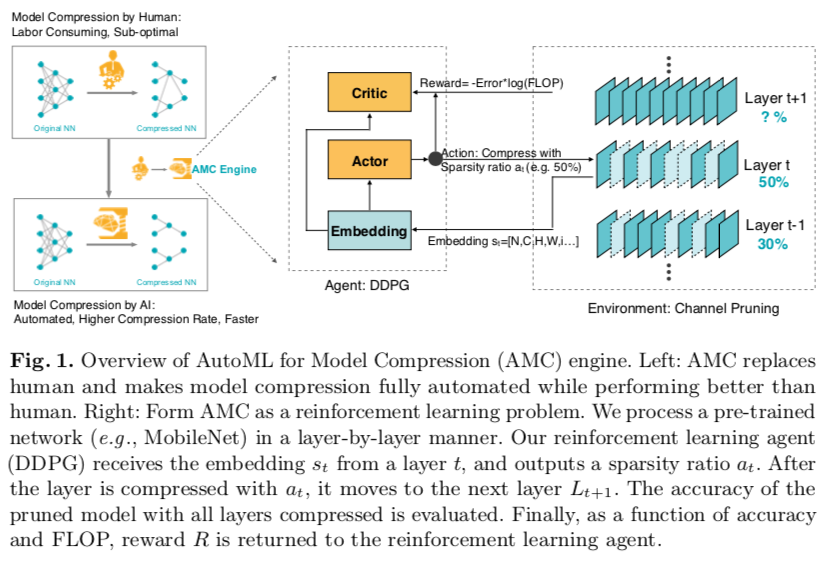</p>

*References*

- http://machinethink.net/blog/compressing-deep-neural-nets/

# Models: Misc

## Wide & Deep Network, 2016

[Wide & Deep Network](https://arxiv.org/abs/1606.07792) is a recommender model from Google that
combines the best aspects of logistic regression and neural nets and found than it outperformed
either approach individually by a small but significant percentage.

The basic idea is that linear models are easy to use, easy to scale and easy to understand. They're
also pretty good at "memorizing" the relationships between individual features when you use some
simple feature engineering to capture the relationship between individual features. This feature
engineering, which is very commonly used, results in a lot of derived features and so the linear
models that uses it is called "wide" learning in this paper.

What the linear models aren't really good at are "generalizing" across different features because
they can't really see those relationships unless you feed in a set of higher order derived features
that capture this, and doing so is labor intensive. This is where neural nets, or so called "deep"
models, come into play. They are better at generalizing and rooting out unexpected feature combinations
that have predictive value. But they're also prone to over-generalization and don't do a good job at
"memorizing" specific feature combinations that are infrequently seen in the training data.

Wide & Deep Network proposes a jointly trained model that combines both wide and deep learning. By
jointly trained we mean that this isn't an ensemble model, where we train a linear model and a
neural net separately and then choose the best prediction among the two. That doesn't help us here
because for ensemble to work, we need both models to be independently accurate. That would mean we
would need to do all the feature engineering we're trying to avoid for the linear model. Rather,
by training the wide and deep models together, they can each do what they’re best at while keeping
the overall model complexity low.

*Reference*

- https://twimlai.com/googles-wide-deep-learning-models/
