<!-- START doctoc generated TOC please keep comment here to allow auto update -->
<!-- DON'T EDIT THIS SECTION, INSTEAD RE-RUN doctoc TO UPDATE -->
**Table of Contents**  *generated with [DocToc](https://github.com/thlorenz/doctoc)*

- [Models: Image Classification](#models-image-classification)
  - [LeNet, 1998](#lenet-1998)
  - [AlexNet, 2012](#alexnet-2012)
  - [ZFNet, 2013](#zfnet-2013)
  - [Network in Network, 2014](#network-in-network-2014)
  - [Inception-v1 (GoogLeNet), 2014](#inception-v1-googlenet-2014)
  - [VGGNet, 2014](#vggnet-2014)
  - [STN, 2015](#stn-2015)
  - [Inception-v2 (BN-Inception), 2015](#inception-v2-bn-inception-2015)
  - [Inception-v3, 2015](#inception-v3-2015)
  - [ResNet, 2015](#resnet-2015)
  - [SqueezeNet, 2016](#squeezenet-2016)
  - [Inception-v4 & Inception-ResNet, 2016](#inception-v4--inception-resnet-2016)
  - [ResNet-v2, 2016](#resnet-v2-2016)
  - [WRN, 2016](#wrn-2016)
  - [PyramidNet, 2016](#pyramidnet-2016)
  - [Xception, 2017](#xception-2017)
  - [ResNeXt, 2017](#resnext-2017)
  - [DenseNet, 2017](#densenet-2017)
  - [MobileNets-v1, 2017](#mobilenets-v1-2017)
  - [ShuffleNet-v1, 2017](#shufflenet-v1-2017)
  - [SENet, 2018](#senet-2018)
- [Models: Object Detection](#models-object-detection)
  - [OverFeat, 2014](#overfeat-2014)
  - [R-CNN, 2014](#r-cnn-2014)
  - [SPPNet, 2014](#sppnet-2014)
  - [MultiBox, 2014-2015](#multibox-2014-2015)
  - [Fast R-CNN, 2015](#fast-r-cnn-2015)
  - [YOLOv1, 2015](#yolov1-2015)
  - [Faster R-CNN, 2015](#faster-r-cnn-2015)
  - [SSD, 2016](#ssd-2016)
  - [YOLOv2, 2016](#yolov2-2016)
  - [R-FCN, 2016](#r-fcn-2016)
  - [FPNs, 2016](#fpns-2016)
  - [RetinaNet, 2018](#retinanet-2018)
- [Models: Object Segmentation](#models-object-segmentation)
  - [FCNs, 2014](#fcns-2014)
  - [U-Net, 2015](#u-net-2015)
  - [DeepLab (TODO)](#deeplab-todo)
  - [Mask R-CNN, 2017](#mask-r-cnn-2017)
- [Models: Scene Text](#models-scene-text)
  - [CRNN, 2015](#crnn-2015)
  - [CTPN, 2016](#ctpn-2016)
  - [EAST (TODO)](#east-todo)
  - [FOTS, 2018](#fots-2018)
  - [PSENet, 2018](#psenet-2018)
- [Models: Face Recognition](#models-face-recognition)
  - [Siamese Network, 2005](#siamese-network-2005)
  - [DeepFace, 2014](#deepface-2014)
  - [FaceNet, 2015](#facenet-2015)

<!-- END doctoc generated TOC please keep comment here to allow auto update -->

# Models: Image Classification

The networks described below are the most popular ones and are presented in the order that they
were published and also had increasingly better accuracy from the earlier ones.

*References*

- https://www.jeremyjordan.me/convnet-architectures/
- https://towardsdatascience.com/an-intuitive-guide-to-deep-network-architectures-65fdc477db41

## LeNet, 1998

LeNet was one of the very first convolutional neural networks which helped propel the field of Deep
Learning. It uses convolution, pooling, etc, which forms the basic structure of current convolution
neural networks.

Quick notes:
- LeNet uses average pooling, which is not commonly used now (use max pooling instead)
- LeNet doesn't use padding (or always use 'Valid' padding), while current network uses 'Same' padding
- LeNet uses tanh/sigmoid activation instead of relu

*References*

- [paper-brief-review-of-lenet-1-lenet-4-lenet-5-boosted-lenet-4-image-classification](https://medium.com/@sh.tsang/paper-brief-review-of-lenet-1-lenet-4-lenet-5-boosted-lenet-4-image-classification-1f5f809dbf17)

## AlexNet, 2012

[AlexNet](https://papers.nips.cc/paper/4824-imagenet-classification-with-deep-convolutional-neural-networks.pdf),
proposed by Alex Krizhevsky, was one of the first deep networks to push ImageNet Classification
accuracy by a significant stride in comparison to traditional methodologies. AlexNet is considered
one of the most influential papers published in computer vision, having spurred many more papers
published employing CNNs and GPUs to accelerate deep learning.

Overall architecture of AlexNet:

<p align="center">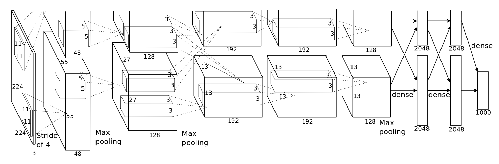</p>

> Now we are ready to describe the overall architecture of our CNN. As depicted in Figure 2, the
> net contains eight layers with weights; the first five are convolutional and the remaining three
> are fully- connected. The output of the last fully-connected layer is fed to a 1000-way softmax
> which produces a distribution over the 1000 class labels. Our network maximizes the multinomial
> logistic regression objective, which is equivalent to maximizing the average across training
> cases of the log-probability of the correct label under the prediction distribution.
>
> The kernels of the second, fourth, and fifth convolutional layers are connected only to those
> kernel maps in the previous layer which reside on the same GPU (see Figure 2). The kernels of the
> third convolutional layer are connected to all kernel maps in the second layer. The neurons in
> the fully- connected layers are connected to all neurons in the previous layer. Response-normalization
> layers follow the first and second convolutional layers. Max-pooling layers, of the kind described
> in Section 3.4, follow both response-normalization layers as well as the fifth convolutional layer.
> The ReLU non-linearity is applied to the output of every convolutional and fully-connected layer.
>
> The first convolutional layer filters the 224 × 224 × 3 input image with 96 kernels of size
> 11 × 11 × 3 with a stride of 4 pixels (this is the distance between the receptive field centers
> of neighboring neurons in a kernel map). The second convolutional layer takes as input the
> (response-normalized and pooled) output of the first convolutional layer and filters it with 256
> kernels of size 5 × 5 × 48. The third, fourth, and fifth convolutional layers are connected to one
> another without any intervening pooling or normalization layers. The third convolutional layer has
> 384 kernels of size 3 × 3 × 256 connected to the (normalized, pooled) outputs of the second
> convolutional layer. The fourth convolutional layer has 384 kernels of size 3 × 3 × 192 , and the
> fifth convolutional layer has 256 kernels of size 3 × 3 × 192. The fully-connected layers have
> 4096 neurons each.

Quick notes:
- AlexNet uses ReLU (Rectified Linear Unit) for the non-linear part, instead of a Tanh or Sigmoid
  function which was the earlier standard for traditional neural networks.
- AlexNet reduces over-fitting problem by using a Dropout layer after every FC layer.
- AlexNet uses local response normalization to normalize data (superceded by batch normalization).
- AlexNet uses data augmentation to improve number of training set.
- AlexNet is much deeper than previous network
- AlexNet stacks multiple convolution layers directly

A smaller version of alexnet is called caffenet.

*References*

- [paper-review-of-alexnet-caffenet-winner-in-ilsvrc-2012-image-classification](https://medium.com/coinmonks/paper-review-of-alexnet-caffenet-winner-in-ilsvrc-2012-image-classification-b93598314160)

## ZFNet, 2013

[ZFNet](https://arxiv.org/abs/1311.2901) becomes the winner of ILSVLC 2013 in image classification
by fine-tuning the AlexNet invented in 2012. The main contribution of ZFNet is to visualize deep
neural networks with deconv, unpooling, etc, to understand why they perform so well, or how they
might be improved.

The authors define three operations for visualizing a convnet, i.e.
- Unpooling
- Rectification
- Filtering

<p align="center">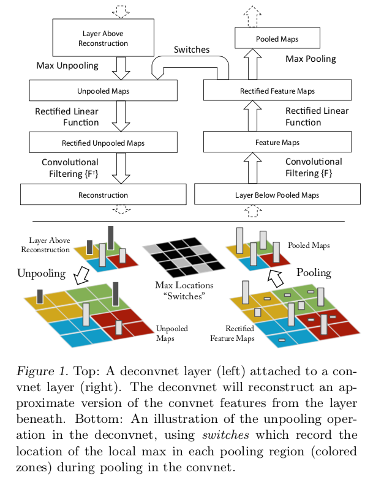</p>

After visualizing AlexNet, two problems are identified:
- Filters at layer 1 are a mix of extremely high and low frequency information, with little coverage
  of the mid frequencies. Without the mid frequencies, there is a chain effect that deep features
  can only learn from extremely high and low frequency information.
- Layer 2 shows aliasing artifacts caused by the large stride 4 used in the 1st layer convolutions.
  Aliasing is an effect that causes different signals to become indistinguishable (or aliases of one
  another) when sampled. It also refers to the distortion or artifact that results when the signal
  reconstructed from samples is different from the original continuous signal.
  Aliasing artifacts usually occurs when under-sampling or poor reconstruction.

To fix the problems, ZFNet made two changes to AlexNet:
- Reduced the 1st layer filter size from 11x11 to 7x7.
- Made the 1st layer stride of the convolution 2, rather than 4.

Conclusion from the paper:

> We explored large convolutional neural network models, trained for image classification, in a number
> ways. First, we presented a novel way to visualize the activity within the model. This reveals the
> features to be far from random, uninterpretable patterns. Rather, they show many intuitively desirable
> properties such as compositionality, increasing invariance and class discrimination as we ascend the
> layers. We also showed how these visualization can be used to debug problems with the model to obtain
> better results, for example improving on Krizhevsky et al. 's (Krizhevsky et al., 2012) impressive
> ImageNet 2012 result. We then demonstrated through a series of occlusion experiments that the model,
> while trained for classification, is highly sensitive to local structure in the image and is not
> just using broad scene context. An ablation study on the model revealed that having a minimum depth
> to the network, rather than any individual section, is vital to the model's performance.

> Finally, we showed how the ImageNet trained model can generalize well to other datasets. For Caltech-101
> and Caltech-256, the datasets are similar enough that we can beat the best reported results, in the
> latter case by a significant margin. This result brings into question to utility of benchmarks with
> small (i.e. < 104) training sets. Our convnet model generalized less well to the PASCAL data, perhaps
> suffering from dataset bias (Torralba & Efros, 2011), although it was still within 3.2% of the best
> reported result, despite no tuning for the task. For example, our performance might improve if a
> different loss function was used that permitted multiple objects per image. This would naturally
> enable the networks to tackle the object detection as well.

*References*

- [paper-review-of-zfnet-the-winner-of-ilsvlc-2013-image-classification](https://medium.com/coinmonks/paper-review-of-zfnet-the-winner-of-ilsvlc-2013-image-classification-d1a5a0c45103)

## Network in Network, 2014

[Network in Network](https://arxiv.org/abs/1312.4400) is a novel deep network structure to enhance
model discriminability. There are two main ideas in this paper, i.e. MLP Convolution Layers and
Global Average Pooling. The overall architecture is:

<p align="center">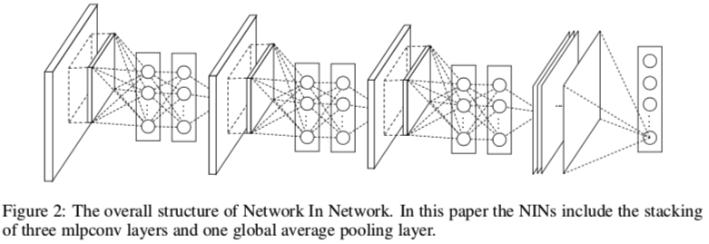</p>

**MLP Convolution Layers**

The convolution filter in CNN is a generalized linear model (GLM) for underlying data patch. Thus
conventional CNN implicitly makes the assumption that the latent concepts are linearly separable.

This paper introduced the concept of having a neural network itself in place of a convolution filter.
The input to this mini-network would be the convolution, and the output would be the value of a
neuron in the activation. To be specific, the mlpconv maps the input local patch to the output
feature vector with a multilayer perceptron (MLP) consisting of multiple fully connected layers
with nonlinear activation functions. The MLP is shared among all local receptive fields. The feature
maps are obtained by sliding the MLP over the input in a similar manner as CNN and are then fed into
the next layer.

The benefits of mlpconv are:
- It is compatible with the backpropagation logic of neural nets, thus this fits well into existing architectures of CNN's
- It can itself be a deep model leading to rich separation between latent features

<p align="center">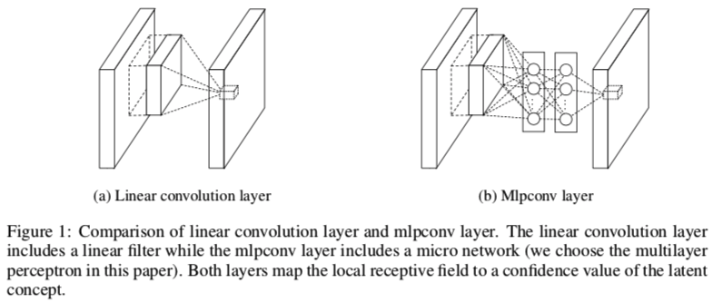</p>

**Global Average Pooling**

Conventional convolutional neural networks perform convolution in the lower layers of the network.
For classification, the feature maps of the last convolutional layer are vectorized and fed into
fully connected layers followed by a softmax logistic regression layer. However, the fully connected
layers are prone to overfitting, thus hampering the generalization ability of the overall network.

The paper proposes another strategy called Global Average Pooling to replace the traditional fully
connected layers in CNN. The idea is to generate **one feature map for each corresponding category**
of the classification task in the last mlpconv layer.

<p align="center"></p>

The advantages of this approach are:
- The mapping between the extracted features and the class scores is more intuitive and direct.
  The feature can be treated as category confidence.
- An implicit advantage is that there are no new parameters to train (unlike the FC layers), leading
  to less overfitting.
- Global average pooling sums out the spatial information, thus it is more robust to spatial
  translations of the input.

*References*

- http://teleported.in/posts/network-in-network/

## Inception-v1 (GoogLeNet), 2014

[GoogLeNet](https://arxiv.org/abs/1409.4842) is the Inception-v1 network, which was an important
milestone in the development of CNN classifiers. Prior to its inception, most popular CNNs just
stacked convolution layers deeper and deeper, hoping to get better performance. However, as noted
in the paper, there are two main issues with this approach:
- Bigger size typically means a larger number of parameters, which makes the enlarged network more
  prone to overfitting, especially if the number of labeled examples in the training set is limited.
- Another drawback of uniformly increased network size is the dramatically increased use of
  computational resources.

The fundamental way of solving both issues would be by ultimately moving from fully connected to
sparsely connected architectures, even inside the convolutions. However, today's computing
infrastructures are very inefficient when it comes to numerical calculation on non-uniform sparse
data structures. This raises the question whether there is any hope for a next, intermediate step:
an architecture that makes use of the extra sparsity, even at filter level, as suggested by the
theory, but exploits our current hardware by utilizing computations on dense matrices.

The Inception architecture started out as a case study of the first author for assessing the
hypothetical output of a sophisticated network topology construction algorithm that tries to
approximate a sparse structure for vision networks and covering the hypothesized outcome by dense,
readily available components.

**Inception Module**

The core of inception module is to use multiple convolution kernel sizes operate on the same level,
i.e. uses convolutions of different sizes to capture details at varied scales (5x5, 3x3, 1x1). With
this design, the network is much "wider" rather than "deeper". The inception network is a stacking
of multiple inception modules.

<p align="center">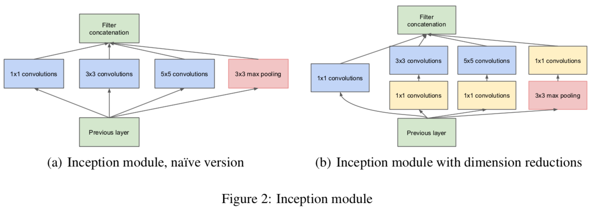</p>

Apart from different kernel size, there are two notable improvement:
- use a 1x1 convolution layer before all convolution layers to reduce the computational complexity
- use auxiliary classifiers to avoid gradient vanishing

Another way to think of inception module: instead of chosing the right filter size for each layer,
we can use multiple filter sizes and have the network learn the best combinations.

**Object Detection**

For the original object detection challenge (ImageNet 2014 context), GoogLeNet uses an approach
similar to the R-CNN, but is augmented with the Inception model as the region classifier. Additionally,
the region proposal step is improved by combining the Selective Search approach with multi-box
predictions for higher object bounding box recall.

Qucik notes:
- GoogLeNet uses 1x1 filter to reduce dimension
- GoogLeNet uses inception module which contains multiple kernel sizes
- GoogLeNet uses global average pooling to greatly reduce computation cost (7x7xN feature map -> 1x1xN)
- GoogLeNet uses auxiliary classifiers to fight the vanishing gradient problem

*References*

- https://towardsdatascience.com/a-simple-guide-to-the-versions-of-the-inception-network-7fc52b863202
- [paper-review-of-googlenet-inception-v1-winner-of-ilsvlc-2014-image-classification](https://medium.com/coinmonks/paper-review-of-googlenet-inception-v1-winner-of-ilsvlc-2014-image-classification-c2b3565a64e7)

## VGGNet, 2014

[VGGNet](https://arxiv.org/pdf/1409.1556.pdf) is deep convolutional network for image recognition
developed and trained by Oxford's renowned Visual Geometry Group (VGG), which achieved very good
performance on the ImageNet dataset: ranked first in localization and second in classification
tasks of ImageNet Challenge 2014 (the first in classification track is GoogLeNet).

VGGNet makes the improvement over AlexNet (and ZFNet) by replacing large kernel-sized filters (11
and 5 in the first and second convolutional layer, respectively) with multiple 3X3 kernel-sized
filters one after another. It proves that multiple stacked smaller size kernel is better than the
one with a larger size kernel because multiple non-linear layers increases the depth of the network
which enables it to learn more complex features, and that too at a lower cost.

There are two advantages of using a stack of three 3 × 3 conv. layers instead of a single 7 × 7
layer (from the paper):
- First, we incorporate three non-linear rectification layers instead of a single one, which makes
  the decision function more discriminative (each 3 x 3 conv. layer will apply a relu function).
- Second, we decrease the number of parameters: assuming that both the input and the output of a
  three-layer 3 × 3 convolution stack has C channels, the stack is parametrised by 3 * (3^2 * C^2)
  = 27 * (C^2) weights; at the same time, a single 7 × 7 conv. layer would require 7^2 * (C^2) =
  49 * (C^2) parameters, i.e. 81% more. This can be seen as imposing a regularisation on the 7 × 7
  conv. filters, forcing them to have a decomposition through the 3 × 3 filters (with non-linearity
  injected in between).

<p align="center"></p>

Therefore, the core of VGGNet is to give an answer to "how to design network structure":

> Our main contribution is a thorough evaluation of networks of increasing depth using an
> architecture with very small (3×3) convolution filters, which shows that a significant improvement
> on the prior-art configurations can be achieved by pushing the depth to 16-19 weight layers.

VGG16 has 16 convolution layers, while VGG19 has 19 such layers. In practice, VGG16 provides
sufficient accuracy.

VGGNet adopts the approach from OverFeat for ILSVRC localisation task, with a few modifications.
To be specific, to perform object localisation, it uses a very deep ConvNet, where the last fully
connected layer predicts the bounding box location instead of the class scores. VGGNet is considerably
better than OverFeat in terms of accuracy.

Quick notes:
- VGGNet uses 3x3 filters in place of 7x7, 5x5 ones, etc
- VGGNet provides a network design approach, i.e. how to design network structure
- VGGnet uses multi-scale training/testing, i.e. scaling images for training and testing

*References*

- https://www.quora.com/What-is-the-VGG-neural-network
- [paper-review-of-vggnet-1st-runner-up-of-ilsvlc-2014-image-classification](https://medium.com/coinmonks/paper-review-of-vggnet-1st-runner-up-of-ilsvlc-2014-image-classification-d02355543a11)

## STN, 2015

[STN](https://arxiv.org/abs/1506.02025) stands for Spatial Transformer Network.

ConvNets are not invariant to relatively large input distortions. This limitation is due to having
only a restricted, pre-defined pooling mechanism for dealing with spatial variation of the data. STN
aims at dealing with the problem, it shows that the use of spatial transformers results in models
which learn invariance to translation, scale, rotation and more generic warping, resulting in
state-of-the-art performance on several benchmarks, and for a number of classes of transformations.

STN is modular, meaning that it can be inserted anywhere into existing architectures with relatively
small tweaking and computation cost. Unlike pooling, STN is dynamic and learnable, and can be trained
with backprop allowing for end-to-end training of the models they are injected in.

At its core, STN is the following block:

<p align="center">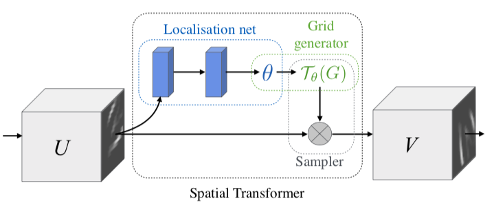</p>

**Localization Network**

The localization network is a standard regression neural network:
- input: feature map U of shape (H, W, C)
- output: transformation matrix `θ` of shape (6,). See references for more information on transformation matrix.
- architecture: fully-connected network or ConvNet as well.

**Grid Generator**

The grid generator's job is to output a parametrised sampling grid on **input feature map U**, which
is a set of points where the input map should be sampled to produce the desired transformed output.

Note here the grid generator takes input grids from **output feature map V**, applies previous
transformation matrix `θ`, then outputs grids on the **input feature map U**. The grids on `V` is
predifined, and we only want to find the transformed grids on `U` at this stage (not pixel values),
thus there is no problem for such transformation.

<p align="center">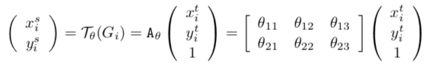</p>

Following is an example:

<p align="center">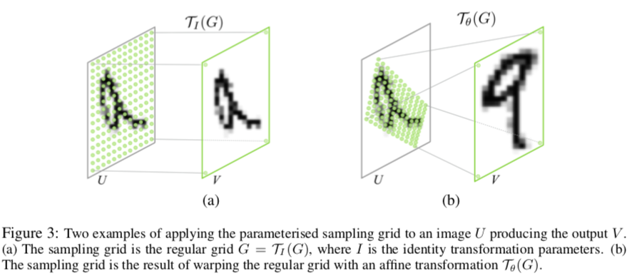</p>

**Sampler**

Also called "Differentiable Image Sampling" in the paper. The sampler's job is to find the values
for each grid on the **input feature map U**. For example, suppose the grids of `V` is 64 x 64 (1:1
mapping of feature map). Now after transformation, the grid point (2, 2) in `V` is transformed to
(1.2, 2.6) in `U`. Then using bilinear interpolation sampler, we can get the value of grid point
(2, 2) in `V`, using P=(1.2, 2.6) and surrounding points (1,2), (1,3), (2,2), (2,3) on `U`.

*References*

- https://kevinzakka.github.io/2017/01/10/stn-part1/
- https://kevinzakka.github.io/2017/01/18/stn-part2/
- https://www.cnblogs.com/liaohuiqiang/p/9226335.html

## Inception-v2 (BN-Inception), 2015

The inception-v2 network is presented in [Batch Normalization](https://arxiv.org/abs/1502.03167):
the paper introduces BN as a technique to accelerating deep network training, and uses modified
inception network for experimentation (denoted as inception-v2).

The authors evaluated several modifications of Inception with BN, e.g.
- BN-Baseline: Same as Inception with BN before each nonlinearity.
- BN-x5: Inception with BN and minor modifications. The initial learning rate was increased by a factor of 5.
- BN-x30: Like BN-x5, but with the initial learning rate 0.045 (30 times that of Inception).

Simply adding BN to a network does not take full advantage of the methods. To do so, the authors
further changed the network and its training parameters:
- increase learning rate
- remove dropout
- reduce the L2 weight regularization
- accelerate the learning rate decay
- remove local response normalization
- shuffle training examples more thoroughly

## Inception-v3, 2015

[Inception-v3](https://arxiv.org/abs/1512.00567) is presented with the goal to increase accuracy and
reduce computational complexity. They are incremental improvement over the original GoogLeNet
(inception-v1) and BN-Inception.

Notes about various inception network versions (from inception-v4 paper):

> The Inception deep convolutional architecture was introduced as GoogLeNet in (Szegedy et al. 2015a),
> here named **Inception-v1**. Later the Inception architecture was refined in various ways, first
> by the introduction of batch normalization (Ioffe and Szegedy 2015) (**Inception-v2**). Later by
> additional factorization ideas in the third iteration (Szegedy et al. 2015b) which will be referred
> to as **Inception-v3** in this report.

**Overall Architecture**

<p align="center">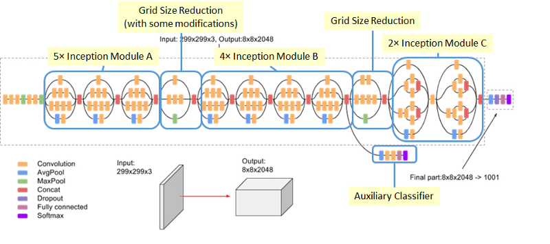</p>
<p align="center"><a href="https://medium.com/@sh.tsang/review-inception-v3-1st-runner-up-image-classification-in-ilsvrc-2015-17915421f77c" style="font-size: 12px">Image Source</a></p>

**Factorizing Convolutions**

Inception-v3 discusses factorizing convolutions extensively, to summarize:
- factorization into smaller convolutions (5x5 -> two 3x3)
- factorization into asymmetric convolutions (7x7 -> 1x7 and 7x1)

Here is visualizations of the two approaches:

<p align="center">
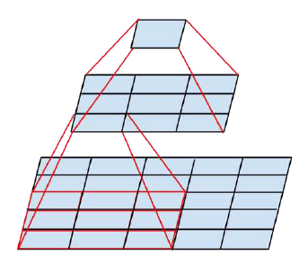
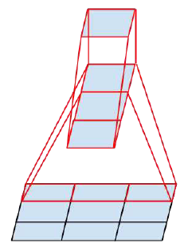
</p>

Based on the observations, the authors propose the following new inception modules:

<p align="center">

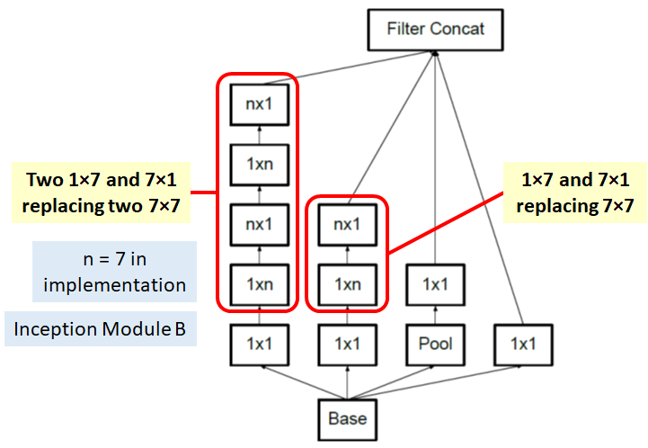

</p>

Note the last type of inception module can be seen as a combination of the two factorizations. It is
not formally discussed in the paper, but is otherwise used in inception network for promoting high
dimensional representations.

**Auxiliary Classifier**

Auxiliary Classifier was introduced in GoogLeNet, but here, the authors found that it did not result
in improved convergence early in the training and the removal of the lower auxiliary branch did not
have any adverse effect on the final quality of the network.

The authors conclude that the hypothesis that auxiliary classifier can help evolving the low-level
features is wrong. Therefore, in inception-v3, only 1 auxiliary classifier is used on the top of the
last 17×17 layer, instead of using 2 auxiliary classifiers, and the purpose of having auxiliary
classifier is not for having deeper network, but to be used as regularizer.

Batch normalization is also used in the auxiliary classifier.

**Efficient Grid Size Reduction**

In this section, the authors proposes yet another inception module to reduce grid size. (The goal
of the above inception modules is not to reduce spatial dimensions).

In conventional CNN networks, the feature map downsizing is done by max pooling. But the drawback is
either *too greedy by max pooling followed by conv layer, or too expensive by conv layer followed by
max pooling*.
- if max pooling is performed before convolution, then we introduce representation bottleneck
- if convolution is performed before max pooling, then we incurr more computational cost

The authors propose the following solution:

<p align="center">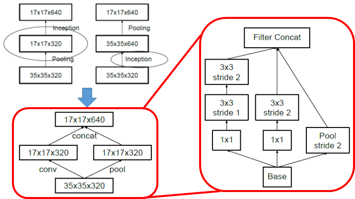</p>
<p align="center"><a style="font-size: 12px">Conventional downsizing (Top Left), Efficient Grid Size Reduction (Bottom Left), Detailed Architecture of Efficient Grid Size Reduction (Right)</a></p>

**Label Smoothing As Regularization**

The purpose of label smoothing is to prevent the largest logit from becoming much larger than all
others:

```
new_labels = (1 — ε) * one_hot_labels + ε / K
```

*References*

- [review-inception-v3-1st-runner-up-image-classification-in-ilsvrc-2015](https://medium.com/@sh.tsang/review-inception-v3-1st-runner-up-image-classification-in-ilsvrc-2015-17915421f77c)

## ResNet, 2015

[ResNet](https://arxiv.org/pdf/1512.03385.pdf) stands for Deep Residual Network. It is a ground
breaking work, with 3.57% top-5 error on ILSVRC'15.

**Motivation**

When deeper networks starts converging, a degradation problem has been exposed: with the network
depth increasing, accuracy gets saturated and then degrades rapidly. Unexpectedly, training accuracy
decreses as well (thus not an overfitting problem). Another different problem is the "vanishing
gradient", in which the gradient fluctuations become too small to be immediately useful.

<p align="center">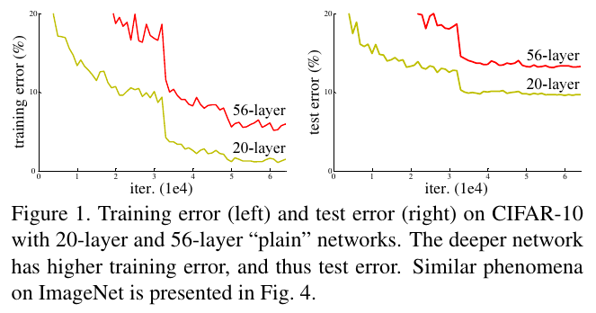</p>

Intuitively, deeper nets should perform no worse than their shallower counterparts, at least at
train time. As a thought process, if we have a neural network with `n` layers, then a network with
`n+1` layer should not perform less because we can just copy input `x` directly from one layer to
next layer, i.e. totally skip the additional layer.

Based on the observation above, the authors of ResNet boiled these problems down to a single
hypothesis: direct mappings are hard to learn. They proposed a fix: instead of learning a direct
mapping of `x -> y` with a function `H(x)` (A few stacked non-linear layers), let us define the
residual function using `F(x) = H(x) - x`, which can be reframed into `H(x) = F(x) + x`, where
`F(x)` and `x` represents the stacked non-linear layers and the identity function (input=output)
respectively.

<p align="center">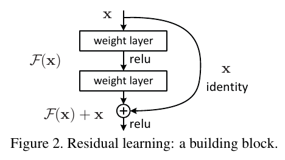</p>

If we go back to our thought experiment, this simplifies our construction of identity layers greatly.
Intuitively, it's much easier to learn to push `F(x)` to 0 and leave the output as `x` than to learn
an identity transformation from scratch. In general, ResNet gives layers a "reference" point `x` to
start learning from.

**Architecture**

The core of ResNet is the Residual Block. ResNet-34 residual block has two layers (Basic block),
while ResNet-50/101/152 has three layers (Bottleneck block).

<p align="center">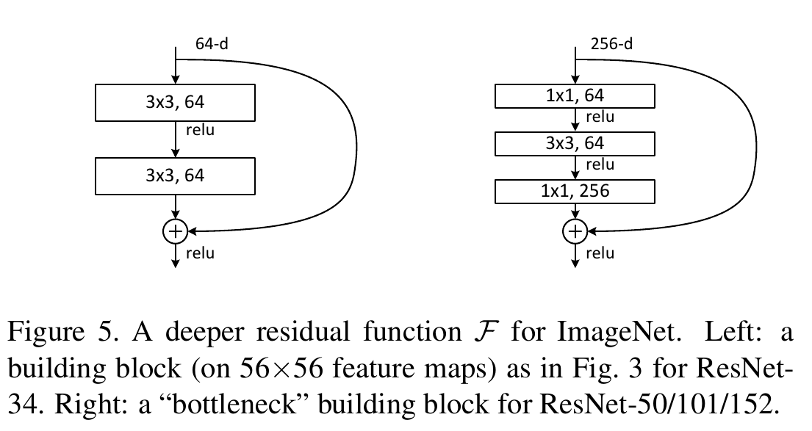</p>

Following is the ResNet-34 architecture. Batch Normalization is added right after each convolution
and before activation. Reference implementation can be found in [pytorch](https://github.com/pytorch/vision/blob/v0.2.1/torchvision/models/resnet.py)
and [keras](https://github.com/keras-team/keras/blob/2.2.2/examples/cifar10_resnet.py).

<p align="center"></p>
<p align="center"><a href="https://github.com/ageron/handson-ml" style="font-size: 12px">ResNet-34 Architecture (image source: handson-ml)</a></p>

Note that the number of feature maps is doubled every few residual units, at the same time as their
height and width are halved (using a convolutional layer with stride 2). When this happens the inputs
cannot be added directly to the outputs of the residual unit since they don't have the same shape
(for example, this problem affects the skip connection represented by the dashed arrow). To solve
this problem, the inputs are passed through a 1×1 convolutional layer with stride 2 and the right
number of output feature maps.

<p align="center"></p>
<p align="center"><a href="https://github.com/ageron/handson-ml" style="font-size: 12px">Image Source: handson-ml</a></p>

ResNet is usally named under its number of layers, e.g. ResNet-50, ResNet-101.

*References*

- https://github.com/KaimingHe/deep-residual-networks
- https://zhuanlan.zhihu.com/p/28413039

## SqueezeNet, 2016

[SqueezeNet](https://arxiv.org/abs/1602.07360) is a small DNN architecture which achieves
AlexNet-level accuracy on ImageNet with 50x fewer parameters. Additionally, with model compression
techniques, SqueezeNet is less than 0.5MB (510x smaller than AlexNet).

In summary, there are three strategies to reduce parameter size while maximizing accuracy:
- Make the network smaller by replacing 3x3 filters with 1x1 filters, which has 9 x fewer parameters.
- Reduce the number of inputs for the remaining 3x3 filters (using a bottleneck layer called `fire
  module`). This is useful because for a convolution layer, the number of parameters is `(number of
  input channels) * (number of filters) * (3*3)`. So, to maintain a small total number of parameters
  in a CNN, it is important not only to decrease the number of 3x3 filters (see above), but also to
  decrease the number of input channels to the 3x3 filters.
- Downsample late in the network so that convolution layers have large activation maps. This is to
  maximize accuracy on a limited budget of parameters.

Following is the fire module in strategy 2. The term `microarchitecture` means different modules,
e.g. inception module, resnet module, firemodule.

<p align="center">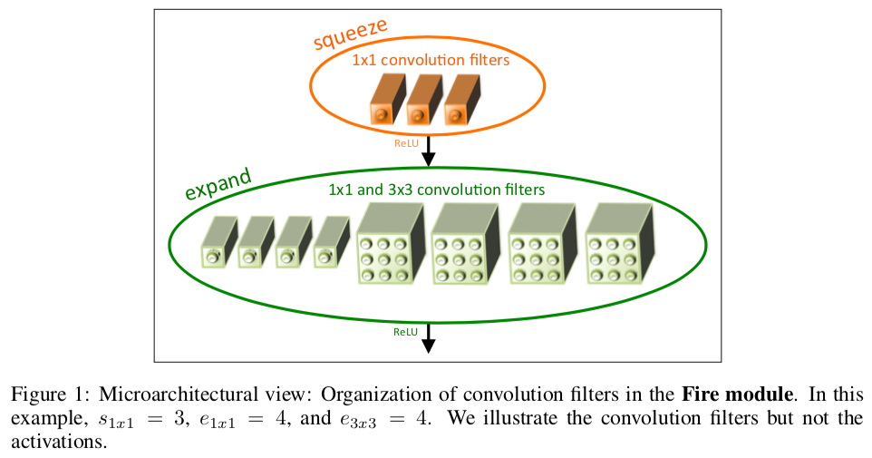</p>

Following is the architecture of SqueezeNet (bypass connection is inspired by ResNet). The term
`macroarchitecture` means end-to-end CNN architecture.

<p align="center">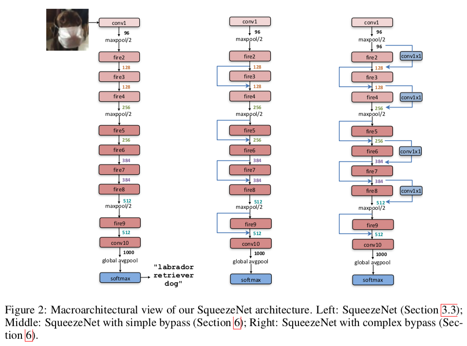</p>

In addition, the authors use `Deep Compression` to compress SqueezeNet by 10× while preserving the
baseline accuracy. In summary: by combining CNN architectural innovation (SqueezeNet) with
state-of-the-art compression techniques (Deep Compression), we achieved a 510× reduction in model
size with no decrease in accuracy compared to the baseline.

*References*

- https://www.kdnuggets.com/2016/09/deep-learning-reading-group-squeezenet.html

## Inception-v4 & Inception-ResNet, 2016

[Inception-v4 and Inception-ResNet](https://arxiv.org/abs/1602.07261) are presented in the same
paper. To be specific, there are three network architectures presented in the paper:
- Inception-v4
- Inception-ResNet-v1
- Inception-ResNet-v2

**Networks**

*Inception-v4* is a pure Inception variant without residual connections. It has a more uniform
simplified architecture and more inception modules than Inception-v3. Historically, Inception-v3
had inherited a lot of the baggage of the earlier incarnations. The technical constraints chiefly
came from the need for partitioning the model for distributed training using DistBelief. Now, after
migrating our training setup to TensorFlow these constraints have been lifted, which allowed us to
simplify the architecture significantly.

<p align="center"></p>
<p align="center"><a style="font-size: 12px">Inception-v4: Whole Network Schema (Leftmost), Stem (2nd Left), Inception-A (Middle), Inception-B (2nd Right), Inception-C (Rightmost)</a></p>

<p align="center">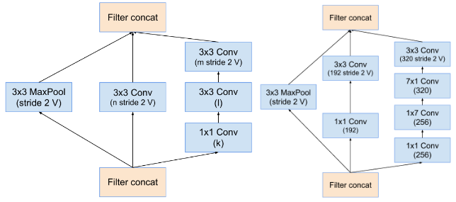</p>
<p align="center"><a style="font-size: 12px">Inception-v4: Reduction-A (Left), Reduction-B (Right)</a></p>

*Inception-ResNet-v1* is a hybrid Inception version with residual connections that has a similar
computational cost to Inception-v3. It trains much faster, but reached slightly worse final accuracy
than Inception-v3.

<p align="center"></p>
<p align="center"><a style="font-size: 12px">Inception-ResNet-v1: Whole Network Schema (Leftmost), Stem (2nd Left), Inception-A (Middle), Inception-B (2nd Right), Inception-C (Rightmost)</a></p>

*Inception-ResNet-v2* is a costlier hybrid Inception version with residual connections. It has
roughly the computational cost of Inception-v4. Inception-ResNet-v2 trains much faster and reached
slightly better final accuracy than Inception-v4.

<p align="center">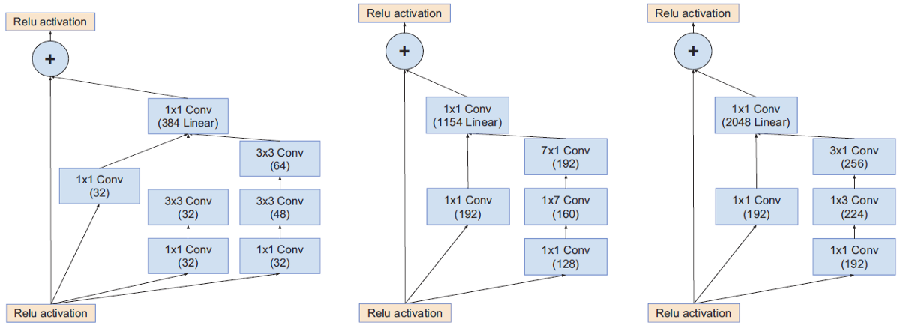</p>
<p align="center"><a style="font-size: 12px">Inception-ResNet-v2: Inception-A (Leftmost), Inception-B (Middle), Inception-C (Rightmost)</a></p>

The authors compared Inception-v3/Inception-v4/Inception-ResNet-v1/Inception-ResNet-v2 with
Single-Crop vs Multi-Crop, as well as Single-Model vs Multi-Model. For more information on model
architecture and result comparison, see reference.

**Niches**

Note1:

> For the residual versions of the Inception networks, we use cheaper Inception blocks than the
> original Inception. Each Inception block is followed by filter-expansion layer (1 × 1 convolution
> without activation) which is used for scaling up the dimensionality of the filter bank before the
> addition to match the depth of the input. This is needed to compensate for the dimensionality
> reduction induced by the Inception block.
>
> Another small technical difference between our residual and non-residual Inception variants is
> that in the case of Inception-ResNet, we used batch-normalization only on top of the traditional
> layers, but not on top of the summations. This is mainly due to resource constraint on a single GPU.

<p align="center">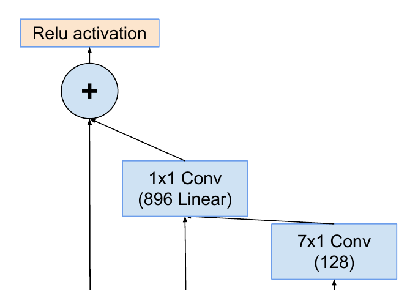</p>

Note2:

> We found that if the number of filters exceeded 1000, the residual variants started to exhibit
> instabilities and the network has just "died" early in the training, meaning that the last layer
> before the average pooling started to produce only zeros after a few tens of thousands of iterations.
>
> We found that scaling down the residuals before adding them to the previous layer activation seemed
> to stabilize the training. In general we picked some scaling factors between 0.1 and 0.3 to scale
> the residuals before their being added to the accumulated layer activations.

<p align="center">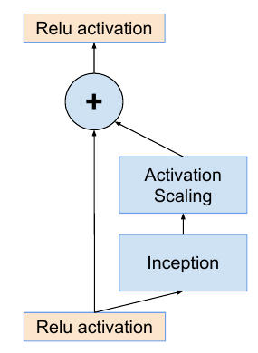</p>

*References*

- [review-inception-v4-evolved-from-googlenet-merged-with-resnet-idea-image-classification](https://towardsdatascience.com/review-inception-v4-evolved-from-googlenet-merged-with-resnet-idea-image-classification-5e8c339d18bc)

## ResNet-v2, 2016

[ResNet-v2](https://arxiv.org/abs/1603.05027), also called `Pre-activation ResNet`, proposes a new
residual unit, which is easier to train and has lower test error. The motivation behind the idea is:

> In this paper, we analyze the propagation formulations behind the residual building blocks, which
> suggest that the forward and backward signals can be directly propagated from one block to any
> other block, when using identity mappings as the skip connections and after-addition activation.
> A series of ablation experiments support the importance of these identity mappings.

In short, the authors argue that making the information propagation path "clear" is very important
for deep network. Following is the new residual unit, the main difference is:
- Remove after-addition "ReLU" from the identity path (grey arrow)
- Add pre-activation "BN" and "ReLU" from the residual path

Because we move the ReLU layer from shortcut connection path to conv layer path, the new network is
therefore also called `ResNet with Identity Mapping`.

<p align="center">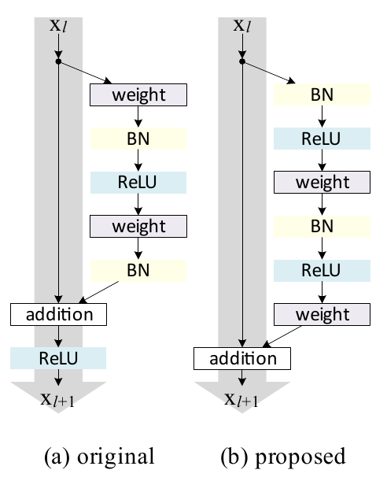</p>

The new residual block is proposed based on various experiments, specifically, the authors experimented
with various types of shortcut connections and activation functions.

<p align="center">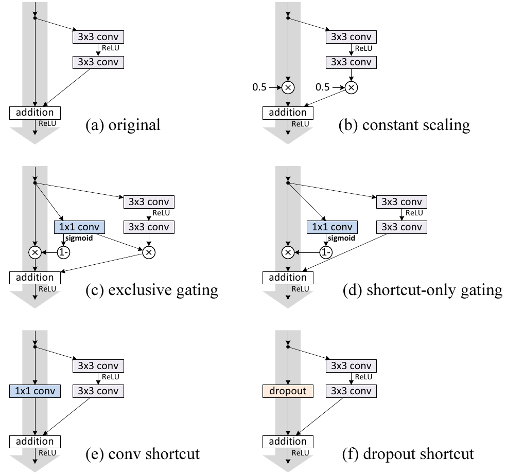</p>
<p align="center"><a style="font-size: 12px">Various usages of shortcut connections</a></p>

<p align="center">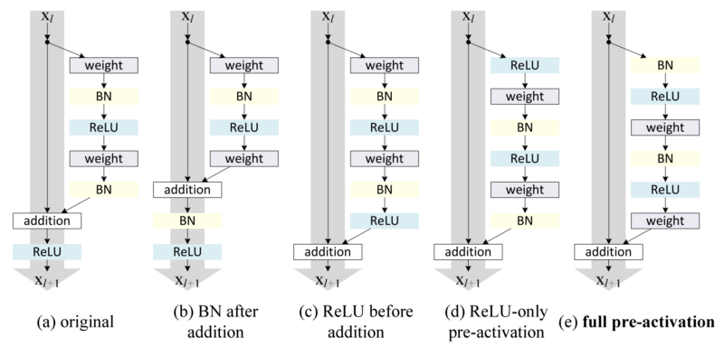</p>
<p align="center"><a style="font-size: 12px">Various usages of activations</a></p>

*References*

- [resnet-with-identity-mapping-over-1000-layers](https://towardsdatascience.com/resnet-with-identity-mapping-over-1000-layers-reached-image-classification-bb50a42af03e)
- https://towardsdatascience.com/an-overview-of-resnet-and-its-variants-5281e2f56035

## WRN, 2016

[WRN](https://arxiv.org/abs/1605.07146) stands for Wide Residual Networks.

Before WRN, the study of residual networks has focused mainly on the order of activations inside a
ResNet block and the depth of residual networks. However, the authors show that the widening of
ResNet blocks (if done properly) provides a much more effective way of improving performance of
residual networks compared to increasing their depth. Additionally, as widening of residual blocks
results in an increase of the number of parameters, the authors studied the effect of dropout to
regularize training and prevent overfitting. Lastly, in terms of computational efficiency, thin and
deep residual networks with small kernels are against the nature of GPU computations because of
their sequential structure. Increasing width helps effectively balance computations in much more
optimal way, so that wide networks are many times more efficient than thin ones.

> In summary, the contributions of this work are as follows:
> - We present a detailed experimental study of residual network architectures that thoroughly examines several important aspects of ResNet block structure.
> - We propose a novel widened architecture for ResNet blocks that allows for residual networks with significantly improved performance.
> - We propose a new way of utilizing dropout within deep residual networks so as to properly regularize them and prevent overfitting during training.
> - Last, we show that our proposed ResNet architectures achieve state-of-the-art results on several datasets dramatically improving accuracy and speed of residual networks.

In the experiments, the authors compare residual blocks given various conditions:
- type of convolution in residual block, e.g. B(3,3), B(1,3,1)
- number of convolution layers in residual block
- width of residual block
- dropout in residual block

Note here, `width` means the number of output feature maps from the convolution layers in residual
block.

*References*

- https://zhuanlan.zhihu.com/p/47235521

## PyramidNet, 2016

The key contribution of [PyramidNet](https://arxiv.org/abs/1610.02915) is:
- The feature map dimensions are increased at all layers to distribute the burden concentrated at
  locations of residual units affected by downsampling, such that it is equally distributed across
  all units. (Unlike most network, where feature map size is reduced by xN while depth are increased
  by xN).
- A new residual unit is proposed, which can further improve the performance of ResNet-based
  architectures. The main idea of the new residual unit is new positions of ReLU and BN.

Following is the architecture proposed in PyramidNet:
- (a) Original Basic ResNet Block
- (b) Original Bottleneck ResNet Block
- (c) Wide Residual Network Block
- (d) Proposed Basic Pyramidal Block
- (d) Proposed Bottleneck Pyramidal Block

<p align="center">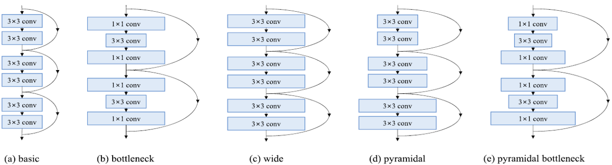</p>

Following is the new residual unit proposed in PyramidNet:
- (a) Original Pre-Activation ResNets
- (b) Pre-Activation ResNets Removing the First ReLU
- (c) Pre-Activation ResNets with a BN Layer After the Final Convolutional Layer
- (d) Pre-Activation ResNets Removing the first ReLU with a BN Layer After the Final Convolutional Layer

<p align="center">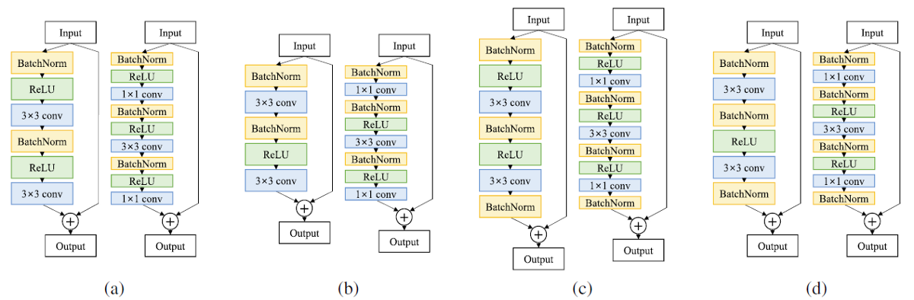</p>

## Xception, 2017

[Xception](https://arxiv.org/abs/1610.02357) improves upon the Inception family of architectures by
replacing Inception modules with depthwise separable convolutions, i.e. by building models that
would be stacks of depthwise separable convolutions. Notes:
- Depthwise separable convolution here is slightly different from the original one, i.e. the order
  of operations. Original depthwise separable convolution performs depthwise convolution then
  pointwise convolution, while for Xception module, it is the reverse. The influence is minor.
- Depthwise separable convolution runs two convolutions one by one without added non-linearity,
  while original Inception module uses ReLU between two different convolutions within an Inception
  module. Not using intermediate activation function turns out to be more accurate.

Following is an xception block:

<p align="center">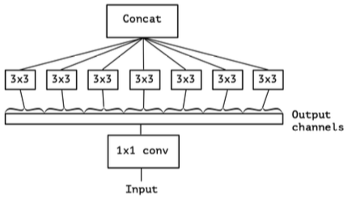</p>

The overall architecture of Xception:

<p align="center"></p>

> We propose a convolutional neural network architecture based entirely on depthwise separable
> convolution layers. In effect, we make the following hypothesis: that the mapping of cross-channels
> correlations and spatial correlations in the feature maps of convolutional neural networks can be
> entirely decoupled.

Note that Xception also uses residual connections from ResNet, which is very important to achieve
a high accuracy.

*References*

- [review-xception-with-depthwise-separable-convolution-better-than-inception-v3-image](https://towardsdatascience.com/review-xception-with-depthwise-separable-convolution-better-than-inception-v3-image-dc967dd42568)

## ResNeXt, 2017

[ResNeXt](https://arxiv.org/abs/1611.05431) is constructed by repeating a building block that
aggregates a set of transformations with the same topology. Following is the core building block,
compared to ResNet block:

<p align="center">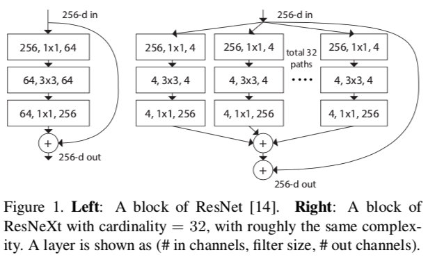</p>

Here, `cardinality` is a concept introduced in the paper, which is size of the set of transformations.
The authors argue that `cardinality` is another important parameter for neural network, the others
are `width` and `depth`. width is the number of channels in a layer, while depth is the number of
layers. Experiments in the paper show that tunning cardinality can result in better accuracy using
the same number of parameters and computation budget, compared to tunning width and depth.

ResNeXt block is similar to Incpetion or Inception-ResNet modules, but unlike those modules, it
shares the same topology among the multiple paths.

**Template Rules**

The repeating blocks all have the same topology, and are subject to two simple rules inspired by
VGG/ResNets:
1. if producing spatial maps of the same size, the blocks share the same hyper-parameters (width
   and filter sizes)
1. each time when the spatial map is downsampled by a factor of 2, the width of the blocks is
   multiplied by a factor of 2 (e.g. 28x28x512 -> 14x14x1024)

**Aggregated Transformations**

The authors compare the transformation of ResNeXt block with the simplest Neuron, and argue that
they are fundamentally the same `split, transformation, and aggregation`.

<p align="center">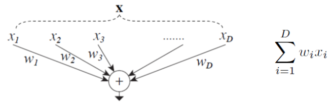</p>
<p align="center">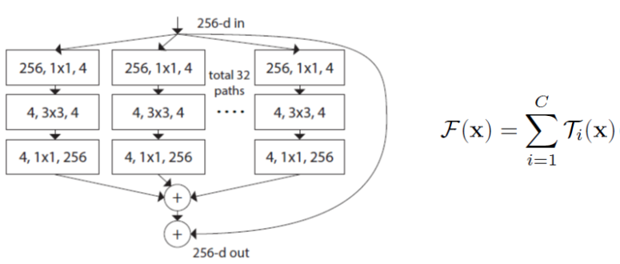</p>

In simple neuron, the transformation is linear (wi * xi), while in ResNeXt block it's 3 convolutions.
There are several equivalent building blocks for the transformation, shown below:

<p align="center">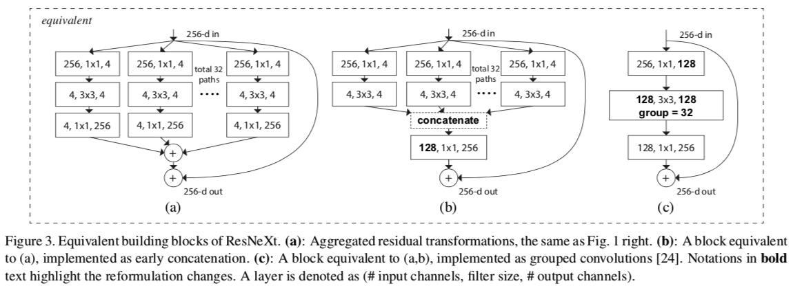</p>

The third transformation is similar to grouped convolutions. In a group conv layer, input and output
channels are divided into C groups, and convolutions are separately performed within each group.

**Architecture**

The architecture ban be found in the following table:

<p align="center">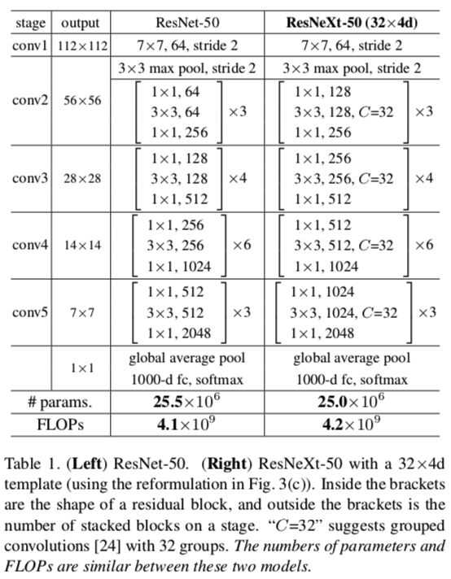</p>

**References**

- [review-resnext-1st-runner-up-of-ilsvrc-2016-image-classification](https://towardsdatascience.com/review-resnext-1st-runner-up-of-ilsvrc-2016-image-classification-15d7f17b42ac)

## DenseNet, 2017

[DenseNet](https://arxiv.org/abs/1608.06993) stands for Densely Connected Convolutional Network.

DenseNet is a network architecture where each layer is directly connected to every other layer in a
feed-forward fashion (within each dense block). For each layer, the feature maps of all preceding
layers are treated as separate inputs whereas its own feature maps are passed on as inputs to all
subsequent layers. This connectivity pattern yields state-of-the-art accuracies on CIFAR10/100 (with
or without data augmentation) and SVHN. On the large scale ILSVRC 2012 (ImageNet) dataset, DenseNet
achieves a similar accuracy as ResNet, but using less than half the amount of parameters and roughly
half the number of FLOPs.

DenseNet is parameter efficient despite the fact that layers are densely connected. This is because
in DenseNet, each layer connects to all previous layers, thus the network explicitly differentiates
between information that is added to the network and information that is preserved, so each layer
can focus on the added information; whereas in other networks, each layer reads the state from its
preceding layer and writes to the subsequent layer. It changes the state but also passes on
information that needs to be preserved.

Another benefit in DenseNet is that, each layer has direct access to the gradients from the loss
function and the original input signal, leading to an implicit deep supervision.

Summary of DenseNet's advantages:

> DenseNets have several compelling advantages: they alleviate the vanishing-gradient problem,
> strengthen feature propagation, encourage feature reuse, and substantially reduce the number
> of parameters.

**DenseNet Block**

Following is a 5-layer densenet block. The growth rate `k` is the number of feature maps produced
at each layer. Because each layer has input feature maps from previous layers, `k` is usually small,
e.g. 12. The growth rate regulates how much new information each layer contributes to the global
state.

> If each function H produces k feature maps, it follows that the lth layer has `k0 + k × (l − 1)`
> input feature-maps, where k0 is the number of channels in the input layer.

<p align="center">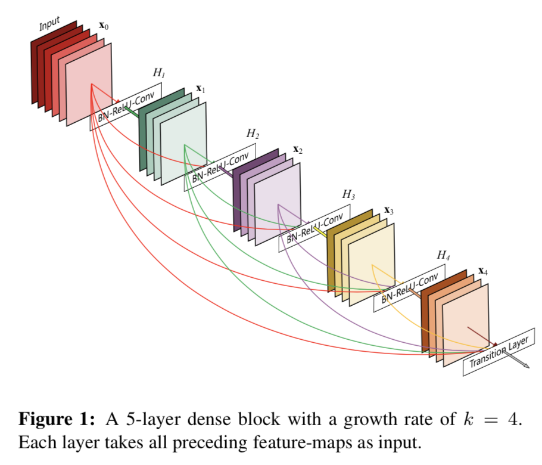</p>

**Architecture**

Note precisely, each layer is connected to all preceding layers **within** a densenet block, not
all layers in the network. Due to downsampling, densenet blocks are connected through `transition
layers`, which do convolution and pooling.

The full architecture of a densenet is shown below:

<p align="center">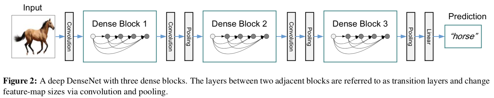</p>

Compare to ResNet: ResNet architecture has a fundamental building block (Identity) where you merge
(additive) a previous layer into a future layer. Reasoning here is by adding additive merges we are
forcing the network to learn residuals (errors, i.e. diff between some previous layer and current
one). In contrast, DenseNet paper proposes concatenating outputs from the previous layers instead
of using the summation.

**DenseNet-BC**

In DenseNet, each layer's transformation function `H` is a composite function of three consecutive
operations: batch normalization (BN), followed by a rectified linear unit (ReLU) and a 3 × 3
convolution (Conv). The authors proposed two optimizations/compressions to the original DenseNet,
one is "Bottleneck layers", the other is "Compression".
- For Bottleneck Layer, the transformation function is changed to `BN-ReLU-Conv(1× 1)-BN-ReLU-Conv(3×3)`
  version. This is used to reduce dimension, and is called "DenseNet-B".
- For Compression, if a dense block contains `m` feature-maps, then the following transition layer
  generate `⌊θm⌋` output feature-maps, where `0 < θ ≤ 1` is referred to as the compression factor.
  This is called "DenseNet-C".

Subsequent experiments for feature reuse show that dense block assignes the least weight to the
outputs of the transition layer, meaning that transition layer has many redundant outputs, thus
making "Compression" a viable approach.

*References*

- https://github.com/liuzhuang13/DenseNet
- https://towardsdatascience.com/review-densenet-image-classification-b6631a8ef803

## MobileNets-v1, 2017

[MobileNets](https://arxiv.org/abs/1704.04861) are based on a streamlined architecture that uses
depthwise separable convolutions to build light weight deep neural networks. MobileNets aims to
reduce computational cost while also maintain high accuracy and low latency.

> Many different approaches can be generally categorized into either compressing pretrained networks
> or training small networks directly. This paper proposes a class of network architectures that
> allows a model developer to specifically choose a small network that matches the resource
> restrictions (latency, size) for their application. MobileNets primarily focus on optimizing for
> latency but also yield small networks.

In general, MobileNets use significantly lower parameters and operations, with only a little
decrease in accuracy.

**Depthwise Separable Convolutions**

MobileNets are built on depthwise separable convolutions, which can be summarized as:

<p align="center">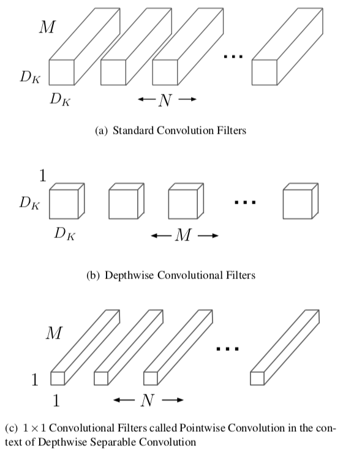</p>

The standard convolutions have the computational cost of:

```
Dk · Dk · M · N · Df · Df
```

while depthwise separable convolutions cost is (i.e. depthwise convolution + pointwise convolution):

```
(Dk · Dk · M · Df · Df) + (M · N · Df · Df)
```

MobileNets defines two parameters to further control its size:
- *Width Multiplier*: The role of the width multiplier `α` is to thin a network uniformly at each
  layer. For a given layer and width multiplier `α`, the number of input channels `M` becomes `αM`
  and the number of output channels `N` becomes `αN`.
- *Resolution Multiplier*: The second hyper-parameter to reduce the computational cost of a neural
  network is a resolution multiplier `ρ`. It is applied to the input image and the internal representation
  of every layer is subsequently reduced by the same multiplier.

The final computational cost of a shrinked version of MobileNets is:

```
Dk · Dk · αM · ρDf · ρDf + αM · αN · ρDf · ρDf
```

The authors experiment with multiple values for `α` and `ρ`, the general conclusion is that:
- Accuracy drops off smoothly until the architecture is made too small with `α`
- Accuracy drops off smoothly across resolution for `ρ`

**Architecture**

With depthwise separable convolutions, the architecture of MobileNets is straightforward:

<p align="center">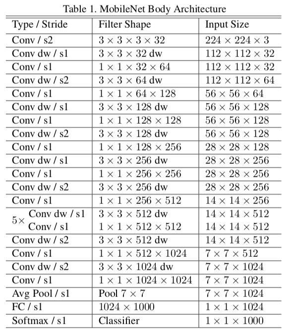</p>

where each "conv dw" is the following block (on the right):

<p align="center">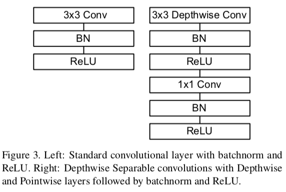</p>

*Reference*

- [review-mobilenetv1-depthwise-separable-convolution-light-weight-model](https://towardsdatascience.com/review-mobilenetv1-depthwise-separable-convolution-light-weight-model-a382df364b69)

## ShuffleNet-v1, 2017

[ShuffleNet](https://arxiv.org/abs/1707.01083) is a computationally efficient CNN architecture
designed specifically for mobile devices with very limited computing power. It's built based on
MobileNets, Xception and ResNeXt, and the authors claim that it outperforms all previous small
networks under the same conditions.

ShuffleNet builds on top of two important operations:
- pointwise group convolutions
- channel shuffle

**pointwise group convolutions**

In ResNeXt, only 3x3 convolution has applied group convolution; however, the authors argue that 1x1
convolution (i.e. pointwise convolution) also involves a lot computation. Ablation study shows that
models with pointwise group convolutions consistently perform better thatn the conterparts without
pointwise group convolution.

**channel shuffle**

If all convolutions are grouped, then output from a certain channels are only derived from a small
fraction of input channels. This blocks information flow between channel groups and weakens
representation. To address this, the authors design a channel shuffle operation, i.e. for feature
maps generated from the previous group layer, we can first divide the channels in each group into
several subgroups, then feed each group in the next layer with different subgroups.

Following is the channel shuffle with 2 group convolutions, each has 3 groups:

<p align="center">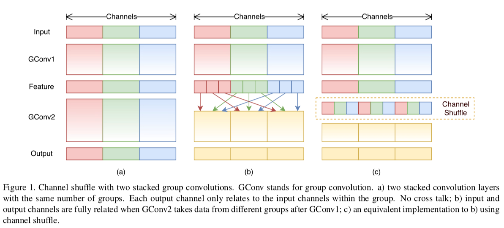</p>

**ShuffleNet Unit**

With pointwise group convolutions and channel shuffle, the authors propose the following ShuffleNet
unit:

<p align="center">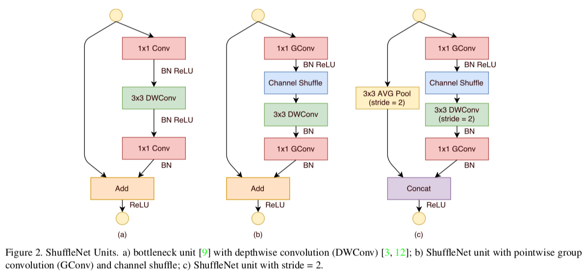</p>

If we look at the following ResNet block, ShuffleNet unit is essentially ResNet block where
corresponding operations are replaced with pointwise group convolution, channel shuffle and
depthwise separable convolution.

<p align="center"></p>

**Architecture**

The full architecture is:

<p align="center">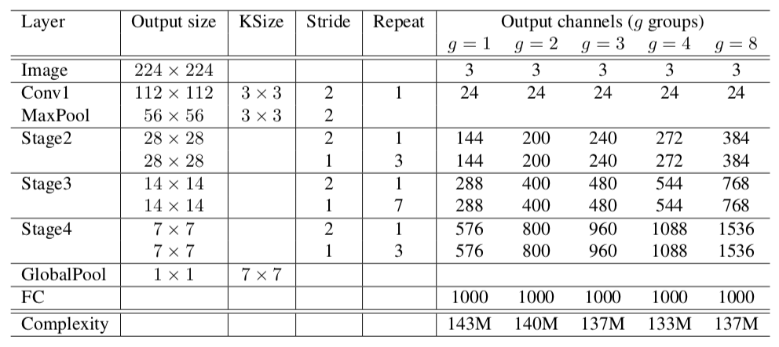</p>

The authors also propose ShuffleNet 0.5x, 0.25x, which is a scaled down version of ShuffleNet with
fewer channels. During ablation study and experiments, the authors prove the effectiveness of
the new operaions, and claim that ShuffleNet outperforms all networks designed for small devices.

## SENet, 2018

SENet stands for Sequeeze-and-Excitation Networks. The paper proposes `SE block`, an architectural
unit designed to improve the representational power of a network by enabling it to perform dynamic
channel-wise feature recalibration.

The motivation is that most prior-arts focused on stacking layers in different ways to imporve
accuracy, e.g. deeper network like VGG, multi-branch network like Inception, as well as algorithmic
architecture search. Amongest the work, convolution is calculated by aggregating all the channels
information, sum them up and forward. However, the authors argue that doing so will likely miss out
lot of information on channel dependencies.

> To make it questionable, Are all the feature maps I have learned are really important? This paper
> investigated a new architectural design: the channel relationship, by introducing a new architectural
> unit, which we term as "Squeeze-and-excitation" (SE) block.

To summarize, the main idea is this:

> Let's add parameters to each channel of a convolutional block so that the network can adaptively
> adjust the weighting of each feature map.

**SE Block**

The fundamental design of SENet is the "SE Block":

<p align="center"></p>

Here,
- `Fsq(*)` is the sequeeze function. In SENet, it's global average pooling, i.e. each 2D feature map
  is average pooled into a single value, for a total of `C` feature maps. As a result, the feature
  maps are reduced from `H x W x C` to `1 x 1 x C`. Max pooling is also tested but has less accuracy
  according to experiments.
- `Fex(*,W)` is the excitation function. In SENet, it's a simple gating mechanism using `FC + ReLU + FC + Sigmoid`.
  A reduction ratio `r` is used to reduce computations. The authors give the criteria for designing
  excitation function:
  - it must be flexible; in particular, it must be capable of learning a nonlinear interaction
    between channels
  - it must learn a non-mutually-exclusive relationship since we would like to ensure that multiple
    channels are allowed to be emphasised, rather than enforcing a one-hot activation
- `Fscale(*,*)` is the scale function (actually part of excitation function) . In SENet, it's
  channel-wise multiplication between the scalar output from `Fex` and the original feature map.

SE Block intrinsically introduce dynamics conditioned on the input, helping to boost feature
discriminability. In other words, SE Block provides insights on channel importance.

**Instantiations**

The SE Block can be integrated into standard architectures such as VGGNet by insertion after the
non-linearity following each convolution. Moreover, the flexibility of the SE Block means that it
can be directly applied to transformations beyond standard convolutions. For example, the left one
is SE-Inception module, and the right one is SE-ResNet module.

<p align="center">
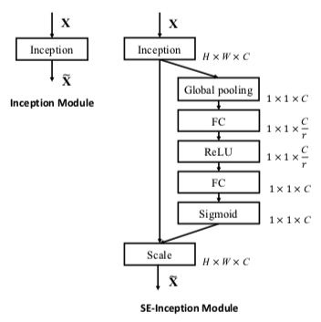
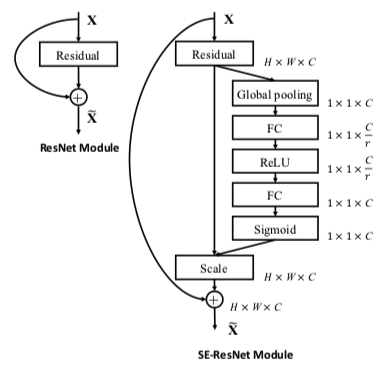
</p>

The authors show quite a few experiments to show the effectiveness of applying SE Block to different
architectures, as well as experiments to show effects of network integration (i.e. where to apply
the SE Block), hyper parameter choice, etc. All evidences show that SE Block has a positive impact
on model accuracy with less added computation overhead.

**Model Cost**

Computations:

> In aggregate, SE-ResNet-50 requires ∼3.87 GFLOPs, corresponding to a 0.26% relative increase over
> the original ResNet-50.

Parameters:

> These additional parameters result solely from the two fully-connected layers of the gating
> mechanism and therefore constitute a small fraction of the total network capacity.  SE-ResNet-50
> introduces ∼2.5 million additional parameters beyond the ∼25 million parameters required by
> ResNet-50, corresponding to a ∼10% increase.

*References*

- https://towardsdatascience.com/squeeze-and-excitation-networks-9ef5e71eacd7

# Models: Object Detection

There are a couple of concepts in the area:
- image classification with localization: classify image and output bounding box
- landmark detection: pinpoint the core points (landmark) of an image
- object detection: output multiple bounding boxes in an image
- object recognition: output multiple bounding boxes as well object classes
- region proposal: certain network, e.g. R-CNN, proposes/detect regions first, then use CNN to
  classify the proposed regions; others do not have region proposal and instead combines the
  detection and recognition steps, e.g. YOLO. For more details on region based approaches,
  or refined classification, refer to [this overview](https://medium.com/@jonathan_hui/what-do-we-learn-from-region-based-object-detectors-faster-r-cnn-r-fcn-fpn-7e354377a7c9).
  For more details on single shot approaches or direct classification, refer to [this overview](https://medium.com/@jonathan_hui/what-do-we-learn-from-single-shot-object-detectors-ssd-yolo-fpn-focal-loss-3888677c5f4d)
- sliding window: in sliding window, we move a pre-defined window among the original image or
  feature map for object detection. It can be seen as a special, brute force region proposal.

**Region Proposals or Sliding Windows**

RCNN and OverFeat represent two early competing ways to do object recognition: either classify
regions proposed by another method (RCNN, FastRCNN, SPPNet), or classify a fixed set of evenly
spaced square windows (OverFeat). The first approach has region proposals that fit the objects
better than the other grid-like candidate windows but is two orders of magnitude slower. The
second approach takes advantage of the convolution operation to quickly regress and classify
objects in sliding-windows fashion.

Multibox ended this competition by introducing the ideas of prior box and region proposal network.
Since then, all state-of-the-art methods now has a set of prior boxes (generated based on a set
of sliding windows or by clustering ground-truth boxes) from which bounding box regressors are
trained to propose regions that better fit the object inside. The new competition is between the
direct classification (YOLO, SSD) and refined classification approaches (Faster RCNN, Mask RCNN).

**Direct Classification or Refined Classification**

These are the two competing approaches for now (2018). Direct classification simultaneously
regresses prior box and classifies object directly from the same input region, while the refined
classification approach first regresses the prior box for a refined bounding box, and then pools
the features of the refined box from a common feature volume and classify object by these features.
The former is faster but less accurate since the features it uses to classify are not extracted
exactly from the refined prior box region.

**Summary**

Non comprehensive path of region proposal based approaches:
- R-CNN
- SPPNet
- Fast R-CNN
- Faster R-CNN
- R-FCN
- FPNs
- Mask R-CNN (for segmentation)

Non comprehensive path of one-shot based approaches:
- OverFeat
- YOLOs
- SSD
- RetinaNet

*References*

- [object-detection-an-overview-in-the-age-of-deep-learning](https://tryolabs.com/blog/2017/08/30/object-detection-an-overview-in-the-age-of-deep-learning/)
- [deep-learning-for-object-detection-a-comprehensive-review](https://towardsdatascience.com/deep-learning-for-object-detection-a-comprehensive-review-73930816d8d9)
- https://github.com/Nikasa1889/HistoryObjectRecognition

## OverFeat, 2014

[OverFeat](https://arxiv.org/abs/1312.6229) is a **multi-scale**, **sliding window** approach using
convolutional neural network to simultaneously classify, locate and detect objects in images. It is
shown that using this integrated approach can boost the classfication accuracy, and the localization
& detection accuracy of all tasks. It is one of the first advances shown that ConvNets can be
effectively used for detection and localization tasks.

Architecture of OverFeat:

<p align="center">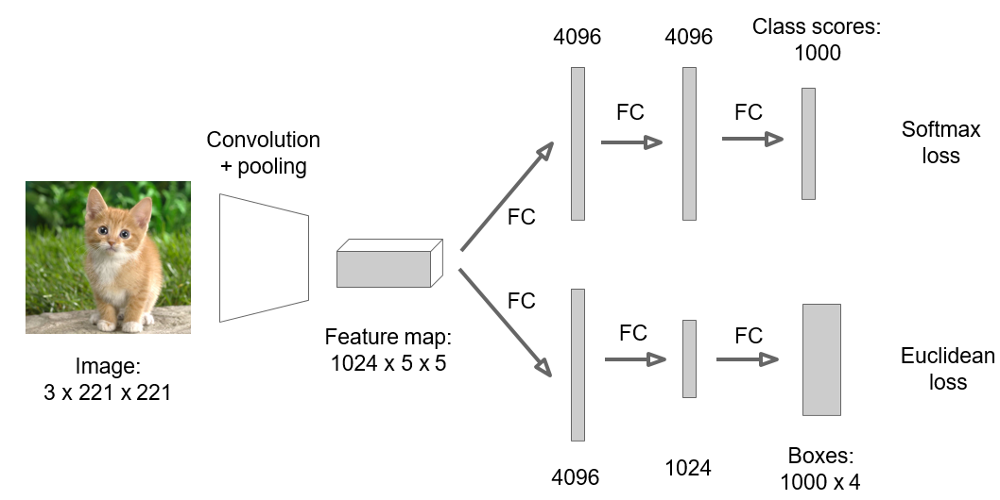</p>
<p align="center"><a href="https://vitalab.github.io/deep-learning/2017/04/18/overfeat.html" style="font-size: 12px">Image Source</a></p>

The network is a simple CNN (based on AlexNet) but with 2 outputs:
- One for predicting the class score (softmax with cross-entropy loss). The classification network
  takes as input the pooled feature maps from layer 5. It has 2 fully-connected hidden layers of
  size 4096 and 4096 channels, respectively. The final output layer has 1000 units specify the class
  score.
- One for predicting the bounding box coordinates (L2 loss). The regression network takes as input
  the pooled feature maps from layer 5. It has 2 fully-connected hidden layers of size 4096 and 1024
  channels, respectively. The final output layer has 4 units which specify the coordinates for the
  bounding box edges.

In short, OverFeat takes an image, runs a ConvNet, branch out two fully-connected layers to predict
class and bounding box coordinates. It's quite simple. Actually, if we remove the boundary regressor,
it will be a typical image classification architecture. In fact, Overfeat trains an image classifier
first, then it fixes the feature layers and train the boundary regressor.

To improve accuracy, OverFeat uses multi-scale and sliding windows, see below.

**Multi-scale Training/Inference**

At inference time, OverFeat explores the entire image by densely running the network at each location
and at multiple scales. In particular, the network takes 6 different scales of an input image: 245x245,
281x317, 317x389, etc, and for each scale, processes several sliding windows. Each sliding window
having a class score and a bounding box. The end result is obtained by combining all of these bounding
boxes and scores.

Because fully connected layers require fixed input size, OverFeat uses "Fine tune Max Pooling" to
hunt for a fixed-size representation in the layer 5 feature maps across different positions and
scales. Following diagram from the paper should be self-explanatory:

<p align="center">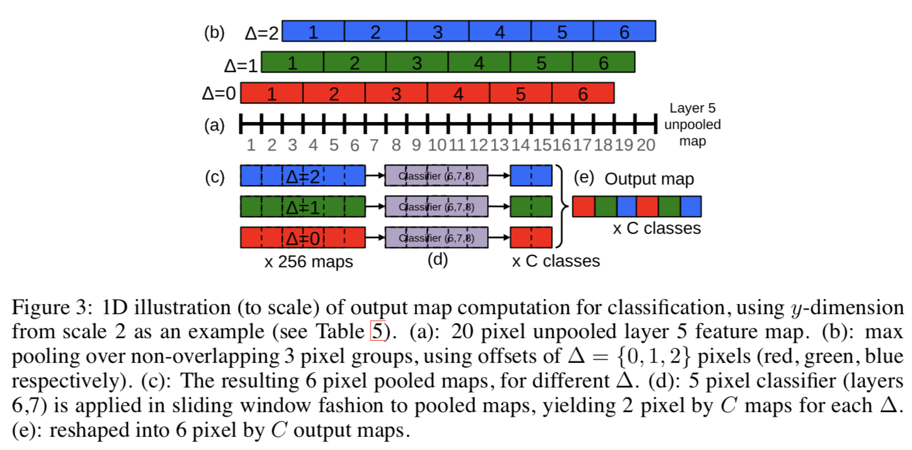</p>

For training, the model uses the same fixed input size approach as in AlexNet (but turns into
multi-scale for classification). Each image is downsampled so that the smallest dimension is 256
pixels. It then extracts 5 random crops (and their horizontal flips) of size 221x221 pixels and
presents these to the network in mini-batches of size 128.

**ConvNets and Sliding Window Efficiency**

One of the reasons that OverFeat can process multiple sliding windows at different scales is due
to the effectiveness of calculating convolutions. ConvNets are inherently efficient when applied
in a sliding fashion because they naturally share computations common to overlapping regions.

The following diagram shows that running convolution once (the second raw, at test time), can
actually compute 2x2 outputs.

<p align="center">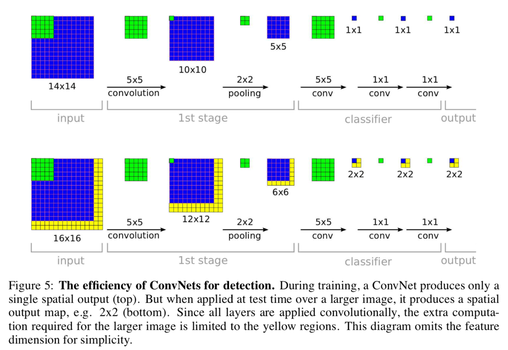</p>

**Detection ideas**

Following is the detection ideas proposed in the paper:

> While images from the ImageNet classification dataset are largely chosen to contain a roughly-centered
> object that fills much of the image, objects of interest sometimes vary significantly in size and
> position within the image.
>
>- The first idea in addressing this is to apply a ConvNet at multiple locations in the image, in a
>  sliding window fashion, and over multiple scales. Even with this, however, many viewing windows
>  may contain a perfectly identifiable portion of the object (say, the head of a dog), but not the
>  entire object, nor even the center of the object. This leads to decent classification but poor
>  localization and detection.
>- Thus, the second idea is to train the system to not only produce a distribution over categories
>  for each window, but also to produce a prediction of the location and size of the bounding box
>  containing the object relative to the window.
>- The third idea is to accumulate the evidence for each category at each location and size.

*References*

- https://vitalab.github.io/deep-learning/2017/04/18/overfeat.html
- https://towardsdatascience.com/object-localization-in-overfeat-5bb2f7328b62
- [review-of-overfeat-winner-of-ilsvrc-2013-localization-task-object-detection](https://medium.com/coinmonks/review-of-overfeat-winner-of-ilsvrc-2013-localization-task-object-detection-a6f8b9044754)

## R-CNN, 2014

[R-CNN](https://arxiv.org/abs/1311.2524) stands or Region-based Convolutional Neural Network, it
consists of 3 simple steps:
- Scan input image for possible objects using an algorithm called Selective Search, generating ~2000 region proposals.
- Run **a single** convolutional neural network (CNN) on top of **each** of these region proposals (once per region).
  Regions are warped before feeding into CNN since it requies fixed input shape.
- Take the output of each CNN and feed it into
   - a **per-class** SVM to classify the region and
   - a **per-class** linear regressor to tighten the bounding box of the object, if such an object exists

In summary:
- we first propose regions
- then extract features
- then classify and regress those regions based on their features

Essentially, we have turned object detection into an image classification problem. R-CNN was very
intuitive, but very slow. Here is the systm flow:

<p align="center"></p>

**R-CNN is Slow**

R-CNN is slow mainly because it runs the CNN for each region, without sharing computation.

**Image Warping**

CNN requires all images to have the same input shape. However, this is not the case for proposals,
which tend to have many different shapes. Among many of the methods for image transformation method,
R-CNN chooses to use image warping.

<p align="center">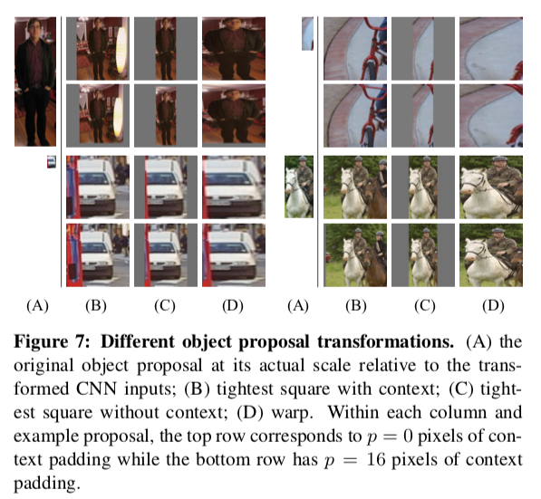</p>

**Supervised Pre-training**

The paper attributes one of the reasons for its success to "Supervised Pre-training", i.e. using
classification models from ImageNet, then fine-tuning the model based on domain knowledge of target
dataset (PASCAL VOC). R-CNN uses AlexNet, it also evaluated VGGNet.

This is typical of transfer learning. However, back then, it's still common to use unsupervised
pre-training, i.e. RBM. Using supervised pre-training is still considered a noval approach.

**Multi-stage Training (No end-to-end training)**

R-CNN training involves three stages:
- fine-tunes a CNN on object proposals using warped region proposals with log loss
- fits per class SVMs to classify object
- fits bounding-box regressors to generate better regions

This is both slow and ineffective. Ideally, we want to train the model end-to-end as a single stage.

**CNN Mini-batch construction**

Region proposals with >= 0.5 IoU overlap with a ground-box are treated as positive examples, others
are negative examples (background). In each SGD training iteration, R-CNN uses batch size 128, with
32 positive examples (over all classes) and 96 background.

**Feature Visualization**

> The idea is to single out a particular unit (feature) in the network and use it as if it were an
> object detector in its own right. That is, we compute the unit's activations on a large set of
> held-out region proposals (about 10 million), sort the proposals from highest to lowest activation,
> perform non-maximum suppression, and then display the top-scoring regions.

**Relation to OverFeat**

> There is an interesting relationship between R-CNN and OverFeat: OverFeat can be seen (roughly) as
> a special case of R-CNN. If one were to replace selective search region proposals with a multi-scale
> pyramid of regular square regions and change the per-class bounding-box regressors to a single
> bounding-box regressor, then the systems would be very similar.

> It is worth noting that OverFeat has a significant speed advantage over R-CNN: it is about 9x
> faster. This speed comes from the fact that OverFeat's sliding windows (i.e., region proposals)
> are not warped at the image level and therefore computation can be easily shared between overlapping
> windows. Sharing is implemented by running the entire network in a convolutional fashion over
> arbitrary-sized inputs

## SPPNet, 2014

The prevalent CNNs require a fixed input image size (e.g., 224×224), which limits both the aspect
ratio and the scale of the input image. [SPPNet](https://arxiv.org/abs/1406.4729) introduces a
"spatial pyramid pooling (SPP)" layer to remove the fixed-size constraint in CNNs. Specifially, it
adds an SPP layer on top of the last convolutional layer. The SPP layer pools the features and
generates fixed-length outputs, which are then fed into the fully-connected layers (or other
classifiers).

<p align="center">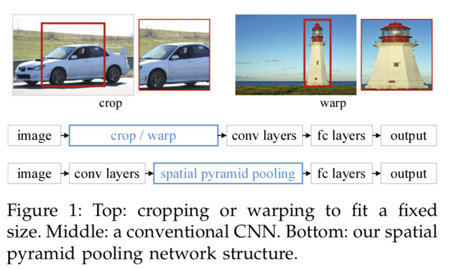</p>

SPPNet can improve accuracy of both classification and detection problems, and the improvement is
not specific to CNN designs. The authors tested SPP with AlexNet, ZFNet, OverFeat, R-CNN, etc.

For detection, SPPNet is essentially an enhanced version of R-CNN using SPP layer to compute feature
volume only once. In fact, Fast-RCNN embraced these ideas to fasten RCNN with minor modifications.

<p align="center">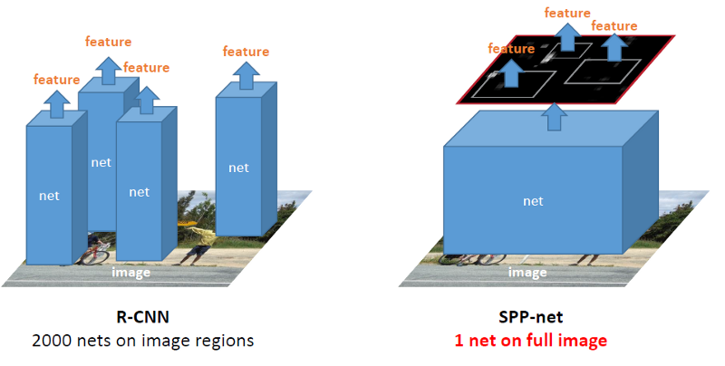</p>

**Spatial Pyramid Pooling**

Following is a detailed SPP workflow:

<p align="center">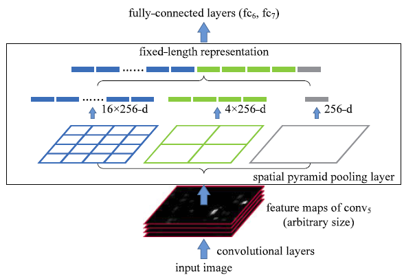</p>

It works by:
- first, each feature map is pooled to become one value (grey), thus 256-d vector is formed.
- then, each feature map is pooled to have 4 values (green), and form a 4×256-d vector.
- similarly, each feature map is pooled to have 16 values (blue), and form a 16×256-d vector.
- the above 3 vectors are concatenated to form a 1-d vector.
- finally, this 1-d vector is going into FC layers as usual.

Note the number of bins is fixed, e.g. in a 4-level SPPNet the pyramid can be `{6×6, 3×3, 2×2, 1×1}`,
for a total of 50 bins. If the number of input feature maps to SPP layer is 256, then SPP layer
will output 50x256 dimension vectors. Exactly how many pixels are located in each bin depends on
the size of an image.

**Single-size and Multi-size Training**

Single-size training, i.e. regular fixed size training. The main purpose of single-size training
is to enable the multi-level pooling (SPP) behavior.

Multi-size training. In theory, image of any sizes can be input to SPPNet for training. However,
for the effectiveness of the training process (e.g. many libraries expect fixed input, like
cuda-convnet), only 224×224 and 180×180 images are used as input. Two networks, 180-network and
240-network are trained with shared parameters: train each full epoch on one network, and then
switch to the other one (keeping all weights). The main purpose of multi-size training is to
simulate the varying input sizes while still leveraging the existing well-optimized fixed-size
implementa tions.

Note that the above single/multi-size solutions are for training only. At the testing stage, it
is straightforward to apply SPPNet on images of any sizes.

*References*

- [review-sppnet-1st-runner-up-object-detection-2nd-runner-up-image-classification-in-ilsvrc](https://medium.com/coinmonks/review-sppnet-1st-runner-up-object-detection-2nd-runner-up-image-classification-in-ilsvrc-906da3753679)

## MultiBox, 2014-2015

MuitiBox has two versions:
- [MultiBox](https://arxiv.org/abs/1312.2249)
- [MSC-MultiBox](https://arxiv.org/abs/1412.1441)

MultiBox is **NOT** an object recognition but a ConvNet-based region proposal solution. It uses
another network for classification: in v1, it's AlexNet, and in v2, it's Inception Network.

MultiBox (v1) popularized the ideas of **region proposal network (RPN)** and **Prior Box (Anchor
Box)**, proving that ConvNet can be trained to propose better region proposals than heuristic
approaches. Since then, heuristic approaches have been gradually fading out and replaced by RPN.

> We aim at achieving a class-agnostic scalable object detection by predicting a set of bounding
> boxes, which represent potential objects. More precisely, we use a Deep Neural Network (DNN),
> which outputs a fixed number of bounding boxes. In addition, it outputs a score for each box
> expressing the networkconfidence of this box containing an object.

MultiBox (v1) formalizes object detection problem as **regression problem**, i.e. to predict the
bounding boxes coordinates and box confidence score. The loss function is a combination of box
prediction error (4 nodes, l2 loss) and confidence error (binary, log loss), with an `alpha` term
to balance the two errors, i.e.

```
multibox_loss = confidence_loss + alpha * location_loss
```

MultiBox (v2) has several improvements over v1, in summary:

> We demonstrate that switching to the latest Inception-style architecture and utilizing multi-scale
> convolutional predictors of bounding box shape and confidence, in combination with an Inception-based
> post-classification model significantly improves the proposal quality and the final object detection
> quality.

In particular, the "multi-scale convolutional predictors of bounding box shape and confidence" means:

> A crucial detail of our approach is that we do not let the proposals free-float, but impose
> diversity by introducing a prior for each box output slot of the network. Let us assume our
> network predicts `k` boxes, together with their confidences, then each of those output slots
> will be associated with a prior rectangle `pi`. These rectangles are computed before training
> the network in a way that matches the distribution of object boxes in the training set.

## Fast R-CNN, 2015

[Fast R-CNN](https://arxiv.org/abs/1504.08083) is R-CNN's immediate descendant. Fast R-CNN resembled
the original in many ways, but improved on its detection speed through two main augmentations:
- Performing feature extraction over the image before proposing regions, thus only running one CNN
  over the entire image instead of 2000 CNNs over 2000 overlapping regions, i.e. we are now generating
  region proposals based on the last feature map of the CNN network, not from the original image
  itself. This is made possible because of RoI pooling (a special case of SPP pooling), which allows
  the CNN network to operate on input images with multiple sizes.
- Replacing the SVM with a softmax layer, thus extending the neural network for predictions instead
  of creating a new model. That is, instead of training many different SVMs to classify each object
  class, there is a single softmax layer that outputs the class probabilities directly.

Fast R-CNN is much faster, but there was just one big bottleneck remaining: the selective search
algorithm for generating region proposals. Here is the system flow:

<p align="center"></p>

In summary:
- Scan input image for possible objects using an algorithm called Selective Search, generating ~2000 region proposals.
- Processes the whole image with a single convolutional neural network (CNN) and outputs a feature map.
- For **each object proposal**, a RoI pooling layer extracts a fixed-length feature vector from the feature map.
- Each feature vector is fed into fully connected (fc) layers that finally branch into two sibling output layers:
  - one that produces softmax probability estimates over K object classes plus a catch-all "background" class
  - another layer that outputs four real-valued numbers for each of the K object classes. Each set of 4 values encodes refined bounding-box positions for one of the K classes.

**Multi-class Loss**

Fast R-CNN jointly optimizes a softmax classifier and bounding-box regressors. It uses a loss
function combining both class prediction loss and regression loss, i.e.

```
L(p, u, tu, v) = L_cls(p, u) + λ[u ≥ 1]L_loc(tu, v)
```

**Mini-batch sampling**

During fine-tuning, each SGD mini-batch is constructed from N = 2 images, chosen uniformly at random.
Fast R-CNN uses mini-batches of size R = 128, sampling 64 RoIs from each image.
- Foreground samples: Foreground comprises 25% of the RoIs from object proposals that have intersection
  over union (IoU) overlap with a ground-truth bounding box of at least 0.5.
- Background samples: The remaining RoIs are sampled from object proposals that have a maximum IoU
  with ground truth in the interval [0.1, 0.5).

**Single-scale and Multi-scale Training**

Fast R-CNN authors compare two strategies for achieving scale-invariant object detection:
- brute-force learning (single scale)
- and image pyramids (multi-scale)

All single-scale experiments use s = 600 pixels, and multi-scale setting uses s ∈ {480, 576, 688, 864, 1200}.
The result shows that single-scale detection performs almost as well as multi-scale detection.
Therefore, since single-scale processing offers the best tradeoff between speed and accuracy,
especially for very deep models, all experiments in Fast R-CNN uses single-scale training and
testing with s = 600 pixels.

## YOLOv1, 2015

[YOLOv1](https://arxiv.org/abs/1506.02640) is published around Faster R-CNN. It is a one-shot model
where a single neural network predicts bounding boxes and class probabilities directly from full
image in one evaluation. This makes YOLOv1 extremely fast, able to be trained end-to-end, etc.

YOLOv1 divides the input image into an `SxS` grids, each grid predicts only **one** object whose
whole center falls inside the grid cell. To better detect objects, each grid cell contains a **fixed
number** of boundary boxes. Initially, YOLOv1 makes **arbitrary guesses** on the boundary boxes, and
gradually learns to find the correct ones during training. In other word, YOLOv1 hasn't started to
use anchor boxes yet.

The following input image is divided into 7x7 grids, the yellow box is a grid and blue boxes are
bounding boxes. The yellow box is responsible to detect the object because the center of the object
(yellow dot) falls inside of the grid cell.

<p align="center"></p>

For each grid cell:
- it predicts **B** boundary boxes and each box has one box confidence score,
- it detects **one** object only regardless of the number of boxes B,
- it predicts **C** conditional class probabilities (one per class for the likeliness of the object class).

Each bounding box contains 5 elements: `(x, y, w, h, p)`, where `(x, y)` coordinates represent the
center of the box relative to the bounds of the grid cell (left upper corner). The width `w` and
height `h` are predicted relative to the whole image. `p` is the conditional class probability, i.e.
how likely that the box belongs to a particular class. Note bounding box width and height are
normalized by the image width and height. Hence, `x`, `y`, `w` and `h` are all between 0 and 1. The
final layer predicts both class probabilities and bounding box coordinates.

For example, if grid size is 7x7, each grid has 2 bounding boxes, and total number of classes are
20, then YOLOv1's prediction has a shape of (7, 7, 2*5+20). The formula is `S x S x (B * 5 + C)`,
where `SxS` is grid size, `B` is number of bounding box, `C` is number of classes.

Note that because predicting is per grid cell, thus for training process, we need to label the
training dataset per grid cell, i.e. for each grid cell, we'll label its corresponding class (or
background class) as well `(x, y, w, h, p)`. This is usually a training preprocessing step. The
original image has only coarse labels, i.e. bounding box for each object, not per grid label.

With this in place, the major concept of YOLOv1 is to build a CNN network to predict the (7, 7, 2*5+20)
tensor. Following is the network design of YOLOv1 (configuration can be found [here](https://github.com/pjreddie/darknet/blob/master/cfg/yolov1.cfg)):

<p align="center"></p>

> YOLOv1 has 24 convolutional layers followed by 2 fully connected layers (FC). Some convolution
> layers use 1 × 1 reduction layers alternatively to reduce the depth of the features maps. For the
> last convolution layer, it outputs a tensor with shape (7, 7, 1024). The tensor is then flattened.
> Using 2 fully connected layers as a form of linear regression, it outputs 7×7×30 parameters and
> then reshapes to (7, 7, 30), i.e. 2 boundary box predictions per location.

YOLOv1 loss function composes of:
- the classification loss.
- the localization loss (errors between the predicted boundary box and the ground truth).
- the confidence loss (the objectness of the box).

The loss function only penalizes classification error if an object is present in that grid cell. It
also only penalizes bounding box coordinate error if that predictor is "responsible" for the ground
truth box (i.e. has the highest IoU).

> We use sum-squared error because it is easy to optimize, however it does not perfectly align with
> our goal of maximizing average precision. It weights localization error equally with classification
> error which may not be ideal. Also, in every image many grid cells do not contain any object. This
> pushes the "confidence" scores of those cells towards zero, often overpowering the gradient from
> cells that do contain objects. This can lead to model instability, causing training to diverge early
> on.
>
> To remedy this, we increase the loss from bounding box coordinate predictions and decrease the
> loss from confidence predictions for boxes that don’t contain objects. We use two parameters,
> λ_coord and λ_noobj to accomplish this. We set λ_coord = 5 and λ_noobj = .5.

As with other detection algorithms, YOLOv1 applies non-maximal suppression to remove duplications
with lower confidence.

Limitations of YOLOv1:
- YOLOv1 only predicts two boxes and can only have one class
- YOLOv1 uses low resolution feature maps and the small object features get too small to be detectable
- YOLOv1 learns to predict bounding box from data, so it struggles to generalize to unseen data
- YOLOv1 has large incorrect localization

*References*

- https://medium.com/@jonathan_hui/real-time-object-detection-with-yolo-yolov2-28b1b93e2088

## Faster R-CNN, 2015

The main insight of [Faster R-CNN](https://arxiv.org/abs/1506.01497) was to replace the slow
Selective Search algorithm in Fast R-CNN with a fast neural network. Specifically, it introduced
the region proposal network (RPN), which is a convolutional network. Thus the model can be seen
as **RPN + Fast R-CNN**.

RPN is built with two important prior work:
- OverFeat. In OverFeat a fully-connected layer is trained to predict the box coordinates for the
  localization task that assumes a single object. The fully-connected layer is then turned into a
  convolutional layer for detecting multiple class-specific objects.
- MultiBox. The MultiBox methods generate region proposals from a network whose last fully-connected
  layer simultaneously predicts multiple class-agnostic boxes, generalizing the "single-box" fashion
  of OverFeat. These class-agnostic boxes are used as proposals for R-CNN.

Following is Faster R-CNN architecture, it has multiple moving parts:

<p align="center"></p>

Here is the system flow:

<p align="center"></p>

**Base Network**

A pre-trained CNN is used to extract features from input image, to be specific, feature maps of
intermediate layers are used in all the following stages. The original Faster R-CNN used ZF and
VGG pretrained on ImageNet. The paper does not specify which layer to use; but in the official
implementation you can see they use the output of `conv5/conv5_1` layer. VGG is the state-of-the-art
network back then, now (2018) newer networks like ResNet, DenseNet have mostly replaced VGG as a
base network for extracting features.

The decision to train the base network depends on the nature of the objects we want to learn and
the computing power available. If we want to detect objects that are similar to those that were on
the original dataset on which the base network was trained on, then there is no real need except
for trying to squeeze all the possible performance we can get. On the other hand, training the base
network can be expensive both in time and on the necessary hardware, to be able to fit the complete
gradients.

<p align="center"></p>

**Region Proposal Network (RPN)**

Using the features that the CNN computed, RPN is used to find up to a *predefined number*, e.g. 2000
in the paper, of regions (bounding boxes), which may contain objects. RPN uses Anchor Box to derive
the proposals. Anchor boxes are fixed bounding boxes that are placed throughout the image with
different sizes and ratios that are going to be used for reference when first predicting object
locations. RPN takes all the reference boxes (anchor boxes) and outputs a set of good proposals for
objects. It does this by having two different outputs for each of the anchors.

To be specific, RPN slides a small window on the feature map. For each sliding window, RPN considers
k different anchor boxes: a tall box, a wide box, a large box, etc. For each of those anchor boxes,
it uses a small convolutional network to output 1) whether or not we think it contains an object,
and 2) what the coordinates for that box are (with bbox-regression). In the original paper, Faster
R-CNN uses **9 anchor boxes per region** (3 scales and 3 aspect ratios), with box areas of 128x128,
256x256, and 512x512 pixels, and 3 aspect ratios of 1:1, 1:2, and 2:1.

After all proposals are found, the network will perform non-max suppression and top-N proposal
selection to reduce the number of proposals passed to next stage.

Notice that although the RPN outputs bounding box coordinates, it does not try to classify any
potential objects: its sole job is still proposing object regions. If an anchor box has an
"objectness" score above a certain threshold, that box's coordinates get passed forward as a
region proposal.

Just as we can use VGG as the base network for object detection in Faster R-CNN, the RPN, up to
now, can also be used standalone in other applications, or to feed into other networks, without
going through following stages, such application includes ocr, face recognition, etc.

<p align="center"></p>

**RoI Pooling**

Now with the features from the CNN and the proposals from RPN, we can ideally run classifiers on
features within a proposal to classify objects. However, the proposals from RPN have different
sizes, it's inefficient to build one classifier for each of them.

Faster R-CNN (or more precisely, Fast R-CNN) solves this by apply Region of Interest (RoI) Pooling.
It works by cropping the CNN feature maps using each proposal and then resize each crop to a fixed
sized `14 x 14 x convdepth` using interpolation (usually bilinear). After cropping, max pooling with
a 2x2 kernel is used to get a final `7 x 7 x convdepth` feature map for each proposal.

Basically, what RoI Pooling does is to perform max pooling on inputs of nonuniform sizes to obtain
fixed-size feature maps (here. 7 × 7).

<p align="center"></p>

**Region-based convolutional neural network (R-CNN)**

After getting a convolutional feature map from the image, using it to get object proposals with the
RPN and extracting features for each of those proposals (via RoI Pooling), we finally need to use
these features for predictions.

Predictions are done using R-CNN, which contains two FC networks:
- A fully-connected layer to classify proposal into one of the classes
- A fully-connected layer to better adjust the bounding box for the proposal according to the predicted class

The sub-network applies to all the region proposals, without sharing computations.

<p align="center"></p>

**Training Faster R-CNN**

After putting the complete model together we end up with 4 different losses, two for the RPN and two
for R-CNN, each network uses two losses: binary cross entropy and smooth L1. We have the trainable
layers in RPN and R-CNN, and we also have the base network which we can train (fine-tune) or not.

To unify RPNs with Fast R-CNN object detection networks, Faster R-CNN proposes a training scheme
that alternates between fine-tuning for the region proposal task and then fine-tuning for object
detection, while keeping the proposals fixed. In other words, it first trains RPN, and uses the
proposals to train Fast R-CNN. The network tuned by Fast R-CNN is then used to initialize RPN, and
this process is iterated. During the iterations, parameters of base convolution layers are shared
in two networks.

One final notes about mini-batch:

> The RPN can be trained end-to-end by back-propagation and stochastic gradient descent (SGD). We
> follow the "image-centric" sampling strategy from Fast R-CNN to train this network. Each mini-batch
> arises from a single image that contains many positive and negative example anchors. It is possible
> to optimize for the loss functions of all anchors, but this will bias towards negative samples as
> they are dominate. Instead, we randomly sample 256 anchors in an image to compute the loss function
> of a mini-batch, where the sampled positive and negative anchors have a ratio of up to 1:1. If
> there are fewer than 128 positive samples in an image, we pad the mini-batch with negative ones.

*References*

- https://tryolabs.com/blog/2018/01/18/faster-r-cnn-down-the-rabbit-hole-of-modern-object-detection/

## SSD, 2016

[SSD](https://arxiv.org/abs/1512.02325) stands for Single Shot MultiBox Detector. As it name
suggests, it is a single shot detection model, similar to YOLO, but largely outperforms YOLO in
terms of accuracy, and it is also slightly faster than YOLO.

In terms of architecture, SSD is **NOT** a fundamental re-design of previous models; rather, it
contains a number of small, independent improvements that make it a successful object detection
model. The two most significant improvements are:
- multi-scale feature maps for detection
- default bounding boxes (carefully chosen instead of random guess)

SSD also uses a couple of optimizations, e.g.
- hard negative sampling: faster and stable training
- data augmentation: improves accuracy
- atrous convolution (dilated convolution): faster training
- top-k prediction filter
- non-max suppression
- etc

**Multi-scale Feature Maps for Detection**

<p align="center">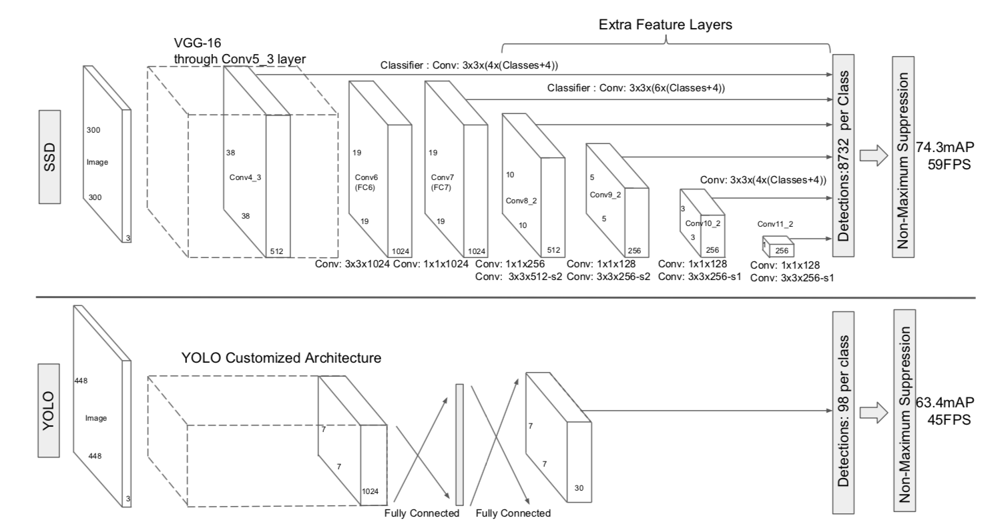</p>

SSD uses the VGG-16 network as a base network; it uses VGG-16 through `conv5_3` and discards the
fully connected layers. Now comes the most import part: SSD adds several convolutional feature
layers to the end of the truncated base network (from `conv6` forward). These layers decrease in
size progressively and allow predictions of detections at multiple scales. It is noted in the paper
that 80% of inference time is spent on VGG-16 base network.

The figure above shows the architecture of SSD300 model (input size 300x300, there's also another
SSD512 model with input size 512x512). From the figure, we can see that SSD uses `conv4_3`,
`conv7 (fc7)`, `conv8_2`, `conv9_2`, `conv10_2`, and `conv11_2` to predict both location and
confidences, for a total of 6 different feature maps and scales.

It's important to note that **each** of the 6 feature maps is used to perform predictions, i.e. each
produces a fixed set of detection predictions using a set of convolutional filters (or `Classifier`
as denoted in the figure). To be specific, for a feature layer of size `m × n` with `p` channels, the
basic element for predicting parameters of a potential detection is a `3 × 3 × p` small kernel that
produces either a score for a category, or a shape offset relative to the default box coordinates.
The `3 x 3 x p` kernel is padded for the network to calculate corner feature map cells of the images.

**Default Bounding Boxes**

In the MultiBox paper, the researchers created `priors` (or `anchors` in Faster-R-CNN terminology),
which are pre-computed, fixed size bounding boxes that closely match object shapes in dataset. SSD
extends the idea and associates a set of default bounding boxes with **each feature map cell**, for
multiple feature maps at the top of the network. For each layer of `m x n` size, with `k` bounding
boxes, it will have `(c+4)kmn` outputs, where `c` equals the number of classes.

<p align="center">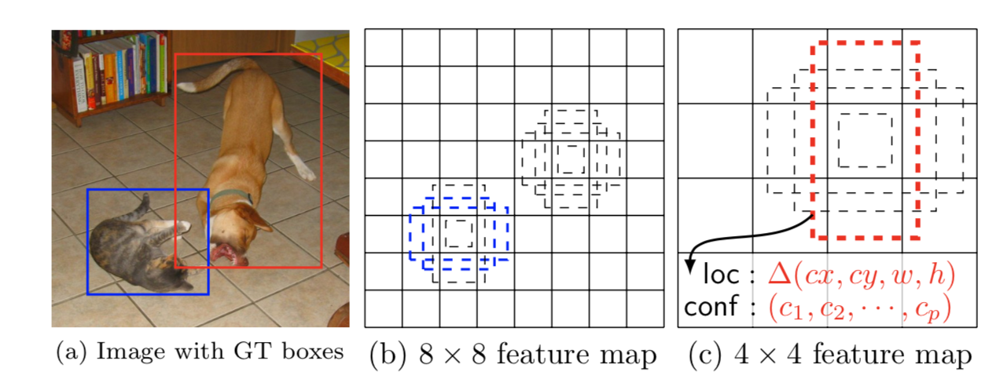</p>

The above shows that two example feature maps with size `8 x 8` and size `4x4`. For the middle
feature map, the blue default bounding box matches object cat, and for the right feature map, the
red bounding box matches object dog. Note that the middle feature **doesn't** match dog because
its bounding box shape is too small.

As mentioned above, the default bounding boxes are manually chosen, using simple calculations. Note:
- scale and size of bounding box is different per feature map layer; this is obvious since each layer has different scale
- aspect ratio is {1, 2, 3, 1/2, 1/3}; for aspect ratio 1, there is 1  more bounding box with different scale (6 in total)
- some layers only have 4 default bounding boxes, with aspect ratio 3 and 1/3 removed
- SSD model is **very sensitive** to the default bounding box sizes
- SSD model has much worse performance on smaller objects than bigger objects
- It's better to calculate bounding box sizes per dataset

**Related Work**

Fast R-CNN:

> Our SSD is very similar to the region proposal network (RPN) in Faster R-CNN in that we also use
> a fixed set of (default) boxes for prediction, similar to the anchor boxes in the RPN. But instead
> of using these to pool features and evaluate another classifier, we simultaneously produce a score
> for each object category in each box. Thus, our approach avoids the complication of merging RPN
> with Fast R-CNN and is easier to train, faster, and straightforward to integrate in other tasks.

YOLO, OverFeat:

> Our SSD method falls in this category (single shot) because we do not have the proposal step but
> use the default boxes. However, our approach is more flexible than the existing methods because we
> can use default boxes of different aspect ratios on each feature location from multiple feature
> maps at different scales.
> - if we only use one default box per location from the topmost feature map, our SSD would have
>   similar architecture to OverFeat (note: OverFeat uses input image with 6 different scales to
>   solve the resolution problem);
> - if we use the whole topmost feature map and add a fully connected layer for predictions instead
>   of our convolutional predictors, and do not explicitly consider multiple aspect ratios, we can
>   approximately reproduce YOLO.

YOLO divides the original image into SxS grids, while SSD detects objects per feature map cell.

*References*

- [review-ssd-single-shot-detector-object-detection](https://towardsdatascience.com/review-ssd-single-shot-detector-object-detection-851a94607d11)
- [understanding-ssd-multibox-real-time-object-detection-in-deep-learning](https://towardsdatascience.com/understanding-ssd-multibox-real-time-object-detection-in-deep-learning-495ef744fab)
- [ssd-object-detection-single-shot-multibox-detector-for-real-time-processing](https://medium.com/@jonathan_hui/ssd-object-detection-single-shot-multibox-detector-for-real-time-processing-9bd8deac0e06)

## YOLOv2, 2016

[YOLOv2](https://arxiv.org/abs/1612.08242) is the second version of the YOLO algorithms family with
improved speed and accuracy. YOLOv2 configuration can be found [here](https://github.com/pjreddie/darknet/blob/master/cfg/yolov2.cfg).
Following is a summary of optimizations in YOLOv2:

<p align="center">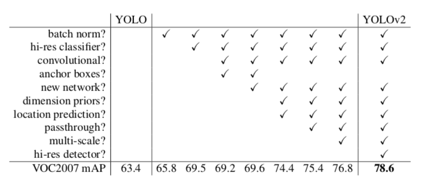</p>

**Batch Normalization**

Adding Batch Normalization to all the convolutional layers improved the mAP by 2%. With BN, YOLOv2
removes dropout from the model without overfitting.

**High Resolution Classifier**

Since AlexNet, most of the classifiers operate on input images smaller than 256 * 256, thus YOLOv1
trains the classifier network at 224 × 224 and increases the resolution to 448 for detection. This
means the network has to simultaneously switch to learning object detection and adjust to the new
input resolution. In YOLOv2, the author increased 224 x 224 input size to 448 x 448 while training
the DarkNet on ImageNet dataset. This increased the mAP by almost 4%.

**Convolutional with Anchor Boxes**

YOLOv2 uses anchor boxes (called `priors` in the paper) similar to Faster R-CNN and SSD.

In YOLOv1, bounding boxes predictions are arbitrary guesses at first. Different predictions will
fight with each other on what shapes to specialize on, making the model unstable. However, real-life
objects are not arbitrary, it is beneficial to use pre-defined anchor boxes to bound YOLO's
predictions. Therefore, YOLOv2 creates 5 anchor boxes per grid cell, and instead of predicting
5 arbitrary bounding boxes, it predicts offsets to each of the anchor boxes.

The network has thus changed quite a bit:
- Remove the fully connected layers that were responsible for predicting the boundary box.
- Move the class prediction from cell level to anchor box level. In YOLOv1, each grid predicts only
  one object, i.e. class prediction is cell level. In YOLOv2, class prediction is boundary box level,
  which means if two objects with different shape falls in the same grid, YOLOv2 can successfully
  detect them. After this change, the third dimension of the `(7, 7, 2*5+20)` tensor in YOLOv1
  should be changed to `2*(4+1+20)`, where 2 is number of bounding box, 4 is `x`, `y`, `w`, `h` of
  bounding boxes, and 20 is class probabilities. Note YOLOv2 actually uses 5 bounding boxes instead
  of 2, thus each grid cell contains `5*(4+1+20)=125` parameters. Same as YOLOv1, the objectness
  prediction still predicts the IOU of the ground truth and the proposed box.
- The last convolutional layer is replaced with 3 x 3 and 1 x 1convolutional layers (ref to darknet).
- Change the input image size from 448 × 448 to 416 × 416, to make odd number spatial dimension.
- Remove one pooling layer to make the spatial output of the network to 13×13 (instead of 7×7).

Anchor boxes decrease mAP slightly from 69.5 to 69.2 but the recall improves from 81% to 88%. i.e.
even the accuracy is slightly decreased but it increases the chances of detecting all the ground
truth objects.

**Dimension Clusters**

After performing "Dimension Clusters" on the ground truth labels in COCO and VOC dataset, it turns
out that most bounding boxes have certain height-width ratios. So instead of choosing anchor boxes
randomly, YOLOv2 (and v3) uses k-means algorithm to find the best anchor boxes shapes. `k` is set
to 5 for best performance and accuracy tradeoff.

If we look at the configuration above, we'll see the anchor boxes are [pre-defined now](https://github.com/pjreddie/darknet/blob/61c9d02ec461e30d55762ec7669d6a1d3c356fb2/cfg/yolov2.cfg#L242).

**Direct location prediction**

With "Convolutional with Anchor Boxes", YOLOv2 now makes predictions on the offsets to the anchors.
However, the offsets are unconstrained, thus predictions will be arbitrary again; that is, any
anchor box can end up at any point in the image. For example, YOLOv2 can predict `tx = -1` to move
the anchor box to the right of its width and matches object A; it can also predict `tx = 5` to move
the anchor box to the left of 5 times its width and matches object B.

To solve the problem, YOLOv2 predicts 5 parameters `(tx, ty, tw, th, and to)` and applies the sigma
function to constraint its possible offset range:

<p align="center">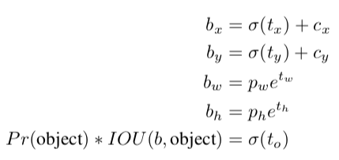</p>

Here,
- `tx, ty, tw, th, to` are constrained predictions and have no exact meaning w.r.t. the image
- `bx, by` are center coordinates of bounding box (`b` stands for bbox)
- `bw, bh` are bounding box width and height (`b` stands for bbox)
- `pw, ph` are anchor box width and height (`p` stands for prior)
- `cx, cy` are left upper corner of grid cell (`c` stands for cell)

An example bounding box:

<p align="center">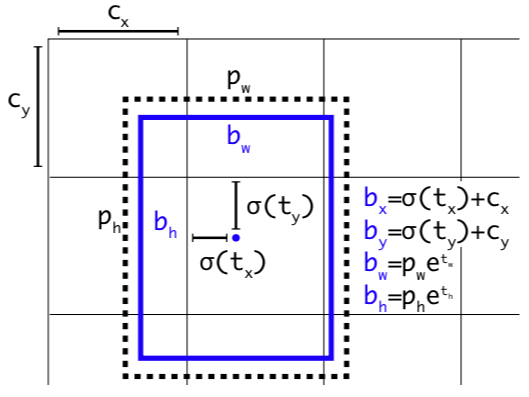</p>

**Fine-Grained Features (Passthrough Layer)**

YOLOv2 predicts detections on a 13 x 13 feature map, as well as an earlier layer at 26 x 26 resolution
to better detect small objects (and objects at different scale). It turns the 26 x 26 x 512 feature
map into a 13 x 13 x 2048 feature map and concatenates it with the original 13 x 13 feature map.
This gives a modest 1% performance increase.

**Multi-Scale Training**

YOLOv2 can take images of different sizes since it removes the fully connected layers. Therefore,
instead of fixing the input size to 416 x 416, it takes images of multiple size, both is a factor
of 32, i.e. 320 x 320, 352 x 352, ... and 608 x 608. For every 10 batches, YOLOv2 randomly selects
another image size to train the model.

**Faster: Darknet 19**

YOLOv2 uses a new classification model as a backbone classifier. It pre-trains the backbone with
ImageNet 1000 class dataset for 160 epochs.

<p align="center">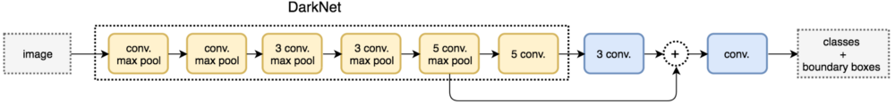</p>
<p align="center"><a href="https://medium.com/@jonathan_hui/real-time-object-detection-with-yolo-yolov2-28b1b93e2088" style="font-size: 12px">Image Source</a></p>

**Stronger: Joint Classification and Detection**

Datasets for object detection have far fewer class categories than those for classification. To
expand the classes that YOLOv2 can detect, YOLOv2 proposes a method to mix images from both
detection and classification datasets during training.

When the network sees an image labelled for detection we can backpropagate based on the full YOLOv2
loss function. When it sees a classification image we only backpropagate loss from the classification
specific parts of the architecture.

YOLOv2 solves challenges in the above procedure using "Hierarchical classification" with WordTree.

*References*

- https://medium.com/@jonathan_hui/real-time-object-detection-with-yolo-yolov2-28b1b93e2088

## R-FCN, 2016

[R-FCN](https://arxiv.org/abs/1605.06409) stands for Region-based Fully Convolutional Network. R-FCN
improves the speed of Faster R-CNN by 2.5 ~ 20x speed up with competitive accuracy. The core idea
for improvement is `position sensitive score maps`. As shown in the following network flow, another
convolutional layer is added between backbone network and RoI pooling: output of this layer is the
score maps:

<p align="center">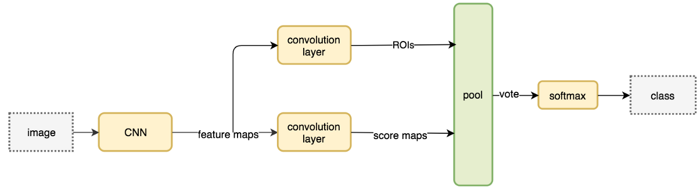</p>
<p align="center"><a href="https://medium.com/@jonathan_hui/understanding-region-based-fully-convolutional-networks-r-fcn-for-object-detection-828316f07c99" style="font-size: 12px">Image Source</a></p>

The reason behind the design is due to the dilemma of image classification & object detection, i.e.
increasing translation invariance for image classification vs. respecting translation variance for
object detection.

In summary:

> In R-FCN, we still have RPN to obtain region proposals, but unlike R-CNN series, FC layers after
> ROI pooling are removed. Instead, all major complexity is moved before ROI pooling to generate the
> score maps. All region proposals, after ROI pooling, will make use of the same set of score maps
> to perform average voting, which is a simple calculation. Thus, No learnable layer after ROI layer
> which is nearly cost-free. As a results, R-FCN is even faster than Faster R-CNN with competitive
> mAP.

Following is a detailed diagram of R-FCN. The feature maps from backbone network (e.g. ResNet without
average pooling and fc layers) are fed into two conv layers: one for RPN, the other for generating
score maps. The first conv layer is the same as RPN in Faster R-CNN, while the second is a `k * k * (C+1)`
conv layer, where `k * k` is the position dimension and `C` is the number of class.

Output from the second layer is the so-called `position sensitive score maps`. As shown above, its
dimension is `k * k * (C+1)`, i.e. each class will have a `k * k` score maps. Furthermore, each RoI
is divided into `k * k` bins, and for each of the `k * k` bins in an RoI, pooling is only performed
on one of the `k * k` maps (marked by different colors).

<p align="center">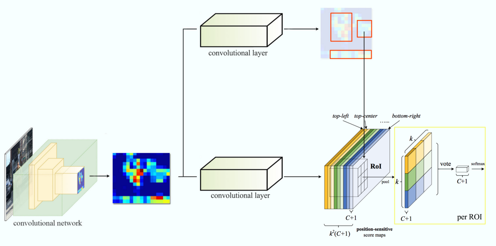</p>
<p align="center"><a href="https://medium.com/@jonathan_hui/understanding-region-based-fully-convolutional-networks-r-fcn-for-object-detection-828316f07c99" style="font-size: 12px">Image Source</a></p>

Details about position-sensitive pooling. Big blue square is the object, and dotted red square is
one proposed RoI. Score of each bin is calculated via IoU, and the final score is averaged across
`k * k` bins.

<p align="center"></p>
<p align="center"></p>
<p align="center"><a href="https://medium.com/@jonathan_hui/understanding-region-based-fully-convolutional-networks-r-fcn-for-object-detection-828316f07c99" style="font-size: 12px">Image Source</a></p>

*References*

- [understanding-region-based-fully-convolutional-networks-r-fcn-for-object-detection](https://medium.com/@jonathan_hui/understanding-region-based-fully-convolutional-networks-r-fcn-for-object-detection-828316f07c99)
- [review-r-fcn-positive-sensitive-score-maps-object-detection](https://towardsdatascience.com/review-r-fcn-positive-sensitive-score-maps-object-detection-91cd2389345c)

## FPNs, 2016

[FPNs](https://arxiv.org/abs/1612.03144) stands for Feature Pyramid Networks, it is a generic feature
extractor for several applications. The goal of FPNs is to naturally leverage the pyramidal shape of
a convnet's feature hierarchy while creating a feature pyramid that has strong semantics at all scales.
Here,
- `convnet's feature hierarchy`: Convnet typically contains multiple layers, thus we'll have multiple
  feature maps. Lower (shadower) layers are spatially finer but semantically weaker, while higher
  (deeper) layers are spatially coarser but semantically stronger. This is the so-called `feature
  hierarchy`.
- `strong semantics at all scales`: As mentioned above, different layers have different semantics.
  FPNs aims to provide strong semantics for every layer, thus each layer can be used for prediction.
  This way, we essentially have a featurized image pyramid, i.e. each layer contains meaningful
  features while at different scales.

FPNs is used in many subsequent models, e.g. RetinaNet, Mask R-CNN.

**Detection Architecture Overview**

<p align="center">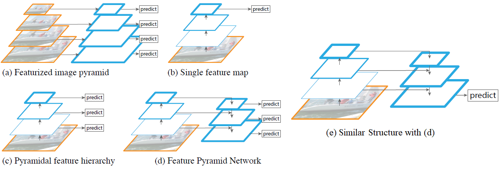</p>

The authors list feature pyramids architectures in various literature:
- (a) *Featurized Image Pyramid*: it is heavily used in the era of hand-engineered features, i.e.
  compute features across a pyramids of images (images of different scales). For example, DPM, etc.
- (b) *Single Feature Map*: It is a standard ConvNet solution on a single input image which has
  the prediction at the end of network. For example, VGG, SPPNet, etc
- (c) *Pyramidal Feature Hierarchy*: At each layer, features are directly used for prediction.
  This is the feature hierarchy mentioned above, since each layer will output feature maps, thus it
  comes without cost. For example, SSD, etc. Note that SSD doesn't use lower layers since they lack
  semantics, therefore it misses the opportunity to reuse the higher-resolution maps of the feature
  hierarchy, consequently misses the detection for small objects.
- (d) *Feature Pyramid Network*: This is the architecture proposed in FPNs, i.e. combines
  low-resolution, semantically strong features with high-resolution, semantically weak features via
  a top-down pathway and lateral connections. Some concurrent works like DSSD also use this approach.
- (e) *Similar Architecture*. Some recent research adopted the similar top-down and skip connections
  such as TDM, SharpMask, RED-Net, U-Net, which were quite popular at that moment, but only predict
  at the last stage.

**Feature Pyramid Network**

The core of FPNs is the bottom-up and top-down pathway architecture:
- bottom-up pathway is the regular forward convolution network.
- top-down pathway upsamples feature maps from higher pyramid levels using lateral connections.

<p align="center"></p>
<p align="center"><a href="https://medium.com/@jonathan_hui/understanding-feature-pyramid-networks-for-object-detection-fpn-45b227b9106c" style="font-size: 12px">Image Source</a></p>

In the above figure, C2-C5 are convolutions of the backbone network, with scale factor of 0.5x.
Note here C2-C5 is not a single convolution, it is a group of convolutions with the same output
dimension, called `stage`. The last feature map of a stage is used for lateral connection. C1 is
not used since its spatial dimension is quite large.

M2-M5 are feature maps in top-down pathway, each one is the result of applying feature maps of C2-C5
and 2x scale of previous map. C2-C5 has 1x1 convolution to reduce dimension, and the 2x scale is to
match spatial dimension (using nearest neighbor upsampling for simplicity). This lateral connection
combines semantic information from M and spatial information from C. Note the 3x3 convolution applied
to M2-M4 (all merged layers) is to remove aliasing effect.

<p align="center">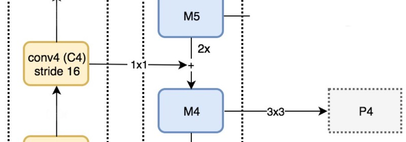</p>
<p align="center"><a href="https://medium.com/@jonathan_hui/understanding-feature-pyramid-networks-for-object-detection-fpn-45b227b9106c" style="font-size: 12px">A lateral connection (Image Source)</a></p>

P2-P5 are the final pyramidal feature maps. Because we share the same classifier and box regressor
of every output feature maps, all feature maps (P5, P4, P3 and P2) have 256-d output channels.

**FPN with RPN**

FPN is not an object detector by itself. It is a feature detector that works with object detectors.
The authors define a `head` here as a 3x3 convolution followed by two 1x1 convolutions for prediction
and bbox regression. FPN with RPN simply applies head to each of the feature maps (P2-P5), unlike
the plain RPN which slides through a single feature map. Note the parameters of the heads are shared
across all feature pyramid levels.

On the other hand, since we are now sliding through all feature maps, it is unnecessary to define
anchor boxes with different scales (recall that in RPN, anchors are fixed bounding boxes with different
scales and aspect ratio on one feature map, in order to capture objects with different shapes).
Formally, the authors define the anchors with areas of `{32², 64², 128², 256², 512²}` pixels on
`{P2, P3, P4, P5, P6}` respectively. And at each level, multiple aspect ratios of `{1:2, 1:1, 2:1}`
are used.

> Here we introduce P6 only for covering a larger anchor scale of 5122. P6 is simply a stride two
> subsampling of P5. P6 is not used by the Fast R-CNN detector in the next section.

FPN with RPN improves AR (average recall: the ability to capture objects) to 56.3, an 8.0 points
improvement over the RPN baseline. The performance on small objects is increased by a large margin
of 12.9 points.

<p align="center">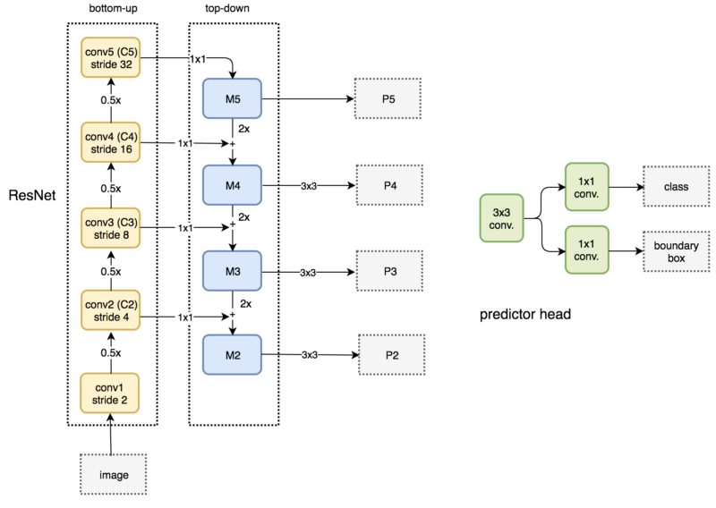</p>
<p align="center"><a href="https://medium.com/@jonathan_hui/understanding-feature-pyramid-networks-for-object-detection-fpn-45b227b9106c" style="font-size: 12px">FPN with RPN (Image Source)</a></p>

**FPN with Fast or Faster R-CNN**

In Fast/Faster R-CNN, the detector receives multiple region proposals, or RoI (around 2000), but
uses only one feature map to create feature patches and feeds into the RoI pooling. To leverage
multiple feature maps, the authors assign each region proposal to different feature map based on
its size , i.e. smaller region proposal will be assigned to finer-resolution feature map, see figure
below. Following steps are the same as Fast R-CNN, i.e. RoI pooling, fc layers, etc.

<p align="center"></p>
<p align="center"><a href="https://medium.com/@jonathan_hui/understanding-feature-pyramid-networks-for-object-detection-fpn-45b227b9106c" style="font-size: 12px">FPN with Fast or Faster R-CNN (Image Source)</a></p>

*References*

- [understanding-feature-pyramid-networks-for-object-detection-fpn](https://medium.com/@jonathan_hui/understanding-feature-pyramid-networks-for-object-detection-fpn-45b227b9106c)
- [review-fpn-feature-pyramid-network-object-detection](https://towardsdatascience.com/review-fpn-feature-pyramid-network-object-detection-262fc7482610)

## RetinaNet, 2018

[RetinaNet](https://arxiv.org/abs/1708.02002) is a one-stage detector using **focal loss**. The aim
of the paper is to understand if one-stage detectors can match or surpass the accuracy of two-stage
detectors while running at similar or faster speeds.

The authors conclude that the extreme imbalance between forground-class and background-class results
in less accurate detection for one-stage detector.  In two stage detector, the first stage (RPN,
Selective Search, etc) will narrow down region proposals to a small number (around 1~2k); while in
one stage detector, there will be much larger number of negative *region proposals* because of
anchors, sliding windows, etc (around 100k), see below:

<p align="center">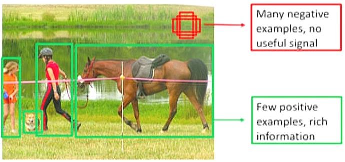</p>

Despite the new network name `RetinaNet`, the core of of the detector is not based on innovations in
network design but due to the novel loss: **focal loss**.

**Focal Loss**

Before entering focal loss, let's review the aforementioned one-shot detection problem with CE loss.
The detection might have 100k easy background regions and 100 hard foreground regions. Following
calculation shows that easy background regions contributes to large portion of CE loss.
- For easy background, the prediction is `y=0` and `pt=0.9` (very confident). In CE loss, the average
  loss can be small (e.g. 0.1), but the total loss for easy background regions is large due to the
  number of background, i.e. 10,000.
- For hard foreground, the prediction is `y=1` and `pt` varies, e.g. from 0.1 to 0.9. Let's say on
  average, the loss is 2.5 per region, so the total loss is about 250, which is 40x smaller than
  loss from background regions.

Focal loss is a direct modification of cross entropy loss to fix the above problem, i.e.

<p align="center">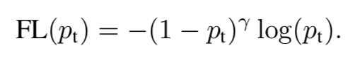</p>

where:

<p align="center">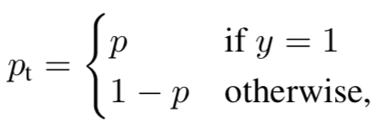</p>

The loss function is a dynamically scaled cross entropy loss, where the scaling factor decays to
zero as confidence in the correct class increases. Intuitively, this scaling factor can automatically
down-weight the contribution of easy examples during training and rapidly focus the model on hard
examples.

A modulating factor `(1-pt)^γ` is added to the cross entropy loss where `γ` is tested from [0,5] in
the experiment, with 2 being the best choice. In addition, the authors also propose a `α-Balanced`
Variant of FL, which is slightly more effective in practice:

<p align="center">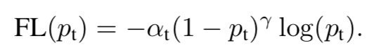</p>

Yet another optimization is model initialization, where a prior `π` is set for the value of `p` at
the start of training, so that the model's estimated `p` for examples of the rare class is low.

**Architecture**

Following is the core architecture, consists of:
- ResNet as the backbone network
- FPN for multi-scale features
- One FCN for class subnet
- One FCN for box subnet

Here, `K` is number of classes, `A` is number of anchors. Anchors design follows FPN.

<p align="center">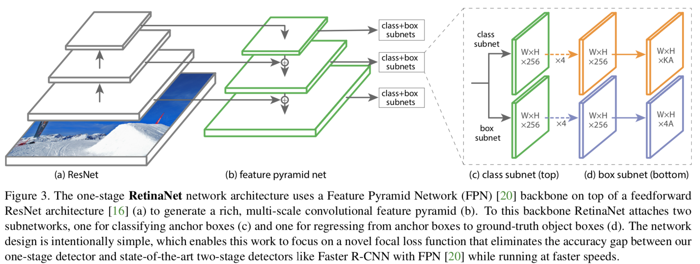</p>

> In this work, we identify class imbalance as the primary obstacle preventing one-stage object
> detectors from surpassing top-performing, two-stage methods. To address this, we propose the focal
> loss which applies a modulating term to the cross entropy loss in order to focus learning on hard
> negative examples. Our approach is simple and highly effective. We demonstrate its efficacy by
> designing a fully convolutional one-stage detector and report extensive experimental analysis
> showing that it achieves state-of-the-art accuracy and speed.

*References*

- [review-retinanet-focal-loss-object-detection](https://towardsdatascience.com/review-retinanet-focal-loss-object-detection-38fba6afabe4)

# Models: Object Segmentation

Segmentation tasks identify objects in pixel level, thus they are harder than Image Classification
and Object Detection models. There are different kinds of segmentations:
- Semantic Segmentation: identify the object category of each pixel for every known object within an
  image. **Labels are class-aware.** Models for semantic segmentations are FCNs, etc
- Instance Segmentation: identify each object instance of each pixel for every known object within an
  image. **Labels are instance-aware.** Models for instance segmentations are Mask R-CNN, etc

<p align="center">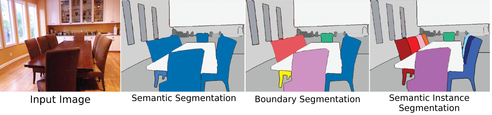</p>
<p align="center"><a href="https://stackoverflow.com/questions/33947823/what-is-semantic-segmentation-compared-to-segmentation-and-scene-labeling" style="font-size: 12px">Image Source</a></p>

## FCNs, 2014

[FCN](https://arxiv.org/abs/1411.4038) is a pretty important paper for semantic segmentation: many
of the future works are based on FCNs. The basic idea behind a fully convolutional network is that
all of its layers are convolutional layers. FCNs are a rich class of models, of which modern
classification convnets are a special case.

The main contributions of the paper:
- It first shows that classification models (e.g. VGG, GoogLeNet, etc) can be used for semantic
  segmentation tasks by replacing fully-connected layers with convolutional layers to **classify
  each pixel** in the image using softmax. The classification model is pretrained on classification
  problems, i.e. transfer learning.
- Then, it uses Deconvolutions to upsample feature maps from the first step in order to recover
  image size for pixelwise dense predictions.
- Last, a novel "skip architecture" is proposed to improve the above modified model. The skip
  architecture combines coarse, semantic (deep layers) and local, appearance information (shallow
  layers) to refine prediction.

Following is the architecture of FCN (to be specific, FCN-8s since we use 8x upsampling):

<p align="center">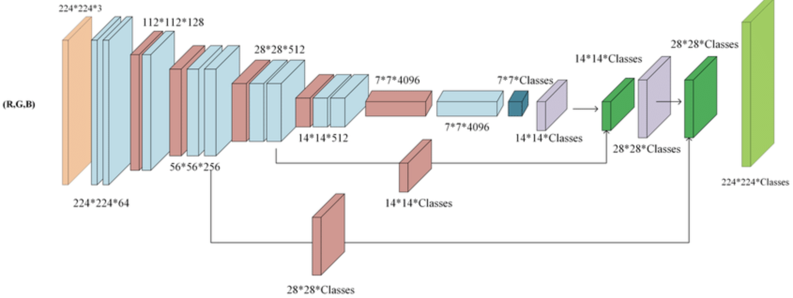</p>
<p align="center"><a href="https://www.researchgate.net/figure/Fully-convolutional-neural-network-architecture-FCN-8_fig1_3275213143" style="font-size: 12px">Image Source</a></p>

**Fully Convolutions & Deconvolutions**

In FCN, the final output layer will be the same height and width as the input image, but the number
of channels will be equal to the number of classes. In the paper, the authors use 21 channels for
PASCAL dataset (20 classes plus a background class).

> We decapitate each net by discarding the final classifier layer, and convert all fully connected
> layers to convolutions. We append a 1 × 1 convolution with channel dimension 21 to predict scores
> for each of the PASCAL classes (including background) at each of the coarse output locations,
> followed by a deconvolution layer to bilinearly upsample the coarse outputs to pixel-dense outputs.

FCNs use "transposed convolutions" to upsample the convolution outputs to make the final prediction
match the shape of input image. Transposed convolutions are just convolutions, their weights are
learnable, just like normal convolutions.

<p align="center"></p>
<p align="center"><a style="font-size: 12px">Converting fully-connected layers to convolutional layers</a></p>

**Fusing layers**

Although converting canonical networks like AlexNet, VGG, and GoogLeNet into FCNs can help solve
semantic segmentation problems, the result is not very accurate. The main reason is that output
dimensions are typically reduced by subsampling in classification network, thus spatial information
are discarded. This makes sense for classification problem since in such problem, we only care about
global information, but this is not the case for semantic segmentation.

The authors define a new fully convolutional net (FCN) for segmentation that combines layers of the
feature hierarchy and refines the spatial precision of the output. To simply put, apart from
upsampling from the final convolutional layer (32x upsampling), FCNs also use lower layers for
prediction.

<p align="center">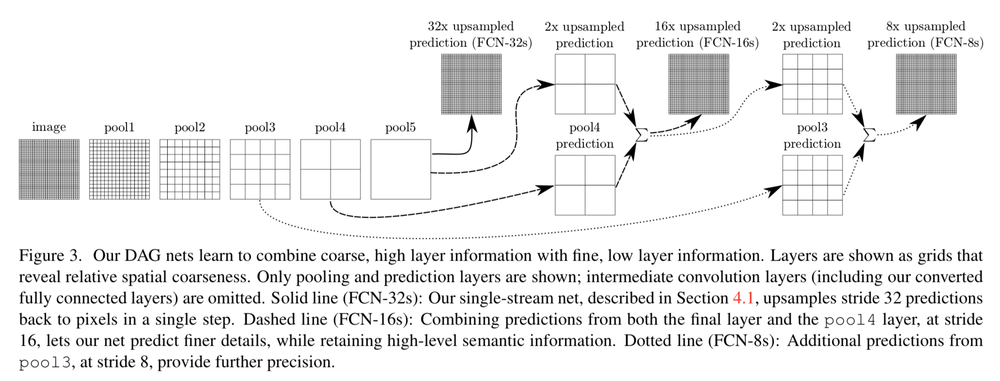</p>

*References*

- https://zhuanlan.zhihu.com/p/37803719
- https://medium.com/self-driving-cars/literature-review-fully-convolutional-networks-d0a11fe0a7aa
- https://towardsdatascience.com/review-fcn-semantic-segmentation-eb8c9b50d2d1
- https://fairyonice.github.io/Learn-about-Fully-Convolutional-Networks-for-semantic-segmentation.html

## U-Net, 2015

[U-Net](https://arxiv.org/abs/1505.04597) is a convolution network built upon FCN. The key
modifications are:
- uses multiple upsampling layers (upsampling is _mirrored_ from downsampling)
- uses skip connections and concatenates instead of adding up
- uses learnable weight filters instead of fixed interpolation technique

Following is the overall architecture:

<p align="center">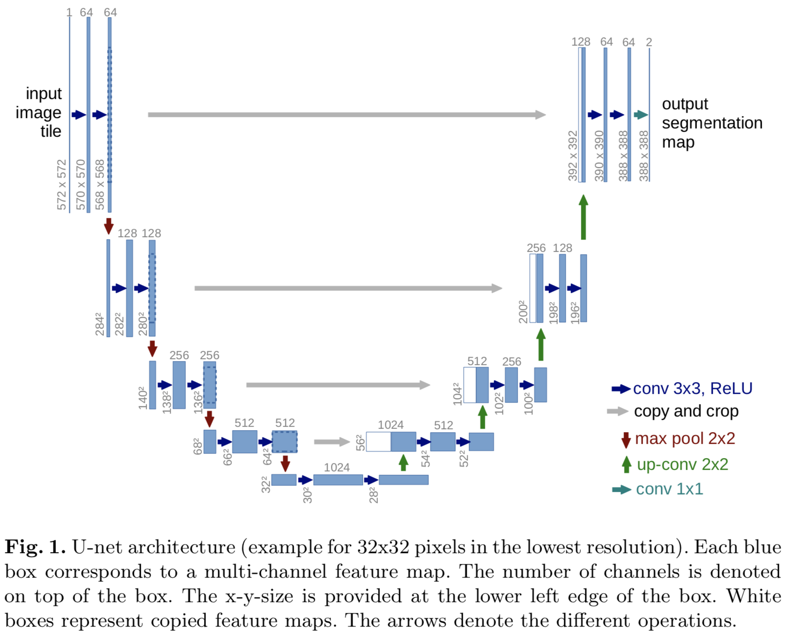</p>

*References*

- https://medium.com/@keremturgutlu/semantic-segmentation-u-net-part-1-d8d6f6005066
- https://stackoverflow.com/questions/50239795/intuition-behind-u-net-vs-fcn-for-semantic-segmentation

## DeepLab (TODO)

https://arxiv.org/abs/1606.00915

https://sthalles.github.io/deep_segmentation_network/

## Mask R-CNN, 2017

[Mask R-CNN](https://arxiv.org/abs/1703.06870) is an approach for instance segmentation, which
extends Faster R-CNN by adding a branch for predicting segmentation masks on each Region of Interest
(RoI), in parallel with the existing branch for classification and bounding box regression, shown
below:

<p align="center">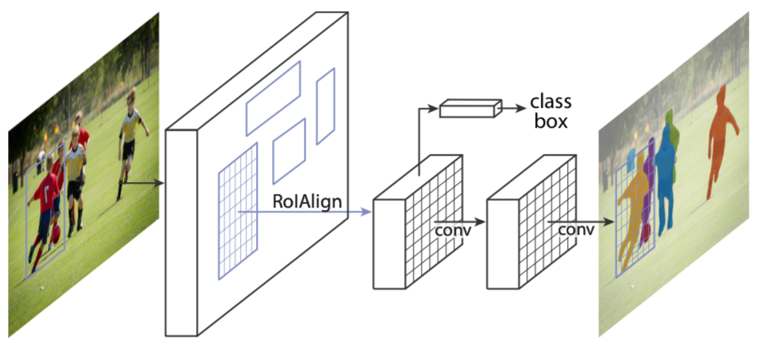</p>

**Architecture**

Following is a full architecture of Mask R-CNN: we can think of Mask R-CNN as combining the two
networks - Faster R-CNN and FCN in one mega architecture. There are two core design decisions:
- Mask branch prediction
- RoIAlign pooling

<p align="center">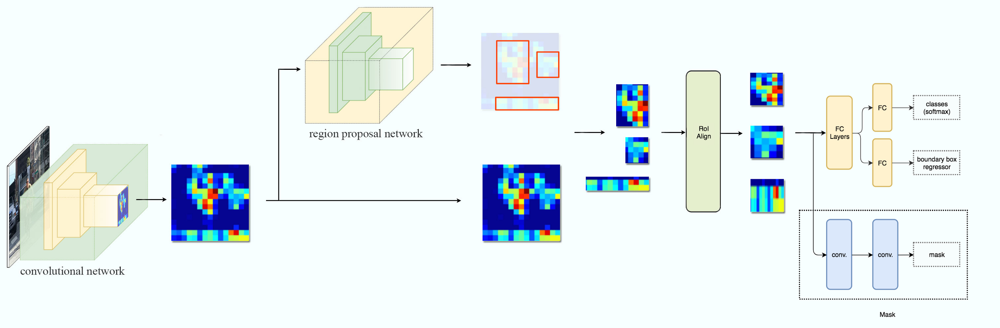</p>
<p align="center"><a href="https://medium.com/@jonathan_hui/image-segmentation-with-mask-r-cnn-ebe6d793272" style="font-size: 12px">Image Source</a></p>

The authors divide the network architecture into two parts: backbone and head. For backbone network,
the authors exprimented ResNet and ResNeXt, as well as ResNet-FPN with combines ResNet and FPN. The
head architecture changes depending on backbone network:

<p align="center">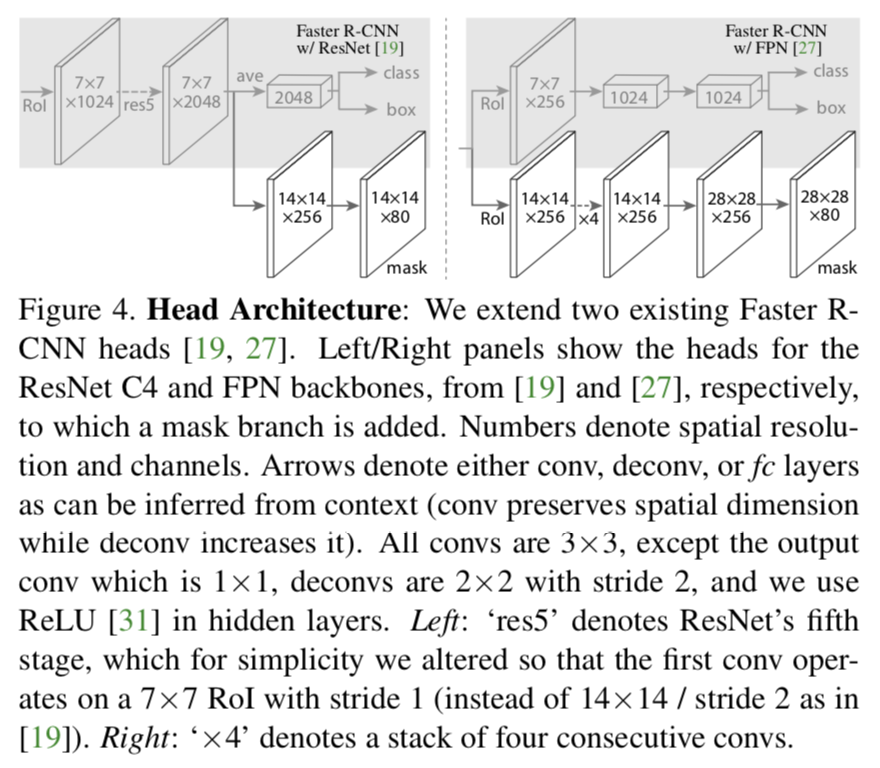</p>

**Mask Branch**

The mask branch is a small FCN applied to each RoI, predicting a segmentation mask in a pixel-to-pixel
manner. It is applied in parallel with bounding-box classification and regression. The paper trains
Mask R-CNN branch on top of Faster R-CNN framework, but it can be trained with other architecture as
well, e.g. RetinaNet. The mask branch only adds a small computational overhead, enabling a fast
system and rapid experimentation.

For each RoI, the mask branch outputs a binary mask that says whether or not a given pixel is part
of an object (binary mask is a matrix with 1s on all locations where the pixel belongs to the object
and 0s elsewhere). The mask branch has a `K * m * m` dimensional output for each RoI, which encodes
K binary masks of resolution `m × m`, one for each of the K classes. Note the mask branch only
predicts mask: it predicts a binary mask for each class independently, without competition among
classes, and rely on the network's RoI classification branch to predict the category.

**RoIAlign**

Traditional RoI Pooling will lose spatial information of the original input image, which is not
acceptable in instance segmentation. To fix the misalignment, the authors propose a simple,
quantization-free layer, called `RoIAlign`, that faithfully preserves exact spatial locations.

The proposed change is illustrated below. Instead of quantizing region proposals, Mask R-CNN uses
bi-linear interpolation to compute the exact values of the input features.

<p align="center">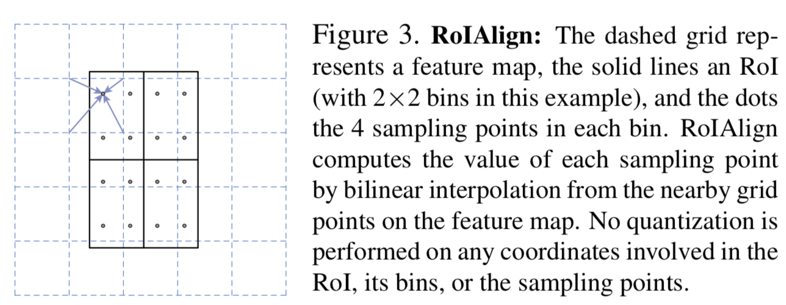</p>

> For example, in the figure (taken from the Mask RCNN paper), the 5×5 feature map from the last
> convolutional layer is shown with dotted lines. Let’s consider that the rectangular proposal is
> overlaid on the feature map at a certain position and is divided into four bins. Now you cannot
> simply apply the max pooling on each bin because of the misalignment of the region proposal on
> feature map. So four points are sampled in each bin and values at those points are determined
> using the bilinear interpolation; four nearest values on the feature map can be used for that
> purpose. So in each cell, the maximum value among the four is chosen. you get four values from
> the four cells in this example. So you get the 2×2 feature map which corresponds to the region
> proposal.

*References*

- https://medium.com/@jonathan_hui/image-segmentation-with-mask-r-cnn-ebe6d793272
- https://www.quora.com/How-does-ROTAlign-work-in-Mask-RCNN
- [a-brief-history-of-cnns-in-image-segmentation-from-r-cnn-to-mask-r-cnn](https://blog.athelas.com/a-brief-history-of-cnns-in-image-segmentation-from-r-cnn-to-mask-r-cnn-34ea83205de4)

# Models: Scene Text

Scene text related models can be divided into three categories:
- detection: those only detect texts, without recognizing content of the texts, e.g. CTPN, PSENet, etc
- recognition: those recognize texts, often used along with detection models, e.g. CRNN, etc
- spotting: those combine both detection and recognition, e.g. FOTS, etc

For detection algorithms, there are two main approaches:
- anchor-based: using anchor boxes typically seen in object detection models, e.g. CTPN.
- pixel-based: using object mask typically seen in object segmentation models, e.g. PSENet.

## CRNN, 2015

[CRNN](https://arxiv.org/abs/1507.05717) is a model for image-based sequence recognition problem.
The core of CRNN is a combination of three approaches:
- CNN network for feature sequence extraction
- RNN network for sequence labeling
- CTC as loss function

CRNN is end-to-end trainable, as its title suggests:
> An End-to-End Trainable Neural Network for Image-Based Sequence Recognition and Its Application to Scene Text Recognition

CRNN is not restricted to scene text recognition. Actually, it is evaluated on scene text recognition
as well as musical score recognition in the paper, which are both challenging vision tasks.

**CNN**

The overall CRNN architecture is shown below:

<p align="center">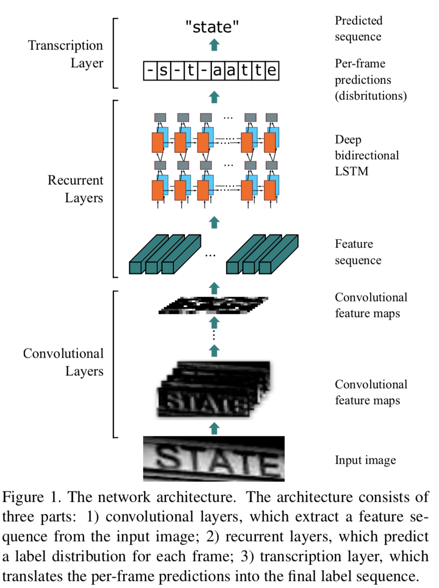</p>

The CNN network takes an input image and output a feature sequence. All the images need to be scaled
to the same height, e.g. 32. Then a sequence of feature vectors is extracted from the feature maps
produced by the component of convolutional layers, which is the input for the recurrent layers.
Specifically, each feature vector of a feature sequence is generated from left to right on the
feature maps by column. **This means the i-th feature vector is the concatenation of the i-th
columns of all the maps. The width of each column is fixed to 1 pixel.**

Following is the receptive field of each feature vector:

<p align="center">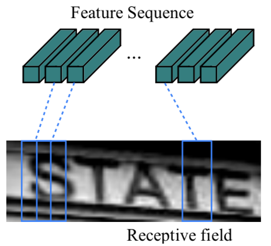</p>

**RNN**

A **deep bidirectional** Recurrent Neural Network (LSTM) is built on the top of the convolutional
layers, as the recurrent layers. The input of the RNN is the feature sequence, one feature vector
at a time. For example, up to this point, in the above architecture (image size is denoted as:
height x width x channel):
- The input image size is resized to `32 x W x 3`
- Output from CNN is `1 x (W/4) x 512`
- For LSTM, T=(W/4), D=512 (`T` stands for max time length, `D` stands for input feature dimension)

**Transcription**

Transcription is the process of converting the per-frame predictions made by RNN into a label
sequence. CRNN adopts the conditional probability defined in the Connectionist Temporal Classification
(CTC). The probability is defined for label sequence `l` conditioned on the per-frame predictions
`y=y1,...,yT`, and it ignores the position where each label in `l` is located.

*References*

- https://zhuanlan.zhihu.com/p/43534801
- https://blog.csdn.net/dcrmg/article/details/80189819
- https://github.com/githubharald/SimpleHTR

## CTPN, 2016

[CTPN](https://arxiv.org/abs/1609.03605) stands for Connectionist Text Proposal Network, it is a
region proposal network for scene text detection. The main components (and contributions) of the
paper is:
- fine-scale text anchor mechanism
- in-network recurrence mechanism
- side-refinement

Following is the overall architecture of CTPN:

<p align="center">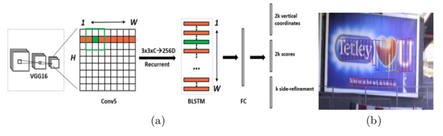</p>

System workflow:
- Input image first goes through a based network (VGG16), which outputs W × H × C conv5 feature
  map, where C is the number of feature maps or channels, and W × H is the spatial arrangement.
- A 3 x 3 x C window slides through the conv5 feature map, and then outputs another feature map.
- For each row of the original conv5 feature map (1 -> W), we feed corresponding new convoluted
  feature vecotor into a bidirectional LSTM (Tmax = W), which then outputs features with both
  spatial and sequential information.
- Features from BLSTM are fed into FC layer, whose outputs are then passed into RPN network, i.e.
  two branches for regression (predictiong text proposal y-coordinates, side-refinement) and
  classification (class scores) for k anchors at each location, i.e. conv5 feature map cell. Common
  strategies like NMS are used to filter proposals.

Loss function of CTPN consists of:
- Anchor softmax loss
- Anchor y coord regression loss
- Anchor x coord regression loss

**Fine-scale text anchor mechanism**

Two important designs in CTPN:
- Instead of predicting both x and y coordinates, CTPN fixes width of a proposal to 16 pixels, thus
  the network only needs to predict y-coordinate. This reduces search space, makes the model more
  reliable and works for multi-scale and multi aspect ratio intput.
- Inspired by Faster R-CNN, CTPN also uses anchor boxes. CTPN sets k=10 with height ranges from
  11 to 273 pixels in the input image. Predictions are y-coordinate and height, relative anchor
  boxes.

**In-network recurrence mechanism**

Text have strong sequential characteristics where the sequential context information is crucial to
make a reliable decision. CTPN uses BLSTM to encode sequential information, and furthermore, it
encodes this information directly in the convolution layer, resulting an in-network connection of
the fine-scale text proposals. The overall network can be trained end-to-end.

To be specific, the authors propose to design a RNN layer upon the conv5 feature map, which takes
the convolutional feature of each window as sequential inputs, and updates its internal state
recurrently in the hidden layer `Ht`, i.e.  `Ht = φ(Ht−1,Xt), t = 1,2,...,W`.

**Side-refinement**

The section first proposes a method to combine multiple fine-scale text proposals into a text line,
using a couple of rules, i.e. under what circumstance can we merge two fine-scale text proposals
into one.

However, the method itself is not sufficient for accurate detection. The fine-scale detection and
RNN connection are able to predict accurate localizations in vertical direction. In horizontal
direction, the image is divided into a sequence of equal 16-pixel width proposals. This may lead to
an inaccurate localization when the text proposals in both horizontal sides are not exactly covered
by a ground truth text line area, or some side proposals are discarded.

<p align="center">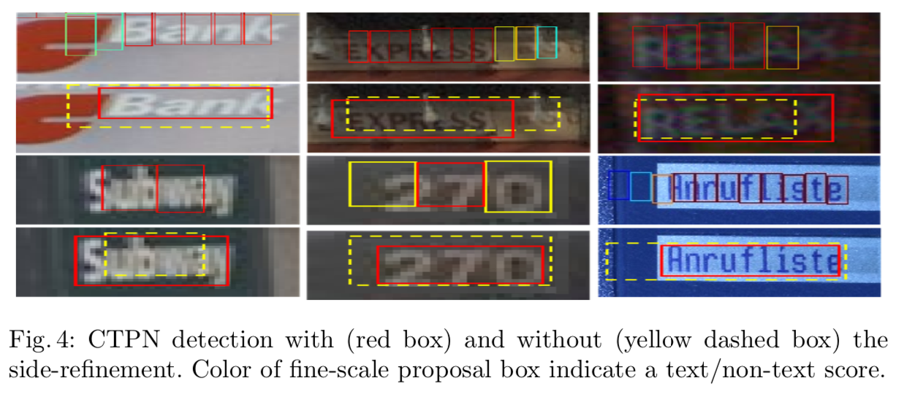</p>

To address this problem, the authors propose a side-refinement approach that accurately estimates
the offset for each anchor/proposal in both left and right horizontal sides (referred as side-anchor
or side-proposal).

*References*

- https://zhuanlan.zhihu.com/p/34757009

## EAST (TODO)

https://arxiv.org/abs/1704.03155

## FOTS, 2018

[FOTS](https://arxiv.org/abs/1801.01671) stands for Fast Oriented Text Spotting, it is a unified
end-to-end trainable network for simultaneous detection and recognition, sharing computation and
visual information among the two complementary tasks. This is one of the first end-to-end trainable
framework for oriented text detection and recognition. Most existing methods treat text detection
and recognition as separate tasks.

FOTS is heavily inspired by CRNN and EAST.

**Architecture**

FOTS consists of four parts:
- shared convolutions
- the text detection branch
- the RoIRotate operation
- the text recognition branch

<p align="center">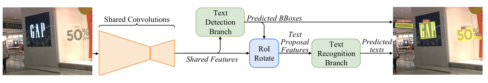</p>
<p align="center"><a style="font-size: 12px">Overall Architecture</a></p>

**Shared Convolutions**

The backbone of the shared convolution part is based on ResNet-50. Inspired by FPN, it concatenates
low-level feature maps and high-level semantic feature maps, using deconv and bilinear upsampling.
As shown below, the output feature map size of shared convolution is 1/4, 1/8, 1/16, 1/32 of original
input image.

<p align="center">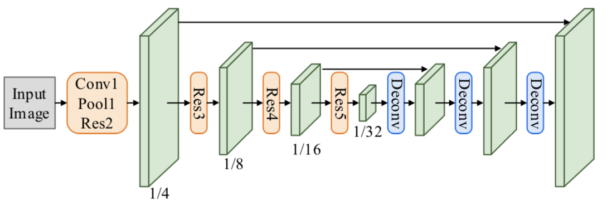</p>
<p align="center"><a style="font-size: 12px">Architecture of Shared Convolutions</a></p>

The shared convolution design is very similar to U-Net and EAST.

**Text Detection**

Text detection branch is a fully convolutional network operating on feature maps from shared
convolutions. Output from text detection branch is dense per-pixel predictions of words.
- The first channel computes the probability of each pixel being a positive sample
- For each positive sample, the following 4 channels predict its distances to top, bottom, left,
  right sides of the bounding box that contains this pixel
- The last channel predicts the orientation of the related bounding box.

The detection branch loss function is composed of two sterms: text classification term and bounding
box regression term. The text detection design is very similar to EAST.

**RoIRotate**

RoIRotate is an operation that applies transformation on oriented feature regions to obtain
axis-aligned feature maps, i.e. rotate RoI to horizontal region or vertical region, shown below:

<p align="center">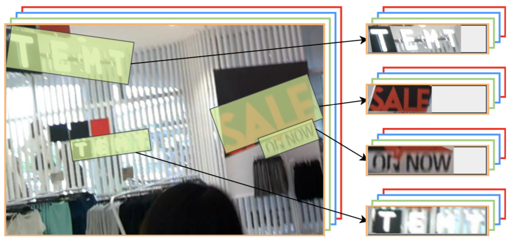</p>
<p align="center"><a style="font-size: 12px">Illustration of RoIRotate</a></p>

RoIRotate can be divided into two steps (similar to Spatial Transformer Network):
- First, affine transformation parameters are computed via predicted or ground truth coordinates of text proposals.
- Then, affine transformations are applied to shared feature maps for each region respectively, and canonical horizontal feature maps of text regions are obtained.

After RoIRotate, transformed feature maps are fed to the text recognition branch.

Two more notes here:
- FOTS fixes the output height and keep the aspect ratio unchanged to deal with the variation in text length.
- FOTS uses ground truth text regions instead of predicted text regions during training for better recognition accuracy.

**Text Recognition**

The text recognition branch aims to predict text labels using the region features extracted by shared
convolutions and transformed by RoIRotate. The overall architecture is similar to CRNN:
- First, spatial features are fed into several sequential convolutions and poolings (VGG-like) along height axis with dimension reduction to extract higher-level features
- Next, the extracted higher-level feature maps are permuted to time major form as a sequence and fed into bidirectional RNN
- Finally, CTC is used to transform frame-wise classifica- tion scores to label sequence.

*References*

- http://www.pianshen.com/article/1462337783/

## PSENet, 2018

[PSENet](https://arxiv.org/abs/1806.02559) is **pixel-wise instance segmentation** based convolutional
neural network for scene text detection. The authors first identify two challenges of shape robust text
detection:
- most existing quadrangular bounding box based detectors are difficult to locate texts with arbitrary shapes
- most pixel-wise segmentation-based detectors may not separate the text instances that are very close to each other

Consequently, PSENet is proposed to address the two problems:
- detecting arbitrary shaped text can be naturally achieved using instance segmentation based network
- a **progressive scale expansion algorithm** is proposed to accurately separate the text instances standing closely to each other

Following is an illustration:

<p align="center">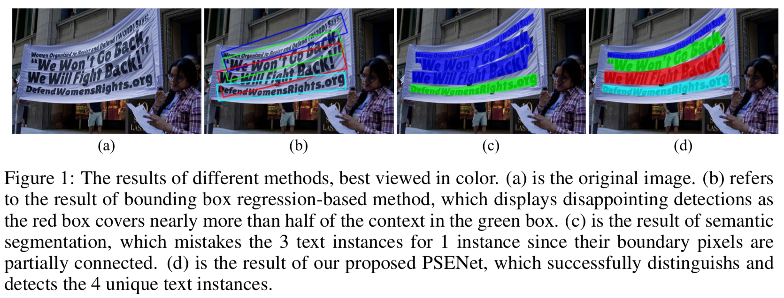</p>

**Architecture**

Following is an overall architecture pipeline of PSENet.
- On the left is a FPNs with feature maps from P2 to P5, each with different scale.
- The feature maps are concatenated into a fused map `F` to encode informations with various receptive views.
- The feature map `F` is projected into `n` branches to produce multiple segmentation results S1, S2, ...Sn.
  Each `Si` would be one segmentation mask for all the text instances at a certain scale.
- After obtaining these segmentation masks, progressive scale expansion algorithm is used to gradually
  expand all the instances' kernels in S1, to their complete shapes in Sn, and obtain the final detection
  results as R.

> The backbone of PSENet is implemented from FPN. We firstly get four 256 channels feature maps
> (i.e. P2, P3, P4, P5) from the backbone. To further combine the semantic features from low to high
> levels, we fuse the four feature maps to get feature map F with 1024 channels via the function C(·)
> as: F = C(P2, P3, P4, P5) = P2 ∥ Up×2(P3) ∥ Up×4(P4) ∥ Up×8(P5), where "∥" refers to the concatenation
> and Up×2(·), Up×4(·), Up×8(·) refer to 2, 4, 8 times upsampling, respectively. Subsequently, F is
> fed into Conv(3, 3)-BN-ReLU layers and is reduced to 256 channels. Next, it passes through multiple
> Conv(1, 1)-Up-Sigmoid layers and produces n segmentation results S1 , S2 , ..., Sn . Here, Conv,
> BN, ReLU and Up refer to convolution, batch normalization, rectified linear units and upsampling.

<p align="center">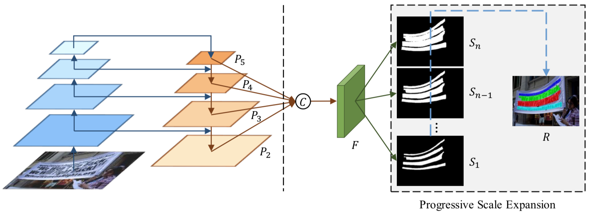</p>

**Progressive Scale Expansion Algorithm**

Following is an example of the procedure of progressive scale expansion algorithm, whose central idea
is brought from the Breadth-First-Search (BFS) algorithm.

<p align="center">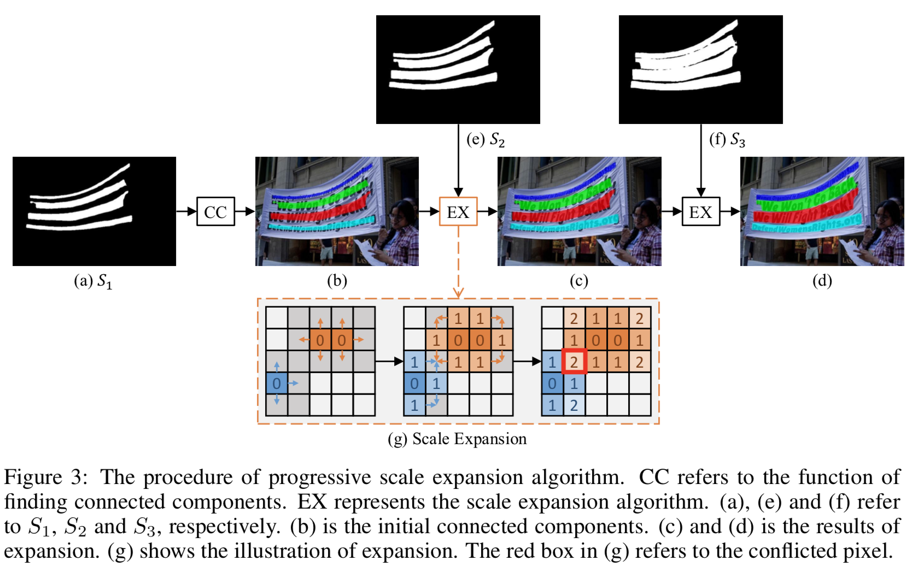</p>

**Label Generation**

Because PSENet produces segmentation results (e.g. S1, S2, ..., Sn) with different kernel scales.
Therefore, it requires the corresponding ground truths with different kernel scales as well during
training. To obtain the shrunk masks labels in multiple kernel scales, PSENet utilizes the Vatti
clipping algorithm to shrink the original polygon `pn` by `di` pixels and get shrunk polygon `pi`.

<p align="center">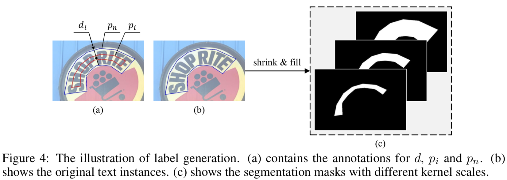</p>

*References*

- https://zhuanlan.zhihu.com/p/37884603
- https://zhuanlan.zhihu.com/p/68058851

# Models: Face Recognition

There are a couple of concepts in the area:
- face verification: output whether the input image is that of the claimed person
- face detection: detect face (bounding box) in input image, but doesn't need to provide its identity
- face recognition: output the identity (name or id) of the person in input image, or output 'not recognized'

## Siamese Network, 2005

Siamese networks are a special type of neural network architecture. Instead of a model learning
to classify its inputs, the neural networks learns to differentiate between two inputs, and learns
the similarity between them.

A Siamese networks consists of two identical (same weights) neural networks, each taking one of the
two input images. The last layers of the two networks are then fed to a contrastive loss function,
which calculates the similarity between the two images. In typical siamese networks, each sister
neural network is a convolutional neural network.

<p align="center"></p>

*References*

- http://yann.lecun.com/exdb/publis/pdf/chopra-05.pdf
- https://www.cs.cmu.edu/~rsalakhu/papers/oneshot1.pdf
- https://towardsdatascience.com/one-shot-learning-face-recognition-using-siamese-neural-network-a13dcf739e
- https://hackernoon.com/one-shot-learning-with-siamese-networks-in-pytorch-8ddaab10340e

## DeepFace, 2014

[DeepFace](https://www.cs.toronto.edu/~ranzato/publications/taigman_cvpr14.pdf) is a face verification
model published by Facebook in CVPR 2014.

This is the first highly successful application of deep neural networks to face verification, providing
approximately human-level performance in face verification, a subtask in facial recognition.

## FaceNet, 2015

[FaceNet](https://arxiv.org/abs/1503.03832) is a face recognition and clustering model published by
Google in 2015. It directly learns a mapping from face images to a compact Euclidean space where
distances directly correspond to a measure of face similarity. Once this space has been produced,
tasks such as face recognition, verification and clustering can be easily implemented using standard
techniques with FaceNet embeddings as feature vectors.

The main contribution of the paper is triplet loss (mentioned in "Loss Function" section). Different
embedding networks, like inception and AlexNet variants, are evaluated to learn the feature vectors.
In particular, the paper evaluates ZFNet and GoogLeNet.

> Once this embedding has been produced, then ... the tasks become straight-forward: face verification
> simply involves thresholding the distnace between the two embeddings; recognition becomes a k-NN
> classification problem; and clustering can be achieved using off-the-shelf techniques such as
> k-means or agglomerative clustering.

Note that FaceNet is a very deep model and is trained on extremely large dataset (260M).
