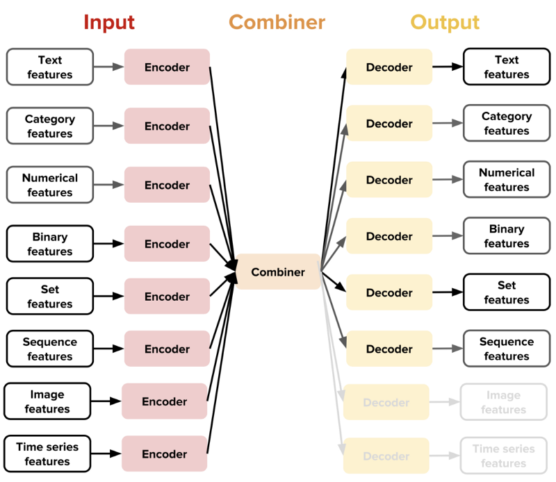

<!-- START doctoc generated TOC please keep comment here to allow auto update -->
<!-- DON'T EDIT THIS SECTION, INSTEAD RE-RUN doctoc TO UPDATE -->
**Table of Contents**  *generated with [DocToc](https://github.com/thlorenz/doctoc)*

- [Overview](#overview)
- [Design](#design)
  - [Data-type Feature](#data-type-feature)
  - [Encoders & Decoders](#encoders--decoders)
  - [Combiner](#combiner)
  - [Preprocessing](#preprocessing)
  - [Extensibility](#extensibility)
- [Experiments](#experiments)
  - [Text classification](#text-classification)

<!-- END doctoc generated TOC please keep comment here to allow auto update -->

# Overview

[Ludwig](https://github.com/uber/ludwig) is a toolbox built on top of TensorFlow that allows to
train and test deep learning models without the need to write code. It provides a set of model
architectures that can be combined together to create an end-to-end model for a given use case.

Ludwig allows its users to train a deep learning model by providing just a tabular file (like CSV)
containing the data and a YAML configuration file that specifies which columns of the tabular file
are input features and which are output target variables. The model definition can contain additional
information, in particular preprocessing information for each feature in the dataset, which encoder
or decoder to use for each feature, architectural parameters for each encoder and decoder, and
training parameters.

Default values of preprocessing, training, and various model architecture parameters are chosen
based on our experience or are adapted from the academic literature, allowing novices to easily
train complex models. At the same time, the ability to set each of them individually in the model
configuration file offers full flexibility to experts. In short, Ludwig is useful for:
- non-expert, to quickly train and test deep learning models without having to write code.
- experienced user, to obtain strong baselines to compare their models against and have an
  experimentation setting that makes it easy to test new ideas and analyze models by performing
  standard data preprocessing and visualization.

# Design

## Data-type Feature

The core design idea in Ludwig is per data-type feature, including:
- binary
- numerical
- category
- set
- bag
- sequence
- text
- time series
- image

## Preprocessing

Each data-type feature has its own `preprocessing`. It is defined as part of model definition.

## Encoders & Decoders

Each data-type feature has its own  `encoders` and `decoders`. Like in other deep learning
architectures, encoders are responsible for mapping raw data to tensors while decoders map tensors
to outputs.

For example, sequence feature has the
following encoders and decoders:
- Encoders
  - Embed Encoder
  - Parallel CNN Encoder
  - etc.
- Decoders
  - Tagger Decoder
  - Generator Decoder
  - etc.

As another example, for image feature:
- Encoders
  - Convolutional Stack Encoder
  - ResNet Encoder
  - etc.
- Decoders
  - N/A (no decoders)

Depending on specific feature, encoders and decoders have different architecture. For example, a
simple map, a convolution neural network, a recurrent neural network, fully-connected layer plus
softmax, etc.

## Combiner

The architecture of Ludwig also includes the concept of a combiner which is a component that combine
the tensors from all input encoders, process them, and return the tensors to be used for the output
decoders. Ludwig contains following combiners
- concat combiner
- sequence concat combiner
- sequence combiner

<p align="center"></p>

## Extensibility

It's possible to extend more features and for each feature, extend more encoders/decoders.

> In future releases, we hope to add several new encoders for each data type, such as Transformer,
> ELMo, and BERT for text, and DenseNet and FractalNet for images. We also want to add additional
> data types like audio, point clouds, and graphs, while at the same time integrating more scalable
> solutions for managing big data sets, like Petastorm.

# Experiments

*Date: 05/02/2019, v0.1.2*

## Text classification

Under `text-classification`, just run:

```
$ ludwig experiment \
  --data_csv reuters-allcats.csv \
  --model_definition_file model_definition.yaml
```

The input feature type for the task is `text`, whose default encoder is `parallel_cnn`. The output
feature type is `category`, whose default decoder is `fc_layers + softmax`. Ludwig will randomly
split the data for train, eval and test, and will stop training if valiation lose doesn't improve
in 5 epoches.
