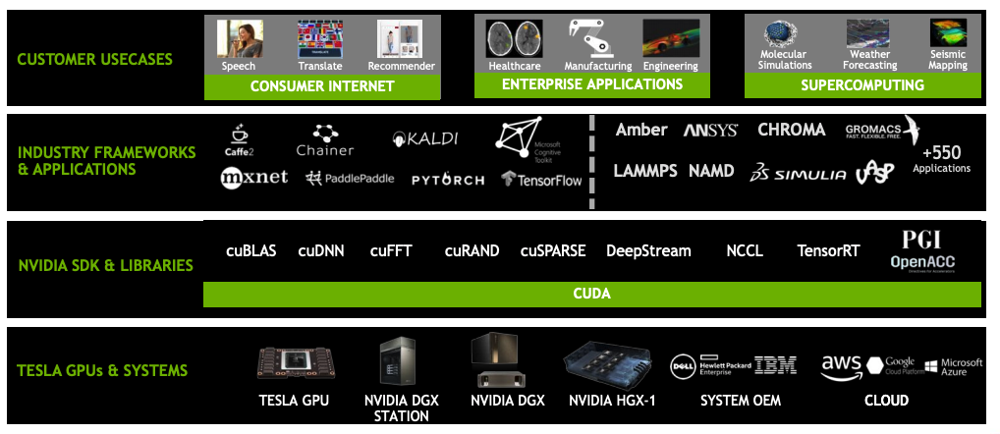

<!-- START doctoc generated TOC please keep comment here to allow auto update -->
<!-- DON'T EDIT THIS SECTION, INSTEAD RE-RUN doctoc TO UPDATE -->
**Table of Contents**  *generated with [DocToc](https://github.com/thlorenz/doctoc)*

- [CUDA](#cuda)

<!-- END doctoc generated TOC please keep comment here to allow auto update -->

# CUDA

CUDA is a parallel computing platform and programming model that higher level languages can use to
exploit parallelism. Following is a short list of important concepts in CUDA programming:
- kernel: a kernel is a small program or a function, and kernel is executed with the aid of threads
- thread: thread is an abstract entity that represents the execution of the kernel
- thread block: thread block represents a group of threads that can be executed serially or in parallel
- grid: multiple blocks are combined to form a grid: all the blocks in the same grid contain the same number of threads

In CUDA programming, multi-threaded applications kernel will receive thread index, block index, etc,
to facilitate parallel computation. The following code `blockIdx.x * blockDim.x + threadIdx.x` is
idiomatic CUDA.
- `threadIdx.x`: the index of the current thread within its block
- `blockDim.x`: the number of threads in the block
- `gridDim.x`: the number of blocks in the grid
- `blockIdx.x`: the index of the current thread block in the grid

```c++
__global__
void add(int n, float *x, float *y)
{
  int index = blockIdx.x * blockDim.x + threadIdx.x;
  int stride = blockDim.x * gridDim.x;
  for (int i = index; i < n; i += stride)
    y[i] = x[i] + y[i];
}
```

CUDA toolkit includes GPU-accelerated libraries, debugging and optimization tools, a C/C++ compiler
and a runtime library to deploy application. Following is an overview of the stack:

<p align="center"></p>

*References*

- https://devblogs.nvidia.com/even-easier-introduction-cuda/
- https://docs.nvidia.com/cuda/cuda-c-programming-guide/index.html
- https://en.wikipedia.org/wiki/CUDA
- https://en.wikipedia.org/wiki/Thread_block_(CUDA_programming)
