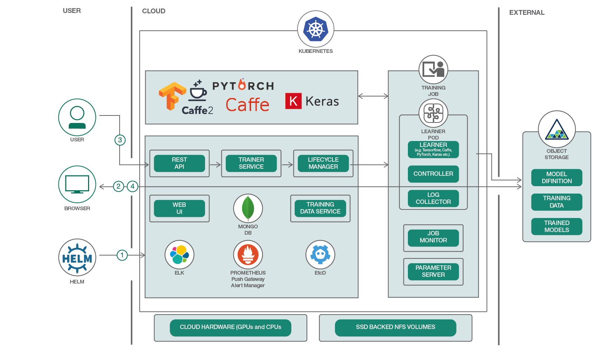

<!-- START doctoc generated TOC please keep comment here to allow auto update -->
<!-- DON'T EDIT THIS SECTION, INSTEAD RE-RUN doctoc TO UPDATE -->
**Table of Contents**  *generated with [DocToc](https://github.com/thlorenz/doctoc)*

- [Overview](#overview)
- [Components](#components)
- [Experiment](#experiment)
  - [Installation](#installation)
  - [Training](#training)

<!-- END doctoc generated TOC please keep comment here to allow auto update -->

# Overview

*Date: 07/08/2018*

FfDL (Fabric for Deep Learning) is a machine learning platform from IBM, forms the core of Watson
Studio Deep Learning Service. Currently FfDL only supports training, for more details, ref: [design doc](https://github.com/IBM/FfDL/blob/b339cbeda09fe730b9c4510154ce053fdb450ec6/design/design_docs.md).



# Components

Components in ffdl:
- API Server
- Trainer
- Lifecycle Manager
- Training Data Service
- etcd, mongo
- prometheus, alertmanager, pushgateway

# Experiment

## Installation

Install ffdl via helm (under ffdl directory):

```
$ kubectl -n kube-system create sa tiller
$ kubectl create clusterrolebinding tiller --clusterrole cluster-admin --serviceaccount=kube-system:tiller
$ helm init --service-account tiller

# Run local hostpath provisioner for 'standard' storageclass (home-made)
$ hostpath-provisioner.sh

$ export SHARED_VOLUME_STORAGE_CLASS="standard"
$ pushd bin
$ ./create_static_volumes.sh
$ ./create_static_volumes_config.sh
$ popd

# Before installing, change 'mongo:3.0' to 'mongo:3.4' or higher.
$ helm install . --set lcm.shared_volume_storage_class=$SHARED_VOLUME_STORAGE_CLASS
NAME:   independent-puma
LAST DEPLOYED: Sun Jul  8 15:05:12 2018
NAMESPACE: default
STATUS: DEPLOYED

RESOURCES:
==> v1/Pod
NAME   READY  STATUS             RESTARTS  AGE
etcd0  0/1    ContainerCreating  0         0s

==> v1beta1/StatefulSet
NAME     DESIRED  CURRENT  AGE
mongo    1        1        0s
storage  1        1        0s

==> v1/Secret
NAME                  TYPE    DATA  AGE
lcm-secrets           Opaque  6     0s
rsa-keys              Opaque  2     0s
trainer-secrets       Opaque  4     0s
trainingdata-secrets  Opaque  4     0s

==> v1/ServiceAccount
NAME      SECRETS  AGE
ffdl-lcm  1        0s

==> v1/Service
NAME               TYPE       CLUSTER-IP  EXTERNAL-IP  PORT(S)                     AGE
etcd0              ClusterIP  10.0.0.175  <none>       2379/TCP,2380/TCP           0s
etcd               ClusterIP  10.0.0.24   <none>       2379/TCP                    0s
mongo              ClusterIP  10.0.0.116  <none>       27017/TCP                   0s
s3                 NodePort   10.0.0.176  <none>       80:32387/TCP                0s
elasticsearch      NodePort   10.0.0.100  <none>       9200:31857/TCP              0s
alertmanager       ClusterIP  10.0.0.223  <none>       9093/TCP                    0s
prometheus         ClusterIP  10.0.0.71   <none>       9090/TCP                    0s
grafana            NodePort   10.0.0.210  <none>       80:30736/TCP                0s
pushgateway        ClusterIP  10.0.0.26   <none>       9091/TCP,9102/TCP,9125/UDP  0s
ffdl-lcm           ClusterIP  10.0.0.34   <none>       80/TCP                      0s
ffdl-restapi       NodePort   10.0.0.21   <none>       80:30260/TCP                0s
ffdl-trainer       NodePort   10.0.0.166  <none>       80:30850/TCP                0s
ffdl-trainingdata  NodePort   10.0.0.50   <none>       80:32015/TCP                0s
ffdl-ui            NodePort   10.0.0.186  <none>       80:30992/TCP                0s

==> v1/Pod(related)
NAME                                READY  STATUS             RESTARTS  AGE
alertmanager-57b64b6c8d-w2jtv       0/1    ContainerCreating  0         0s
prometheus-7bf4d6b774-lnxrz         0/2    ContainerCreating  0         0s
pushgateway-c7db68bf7-fd455         0/2    ContainerCreating  0         0s
ffdl-lcm-7b5cb8d4cb-s9x8l           0/1    ContainerCreating  0         0s
ffdl-restapi-79d6f4bf87-pc6t9       0/1    Pending            0         0s
ffdl-trainer-7644b7545f-bhs5j       0/1    Pending            0         0s
ffdl-trainingdata-748b697c9b-nhwv6  0/1    Pending            0         0s
ffdl-ui-686d58cd8b-bjwgk            0/1    Pending            0         0s
mongo-0                             0/1    Pending            0         0s
storage-0                           0/1    Pending            0         0s

==> v1/ConfigMap
NAME                       DATA  AGE
prometheus-alertmanager    1     0s
prometheus-alertrules      1     0s
prometheus                 1     0s
statsd-exporter-configmap  1     0s
learner-entrypoint-files   2     0s
learner-config             44    0s

==> v1beta1/ClusterRoleBinding
NAME      AGE
ffdl-lcm  0s

==> v1beta1/Deployment
NAME               DESIRED  CURRENT  UP-TO-DATE  AVAILABLE  AGE
alertmanager       1        0        0           0          0s
prometheus         1        0        0           0          0s
pushgateway        1        0        0           0          0s
ffdl-lcm           1        0        0           0          0s
ffdl-restapi       1        0        0           0          0s
ffdl-trainer       1        0        0           0          0s
ffdl-trainingdata  1        0        0           0          0s
ffdl-ui            1        0        0           0          0s
```

Final output:

```
$ kubectl get pods --all-namespaces
NAMESPACE     NAME                                 READY     STATUS        RESTARTS   AGE
default       alertmanager-57b64b6c8d-w2jtv        1/1       Running       0          20m
default       etcd0                                1/1       Running       0          20m
default       ffdl-lcm-7b5cb8d4cb-s9x8l            1/1       Running       1          20m
default       ffdl-restapi-79d6f4bf87-pc6t9        1/1       Running       0          20m
default       ffdl-trainer-7644b7545f-bhs5j        1/1       Running       7          20m
default       ffdl-trainingdata-748b697c9b-nhwv6   1/1       Running       5          20m
default       ffdl-ui-686d58cd8b-bjwgk             1/1       Running       0          20m
default       mongo-0                              1/1       Running       2          20m
default       prometheus-7bf4d6b774-lnxrz          2/2       Running       0          20m
default       pushgateway-c7db68bf7-fd455          2/2       Running       0          20m
default       storage-0                            1/1       Running       0          20m
kube-system   hostpath-provisioner                 1/1       Running       0          23m
kube-system   kube-dns-659bc9899c-prljw            3/3       Running       0          21h
kube-system   tiller-deploy-5c688d5f9b-jx2lg       1/1       Running       0          21h
```

## Training

Following is an example manifest:

```yaml
name: tf_convolutional_network_tutorial
description: Convolutional network model using tensorflow
version: "1.0"
gpus: 0
cpus: 0.5
memory: 1Gb
learners: 1

# Object stores that allow the system to retrieve training data.
data_stores:
  - id: sl-internal-os
    type: mount_cos
    training_data:
      container: tf_training_data
    training_results:
      container: tf_trained_model
    connection:
      auth_url: http://s3.default.svc.cluster.local
      user_name: test
      password: test

framework:
  name: tensorflow
  version: "1.5.0-py3"
  command: >
    python3 convolutional_network.py --trainImagesFile ${DATA_DIR}/train-images-idx3-ubyte.gz
      --trainLabelsFile ${DATA_DIR}/train-labels-idx1-ubyte.gz --testImagesFile ${DATA_DIR}/t10k-images-idx3-ubyte.gz
      --testLabelsFile ${DATA_DIR}/t10k-labels-idx1-ubyte.gz --learningRate 0.001
      --trainingIters 2000
  # Change trainingIters to 20000 if you want your model to have over 80% Accuracy rate.

evaluation_metrics:
  type: tensorboard
  in: "$JOB_STATE_DIR/logs/tb"
  # (Eventual) Available event types: 'images', 'distributions', 'histograms', 'images'
  # 'audio', 'scalars', 'tensors', 'graph', 'meta_graph', 'run_metadata'
  #  event_types: [scalars]

```

*References*

- [deploy-and-use-a-multi-framework-deep-learning-platform-on-kubernetes](https://developer.ibm.com/code/patterns/deploy-and-use-a-multi-framework-deep-learning-platform-on-kubernetes/)
